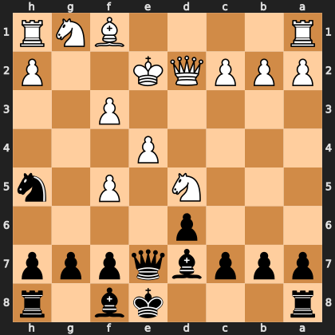

# Puzzle p4e31e65abb

<!-- puzzle-id: p4e31e65abb | frame: original | fen: r3kb1r/pppbqppp/3p4/3N1P1n/4P3/5P2/PPPQK2P/R4BNR b kq - 6 13 | type: allowed_tactic -->

**Black to move.** You want to play **e7e5**. What is wrong with it?



```
    h g f e d c b a
  1 R N B . . . . R 1
  2 P . . K Q P P P 2
  3 . . P . . . . . 3
  4 . . . P . . . . 4
  5 n . P . N . . . 5
  6 . . . . p . . . 6
  7 p p p q b p p p 7
  8 r . b k . . . r 8
    h g f e d c b a
```

Board is drawn from Black's side. Uppercase is White, lowercase is Black.

FEN: `r3kb1r/pppbqppp/3p4/3N1P1n/4P3/5P2/PPPQK2P/R4BNR b kq - 6 13`

Status: unattempted | attempts: 0

<details><summary>Answer</summary>

After **e7e5**, the refutation is `Nxc7+` (d5c7).

Play instead: `Qd8` (e7d8)

Eval before: -1.70
Win probability lost: 33.8
Refute depth: 3

Source: https://www.chess.com/game/live/171926193190, move 13

</details>
