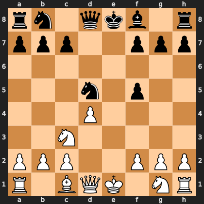

# Puzzle p7a5f355e94

<!-- puzzle-id: p7a5f355e94 | frame: original | fen: rn1qkb1r/ppp2ppp/8/3n1p2/3P4/2N5/PPP2PPP/R1BQK1NR w KQkq - 0 7 | type: missed_tactic -->

**White to move.** Find the best move.



```
    a b c d e f g h
  8 r n . q k b . r 8
  7 p p p . . p p p 7
  6 . . . . . . . . 6
  5 . . . n . p . . 5
  4 . . . P . . . . 4
  3 . . N . . . . . 3
  2 P P P . . P P P 2
  1 R . B Q K . N R 1
    a b c d e f g h
```

Board is drawn from White's side. Uppercase is White, lowercase is Black.

FEN: `rn1qkb1r/ppp2ppp/8/3n1p2/3P4/2N5/PPP2PPP/R1BQK1NR w KQkq - 0 7`

Status: unattempted | attempts: 0

<details><summary>Answer</summary>

Best move: `Qe2+` (d1e2)

You played: `g1e2`

Eval before: +1.38
Win probability lost: 10.0
Refute depth: 3

Source: https://www.chess.com/game/live/171984928774, move 7

</details>
