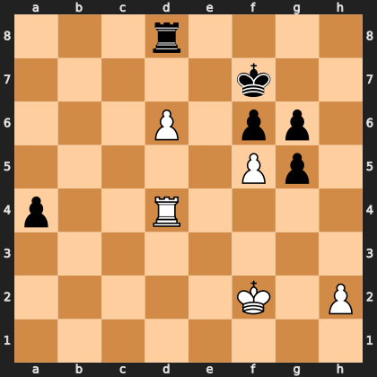

# Puzzle p93cbc98c87

<!-- puzzle-id: p93cbc98c87 | frame: original | fen: 3r4/5k2/3P1pp1/5Pp1/p2R4/8/5K1P/8 w - - 0 37 | type: missed_tactic -->

**White to move.** Find the best move.



```
    a b c d e f g h
  8 . . . r . . . . 8
  7 . . . . . k . . 7
  6 . . . P . p p . 6
  5 . . . . . P p . 5
  4 p . . R . . . . 4
  3 . . . . . . . . 3
  2 . . . . . K . P 2
  1 . . . . . . . . 1
    a b c d e f g h
```

Board is drawn from White's side. Uppercase is White, lowercase is Black.

FEN: `3r4/5k2/3P1pp1/5Pp1/p2R4/8/5K1P/8 w - - 0 37`

Status: unattempted | attempts: 0

<details><summary>Answer</summary>

Best move: `fxg6+` (f5g6)

You played: `d4a4`

Eval before: -0.22
Win probability lost: 30.5
Refute depth: 5

Source: https://www.chess.com/game/live/171984928774, move 37

</details>
