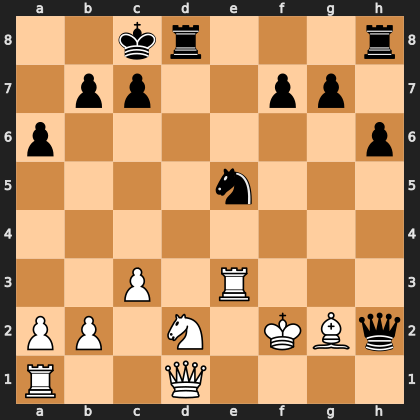

# Puzzle pa2f6791a2d

<!-- puzzle-id: pa2f6791a2d | frame: original | fen: 2kr3r/1pp2pp1/p6p/4n3/8/2P1R3/PP1N1KBq/R2Q4 w - - 0 23 | type: allowed_tactic -->

**White to move.** You want to play **d1h1**. What is wrong with it?



```
    a b c d e f g h
  8 . . k r . . . r 8
  7 . p p . . p p . 7
  6 p . . . . . . p 6
  5 . . . . n . . . 5
  4 . . . . . . . . 4
  3 . . P . R . . . 3
  2 P P . N . K B q 2
  1 R . . Q . . . . 1
    a b c d e f g h
```

Board is drawn from White's side. Uppercase is White, lowercase is Black.

FEN: `2kr3r/1pp2pp1/p6p/4n3/8/2P1R3/PP1N1KBq/R2Q4 w - - 0 23`

Status: unattempted | attempts: 0

<details><summary>Answer</summary>

After **d1h1**, the refutation is `Rxd2+` (d8d2).

Play instead: `Qe2` (d1e2)

Eval before: -0.30
Win probability lost: 40.9
Refute depth: 8

Source: https://www.chess.com/game/live/171987878016, move 23

</details>
