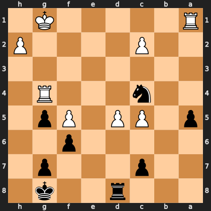

# Puzzle pb57195994b

<!-- puzzle-id: pb57195994b | frame: original | fen: 3r2k1/2p3p1/5p2/p1PP1Pp1/2n3R1/8/2P4P/R5K1 b - - 3 30 | type: missed_tactic -->

**Black to move.** Find the best move.



```
    h g f e d c b a
  1 . K . . . . . R 1
  2 P . . . . P . . 2
  3 . . . . . . . . 3
  4 . R . . . n . . 4
  5 . p P . P P . p 5
  6 . . p . . . . . 6
  7 . p . . . p . . 7
  8 . k . . r . . . 8
    h g f e d c b a
```

Board is drawn from Black's side. Uppercase is White, lowercase is Black.

FEN: `3r2k1/2p3p1/5p2/p1PP1Pp1/2n3R1/8/2P4P/R5K1 b - - 3 30`

Status: unattempted | attempts: 0

<details><summary>Answer</summary>

Best move: `Ne5` (c4e5)

You played: `c4e3`

Eval before: +0.29
Win probability lost: 26.2
Refute depth: 6

Source: https://www.chess.com/game/live/171984928774, move 30

</details>
