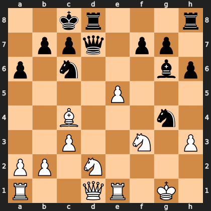

# Puzzle pb65f05abe7

<!-- puzzle-id: pb65f05abe7 | frame: original | fen: 2kr3r/1ppq1pp1/p1n3bp/4P3/2B3n1/2P2N1P/PP1N4/R2QR1K1 w - - 0 17 | type: missed_tactic -->

**White to move.** Find the best move.



```
    a b c d e f g h
  8 . . k r . . . r 8
  7 . p p q . p p . 7
  6 p . n . . . b p 6
  5 . . . . P . . . 5
  4 . . B . . . n . 4
  3 . . P . . N . P 3
  2 P P . N . . . . 2
  1 R . . Q R . K . 1
    a b c d e f g h
```

Board is drawn from White's side. Uppercase is White, lowercase is Black.

FEN: `2kr3r/1ppq1pp1/p1n3bp/4P3/2B3n1/2P2N1P/PP1N4/R2QR1K1 w - - 0 17`

Status: unattempted | attempts: 0

<details><summary>Answer</summary>

Best move: `e6` (e5e6)

You played: `h3g4`

Eval before: +1.16
Win probability lost: 16.2
Refute depth: 7

Source: https://www.chess.com/game/live/171987878016, move 17

</details>
