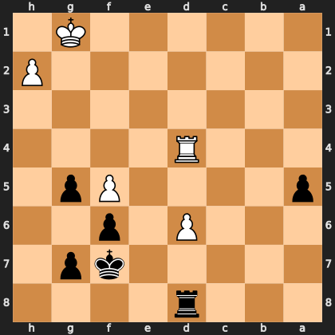

# Puzzle pd41c569434

<!-- puzzle-id: pd41c569434 | frame: original | fen: 3r4/5kp1/3P1p2/p4Pp1/3R4/8/7P/6K1 b - - 0 35 | type: missed_tactic -->

**Black to move.** Find the best move.



```
    h g f e d c b a
  1 . K . . . . . . 1
  2 P . . . . . . . 2
  3 . . . . . . . . 3
  4 . . . . R . . . 4
  5 . p P . . . . p 5
  6 . . p . P . . . 6
  7 . p k . . . . . 7
  8 . . . . r . . . 8
    h g f e d c b a
```

Board is drawn from Black's side. Uppercase is White, lowercase is Black.

FEN: `3r4/5kp1/3P1p2/p4Pp1/3R4/8/7P/6K1 b - - 0 35`

Status: unattempted | attempts: 0

<details><summary>Answer</summary>

Best move: `Ke8` (f7e8)

You played: `a5a4`

Eval before: -4.98
Win probability lost: 35.3
Refute depth: 4

Source: https://www.chess.com/game/live/171984928774, move 35

</details>
