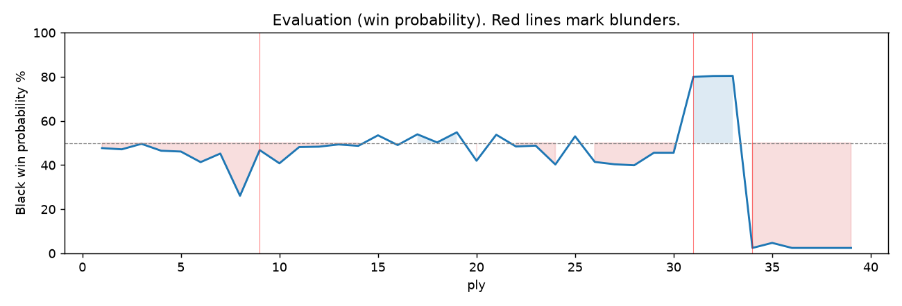

# (free, so lmk) Game analysis: Mirrorwahl vs DanielKetterer

Date: 2026.07.17  |  Time control: rapid (1800)  |  You played: black
Game: https://www.chess.com/game/live/171716896322

## Summary

- Lichess accuracy: you 42.4%, opponent 68.7%
- Opening: D00 Queen's Pawn Game: Accelerated London System (theory followed through ply 3)
- First deviation from theory: ply 4, You played 2... Nc6
- Your moves: 5 best, 2 excellent, 5 good, 3 inaccuracy, 3 mistake, 1 blunder

METRICS:

Best: The played move exactly matches Stockfish's top move

Excellent: A non-best move that loses 2 WP points or less.

Good: WP loss is over 2, but under 5 points; also used for losses under 20 when the position remains already decided.

Inaccuracy: WP loss is at least 5 but under 10 points.

Mistake: WP loss is at least 10 but under 20 points; also generally used when a forced mate is missed with under 10 points of WP loss.

Blunder: WP loss is 20 points or more, or a forced mate is missed with at least 10 points of WP loss.

See: https://support.chess.com/en/articles/8572705-how-are-moves-classified-what-is-a-blunder-or-brilliant-etc 

(Brillint, Great and Miss are rating subjective)

## Biggest missed opportunity

You played 17...g4. Stockfish preferred Bf6, after which the main line runs 17...Bf6 18. c3 Qb6 19. Rd2 Rab8 20. Qc4. The evaluation crossed from winning to losing, which matters more than the raw number. Why it went wrong: left bishop on g7, pawn on c5 insufficiently defended. Before committing to a quiet move here, the checklist is checks, captures, threats, in that order. The engine prefers this move from search depth 1; it sits near the surface, a forcing move, the kind a checks-and-captures scan catches. Candidates considered by the engine: Bf6 (-3.84), Bh8 (+2.17), Be5 (+2.89).

## Critical positions

- Ply 9 (opponent), 5.Nf3: +2.83 -> +0.35 [only-move situation; evaluation crossed winning -> equal]
- Ply 14 (you), 7...bxc6: +0.07 -> +0.14 [only-move situation]
- Ply 28 (you), 14...dxe4: +1.06 -> +1.11 [only-move situation]
- Ply 31 (opponent), 16.Bxg5: +0.48 -> -3.76 [evaluation crossed equal -> losing]
- Ply 32 (you), 16...hxg5: -3.76 -> -3.83 [only-move situation]
- Ply 34 (you), 17...g4: -3.84 -> M6 [only-move situation; evaluation crossed winning -> losing]
- Ply 35 (opponent), 18.hxg7: M6 -> +8.15 [forced mate was on the board]

## Your errors, move by move

### 4...Nf6 (mistake, positional, wp loss 19%)

You played 4...Nf6. Stockfish preferred e6, after which the main line runs 4...e6 5. Nf3 Bd6 6. Bg3 Nf6 7. Bd3. The evaluation crossed from equal to losing, which matters more than the raw number. This was a judgment error rather than a missed tactic; compare the pawn structure and piece activity after both moves. The engine does not prefer this move until depth 31; missing it is forgivable, so weigh this one lightly. Candidates considered by the engine: e6 (+0.52), a6 (+0.59), Bg7 (+0.60).

### 5...Bg7 (inaccuracy, positional, wp loss 6%)

You played 5...Bg7. Stockfish preferred Nh5, after which the main line runs 5...Nh5 6. Bg5 h6 7. Bh4 Bg7 8. Bb5. This was a judgment error rather than a missed tactic; compare the pawn structure and piece activity after both moves. The engine prefers this move from search depth 3; it sits near the surface, a quiet move, but one whose point shows at a glance. Candidates considered by the engine: Nh5 (+0.35), a6 (+0.53), Bd7 (+0.66).

### 10...h6 (mistake, positional, wp loss 13%)

You played 10...h6. Stockfish preferred Qb7, after which the main line runs 10...Qb7 11. Ne5 Rab8 12. b3 c5 13. f3. This was a judgment error rather than a missed tactic; compare the pawn structure and piece activity after both moves. The engine prefers this move from search depth 1; it sits near the surface, a quiet move, but one whose point shows at a glance. Candidates considered by the engine: Qb7 (-0.53), Bg4 (-0.04), Ne4 (+0.00).

### 11...Ne4 (inaccuracy, positional, wp loss 5%)

You played 11...Ne4. Stockfish preferred Bg4, after which the main line runs 11...Bg4 12. Qa6 Qb6 13. Qa3 Nd7 14. Rd3. This was a judgment error rather than a missed tactic; compare the pawn structure and piece activity after both moves. The engine first prefers this move at depth 9; findable, but it takes a deliberate look rather than a scan. Candidates considered by the engine: Bg4 (-0.41), Ne4 (+0.22), Qb6 (+0.42).

### 12...Bxe4 (inaccuracy, positional, wp loss 9%)

You played 12...Bxe4. Stockfish preferred dxe4, after which the main line runs 12...dxe4 13. Ne5 Qb5 14. Qxb5 cxb5 15. Nc6. Why it went wrong: a favorable capture was available (Bxe4). This was a judgment error rather than a missed tactic; compare the pawn structure and piece activity after both moves. The engine prefers this move from search depth 1; it sits near the surface, a quiet move, but one whose point shows at a glance. Candidates considered by the engine: dxe4 (+0.13), Bxe4 (+0.87), e5 (+3.19).

### 13...c5 (mistake, tactical, wp loss 12%)

You played 13...c5. Stockfish preferred Bxg2, after which the main line runs 13...Bxg2 14. Rhg1 Bh3 15. e4 Kh7 16. Qe3. Why it went wrong: left pawn on c5 insufficiently defended; a favorable capture was available (Bxg2). Before committing to a quiet move here, the checklist is checks, captures, threats, in that order. The engine first prefers this move at depth 7; findable, but it takes a deliberate look rather than a scan. Candidates considered by the engine: Bxg2 (-0.33), Bf5 (+0.16), a5 (+0.39).

### 17...g4 (blunder, tactical, wp loss 78%)

You played 17...g4. Stockfish preferred Bf6, after which the main line runs 17...Bf6 18. c3 Qb6 19. Rd2 Rab8 20. Qc4. The evaluation crossed from winning to losing, which matters more than the raw number. Why it went wrong: left bishop on g7, pawn on c5 insufficiently defended. Before committing to a quiet move here, the checklist is checks, captures, threats, in that order. The engine prefers this move from search depth 1; it sits near the surface, a forcing move, the kind a checks-and-captures scan catches. Candidates considered by the engine: Bf6 (-3.84), Bh8 (+2.17), Be5 (+2.89).

## Full move table

| Ply | Move | Eval before | Eval after | Best | CP loss | WP loss | Class |
|-----|------|-------------|------------|------|---------|---------|-------|
| 1 | 1.d4 | +0.28 | +0.25 | Nf3 | 3 | 0% | excellent |
| 2 | 1...d5* | +0.25 | +0.31 | Nf6 | 6 | 1% | excellent |
| 3 | 2.Bf4 | +0.31 | +0.04 | c4 | 27 | 2% | good |
| 4 | 2...Nc6* | +0.04 | +0.38 | c5 | 34 | 3% | good |
| 5 | 3.e3 | +0.38 | +0.42 | e3 | 0 | 0% | best |
| 6 | 3...g6* | +0.42 | +0.95 | Nf6 | 53 | 5% | good |
| 7 | 4.Nc3 | +0.95 | +0.52 | Nf3 | 43 | 4% | good |
| 8 | 4...Nf6* | +0.52 | +2.83 | e6 | 231 | 19% | mistake |
| 9 | 5.Nf3 | +2.83 | +0.35 | Nb5 | 248 | 21% | blunder |
| 10 | 5...Bg7* | +0.35 | +1.01 | Nh5 | 66 | 6% | inaccuracy |
| 11 | 6.Bb5 | +1.01 | +0.20 | Nb5 | 81 | 7% | inaccuracy |
| 12 | 6...O-O* | +0.20 | +0.18 | Nh5 | 0 | 0% | excellent |
| 13 | 7.Bxc6 | +0.18 | +0.07 | O-O | 11 | 1% | excellent |
| 14 | 7...bxc6* | +0.07 | +0.14 | bxc6 | 7 | 1% | best |
| 15 | 8.Qd3 | +0.14 | -0.38 | O-O | 52 | 5% | good |
| 16 | 8...Bf5* | -0.38 | +0.10 | Nh5 | 48 | 4% | good |
| 17 | 9.Qe2 | +0.10 | -0.43 | Qa6 | 53 | 5% | good |
| 18 | 9...Qb8* | -0.43 | -0.03 | Nh5 | 40 | 4% | good |
| 19 | 10.O-O-O | -0.03 | -0.53 | Rb1 | 50 | 5% | good |
| 20 | 10...h6* | -0.53 | +0.88 | Qb7 | 141 | 13% | mistake |
| 21 | 11.h4 | +0.88 | -0.41 | Ne5 | 129 | 12% | mistake |
| 22 | 11...Ne4* | -0.41 | +0.17 | Bg4 | 58 | 5% | inaccuracy |
| 23 | 12.Nxe4 | +0.17 | +0.13 | Nxe4 | 4 | 0% | best |
| 24 | 12...Bxe4* | +0.13 | +1.07 | dxe4 | 94 | 9% | inaccuracy |
| 25 | 13.Nd2 | +1.07 | -0.33 | Ne5 | 140 | 13% | mistake |
| 26 | 13...c5* | -0.33 | +0.94 | Bxg2 | 127 | 12% | mistake |
| 27 | 14.Nxe4 | +0.94 | +1.06 | Nxe4 | 0 | 0% | best |
| 28 | 14...dxe4* | +1.06 | +1.11 | dxe4 | 5 | 0% | best |
| 29 | 15.h5 | +1.11 | +0.48 | Qc4 | 63 | 6% | inaccuracy |
| 30 | 15...g5* | +0.48 | +0.48 | g5 | 0 | 0% | best |
| 31 | 16.Bxg5 | +0.48 | -3.76 | Be5 | 424 | 34% | blunder |
| 32 | 16...hxg5* | -3.76 | -3.83 | hxg5 | 0 | 0% | best |
| 33 | 17.h6 | -3.83 | -3.84 | c3 | 1 | 0% | excellent |
| 34 | 17...g4* | -3.84 | M6 | Bf6 |  | 78% | blunder |
| 35 | 18.hxg7 | M6 | +8.15 | Qxg4 |  | 2% | mistake |
| 36 | 18...Kxg7* | +8.15 | M2 | f5 |  | 2% | good |
| 37 | 19.Qxg4+ | M2 | M1 | Qxg4+ |  | 0% | best |
| 38 | 19...Kf6* | M1 | M1 | Kf6 |  | 0% | best |
| 39 | 20.Rh6# | M1 | M1 | Rh6# |  | 0% | best |

Rows marked * are your moves. WP loss is win-probability loss; it is the primary signal, CP loss is shown for reference.

## Patterns in this game

- Error mix: 2 tactical, 5 positional.
- Opening: 3 error(s) (avg wp loss 13%).
- Middlegame: 4 error(s) (avg wp loss 26%).
