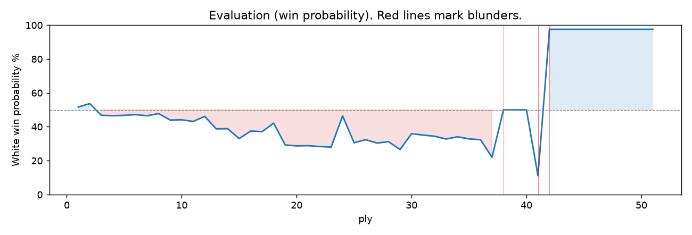

# (free, so lmk) Game analysis: DanielKetterer vs Mirrorwahl

Date: 2026.07.13  |  Time control: rapid (1800)  |  You played: white
Game: https://www.chess.com/game/live/171535977872

## Summary

- Lichess accuracy: you 77.5%, opponent 40.6%
- Opening: B10 Caro-Kann Defense: Hillbilly Attack (theory followed through ply 3)
- First deviation from theory: ply 4, Opponent played 2... d5
- Your moves: 14 best, 3 excellent, 2 good, 3 inaccuracy, 3 mistake, 1 blunder

METRICS:

Best: The played move exactly matches Stockfish's top move

Excellent: A non-best move that loses 2 WP points or less.

Good: WP loss is over 2, but under 5 points; also used for losses under 20 when the position remains already decided.

Inaccuracy: WP loss is at least 5 but under 10 points.

Mistake: WP loss is at least 10 but under 20 points; also generally used when a forced mate is missed with under 10 points of WP loss.

Blunder: WP loss is 20 points or more, or a forced mate is missed with at least 10 points of WP loss.

See: https://support.chess.com/en/articles/8572705-how-are-moves-classified-what-is-a-blunder-or-brilliant-etc 

(Brillint, Great and Miss are rating subjective)

## Biggest missed opportunity

You played 21.Bg5+. Stockfish preferred Rxf7+, after which the main line runs 21. Rxf7+ Kxf7 22. Qd7+ Kg8 23. Qxe6+ Kf8. The evaluation crossed from equal to losing, which matters more than the raw number. Why it went wrong: left pawn on c3 insufficiently defended; the best move was a forcing check. Before committing to a quiet move here, the checklist is checks, captures, threats, in that order. The engine does not prefer this move until depth 16; missing it is forgivable, so weigh this one lightly. Candidates considered by the engine: Rxf7+ (+0.00), Qa6 (-5.26), Qc6 (-5.27).

## Critical positions

- Ply 10 (opponent), 5...bxc6: -0.66 -> -0.64 [only-move situation]
- Ply 17 (you), 9.Nf3: -1.39 -> -1.43 [only-move situation]
- Ply 38 (opponent), 19...Bxb1: -3.43 -> +0.00 [evaluation crossed winning -> equal]
- Ply 39 (you), 20.Qa4+: +0.00 -> +0.00 [only-move situation]
- Ply 41 (you), 21.Bg5+: +0.00 -> -5.66 [only-move situation; evaluation crossed equal -> losing]
- Ply 42 (opponent), 21...f6: -5.66 -> M7 [only-move situation; evaluation crossed winning -> losing]
- Ply 43 (you), 22.exf6+: M7 -> M6 [only-move situation]
- Ply 45 (you), 23.Qd7+: M4 -> M3 [only-move situation]

## Your errors, move by move

### 2.Bc4 (inaccuracy, positional, wp loss 7%)

You played 2.Bc4. Stockfish preferred d4, after which the main line runs 2. d4 d5 3. e5 Bf5 4. Nf3 e6. This was a judgment error rather than a missed tactic; compare the pawn structure and piece activity after both moves. The engine prefers this move from search depth 1; it sits near the surface, a quiet move, but one whose point shows at a glance. Candidates considered by the engine: d4 (+0.40), Nc3 (+0.32), Nf3 (+0.26).

### 7.g4 (inaccuracy, positional, wp loss 7%)

You played 7.g4. Stockfish preferred c4, after which the main line runs 7. c4 e6 8. c5 Qb8 9. Nc3 h5. This was a judgment error rather than a missed tactic; compare the pawn structure and piece activity after both moves. The engine does not prefer this move until depth 12; missing it is forgivable, so weigh this one lightly. Candidates considered by the engine: c4 (-0.42), Ne2 (-0.53), b3 (-0.69).

### 8.f4 (inaccuracy, positional, wp loss 6%)

You played 8.f4. Stockfish preferred Nf3, after which the main line runs 8. Nf3 e6 9. h4 h5 10. Ne5 Bh7. The evaluation crossed from equal to losing, which matters more than the raw number. This was a judgment error rather than a missed tactic; compare the pawn structure and piece activity after both moves. The engine prefers this move from search depth 5; it sits near the surface, a quiet move, but one whose point shows at a glance. Candidates considered by the engine: Nf3 (-1.23), Nh3 (-1.36), Ne2 (-1.46).

### 10.O-O (mistake, tactical, wp loss 13%)

You played 10.O-O. Stockfish preferred g5, after which the main line runs 10. g5 Nd7 11. Nc3 Bg6 12. Nh4 e6. The evaluation crossed from equal to losing, which matters more than the raw number. Why it went wrong: left pawn on g4 insufficiently defended; motif: creates threat on f6. Before committing to a quiet move here, the checklist is checks, captures, threats, in that order. The engine first prefers this move at depth 6; findable, but it takes a deliberate look rather than a scan. Candidates considered by the engine: g5 (-0.86), Nbd2 (-1.14), Nc3 (-1.14).

### 13.c3 (mistake, positional, wp loss 16%)

You played 13.c3. Stockfish preferred Nc3, after which the main line runs 13. Nc3 g6 14. Nxe4 dxe4 15. c3 Bg7. The evaluation crossed from equal to losing, which matters more than the raw number. This was a judgment error rather than a missed tactic; compare the pawn structure and piece activity after both moves. The engine prefers this move from search depth 1; it sits near the surface, a quiet move, but one whose point shows at a glance. Candidates considered by the engine: Nc3 (-0.39), e6 (-0.99), Rf2 (-2.07).

### 19.Rb1 (mistake, tactical, wp loss 10%)

You played 19.Rb1. Stockfish preferred Qa4+, after which the main line runs 19. Qa4+ Kf8 20. Qc6 Rd8 21. Qc7 Qb8. Why it went wrong: left pawn on c3, pawn on a2 insufficiently defended; the best move was a forcing check. Before committing to a quiet move here, the checklist is checks, captures, threats, in that order. The engine prefers this move from search depth 1; it sits near the surface, a forcing move, the kind a checks-and-captures scan catches. Candidates considered by the engine: Qa4+ (-2.00), Bd4 (-2.95), Qe1 (-3.32).

### 21.Bg5+ (blunder, tactical, wp loss 39%)

You played 21.Bg5+. Stockfish preferred Rxf7+, after which the main line runs 21. Rxf7+ Kxf7 22. Qd7+ Kg8 23. Qxe6+ Kf8. The evaluation crossed from equal to losing, which matters more than the raw number. Why it went wrong: left pawn on c3 insufficiently defended; the best move was a forcing check. Before committing to a quiet move here, the checklist is checks, captures, threats, in that order. The engine does not prefer this move until depth 16; missing it is forgivable, so weigh this one lightly. Candidates considered by the engine: Rxf7+ (+0.00), Qa6 (-5.26), Qc6 (-5.27).

## Full move table

| Ply | Move | Eval before | Eval after | Best | CP loss | WP loss | Class |
|-----|------|-------------|------------|------|---------|---------|-------|
| 1 | 1.e4* | +0.27 | +0.18 | Nf3 | 9 | 1% | excellent |
| 2 | 1...c6 | +0.18 | +0.40 | e5 | 22 | 2% | good |
| 3 | 2.Bc4* | +0.40 | -0.35 | d4 | 75 | 7% | inaccuracy |
| 4 | 2...d5 | -0.35 | -0.38 | d5 | 0 | 0% | best |
| 5 | 3.exd5* | -0.38 | -0.35 | exd5 | 0 | 0% | best |
| 6 | 3...cxd5 | -0.35 | -0.31 | cxd5 | 4 | 0% | best |
| 7 | 4.Bb5+* | -0.31 | -0.38 | Bb5+ | 7 | 1% | best |
| 8 | 4...Nc6 | -0.38 | -0.24 | Bd7 | 14 | 1% | excellent |
| 9 | 5.Bxc6+* | -0.24 | -0.66 | Nf3 | 42 | 4% | good |
| 10 | 5...bxc6 | -0.66 | -0.64 | bxc6 | 2 | 0% | best |
| 11 | 6.d4* | -0.64 | -0.75 | Nf3 | 11 | 1% | excellent |
| 12 | 6...Bf5 | -0.75 | -0.42 | Nf6 | 33 | 3% | good |
| 13 | 7.g4* | -0.42 | -1.24 | c4 | 82 | 7% | inaccuracy |
| 14 | 7...Bg6 | -1.24 | -1.23 | Bg6 | 1 | 0% | best |
| 15 | 8.f4* | -1.23 | -1.92 | Nf3 | 69 | 6% | inaccuracy |
| 16 | 8...Be4 | -1.92 | -1.39 | e6 | 53 | 4% | good |
| 17 | 9.Nf3* | -1.39 | -1.43 | Nf3 | 4 | 0% | best |
| 18 | 9...Nf6 | -1.43 | -0.86 | e6 | 57 | 5% | inaccuracy |
| 19 | 10.O-O* | -0.86 | -2.39 | g5 | 153 | 13% | mistake |
| 20 | 10...Nxg4 | -2.39 | -2.47 | Nxg4 | 0 | 0% | best |
| 21 | 11.Ne5* | -2.47 | -2.45 | Ne5 | 0 | 0% | best |
| 22 | 11...Nxe5 | -2.45 | -2.52 | Nxe5 | 0 | 0% | best |
| 23 | 12.fxe5* | -2.52 | -2.56 | fxe5 | 4 | 0% | best |
| 24 | 12...Qb6 | -2.56 | -0.39 | e6 | 217 | 18% | mistake |
| 25 | 13.c3* | -0.39 | -2.23 | Nc3 | 184 | 16% | mistake |
| 26 | 13...e6 | -2.23 | -2.00 | e6 | 23 | 2% | best |
| 27 | 14.Nd2* | -2.00 | -2.25 | Nd2 | 25 | 2% | best |
| 28 | 14...Bg6 | -2.25 | -2.15 | Bg6 | 10 | 1% | best |
| 29 | 15.Nb3* | -2.15 | -2.76 | h4 | 61 | 5% | good |
| 30 | 15...c5 | -2.76 | -1.57 | a5 | 119 | 9% | inaccuracy |
| 31 | 16.Be3* | -1.57 | -1.67 | Be3 | 10 | 1% | best |
| 32 | 16...c4 | -1.67 | -1.75 | c4 | 0 | 0% | best |
| 33 | 17.Nc5* | -1.75 | -1.95 | Nc5 | 20 | 2% | best |
| 34 | 17...Bxc5 | -1.95 | -1.79 | Bxc5 | 16 | 1% | best |
| 35 | 18.dxc5* | -1.79 | -1.94 | dxc5 | 15 | 1% | best |
| 36 | 18...Qxb2 | -1.94 | -2.00 | Qxb2 | 0 | 0% | best |
| 37 | 19.Rb1* | -2.00 | -3.43 | Qa4+ | 143 | 10% | mistake |
| 38 | 19...Bxb1 | -3.43 | +0.00 | Qxc3 | 343 | 28% | blunder |
| 39 | 20.Qa4+* | +0.00 | +0.00 | Qa4+ | 0 | 0% | best |
| 40 | 20...Ke7 | +0.00 | +0.00 | Ke7 | 0 | 0% | best |
| 41 | 21.Bg5+* | +0.00 | -5.66 | Rxf7+ | 566 | 39% | blunder |
| 42 | 21...f6 | -5.66 | M7 | Kf8 |  | 86% | blunder |
| 43 | 22.exf6+* | M7 | M6 | exf6+ |  | 0% | best |
| 44 | 22...Kf7 | M6 | M4 | gxf6 |  | 0% | excellent |
| 45 | 23.Qd7+* | M4 | M3 | Qd7+ |  | 0% | best |
| 46 | 23...Kg6 | M3 | M3 | Kg6 |  | 0% | best |
| 47 | 24.Qxg7+* | M3 | M2 | Qxg7+ |  | 0% | best |
| 48 | 24...Kh5 | M2 | M2 | Kh5 |  | 0% | best |
| 49 | 25.Qh6+* | M2 | M1 | Qh6+ |  | 0% | best |
| 50 | 25...Kg4 | M1 | M1 | Kg4 |  | 0% | best |
| 51 | 26.Rf4#* | M1 | M1 | Qh4# |  | 0% | excellent |

Rows marked * are your moves. WP loss is win-probability loss; it is the primary signal, CP loss is shown for reference.

## Patterns in this game

- Error mix: 3 tactical, 4 positional.
- Opening: 4 error(s) (avg wp loss 8%).
- Middlegame: 3 error(s) (avg wp loss 22%).
