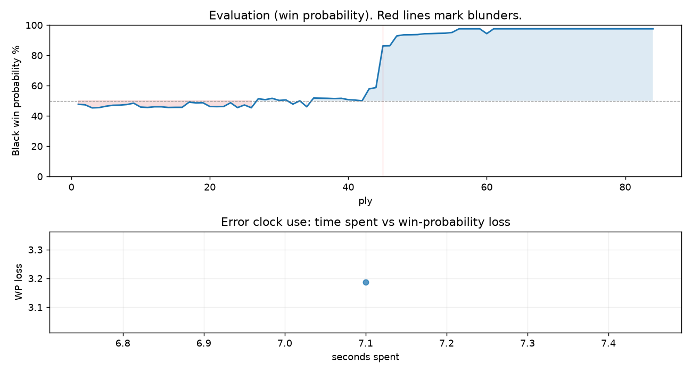

# (free, so lmk) Game analysis: DanielKetterer vs Mirrorwahl

Date: 2026.07.18  |  Time control: rapid (1800)  |  You played: black
Game ID: d10087e9-82cf-11f1-bc12-27231f01000f
Analysis: depth=24 multipv=3 findability=honest floor=6 stable_run=3 threads=1 hash_mb=256 deterministic=True engine_id=Stockfish_18 generated=2026-07-31T05:02:52Z
Game end time UTC: 2026-07-18T18:13:19+00:00
Game: https://www.chess.com/game/live/171750428224

## Summary

- Lichess accuracy: you 98.0%, opponent 88.0%
- Opening: B18 Caro-Kann Defense: Classical Variation (theory followed through ply 8)
- First deviation from theory: ply 9, Opponent played 5. Qf3
- Your moves: 13 best, 23 excellent, 5 good, 0 inaccuracy, 1 mistake, 0 blunder

METRICS:

Best: The played move exactly matches Stockfish's top move

Excellent: A non-best move that loses 2 WP points or less.

Good: WP loss is over 2, but under 5 points; also used for losses under 20 when the position remains already decided.

Inaccuracy: WP loss is at least 5 but under 10 points.

Mistake: WP loss is at least 10 but under 20 points; also generally used when a forced mate is missed with under 10 points of WP loss.

Blunder: WP loss is 20 points or more, or a forced mate is missed with at least 10 points of WP loss.

See: https://support.chess.com/en/articles/8572705-how-are-moves-classified-what-is-a-blunder-or-brilliant-etc 

(Brillint, Great and Miss are rating subjective)
- Puzzles: 44 open, 0 solved

### Puzzle gate tally (this game)

Gates: category in ['brilliant_sacrifice', 'missed_tactic', 'allowed_tactic', 'endgame'], refute depth in [3, 8], best-vs-second WP gap >= 5. Refute bar per move: max(5, 0.6 x WP loss).

| outcome | errors |
|---|---|
| category:positional | 1 |

Four gates pass at once or nothing is generated, so a zero here is a product of four pass rates rather than a fault. Read the binding gate off this table before changing any threshold.

## Biggest missed opportunity

You played 30...Rxh2. Stockfish preferred R8e3+, after which the main line runs 30...R8e3+ 31. Kf4 g5+ 32. Kf5 Kf7 33. Re1. There was a forced mate on the board and this move let it slip. Why it went wrong: the best move was a forcing check; motif: creates threat on h2. This was a judgment error rather than a missed tactic; compare the pawn structure and piece activity after both moves. The engine prefers this move from at or below depth 6, which is as shallow as this measurement resolves; it sits near the surface, a quiet move, but one whose point shows at a glance. Candidates considered by the engine: R8e3+ (-M4), Re1 (-M16), R2e3+ (-M17).

## Critical positions

- Ply 11 (opponent), 6.Qxe4: +0.45 -> +0.48 [only-move situation]
- Ply 28 (you), 14...Nxf6: -0.15 -> -0.08 [only-move situation]
- Ply 44 (you), 22...Nxf7: -0.86 -> -0.96 [only-move situation]
- Ply 45 (opponent), 23.Qh5: -0.96 -> -4.99 [only-move situation; evaluation crossed equal -> losing]
- Ply 48 (you), 24...Qxf7: -6.96 -> -7.28 [only-move situation]
- Ply 50 (you), 25...Kxf7: -7.30 -> -7.35 [only-move situation]
- Ply 60 (you), 30...Rxh2: -M4 -> -7.65 [forced mate was on the board]

## Your errors, move by move

| Move | Class | Category | WP loss | Refute depth | Seconds spent | Pre-error eval |
|---|---|---|---:|---|---:|---|
| 30...Rxh2 | mistake | positional | 3% | 9 | 7 | winning |

### 30...Rxh2 (mistake, positional, wp loss 3%)

You played 30...Rxh2. Stockfish preferred R8e3+, after which the main line runs 30...R8e3+ 31. Kf4 g5+ 32. Kf5 Kf7 33. Re1. There was a forced mate on the board and this move let it slip. Why it went wrong: the best move was a forcing check; motif: creates threat on h2. This was a judgment error rather than a missed tactic; compare the pawn structure and piece activity after both moves. The engine prefers this move from at or below depth 6, which is as shallow as this measurement resolves; it sits near the surface, a quiet move, but one whose point shows at a glance. Candidates considered by the engine: R8e3+ (-M4), Re1 (-M16), R2e3+ (-M17).

## Full move table

| Ply | Move | Eval before | Eval after | Best | CP loss | WP loss | Class |
|-----|------|-------------|------------|------|---------|---------|-------|
| 1 | 1.e4 | +0.31 | +0.25 | e4 | 6 | 1% | best |
| 2 | 1...c6* | +0.25 | +0.29 | e5 | 4 | 0% | excellent |
| 3 | 2.d4 | +0.29 | +0.51 | c3 | 0 | 0% | excellent |
| 4 | 2...d5* | +0.51 | +0.49 | d5 | 0 | 0% | best |
| 5 | 3.Nc3 | +0.49 | +0.39 | e5 | 10 | 1% | excellent |
| 6 | 3...dxe4* | +0.39 | +0.32 | dxe4 | 0 | 0% | best |
| 7 | 4.Nxe4 | +0.32 | +0.31 | Nxe4 | 1 | 0% | best |
| 8 | 4...Bf5* | +0.31 | +0.27 | Bf5 | 0 | 0% | best |
| 9 | 5.Qf3 | +0.27 | +0.17 | Ng3 | 10 | 1% | excellent |
| 10 | 5...Bxe4* | +0.17 | +0.45 | e6 | 28 | 3% | good |
| 11 | 6.Qxe4 | +0.45 | +0.48 | Qxe4 | 0 | 0% | best |
| 12 | 6...Nf6* | +0.48 | +0.43 | Nf6 | 0 | 0% | best |
| 13 | 7.Qe3 | +0.43 | +0.43 | Qe3 | 0 | 0% | best |
| 14 | 7...e6* | +0.43 | +0.48 | Qc7 | 5 | 0% | excellent |
| 15 | 8.Nf3 | +0.48 | +0.47 | Nf3 | 1 | 0% | best |
| 16 | 8...Bd6* | +0.47 | +0.47 | Qc7 | 0 | 0% | excellent |
| 17 | 9.Bc4 | +0.47 | +0.10 | g3 | 37 | 3% | good |
| 18 | 9...Nbd7* | +0.10 | +0.15 | Qc7 | 5 | 0% | excellent |
| 19 | 10.O-O | +0.15 | +0.14 | O-O | 1 | 0% | best |
| 20 | 10...Nd5* | +0.14 | +0.41 | O-O | 27 | 2% | good |
| 21 | 11.Qe2 | +0.41 | +0.42 | Qe2 | 0 | 0% | best |
| 22 | 11...O-O* | +0.42 | +0.41 | O-O | 0 | 0% | best |
| 23 | 12.Bg5 | +0.41 | +0.14 | g3 | 27 | 2% | good |
| 24 | 12...N5f6* | +0.14 | +0.49 | Nf4 | 35 | 3% | good |
| 25 | 13.Ne5 | +0.49 | +0.30 | Rae1 | 19 | 2% | excellent |
| 26 | 13...h6* | +0.30 | +0.50 | Qc7 | 20 | 2% | excellent |
| 27 | 14.Bxf6 | +0.50 | -0.15 | Bh4 | 65 | 6% | inaccuracy |
| 28 | 14...Nxf6* | -0.15 | -0.08 | Nxf6 | 7 | 1% | best |
| 29 | 15.Ng4 | -0.08 | -0.18 | c3 | 10 | 1% | excellent |
| 30 | 15...Nh7* | -0.18 | -0.03 | Nxg4 | 15 | 1% | excellent |
| 31 | 16.f4 | -0.03 | -0.06 | f4 | 3 | 0% | best |
| 32 | 16...Re8* | -0.06 | +0.24 | Nf6 | 30 | 3% | good |
| 33 | 17.Ne5 | +0.24 | +0.00 | Kh1 | 24 | 2% | good |
| 34 | 17...Qb6* | +0.00 | +0.43 | Re7 | 43 | 4% | good |
| 35 | 18.Rad1 | +0.43 | -0.20 | Kh1 | 63 | 6% | inaccuracy |
| 36 | 18...Qxb2* | -0.20 | -0.19 | Bxe5 | 1 | 0% | excellent |
| 37 | 19.f5 | -0.19 | -0.18 | Rf3 | 0 | 0% | excellent |
| 38 | 19...Bxe5* | -0.18 | -0.16 | Bxe5 | 2 | 0% | best |
| 39 | 20.dxe5 | -0.16 | -0.18 | dxe5 | 2 | 0% | best |
| 40 | 20...exf5* | -0.18 | -0.08 | exf5 | 10 | 1% | best |
| 41 | 21.Rxf5 | -0.08 | -0.05 | Rxf5 | 0 | 0% | best |
| 42 | 21...Ng5* | -0.05 | +0.00 | Re7 | 5 | 0% | excellent |
| 43 | 22.Bxf7+ | +0.00 | -0.86 | h4 | 86 | 8% | inaccuracy |
| 44 | 22...Nxf7* | -0.86 | -0.96 | Nxf7 | 0 | 0% | best |
| 45 | 23.Qh5 | -0.96 | -4.99 | Rxf7 | 403 | 28% | blunder |
| 46 | 23...Qxa2* | -4.99 | -5.01 | Nxe5 | 0 | 0% | excellent |
| 47 | 24.Qxf7+ | -5.01 | -6.96 | Rd7 | 195 | 6% | inaccuracy |
| 48 | 24...Qxf7* | -6.96 | -7.28 | Qxf7 | 0 | 0% | best |
| 49 | 25.Rxf7 | -7.28 | -7.30 | Rxf7 | 2 | 0% | best |
| 50 | 25...Kxf7* | -7.30 | -7.35 | Kxf7 | 0 | 0% | best |
| 51 | 26.Rf1+ | -7.35 | -7.62 | Rb1 | 27 | 1% | excellent |
| 52 | 26...Kg8* | -7.62 | -7.67 | Ke6 | 0 | 0% | excellent |
| 53 | 27.g4 | -7.67 | -7.75 | Ra1 | 8 | 0% | excellent |
| 54 | 27...Rxe5* | -7.75 | -7.80 | a5 | 0 | 0% | excellent |
| 55 | 28.c4 | -7.80 | -8.09 | Rb1 | 29 | 1% | excellent |
| 56 | 28...Rae8* | -8.09 | -12.50 | a5 | 0 | 0% | excellent |
| 57 | 29.Kg2 | -12.50 | -75.70 | g5 | 6320 | 0% | excellent |
| 58 | 29...Re2+* | -75.70 | -M15 | Re1 |  | 0% | excellent |
| 59 | 30.Kf3 | -M15 | -M4 | Kg3 |  | 0% | excellent |
| 60 | 30...Rxh2* | -M4 | -7.65 | R8e3+ |  | 3% | mistake |
| 61 | 31.Kf4 | -7.65 | -M15 | Rg1 |  | 3% | good |
| 62 | 31...Rf8+* | -M15 | -M15 | Rhe2 |  | 0% | excellent |
| 63 | 32.Kg3 | -M15 | -M13 | Kg3 |  | 0% | best |
| 64 | 32...Rxf1* | -M13 | -M11 | Rxf1 |  | 0% | best |
| 65 | 33.Kxh2 | -M11 | -M11 | Kxh2 |  | 0% | best |
| 66 | 33...Rc1* | -M11 | -M13 | g5 |  | 0% | excellent |
| 67 | 34.Kh3 | -M13 | -M11 | Kg2 |  | 0% | excellent |
| 68 | 34...Rxc4* | -M11 | -M11 | g5 |  | 0% | excellent |
| 69 | 35.Kh4 | -M11 | -M11 | Kg3 |  | 0% | excellent |
| 70 | 35...a5* | -M11 | -M10 | g5+ |  | 0% | excellent |
| 71 | 36.Kh5 | -M10 | -M10 | Kg3 |  | 0% | excellent |
| 72 | 36...a4* | -M10 | -M9 | Rc5+ |  | 0% | excellent |
| 73 | 37.Kg6 | -M9 | -M2 | g5 |  | 0% | excellent |
| 74 | 37...a3* | -M2 | -M8 | Rc5 |  | 0% | excellent |
| 75 | 38.Kf5 | -M8 | -M8 | g5 |  | 0% | excellent |
| 76 | 38...a2* | -M8 | -M7 | Rc5+ |  | 0% | excellent |
| 77 | 39.Ke6 | -M7 | -M5 | Ke5 |  | 0% | excellent |
| 78 | 39...a1=Q* | -M5 | -M6 | Rd4 |  | 0% | excellent |
| 79 | 40.Ke7 | -M6 | -M3 | Kd7 |  | 0% | excellent |
| 80 | 40...Qe1+* | -M3 | -M6 | Rd4 |  | 0% | excellent |
| 81 | 41.Kd6 | -M6 | -M4 | Kd8 |  | 0% | excellent |
| 82 | 41...Qd2+* | -M4 | -M6 | Qa5 |  | 0% | excellent |
| 83 | 42.Ke7 | -M6 | -M1 | Kc7 |  | 0% | excellent |
| 84 | 42...Re4#* | -M1 | -M1 | Re4# |  | 0% | best |

Rows marked * are your moves. WP loss is win-probability loss; it is the primary signal, CP loss is shown for reference.

## Patterns in this game

- Error categories: 1 positional.
- Attention errors per 100 moves: 0.0.
- Pre-error eval buckets: 1 winning, 0 balanced, 0 losing.
- Middlegame: 1 error(s) (avg wp loss 3%).
