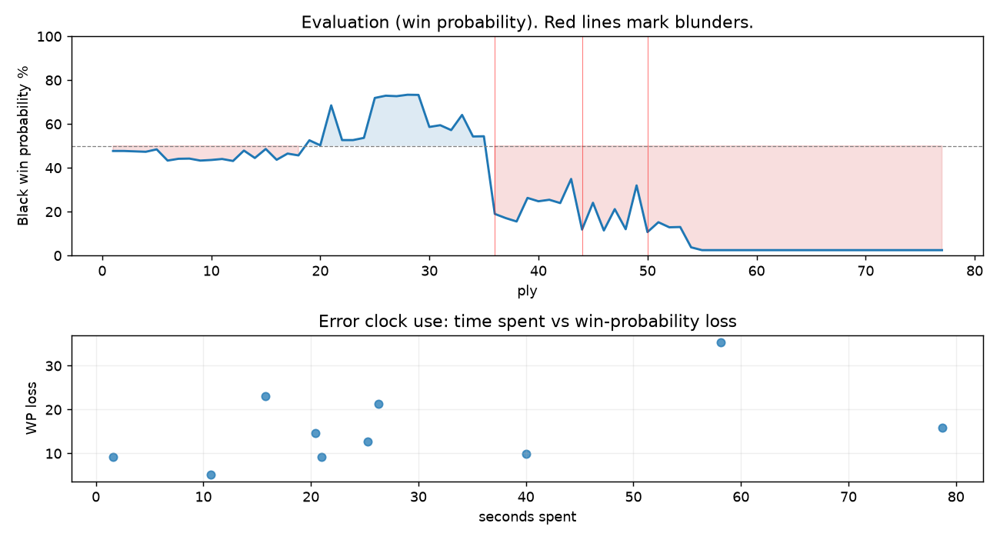

# (free, so lmk) Game analysis: ozvasiliy vs DanielKetterer

Date: 2026.07.19  |  Time control: rapid (1800)  |  You played: black
Game ID: 3b953a42-8394-11f1-b9ec-2f831301000f
Analysis: depth=24 multipv=3 findability=honest floor=6 stable_run=3 threads=1 hash_mb=256 deterministic=True engine_id=Stockfish_18 generated=2026-07-25T15:58:33Z
Game end time UTC: 2026-07-19T17:24:11+00:00
Game: https://www.chess.com/game/live/171794224796

## Summary

- Lichess accuracy: you 75.4%, opponent 82.9%
- Opening: C46 Three Knights Opening (theory followed through ply 5)
- First deviation from theory: ply 6, You played 3... Bc5
- Your moves: 14 best, 9 excellent, 5 good, 4 inaccuracy, 3 mistake, 3 blunder

METRICS:

Best: The played move exactly matches Stockfish's top move

Excellent: A non-best move that loses 2 WP points or less.

Good: WP loss is over 2, but under 5 points; also used for losses under 20 when the position remains already decided.

Inaccuracy: WP loss is at least 5 but under 10 points.

Mistake: WP loss is at least 10 but under 20 points; also generally used when a forced mate is missed with under 10 points of WP loss.

Blunder: WP loss is 20 points or more, or a forced mate is missed with at least 10 points of WP loss.

See: https://support.chess.com/en/articles/8572705-how-are-moves-classified-what-is-a-blunder-or-brilliant-etc 

(Brillint, Great and Miss are rating subjective)
- Puzzles: 14 open, 0 solved

### Puzzle gate tally (this game)

Gates: category in ['brilliant_sacrifice', 'missed_tactic', 'allowed_tactic', 'endgame'], refute depth in [3, 8], best-vs-second WP gap >= 5. Refute bar per move: max(5, 0.6 x WP loss).

| outcome | errors |
|---|---|
| accepted | 1 |
| category:attention | 3 |
| refute_censored_high | 1 |
| refute_too_deep | 2 |
| wp_gap_too_small | 3 |

Four gates pass at once or nothing is generated, so a zero here is a product of four pass rates rather than a fault. Read the binding gate off this table before changing any threshold.

### Sacrifices in the engine's line

Real sacrifices are listed but never served as puzzles: compensation that never resolves back into material has no gradable answer.

| Move | Offered | Kind | Quiet | Line ends | Verdict |
|---|---|---|---|---|---|
| 3 | -3.0 (piece) | sham | yes | +0.0 pawns | opening_ply |
| 17 | -3.0 (piece) | real | yes | -1.0 pawns | real_sacrifice_not_gradable |
| 18 | -5.0 (piece) | sham | yes | +0.0 pawns | desperado |
| 23 | -3.0 (piece) | sham | yes | +0.0 pawns | desperado |
| 24 | -3.0 (piece) | sham | yes | +1.0 pawns | desperado |

## Biggest missed opportunity

You played 18...e5. Stockfish preferred Rf7, after which the main line runs 18...Rf7 19. Rb3 Ne2+ 20. Kh1 Rc8 21. Re1. The evaluation crossed from equal to losing, which matters more than the raw number. Why it went wrong: left rook on f8 insufficiently defended; motif: creates threat on b7. Before committing to a quiet move here, the checklist is checks, captures, threats, in that order. The engine prefers this move from at or below depth 6, which is as shallow as this measurement resolves; it sits near the surface, a forcing move, the kind a checks-and-captures scan catches. Candidates considered by the engine: Rf7 (-0.48), Ne2+ (-0.30), Rfb8 (-0.11).

## Critical positions

- Ply 9 (opponent), 5.d4: +0.63 -> +0.73 [only-move situation]
- Ply 11 (opponent), 6.dxe5: +0.70 -> +0.65 [only-move situation]
- Ply 12 (you), 6...Bxe5: +0.65 -> +0.75 [only-move situation]
- Ply 26 (you), 13...Bxc3: -2.55 -> -2.69 [only-move situation]
- Ply 28 (you), 14...Nxe4: -2.66 -> -2.75 [only-move situation]
- Ply 36 (you), 18...e5: -0.48 -> +3.94 [evaluation crossed equal -> losing]
- Ply 37 (opponent), 19.Bxf8: +3.94 -> +4.29 [only-move situation]
- Ply 44 (you), 22...Rf3: +1.69 -> +5.45

## Your errors, move by move

| Move | Class | Category | WP loss | Refute depth | Seconds spent | Pre-error eval |
|---|---|---|---:|---|---:|---|
| 3...Bc5 | inaccuracy | allowed_tactic | 5% | >18 | 11 | balanced |
| 11...Be6 | mistake | missed_tactic | 16% | 4 | 79 | winning |
| 15...Nxc3 | mistake | attention | 15% | 2 | 20 | winning |
| 17...d5 | inaccuracy | attention | 10% | 1 | 40 | balanced |
| 18...e5 | blunder | missed_tactic | 35% | 3 | 58 | balanced |
| 22...Rf3 | blunder | allowed_tactic | 23% | 11 | 16 | losing |
| 23...h5 | mistake | missed_tactic | 13% | 8 | 25 | losing |
| 24...a5 | inaccuracy | allowed_tactic | 9% | 4 | 21 | losing |
| 25...Kh7 | blunder | missed_tactic | 21% | 9 | 26 | losing |
| 27...exd3 | inaccuracy | attention | 9% | 2 | 2 | losing |

### 3...Bc5 (inaccuracy, positional, wp loss 5%)

You played 3...Bc5. Stockfish preferred Nf6, after which the main line runs 3...Nf6 4. d4 exd4 5. Nxd4 Bb4 6. Nxc6. This was a judgment error rather than a missed tactic; compare the pawn structure and piece activity after both moves. The engine prefers this move from at or below depth 6, which is as shallow as this measurement resolves; it sits near the surface, a quiet move, but one whose point shows at a glance. Candidates considered by the engine: Nf6 (+0.17), d6 (+0.61), Bb4 (+0.64).

### 11...Be6 (mistake, tactical, wp loss 16%)

You played 11...Be6. Stockfish preferred Bxc3, after which the main line runs 11...Bxc3 12. bxc3 Nxe4 13. h4 Be6 14. Bd3. The evaluation crossed from winning to equal, which matters more than the raw number. Before committing to a quiet move here, the checklist is checks, captures, threats, in that order. The engine prefers this move from at or below depth 6, which is as shallow as this measurement resolves; it sits near the surface, a forcing move, the kind a checks-and-captures scan catches. Candidates considered by the engine: Bxc3 (-2.11), Re8 (-0.48), Be6 (-0.45).

### 15...Nxc3 (mistake, tactical, wp loss 15%)

You played 15...Nxc3. Stockfish preferred b6, after which the main line runs 15...b6 16. c4 Rf5 17. Rfe1 Nf6 18. c5. The evaluation crossed from winning to equal, which matters more than the raw number. Why it went wrong: left pawn on b7 insufficiently defended; motif: creates threat on c3. Before committing to a quiet move here, the checklist is checks, captures, threats, in that order. The engine prefers this move from at or below depth 6, which is as shallow as this measurement resolves; it sits near the surface, a forcing move, the kind a checks-and-captures scan catches. Candidates considered by the engine: b6 (-2.74), Rfb8 (-2.01), Nxc3 (-1.08).

### 17...d5 (inaccuracy, positional, wp loss 10%)

You played 17...d5. Stockfish preferred Rf7, after which the main line runs 17...Rf7 18. Rb3 Ne2+ 19. Kh1 Nd4 20. Bxd4. Why it went wrong: left pawn on c5 insufficiently defended; motif: creates threat on b7. This was a judgment error rather than a missed tactic; compare the pawn structure and piece activity after both moves. The engine prefers this move from at or below depth 6, which is as shallow as this measurement resolves; it sits near the surface, a quiet move, but one whose point shows at a glance. Candidates considered by the engine: Rf7 (-1.58), Ne2+ (-1.34), e5 (-1.31).

### 18...e5 (blunder, tactical, wp loss 35%)

You played 18...e5. Stockfish preferred Rf7, after which the main line runs 18...Rf7 19. Rb3 Ne2+ 20. Kh1 Rc8 21. Re1. The evaluation crossed from equal to losing, which matters more than the raw number. Why it went wrong: left rook on f8 insufficiently defended; motif: creates threat on b7. Before committing to a quiet move here, the checklist is checks, captures, threats, in that order. The engine prefers this move from at or below depth 6, which is as shallow as this measurement resolves; it sits near the surface, a forcing move, the kind a checks-and-captures scan catches. Candidates considered by the engine: Rf7 (-0.48), Ne2+ (-0.30), Rfb8 (-0.11).

### 22...Rf3 (blunder, positional, wp loss 23%)

You played 22...Rf3. Stockfish preferred Rd8, after which the main line runs 22...Rd8 23. Kg2 a5 24. Rg1 Kf7 25. Rb6. This was a judgment error rather than a missed tactic; compare the pawn structure and piece activity after both moves. The engine does not settle on this move until depth 12; reachable with real calculation, but not on a scan. Candidates considered by the engine: Rd8 (+1.69), Re8 (+2.60), Rc8 (+2.67).

### 23...h5 (mistake, tactical, wp loss 13%)

You played 23...h5. Stockfish preferred Rf6, after which the main line runs 23...Rf6 24. f3 e3 25. Rxc3 dxc3 26. Rxe3. Why it went wrong: left rook on f3 insufficiently defended. Before committing to a quiet move here, the checklist is checks, captures, threats, in that order. The engine does not settle on this move until depth 18; reachable with real calculation, but not on a scan. Candidates considered by the engine: Rf6 (+3.12), Rf5 (+3.13), Rf8 (+3.26).

### 24...a5 (inaccuracy, positional, wp loss 9%)

You played 24...a5. Stockfish preferred Rf6, after which the main line runs 24...Rf6 25. Rxc3 dxc3 26. Rxe4 Ra6 27. a4. Why it went wrong: left rook on f3 insufficiently defended. This was a judgment error rather than a missed tactic; compare the pawn structure and piece activity after both moves. The engine does not settle on this move until depth 14; reachable with real calculation, but not on a scan. Candidates considered by the engine: Rf6 (+3.57), Rf5 (+3.64), Rf8 (+3.76).

### 25...Kh7 (blunder, tactical, wp loss 21%)

You played 25...Kh7. Stockfish preferred Rf8, after which the main line runs 25...Rf8 26. Rb6 Rc8 27. Rb7 Kh7 28. Rd7. Why it went wrong: left rook on f3 insufficiently defended; motif: creates threat on b8. Before committing to a quiet move here, the checklist is checks, captures, threats, in that order. The engine prefers this move from at or below depth 6, which is as shallow as this measurement resolves; it sits near the surface, a forcing move, the kind a checks-and-captures scan catches. Candidates considered by the engine: Rf8 (+2.05), Kf7 (+5.49), Kh7 (+5.60).

### 27...exd3 (inaccuracy, positional, wp loss 9%)

You played 27...exd3. Stockfish preferred Rxd3, after which the main line runs 27...Rxd3 28. Rc8 Nd5 29. Rxe4 Rd2 30. Re5. Why it went wrong: left rook on f3 insufficiently defended. This was a judgment error rather than a missed tactic; compare the pawn structure and piece activity after both moves. The engine prefers this move from at or below depth 6, which is as shallow as this measurement resolves; it sits near the surface, a quiet move, but one whose point shows at a glance. Candidates considered by the engine: Rxd3 (+5.16), Nb5 (+6.00), Rf7 (+6.01).

## Full move table

| Ply | Move | Eval before | Eval after | Best | CP loss | WP loss | Class |
|-----|------|-------------|------------|------|---------|---------|-------|
| 1 | 1.e4 | +0.31 | +0.25 | e4 | 6 | 1% | best |
| 2 | 1...e5* | +0.25 | +0.25 | e5 | 0 | 0% | best |
| 3 | 2.Nf3 | +0.25 | +0.27 | Nf3 | 0 | 0% | best |
| 4 | 2...Nc6* | +0.27 | +0.29 | Nc6 | 2 | 0% | best |
| 5 | 3.Nc3 | +0.29 | +0.17 | Bc4 | 12 | 1% | excellent |
| 6 | 3...Bc5* | +0.17 | +0.73 | Nf6 | 56 | 5% | inaccuracy |
| 7 | 4.Nxe5 | +0.73 | +0.64 | Nxe5 | 9 | 1% | best |
| 8 | 4...Nxe5* | +0.64 | +0.63 | Nxe5 | 0 | 0% | best |
| 9 | 5.d4 | +0.63 | +0.73 | d4 | 0 | 0% | best |
| 10 | 5...Bd6* | +0.73 | +0.70 | Bd6 | 0 | 0% | best |
| 11 | 6.dxe5 | +0.70 | +0.65 | dxe5 | 5 | 0% | best |
| 12 | 6...Bxe5* | +0.65 | +0.75 | Bxe5 | 10 | 1% | best |
| 13 | 7.Bc4 | +0.75 | +0.23 | Bd3 | 52 | 5% | good |
| 14 | 7...d6* | +0.23 | +0.60 | Nf6 | 37 | 3% | good |
| 15 | 8.Qf3 | +0.60 | +0.15 | Qd3 | 45 | 4% | good |
| 16 | 8...Qf6* | +0.15 | +0.69 | Nf6 | 54 | 5% | good |
| 17 | 9.Qxf6 | +0.69 | +0.38 | Nd5 | 31 | 3% | good |
| 18 | 9...Nxf6* | +0.38 | +0.47 | Bxf6 | 9 | 1% | excellent |
| 19 | 10.O-O | +0.47 | -0.28 | Nb5 | 75 | 7% | inaccuracy |
| 20 | 10...O-O* | -0.28 | -0.03 | Bxc3 | 25 | 2% | good |
| 21 | 11.Bg5 | -0.03 | -2.11 | Nd5 | 208 | 18% | mistake |
| 22 | 11...Be6* | -2.11 | -0.29 | Bxc3 | 182 | 16% | mistake |
| 23 | 12.Bxe6 | -0.29 | -0.29 | Bxe6 | 0 | 0% | best |
| 24 | 12...fxe6* | -0.29 | -0.40 | fxe6 | 0 | 0% | best |
| 25 | 13.Rab1 | -0.40 | -2.55 | Bxf6 | 215 | 18% | mistake |
| 26 | 13...Bxc3* | -2.55 | -2.69 | Bxc3 | 0 | 0% | best |
| 27 | 14.bxc3 | -2.69 | -2.66 | bxc3 | 0 | 0% | best |
| 28 | 14...Nxe4* | -2.66 | -2.75 | Nxe4 | 0 | 0% | best |
| 29 | 15.Be3 | -2.75 | -2.74 | Be3 | 0 | 0% | best |
| 30 | 15...Nxc3* | -2.74 | -0.95 | b6 | 179 | 15% | mistake |
| 31 | 16.Rxb7 | -0.95 | -1.04 | Rxb7 | 9 | 1% | best |
| 32 | 16...c5* | -1.04 | -0.79 | Rfc8 | 25 | 2% | good |
| 33 | 17.a3 | -0.79 | -1.58 | Re1 | 79 | 7% | inaccuracy |
| 34 | 17...d5* | -1.58 | -0.47 | Rf7 | 111 | 10% | inaccuracy |
| 35 | 18.Bxc5 | -0.47 | -0.48 | Bxc5 | 1 | 0% | best |
| 36 | 18...e5* | -0.48 | +3.94 | Rf7 | 442 | 35% | blunder |
| 37 | 19.Bxf8 | +3.94 | +4.29 | Bxf8 | 0 | 0% | best |
| 38 | 19...Rxf8* | +4.29 | +4.60 | Ne2+ | 31 | 2% | excellent |
| 39 | 20.Rb3 | +4.60 | +2.80 | Re1 | 180 | 11% | mistake |
| 40 | 20...d4* | +2.80 | +3.02 | d4 | 22 | 2% | best |
| 41 | 21.Re1 | +3.02 | +2.92 | f3 | 10 | 1% | excellent |
| 42 | 21...e4* | +2.92 | +3.14 | e4 | 22 | 2% | best |
| 43 | 22.g3 | +3.14 | +1.69 | f3 | 145 | 11% | mistake |
| 44 | 22...Rf3* | +1.69 | +5.45 | Rd8 | 376 | 23% | blunder |
| 45 | 23.Kg2 | +5.45 | +3.12 | Rxe4 | 233 | 12% | mistake |
| 46 | 23...h5* | +3.12 | +5.56 | Rf6 | 244 | 13% | mistake |
| 47 | 24.h4 | +5.56 | +3.57 | Rxe4 | 199 | 10% | inaccuracy |
| 48 | 24...a5* | +3.57 | +5.41 | Rf6 | 184 | 9% | inaccuracy |
| 49 | 25.Rb8+ | +5.41 | +2.05 | Rxe4 | 336 | 20% | mistake |
| 50 | 25...Kh7* | +2.05 | +5.76 | Rf8 | 371 | 21% | blunder |
| 51 | 26.Rd8 | +5.76 | +4.67 | Rxe4 | 109 | 4% | good |
| 52 | 26...d3* | +4.67 | +5.19 | Rf5 | 52 | 2% | good |
| 53 | 27.cxd3 | +5.19 | +5.16 | cxd3 | 3 | 0% | best |
| 54 | 27...exd3* | +5.16 | +8.82 | Rxd3 | 366 | 9% | inaccuracy |
| 55 | 28.Kxf3 | +8.82 | +10.08 | Kxf3 | 0 | 0% | best |
| 56 | 28...Kg6* | +10.08 | M13 | d2 |  | 0% | excellent |
| 57 | 29.Rxd3 | M13 | M12 | Rxd3 |  | 0% | best |
| 58 | 29...a4* | M12 | M7 | Na4 |  | 0% | excellent |
| 59 | 30.Rxc3 | M7 | M6 | Rxc3 |  | 0% | best |
| 60 | 30...Kf5* | M6 | M4 | Kf6 |  | 0% | excellent |
| 61 | 31.Rc5+ | M4 | M6 | Rc6 |  | 0% | excellent |
| 62 | 31...Kf6* | M6 | M5 | Kf6 |  | 0% | best |
| 63 | 32.Re4 | M5 | M5 | Kf4 |  | 0% | excellent |
| 64 | 32...g6* | M5 | M5 | Kf7 |  | 0% | excellent |
| 65 | 33.Rxa4 | M5 | M6 | Rc6+ |  | 0% | excellent |
| 66 | 33...Kf7* | M6 | M4 | Ke7 |  | 0% | excellent |
| 67 | 34.Ra6 | M4 | M3 | Ra6 |  | 0% | best |
| 68 | 34...Kg7* | M3 | M3 | Ke8 |  | 0% | excellent |
| 69 | 35.g4 | M3 | M4 | Rc7+ |  | 0% | excellent |
| 70 | 35...hxg4+* | M4 | M4 | hxg4+ |  | 0% | best |
| 71 | 36.Kxg4 | M4 | M3 | Kxg4 |  | 0% | best |
| 72 | 36...Kh6* | M3 | M2 | Kh7 |  | 0% | excellent |
| 73 | 37.h5 | M2 | M2 | Ra7 |  | 0% | excellent |
| 74 | 37...Kh7* | M2 | M2 | Kh7 |  | 0% | best |
| 75 | 38.Rc7+ | M2 | M1 | Rc7+ |  | 0% | best |
| 76 | 38...Kh6* | M1 | M1 | Kh6 |  | 0% | best |
| 77 | 39.Rxg6# | M1 | M1 | Rxg6# |  | 0% | best |

Rows marked * are your moves. WP loss is win-probability loss; it is the primary signal, CP loss is shown for reference.

## Patterns in this game

- Error categories: 3 allowed_tactic, 3 attention, 4 missed_tactic.
- Attention errors per 100 moves: 7.9.
- Pre-error eval buckets: 2 winning, 3 balanced, 5 losing.
- Opening: 1 error(s) (avg wp loss 5%).
- Middlegame: 9 error(s) (avg wp loss 17%).
