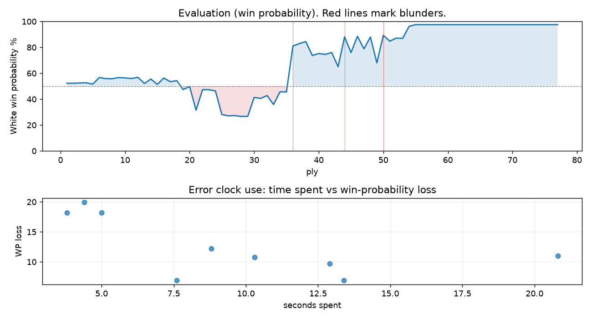

# (free, so lmk) Game analysis: ozvasiliy vs DanielKetterer

Date: 2026.07.19  |  Time control: rapid (1800)  |  You played: white
Game ID: 3b953a42-8394-11f1-b9ec-2f831301000f
Analysis: depth=24 multipv=3 findability=honest floor=6 stable_run=3 threads=1 hash_mb=256 deterministic=True engine_id=Stockfish_18 generated=2026-07-25T15:58:33Z
Game end time UTC: 2026-07-19T17:24:11+00:00
Game: https://www.chess.com/game/live/171794224796

## Summary

- Lichess accuracy: you 82.9%, opponent 75.4%
- Opening: C46 Three Knights Opening (theory followed through ply 5)
- First deviation from theory: ply 6, Opponent played 3... Bc5
- Your moves: 19 best, 7 excellent, 4 good, 3 inaccuracy, 6 mistake, 0 blunder

METRICS:

Best: The played move exactly matches Stockfish's top move

Excellent: A non-best move that loses 2 WP points or less.

Good: WP loss is over 2, but under 5 points; also used for losses under 20 when the position remains already decided.

Inaccuracy: WP loss is at least 5 but under 10 points.

Mistake: WP loss is at least 10 but under 20 points; also generally used when a forced mate is missed with under 10 points of WP loss.

Blunder: WP loss is 20 points or more, or a forced mate is missed with at least 10 points of WP loss.

See: https://support.chess.com/en/articles/8572705-how-are-moves-classified-what-is-a-blunder-or-brilliant-etc 

(Brillint, Great and Miss are rating subjective)
- Puzzles: 13 open, 0 solved

### Puzzle gate tally (this game)

Gates: category in ['brilliant_sacrifice', 'missed_tactic', 'allowed_tactic', 'endgame'], refute depth in [3, 8], best-vs-second WP gap >= 5. Refute bar per move: max(5, 0.6 x WP loss).

| outcome | errors |
|---|---|
| category:attention | 1 |
| category:positional | 1 |
| refute_censored_high | 1 |
| refute_too_deep | 2 |
| wp_gap_too_small | 4 |

Four gates pass at once or nothing is generated, so a zero here is a product of four pass rates rather than a fault. Read the binding gate off this table before changing any threshold.

### Sacrifices in the engine's line

Real sacrifices are listed but never served as puzzles: compensation that never resolves back into material has no gradable answer.

| Move | Offered | Kind | Quiet | Line ends | Verdict |
|---|---|---|---|---|---|
| 10 | -3.0 (piece) | real | yes | -1.0 pawns | real_sacrifice_not_gradable |
| 11 | -6.0 (piece) | sham | yes | +0.0 pawns | opening_ply |
| 13 | -3.0 (piece) | sham | no | +0.0 pawns | obvious |
| 17 | -5.0 (piece) | sham | yes | +0.0 pawns | puzzle |
| 22 | -2.0 (exchange) | real | yes | -1.0 pawns | real_sacrifice_not_gradable |

## Biggest missed opportunity

You played 25.Rb8+. Stockfish preferred Rxe4, after which the main line runs 25. Rxe4 Rxf2+ 26. Kxf2 Nxe4+ 27. Kg2 g5. Before committing to a quiet move here, the checklist is checks, captures, threats, in that order. The engine prefers this move from at or below depth 6, which is as shallow as this measurement resolves; it sits near the surface, a forcing move, the kind a checks-and-captures scan catches. Candidates considered by the engine: Rxe4 (+5.41), Kg1 (+3.52), a4 (+2.63).

## Critical positions

- Ply 9 (you), 5.d4: +0.63 -> +0.73 [only-move situation]
- Ply 11 (you), 6.dxe5: +0.70 -> +0.65 [only-move situation]
- Ply 12 (opponent), 6...Bxe5: +0.65 -> +0.75 [only-move situation]
- Ply 26 (opponent), 13...Bxc3: -2.55 -> -2.69 [only-move situation]
- Ply 28 (opponent), 14...Nxe4: -2.66 -> -2.75 [only-move situation]
- Ply 36 (opponent), 18...e5: -0.48 -> +3.94 [evaluation crossed equal -> losing]
- Ply 37 (you), 19.Bxf8: +3.94 -> +4.29 [only-move situation]
- Ply 44 (opponent), 22...Rf3: +1.69 -> +5.45

## Your errors, move by move

| Move | Class | Category | WP loss | Refute depth | Seconds spent | Pre-error eval |
|---|---|---|---:|---|---:|---|
| 10.O-O | inaccuracy | attention | 7% | 1 | 8 | balanced |
| 11.Bg5 | mistake | allowed_tactic | 18% | 4 | 4 | balanced |
| 13.Rab1 | mistake | missed_tactic | 18% | 3 | 5 | balanced |
| 17.a3 | inaccuracy | brilliant_sacrifice | 7% | >18 | 13 | balanced |
| 20.Rb3 | mistake | missed_tactic | 11% | 7 | 10 | winning |
| 22.g3 | mistake | positional | 11% | >18 | 21 | winning |
| 23.Kg2 | mistake | missed_tactic | 12% | 11 | 9 | winning |
| 24.h4 | inaccuracy | allowed_tactic | 10% | 5 | 13 | winning |
| 25.Rb8+ | mistake | missed_tactic | 20% | 10 | 4 | winning |

### 10.O-O (inaccuracy, positional, wp loss 7%)

You played 10.O-O. Stockfish preferred Nb5, after which the main line runs 10. Nb5 d5 11. f4 Bd6 12. e5 dxc4. Why it went wrong: motif: creates threat on c7. This was a judgment error rather than a missed tactic; compare the pawn structure and piece activity after both moves. The engine prefers this move from at or below depth 6, which is as shallow as this measurement resolves; it sits near the surface, a quiet move, but one whose point shows at a glance. Candidates considered by the engine: Nb5 (+0.47), Bd2 (-0.01), Nd5 (-0.07).

### 11.Bg5 (mistake, positional, wp loss 18%)

You played 11.Bg5. Stockfish preferred Nd5, after which the main line runs 11. Nd5 Be6 12. Re1 Rfe8 13. Bd2 Bxb2. The evaluation crossed from equal to losing, which matters more than the raw number. Why it went wrong: motif: creates threat on c7. This was a judgment error rather than a missed tactic; compare the pawn structure and piece activity after both moves. The engine does not settle on this move until depth 11; reachable with real calculation, but not on a scan. Candidates considered by the engine: Nd5 (-0.03), Re1 (-0.27), Bd3 (-0.41).

### 13.Rab1 (mistake, tactical, wp loss 18%)

You played 13.Rab1. Stockfish preferred Bxf6, after which the main line runs 13. Bxf6 Bxf6 14. a4 Bxc3 15. bxc3 e5. The evaluation crossed from equal to losing, which matters more than the raw number. Before committing to a quiet move here, the checklist is checks, captures, threats, in that order. The engine prefers this move from at or below depth 6, which is as shallow as this measurement resolves; it sits near the surface, a forcing move, the kind a checks-and-captures scan catches. Candidates considered by the engine: Bxf6 (-0.40), f3 (-0.71), Rfe1 (-0.87).

### 17.a3 (inaccuracy, positional, wp loss 7%)

You played 17.a3. Stockfish preferred Re1, after which the main line runs 17. Re1 Rf7 18. Rb3 Nd5 19. Bc1 c4. This was a judgment error rather than a missed tactic; compare the pawn structure and piece activity after both moves. The engine does not settle on this move until depth 12; reachable with real calculation, but not on a scan. Candidates considered by the engine: Re1 (-0.79), h4 (-0.92), g3 (-1.23).

### 20.Rb3 (mistake, tactical, wp loss 11%)

You played 20.Rb3. Stockfish preferred Re1, after which the main line runs 20. Re1 e4 21. f3 Rc8 22. fxe4 dxe4. Why it went wrong: motif: creates threat on a7, e5. Before committing to a quiet move here, the checklist is checks, captures, threats, in that order. The engine prefers this move from at or below depth 6, which is as shallow as this measurement resolves; it sits near the surface, a forcing move, the kind a checks-and-captures scan catches. Candidates considered by the engine: Re1 (+4.60), f3 (+4.47), Ra1 (+3.99).

### 22.g3 (mistake, positional, wp loss 11%)

You played 22.g3. Stockfish preferred f3, after which the main line runs 22. f3 e3 23. Rxc3 dxc3 24. Rxe3 Rc8. This was a judgment error rather than a missed tactic; compare the pawn structure and piece activity after both moves. The engine prefers this move from at or below depth 6, which is as shallow as this measurement resolves; it sits near the surface, a quiet move, but one whose point shows at a glance. Candidates considered by the engine: f3 (+3.14), h3 (+2.77), Rb7 (+2.57).

### 23.Kg2 (mistake, tactical, wp loss 12%)

You played 23.Kg2. Stockfish preferred Rxe4, after which the main line runs 23. Rxe4 h5 24. Kg2 Rxf2+ 25. Kxf2 Nxe4+. Why it went wrong: your king's zone came under heavier attack after this move. Before committing to a quiet move here, the checklist is checks, captures, threats, in that order. The engine first prefers this move at depth 9 and holds it; findable, but it takes a deliberate look rather than a scan. Candidates considered by the engine: Rxe4 (+5.45), Rb4 (+4.49), Kg2 (+3.05).

### 24.h4 (inaccuracy, positional, wp loss 10%)

You played 24.h4. Stockfish preferred Rxe4, after which the main line runs 24. Rxe4 Rxf2+ 25. Kxf2 Nxe4+ 26. Ke2 Nd6. This was a judgment error rather than a missed tactic; compare the pawn structure and piece activity after both moves. The engine does not settle on this move until depth 12; reachable with real calculation, but not on a scan. Candidates considered by the engine: Rxe4 (+5.56), Rb4 (+4.47), h4 (+2.94).

### 25.Rb8+ (mistake, tactical, wp loss 20%)

You played 25.Rb8+. Stockfish preferred Rxe4, after which the main line runs 25. Rxe4 Rxf2+ 26. Kxf2 Nxe4+ 27. Kg2 g5. Before committing to a quiet move here, the checklist is checks, captures, threats, in that order. The engine prefers this move from at or below depth 6, which is as shallow as this measurement resolves; it sits near the surface, a forcing move, the kind a checks-and-captures scan catches. Candidates considered by the engine: Rxe4 (+5.41), Kg1 (+3.52), a4 (+2.63).

## Full move table

| Ply | Move | Eval before | Eval after | Best | CP loss | WP loss | Class |
|-----|------|-------------|------------|------|---------|---------|-------|
| 1 | 1.e4* | +0.31 | +0.25 | e4 | 6 | 1% | best |
| 2 | 1...e5 | +0.25 | +0.25 | e5 | 0 | 0% | best |
| 3 | 2.Nf3* | +0.25 | +0.27 | Nf3 | 0 | 0% | best |
| 4 | 2...Nc6 | +0.27 | +0.29 | Nc6 | 2 | 0% | best |
| 5 | 3.Nc3* | +0.29 | +0.17 | Bc4 | 12 | 1% | excellent |
| 6 | 3...Bc5 | +0.17 | +0.73 | Nf6 | 56 | 5% | inaccuracy |
| 7 | 4.Nxe5* | +0.73 | +0.64 | Nxe5 | 9 | 1% | best |
| 8 | 4...Nxe5 | +0.64 | +0.63 | Nxe5 | 0 | 0% | best |
| 9 | 5.d4* | +0.63 | +0.73 | d4 | 0 | 0% | best |
| 10 | 5...Bd6 | +0.73 | +0.70 | Bd6 | 0 | 0% | best |
| 11 | 6.dxe5* | +0.70 | +0.65 | dxe5 | 5 | 0% | best |
| 12 | 6...Bxe5 | +0.65 | +0.75 | Bxe5 | 10 | 1% | best |
| 13 | 7.Bc4* | +0.75 | +0.23 | Bd3 | 52 | 5% | good |
| 14 | 7...d6 | +0.23 | +0.60 | Nf6 | 37 | 3% | good |
| 15 | 8.Qf3* | +0.60 | +0.15 | Qd3 | 45 | 4% | good |
| 16 | 8...Qf6 | +0.15 | +0.69 | Nf6 | 54 | 5% | good |
| 17 | 9.Qxf6* | +0.69 | +0.38 | Nd5 | 31 | 3% | good |
| 18 | 9...Nxf6 | +0.38 | +0.47 | Bxf6 | 9 | 1% | excellent |
| 19 | 10.O-O* | +0.47 | -0.28 | Nb5 | 75 | 7% | inaccuracy |
| 20 | 10...O-O | -0.28 | -0.03 | Bxc3 | 25 | 2% | good |
| 21 | 11.Bg5* | -0.03 | -2.11 | Nd5 | 208 | 18% | mistake |
| 22 | 11...Be6 | -2.11 | -0.29 | Bxc3 | 182 | 16% | mistake |
| 23 | 12.Bxe6* | -0.29 | -0.29 | Bxe6 | 0 | 0% | best |
| 24 | 12...fxe6 | -0.29 | -0.40 | fxe6 | 0 | 0% | best |
| 25 | 13.Rab1* | -0.40 | -2.55 | Bxf6 | 215 | 18% | mistake |
| 26 | 13...Bxc3 | -2.55 | -2.69 | Bxc3 | 0 | 0% | best |
| 27 | 14.bxc3* | -2.69 | -2.66 | bxc3 | 0 | 0% | best |
| 28 | 14...Nxe4 | -2.66 | -2.75 | Nxe4 | 0 | 0% | best |
| 29 | 15.Be3* | -2.75 | -2.74 | Be3 | 0 | 0% | best |
| 30 | 15...Nxc3 | -2.74 | -0.95 | b6 | 179 | 15% | mistake |
| 31 | 16.Rxb7* | -0.95 | -1.04 | Rxb7 | 9 | 1% | best |
| 32 | 16...c5 | -1.04 | -0.79 | Rfc8 | 25 | 2% | good |
| 33 | 17.a3* | -0.79 | -1.58 | Re1 | 79 | 7% | inaccuracy |
| 34 | 17...d5 | -1.58 | -0.47 | Rf7 | 111 | 10% | inaccuracy |
| 35 | 18.Bxc5* | -0.47 | -0.48 | Bxc5 | 1 | 0% | best |
| 36 | 18...e5 | -0.48 | +3.94 | Rf7 | 442 | 35% | blunder |
| 37 | 19.Bxf8* | +3.94 | +4.29 | Bxf8 | 0 | 0% | best |
| 38 | 19...Rxf8 | +4.29 | +4.60 | Ne2+ | 31 | 2% | excellent |
| 39 | 20.Rb3* | +4.60 | +2.80 | Re1 | 180 | 11% | mistake |
| 40 | 20...d4 | +2.80 | +3.02 | d4 | 22 | 2% | best |
| 41 | 21.Re1* | +3.02 | +2.92 | f3 | 10 | 1% | excellent |
| 42 | 21...e4 | +2.92 | +3.14 | e4 | 22 | 2% | best |
| 43 | 22.g3* | +3.14 | +1.69 | f3 | 145 | 11% | mistake |
| 44 | 22...Rf3 | +1.69 | +5.45 | Rd8 | 376 | 23% | blunder |
| 45 | 23.Kg2* | +5.45 | +3.12 | Rxe4 | 233 | 12% | mistake |
| 46 | 23...h5 | +3.12 | +5.56 | Rf6 | 244 | 13% | mistake |
| 47 | 24.h4* | +5.56 | +3.57 | Rxe4 | 199 | 10% | inaccuracy |
| 48 | 24...a5 | +3.57 | +5.41 | Rf6 | 184 | 9% | inaccuracy |
| 49 | 25.Rb8+* | +5.41 | +2.05 | Rxe4 | 336 | 20% | mistake |
| 50 | 25...Kh7 | +2.05 | +5.76 | Rf8 | 371 | 21% | blunder |
| 51 | 26.Rd8* | +5.76 | +4.67 | Rxe4 | 109 | 4% | good |
| 52 | 26...d3 | +4.67 | +5.19 | Rf5 | 52 | 2% | good |
| 53 | 27.cxd3* | +5.19 | +5.16 | cxd3 | 3 | 0% | best |
| 54 | 27...exd3 | +5.16 | +8.82 | Rxd3 | 366 | 9% | inaccuracy |
| 55 | 28.Kxf3* | +8.82 | +10.08 | Kxf3 | 0 | 0% | best |
| 56 | 28...Kg6 | +10.08 | M13 | d2 |  | 0% | excellent |
| 57 | 29.Rxd3* | M13 | M12 | Rxd3 |  | 0% | best |
| 58 | 29...a4 | M12 | M7 | Na4 |  | 0% | excellent |
| 59 | 30.Rxc3* | M7 | M6 | Rxc3 |  | 0% | best |
| 60 | 30...Kf5 | M6 | M4 | Kf6 |  | 0% | excellent |
| 61 | 31.Rc5+* | M4 | M6 | Rc6 |  | 0% | excellent |
| 62 | 31...Kf6 | M6 | M5 | Kf6 |  | 0% | best |
| 63 | 32.Re4* | M5 | M5 | Kf4 |  | 0% | excellent |
| 64 | 32...g6 | M5 | M5 | Kf7 |  | 0% | excellent |
| 65 | 33.Rxa4* | M5 | M6 | Rc6+ |  | 0% | excellent |
| 66 | 33...Kf7 | M6 | M4 | Ke7 |  | 0% | excellent |
| 67 | 34.Ra6* | M4 | M3 | Ra6 |  | 0% | best |
| 68 | 34...Kg7 | M3 | M3 | Ke8 |  | 0% | excellent |
| 69 | 35.g4* | M3 | M4 | Rc7+ |  | 0% | excellent |
| 70 | 35...hxg4+ | M4 | M4 | hxg4+ |  | 0% | best |
| 71 | 36.Kxg4* | M4 | M3 | Kxg4 |  | 0% | best |
| 72 | 36...Kh6 | M3 | M2 | Kh7 |  | 0% | excellent |
| 73 | 37.h5* | M2 | M2 | Ra7 |  | 0% | excellent |
| 74 | 37...Kh7 | M2 | M2 | Kh7 |  | 0% | best |
| 75 | 38.Rc7+* | M2 | M1 | Rc7+ |  | 0% | best |
| 76 | 38...Kh6 | M1 | M1 | Kh6 |  | 0% | best |
| 77 | 39.Rxg6#* | M1 | M1 | Rxg6# |  | 0% | best |

Rows marked * are your moves. WP loss is win-probability loss; it is the primary signal, CP loss is shown for reference.

## Patterns in this game

- Error categories: 2 allowed_tactic, 1 attention, 1 brilliant_sacrifice, 4 missed_tactic, 1 positional.
- Attention errors per 100 moves: 2.6.
- Pre-error eval buckets: 5 winning, 4 balanced, 0 losing.
- Opening: 1 error(s) (avg wp loss 7%).
- Middlegame: 8 error(s) (avg wp loss 13%).
