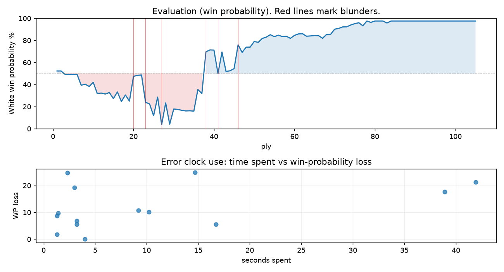

# (free, so lmk) Game analysis: alesandro777888 vs DanielKetterer

Date: 2026.07.19  |  Time control: rapid (1800)  |  You played: white
Game ID: 0b0abfa6-8397-11f1-998b-190e3501000f
Analysis: depth=24 multipv=3 findability=honest floor=6 stable_run=3 threads=1 hash_mb=256 deterministic=True engine_id=Stockfish_18 generated=2026-07-25T16:48:13Z
Game end time UTC: 2026-07-19T18:07:05+00:00
Game: https://www.chess.com/game/live/171795040624

## Summary

- Lichess accuracy: you 79.7%, opponent 76.0%
- Opening: C22 Center Game: Normal Variation (theory followed through ply 6)
- First deviation from theory: ply 7, You played 4. Qd5
- Your moves: 23 best, 12 excellent, 4 good, 5 inaccuracy, 6 mistake, 3 blunder

METRICS:

Best: The played move exactly matches Stockfish's top move

Excellent: A non-best move that loses 2 WP points or less.

Good: WP loss is over 2, but under 5 points; also used for losses under 20 when the position remains already decided.

Inaccuracy: WP loss is at least 5 but under 10 points.

Mistake: WP loss is at least 10 but under 20 points; also generally used when a forced mate is missed with under 10 points of WP loss.

Blunder: WP loss is 20 points or more, or a forced mate is missed with at least 10 points of WP loss.

See: https://support.chess.com/en/articles/8572705-how-are-moves-classified-what-is-a-blunder-or-brilliant-etc 

(Brillint, Great and Miss are rating subjective)
- Puzzles: 14 open, 0 solved

### Puzzle gate tally (this game)

Gates: category in ['brilliant_sacrifice', 'missed_tactic', 'allowed_tactic', 'endgame'], refute depth in [3, 8], best-vs-second WP gap >= 5. Refute bar per move: max(5, 0.6 x WP loss).

| outcome | errors |
|---|---|
| category:attention | 3 |
| category:opening | 3 |
| category:positional | 3 |
| refute_censored_high | 2 |
| refute_too_deep | 2 |
| wp_gap_too_small | 1 |

Four gates pass at once or nothing is generated, so a zero here is a product of four pass rates rather than a fault. Read the binding gate off this table before changing any threshold.

### Sacrifices in the engine's line

Real sacrifices are listed but never served as puzzles: compensation that never resolves back into material has no gradable answer.

| Move | Offered | Kind | Quiet | Line ends | Verdict |
|---|---|---|---|---|---|
| 4 | -3.0 (piece) | sham | yes | +0.0 pawns | desperado |
| 6 | -5.0 (piece) | sham | yes | +0.0 pawns | opening_ply |
| 8 | -3.0 (piece) | sham | no | +0.0 pawns | opening_ply |
| 10 | -9.0 (piece) | sham | yes | +0.0 pawns | opening_ply |
| 12 | -9.0 (piece) | sham | yes | +0.0 pawns | obvious |
| 14 | -6.0 (piece) | real | yes | -3.0 pawns | real_sacrifice_not_gradable |
| 15 | -8.0 (piece) | real | yes | -3.0 pawns | real_sacrifice_not_gradable |
| 21 | -2.0 (exchange) | real | yes | -1.0 pawns | real_sacrifice_not_gradable |
| 42 | -3.0 (piece) | sham | yes | mate | desperado |

## Biggest missed opportunity

You played 14.Bg2. Stockfish preferred Bf4, after which the main line runs 14. Bf4 Qxb2 15. Rc1 Bd4 16. Qb5+ c6. Why it went wrong: motif: creates threat on e5. This was a judgment error rather than a missed tactic; compare the pawn structure and piece activity after both moves. The engine prefers this move from at or below depth 6, which is as shallow as this measurement resolves; it sits near the surface, a quiet move, but one whose point shows at a glance. Candidates considered by the engine: Bf4 (-2.48), c3 (-3.71), Rh2 (-4.03).

## Critical positions

- Ply 20 (opponent), 10...Ne5: -2.98 -> -0.28 [evaluation crossed winning -> equal]
- Ply 22 (opponent), 11...Qxe5: -0.18 -> -0.15 [only-move situation]
- Ply 23 (you), 12.h4: -0.15 -> -3.14 [evaluation crossed equal -> losing]
- Ply 27 (you), 14.Bg2: -2.48 -> -8.86
- Ply 32 (opponent), 16...Kh8: -4.22 -> -4.37 [only-move situation]
- Ply 34 (opponent), 17...Qe7: -4.48 -> -4.45 [only-move situation]
- Ply 38 (opponent), 19...g5: -2.06 -> +2.25 [evaluation crossed winning -> losing]
- Ply 39 (you), 20.hxg5: +2.25 -> +2.48 [only-move situation]

## Your errors, move by move

| Move | Class | Category | WP loss | Refute depth | Seconds spent | Pre-error eval |
|---|---|---|---:|---|---:|---|
| 4.Qd5 | inaccuracy | opening | 10% | 4 | 1 | balanced |
| 6.f3 | mistake | attention | 10% | 1 | 10 | balanced |
| 8.Nxe4 | inaccuracy | allowed_tactic | 5% | 8 | 3 | losing |
| 9.fxe4 | inaccuracy | opening | 9% | 14 | 1 | losing |
| 10.Nf3 | inaccuracy | opening | 6% | >18 | 17 | losing |
| 12.h4 | blunder | attention | 25% | 1 | 2 | balanced |
| 13.g3 | mistake | positional | 11% | 11 | 9 | losing |
| 14.Bg2 | blunder | positional | 25% | 6 | 15 | losing |
| 15.c3 | mistake | missed_tactic | 19% | 9 | 3 | losing |
| 21.e6 | blunder | allowed_tactic | 21% | 10 | 42 | winning |
| 22.Bd5 | mistake | allowed_tactic | 18% | >18 | 39 | winning |
| 24.Qd4+ | inaccuracy | attention | 7% | 2 | 3 | winning |
| 42.Kxh3 | mistake | allowed_tactic | 2% | >18 | 1 | winning |
| 44.Rd5+ | mistake | positional | 0% | >18 | 4 | winning |

### 4.Qd5 (inaccuracy, positional, wp loss 10%)

You played 4.Qd5. Stockfish preferred Qe3, after which the main line runs 4. Qe3 Nf6 5. Bd2 Be7 6. Nc3 d5. This was a judgment error rather than a missed tactic; compare the pawn structure and piece activity after both moves. The engine does not settle on this move until depth 23, which is outside what a human reasonably calculates over the board; this is not a training target. Candidates considered by the engine: Qe3 (-0.10), Qd3 (-0.13), Qc4 (-0.23).

### 6.f3 (mistake, positional, wp loss 10%)

You played 6.f3. Stockfish preferred Nc3, after which the main line runs 6. Nc3 d5 7. Bg5 Nb4 8. Qe2 d4. The evaluation crossed from equal to losing, which matters more than the raw number. This was a judgment error rather than a missed tactic; compare the pawn structure and piece activity after both moves. The engine prefers this move from at or below depth 6, which is as shallow as this measurement resolves; it sits near the surface, a quiet move, but one whose point shows at a glance. Candidates considered by the engine: Nc3 (-0.87), Qe3 (-1.73), a3 (-1.79).

### 8.Nxe4 (inaccuracy, positional, wp loss 5%)

You played 8.Nxe4. Stockfish preferred fxe4, after which the main line runs 8. fxe4 Bf5 9. Bg5 Bxe4 10. Nxe4 Qxe4+. This was a judgment error rather than a missed tactic; compare the pawn structure and piece activity after both moves. The engine prefers this move from at or below depth 6, which is as shallow as this measurement resolves; it sits near the surface, a quiet move, but one whose point shows at a glance. Candidates considered by the engine: fxe4 (-1.95), Nxe4 (-2.29), Qe3 (-3.71).

### 9.fxe4 (inaccuracy, positional, wp loss 9%)

You played 9.fxe4. Stockfish preferred Qxe4, after which the main line runs 9. Qxe4 Nb4 10. Bb5+ c6 11. Bd3 Nxd3+. Why it went wrong: a favorable capture was available (fxe4). This was a judgment error rather than a missed tactic; compare the pawn structure and piece activity after both moves. The engine prefers this move from at or below depth 6, which is as shallow as this measurement resolves; it sits near the surface, a quiet move, but one whose point shows at a glance. Candidates considered by the engine: Qxe4 (-1.89), fxe4 (-2.85), Be3 (-5.03).

### 10.Nf3 (inaccuracy, positional, wp loss 6%)

You played 10.Nf3. Stockfish preferred Bd2, after which the main line runs 10. Bd2 Rd8 11. Qe3 Qh4+ 12. Qg3 Qxg3+. This was a judgment error rather than a missed tactic; compare the pawn structure and piece activity after both moves. The engine first prefers this move at depth 7 and holds it; findable, but it takes a deliberate look rather than a scan. Candidates considered by the engine: Bd2 (-2.23), Nf3 (-2.71), Be3 (-2.76).

### 12.h4 (blunder, tactical, wp loss 25%)

You played 12.h4. Stockfish preferred Qb5+, after which the main line runs 12. Qb5+ Qxb5 13. Bxb5+ c6 14. Be2 Bxe2. The evaluation crossed from equal to losing, which matters more than the raw number. Why it went wrong: the best move was a forcing check; motif: fork; creates threat on b7, e5. Before committing to a quiet move here, the checklist is checks, captures, threats, in that order. The engine prefers this move from at or below depth 6, which is as shallow as this measurement resolves; it sits near the surface, a forcing move, the kind a checks-and-captures scan catches. Candidates considered by the engine: Qb5+ (-0.15), Be3 (-1.26), h3 (-1.31).

### 13.g3 (mistake, positional, wp loss 11%)

You played 13.g3. Stockfish preferred Bg5, after which the main line runs 13. Bg5 h6 14. Bf4 Bb4+ 15. c3 Bxc3+. This was a judgment error rather than a missed tactic; compare the pawn structure and piece activity after both moves. The engine prefers this move from at or below depth 6, which is as shallow as this measurement resolves; it sits near the surface, a quiet move, but one whose point shows at a glance. Candidates considered by the engine: Bg5 (-3.37), Bf4 (-3.42), Be3 (-4.40).

### 14.Bg2 (blunder, positional, wp loss 25%)

You played 14.Bg2. Stockfish preferred Bf4, after which the main line runs 14. Bf4 Qxb2 15. Rc1 Bd4 16. Qb5+ c6. Why it went wrong: motif: creates threat on e5. This was a judgment error rather than a missed tactic; compare the pawn structure and piece activity after both moves. The engine prefers this move from at or below depth 6, which is as shallow as this measurement resolves; it sits near the surface, a quiet move, but one whose point shows at a glance. Candidates considered by the engine: Bf4 (-2.48), c3 (-3.71), Rh2 (-4.03).

### 15.c3 (mistake, tactical, wp loss 19%)

You played 15.c3. Stockfish preferred Qc4+, after which the main line runs 15. Qc4+ Kh8 16. Bf4 Qxb2 17. Qxc5 Qxa1+. Why it went wrong: the best move was a forcing check. Before committing to a quiet move here, the checklist is checks, captures, threats, in that order. The engine never settles on this move within the analysis depth, so how findable it was is not measured here; weigh this one lightly. Candidates considered by the engine: Qc4+ (-3.23), Bf4 (-3.29), Rf1 (-5.55).

### 21.e6 (blunder, positional, wp loss 21%)

You played 21.e6. Stockfish preferred b4, after which the main line runs 21. b4 Bb6 22. Bc6 Rg8 23. Kf1 Rxg5. The evaluation crossed from winning to equal, which matters more than the raw number. Why it went wrong: motif: creates threat on c5. This was a judgment error rather than a missed tactic; compare the pawn structure and piece activity after both moves. The engine prefers this move from at or below depth 6, which is as shallow as this measurement resolves; it sits near the surface, a quiet move, but one whose point shows at a glance. Candidates considered by the engine: b4 (+2.46), Rh2 (+2.44), Bg2 (+2.10).

### 22.Bd5 (mistake, positional, wp loss 18%)

You played 22.Bd5. Stockfish preferred O-O, after which the main line runs 22. O-O Kh7 23. Bc6 Kg6 24. Rae1 Rh8. The evaluation crossed from winning to equal, which matters more than the raw number. This was a judgment error rather than a missed tactic; compare the pawn structure and piece activity after both moves. The engine first prefers this move at depth 7 and holds it; findable, but it takes a deliberate look rather than a scan. Candidates considered by the engine: O-O (+2.23), b4 (+1.14), Bc6 (+0.99).

### 24.Qd4+ (inaccuracy, positional, wp loss 7%)

You played 24.Qd4+. Stockfish preferred O-O, after which the main line runs 24. O-O a5 25. Rae1 Rb8 26. Rf2 Rfd8. This was a judgment error rather than a missed tactic; compare the pawn structure and piece activity after both moves. The engine prefers this move from at or below depth 6, which is as shallow as this measurement resolves; it sits near the surface, a quiet move, but one whose point shows at a glance. Candidates considered by the engine: O-O (+3.13), Kf2 (+2.31), b4 (+2.20).

### 42.Kxh3 (mistake, positional, wp loss 2%)

You played 42.Kxh3. Stockfish preferred e8=Q, after which the main line runs 42. e8=Q Bxe8 43. c5+ Kc7 44. Rxe8 Rxe8. There was a forced mate on the board and this move let it slip. Why it went wrong: left pawn on e7, bishop on c6 insufficiently defended; motif: creates threat on c8, g6. This was a judgment error rather than a missed tactic; compare the pawn structure and piece activity after both moves. The engine never settles on this move within the analysis depth, so how findable it was is not measured here; weigh this one lightly. Candidates considered by the engine: e8=Q (M19), c5+ (M19), e8=N+ (M19).

### 44.Rd5+ (mistake, positional, wp loss 0%)

You played 44.Rd5+. Stockfish preferred Kh4, after which the main line runs 44. Kh4 Rh8+ 45. Kg5 Kd7 46. e8=Q+ Rxe8. There was a forced mate on the board and this move let it slip. Why it went wrong: left pawn on e7, rook on d5 insufficiently defended; motif: creates threat on f5. This was a judgment error rather than a missed tactic; compare the pawn structure and piece activity after both moves. The engine never settles on this move within the analysis depth, so how findable it was is not measured here; weigh this one lightly. Candidates considered by the engine: Kh4 (M17), c5+ (+76.77), b6 (+11.72).

## Full move table

| Ply | Move | Eval before | Eval after | Best | CP loss | WP loss | Class |
|-----|------|-------------|------------|------|---------|---------|-------|
| 1 | 1.e4* | +0.31 | +0.25 | e4 | 6 | 1% | best |
| 2 | 1...e5 | +0.25 | +0.25 | e5 | 0 | 0% | best |
| 3 | 2.d4* | +0.25 | -0.09 | Nf3 | 34 | 3% | good |
| 4 | 2...exd4 | -0.09 | -0.09 | exd4 | 0 | 0% | best |
| 5 | 3.Qxd4* | -0.09 | -0.10 | Nf3 | 1 | 0% | excellent |
| 6 | 3...Nc6 | -0.10 | -0.10 | Nc6 | 0 | 0% | best |
| 7 | 4.Qd5* | -0.10 | -1.17 | Qe3 | 107 | 10% | inaccuracy |
| 8 | 4...Nf6 | -1.17 | -1.06 | Nf6 | 11 | 1% | best |
| 9 | 5.Qd3* | -1.06 | -1.30 | Qc4 | 24 | 2% | good |
| 10 | 5...Qe7 | -1.30 | -0.87 | Bb4+ | 43 | 4% | good |
| 11 | 6.f3* | -0.87 | -2.06 | Nc3 | 119 | 10% | mistake |
| 12 | 6...d5 | -2.06 | -2.01 | d5 | 5 | 0% | best |
| 13 | 7.Nc3* | -2.01 | -2.12 | Nc3 | 11 | 1% | best |
| 14 | 7...dxe4 | -2.12 | -1.95 | Be6 | 17 | 1% | excellent |
| 15 | 8.Nxe4* | -1.95 | -2.66 | fxe4 | 71 | 5% | inaccuracy |
| 16 | 8...Nxe4 | -2.66 | -1.89 | Nb4 | 77 | 6% | inaccuracy |
| 17 | 9.fxe4* | -1.89 | -3.04 | Qxe4 | 115 | 9% | inaccuracy |
| 18 | 9...Bg4 | -3.04 | -2.23 | Bf5 | 81 | 6% | inaccuracy |
| 19 | 10.Nf3* | -2.23 | -2.98 | Bd2 | 75 | 6% | inaccuracy |
| 20 | 10...Ne5 | -2.98 | -0.28 | Rd8 | 270 | 22% | blunder |
| 21 | 11.Nxe5* | -0.28 | -0.18 | Nxe5 | 0 | 0% | best |
| 22 | 11...Qxe5 | -0.18 | -0.15 | Qxe5 | 3 | 0% | best |
| 23 | 12.h4* | -0.15 | -3.14 | Qb5+ | 299 | 25% | blunder |
| 24 | 12...Bc5 | -3.14 | -3.37 | Bc5 | 0 | 0% | best |
| 25 | 13.g3* | -3.37 | -5.48 | Bg5 | 211 | 11% | mistake |
| 26 | 13...f5 | -5.48 | -2.48 | Rd8 | 300 | 17% | mistake |
| 27 | 14.Bg2* | -2.48 | -8.86 | Bf4 | 638 | 25% | blunder |
| 28 | 14...O-O | -8.86 | -3.23 | Rd8 | 563 | 20% | mistake |
| 29 | 15.c3* | -3.23 | -8.57 | Qc4+ | 534 | 19% | mistake |
| 30 | 15...Rad8 | -8.57 | -4.15 | Bf2+ | 442 | 14% | mistake |
| 31 | 16.Qc4+* | -4.15 | -4.22 | Qc4+ | 7 | 0% | best |
| 32 | 16...Kh8 | -4.22 | -4.37 | Kh8 | 0 | 0% | best |
| 33 | 17.Bf4* | -4.37 | -4.48 | Bf4 | 11 | 1% | best |
| 34 | 17...Qe7 | -4.48 | -4.45 | Qe7 | 3 | 0% | best |
| 35 | 18.e5* | -4.45 | -4.52 | e5 | 7 | 0% | best |
| 36 | 18...h6 | -4.52 | -1.62 | Rfe8 | 290 | 20% | mistake |
| 37 | 19.Bxb7* | -1.62 | -2.06 | Bxb7 | 44 | 4% | best |
| 38 | 19...g5 | -2.06 | +2.25 | c6 | 431 | 38% | blunder |
| 39 | 20.hxg5* | +2.25 | +2.48 | hxg5 | 0 | 0% | best |
| 40 | 20...h5 | +2.48 | +2.46 | h5 | 0 | 0% | best |
| 41 | 21.e6* | +2.46 | +0.00 | b4 | 246 | 21% | blunder |
| 42 | 21...Bd6 | +0.00 | +2.23 | Rd6 | 223 | 19% | mistake |
| 43 | 22.Bd5* | +2.23 | +0.20 | O-O | 203 | 18% | mistake |
| 44 | 22...Bxf4 | +0.20 | +0.27 | Bxf4 | 7 | 1% | best |
| 45 | 23.gxf4* | +0.27 | +0.48 | gxf4 | 0 | 0% | best |
| 46 | 23...Kg7 | +0.48 | +3.13 | c6 | 265 | 22% | blunder |
| 47 | 24.Qd4+* | +3.13 | +2.19 | O-O | 94 | 7% | inaccuracy |
| 48 | 24...Kg6 | +2.19 | +2.82 | Kh7 | 63 | 5% | good |
| 49 | 25.Qe5* | +2.82 | +2.83 | Qe5 | 0 | 0% | best |
| 50 | 25...Rh8 | +2.83 | +3.60 | Qd6 | 77 | 5% | inaccuracy |
| 51 | 26.Kf2* | +3.60 | +3.47 | O-O | 13 | 1% | excellent |
| 52 | 26...h4 | +3.47 | +4.07 | c6 | 60 | 4% | good |
| 53 | 27.Rh2* | +4.07 | +4.30 | Rh2 | 0 | 0% | best |
| 54 | 27...h3 | +4.30 | +4.74 | Qc5+ | 44 | 2% | good |
| 55 | 28.Kg3* | +4.74 | +4.38 | Re1 | 36 | 2% | excellent |
| 56 | 28...Qg7 | +4.38 | +4.65 | Qg7 | 27 | 1% | best |
| 57 | 29.Qxg7+* | +4.65 | +4.40 | Re1 | 25 | 1% | excellent |
| 58 | 29...Kxg7 | +4.40 | +4.45 | Kxg7 | 5 | 0% | best |
| 59 | 30.c4* | +4.45 | +4.09 | Bc4 | 36 | 2% | excellent |
| 60 | 30...Kf8 | +4.09 | +4.61 | Rd6 | 52 | 3% | good |
| 61 | 31.Re1* | +4.61 | +4.90 | Re1 | 0 | 0% | best |
| 62 | 31...Ke7 | +4.90 | +4.94 | Ke7 | 4 | 0% | best |
| 63 | 32.b4* | +4.94 | +4.46 | Re3 | 48 | 2% | good |
| 64 | 32...c6 | +4.46 | +4.51 | c6 | 5 | 0% | best |
| 65 | 33.Bxc6* | +4.51 | +4.59 | Bxc6 | 0 | 0% | best |
| 66 | 33...Rd3+ | +4.59 | +4.56 | Rd3+ | 0 | 0% | best |
| 67 | 34.Kf2* | +4.56 | +4.10 | Kf2 | 46 | 2% | best |
| 68 | 34...Rd2+ | +4.10 | +4.81 | Rd2+ | 71 | 4% | best |
| 69 | 35.Kg1* | +4.81 | +4.83 | Kg3 | 0 | 0% | excellent |
| 70 | 35...Rxh2 | +4.83 | +6.01 | Rd4 | 118 | 5% | good |
| 71 | 36.Kxh2* | +6.01 | +6.23 | Kxh2 | 0 | 0% | best |
| 72 | 36...Rc8 | +6.23 | +6.71 | Bh5 | 48 | 1% | excellent |
| 73 | 37.b5* | +6.71 | +6.74 | Bd5 | 0 | 0% | excellent |
| 74 | 37...a6 | +6.74 | +7.45 | Rb8 | 71 | 2% | excellent |
| 75 | 38.a4* | +7.45 | +8.09 | a4 | 0 | 0% | best |
| 76 | 38...a5 | +8.09 | +8.62 | axb5 | 53 | 1% | excellent |
| 77 | 39.Re5* | +8.62 | +7.13 | Bd5 | 149 | 3% | good |
| 78 | 39...Kd6 | +7.13 | +14.71 | Bd1 | 758 | 4% | good |
| 79 | 40.g6* | +14.71 | +8.84 | e7 | 587 | 1% | excellent |
| 80 | 40...Bh5 | +8.84 | M23 | Ke7 |  | 1% | excellent |
| 81 | 41.e7* | M23 | +13.93 | e7 |  | 0% | best |
| 82 | 41...Bxg6 | +13.93 | M19 | Bxg6 |  | 0% | best |
| 83 | 42.Kxh3* | M19 | +8.45 | e8=Q |  | 2% | mistake |
| 84 | 42...Be8 | +8.45 | +17.99 | Rh8+ | 954 | 2% | excellent |
| 85 | 43.Bxe8* | +17.99 | +81.68 | c5+ | 0 | 0% | excellent |
| 86 | 43...Rxe8 | +81.68 | M17 | Rxe8 |  | 0% | best |
| 87 | 44.Rd5+* | M17 | +12.47 | Kh4 |  | 0% | mistake |
| 88 | 44...Kxe7 | +12.47 | M17 | Ke6 |  | 0% | excellent |
| 89 | 45.Re5+* | M17 | M16 | Re5+ |  | 0% | best |
| 90 | 45...Kd7 | M16 | M16 | Kf8 |  | 0% | excellent |
| 91 | 46.Rxe8* | M16 | M15 | Rxe8 |  | 0% | best |
| 92 | 46...Kxe8 | M15 | M15 | Kxe8 |  | 0% | best |
| 93 | 47.b6* | M15 | M15 | c5 |  | 0% | excellent |
| 94 | 47...Kd8 | M15 | M14 | Kd8 |  | 0% | best |
| 95 | 48.c5* | M14 | M14 | Kh4 |  | 0% | excellent |
| 96 | 48...Kc8 | M14 | M11 | Kd7 |  | 0% | excellent |
| 97 | 49.c6* | M11 | M10 | c6 |  | 0% | best |
| 98 | 49...Kb8 | M10 | M10 | Kd8 |  | 0% | excellent |
| 99 | 50.c7+* | M10 | M11 | Kh4 |  | 0% | excellent |
| 100 | 50...Kb7 | M11 | M10 | Kc8 |  | 0% | excellent |
| 101 | 51.Kh4* | M10 | M9 | Kh4 |  | 0% | best |
| 102 | 51...Kc8 | M9 | M9 | Ka6 |  | 0% | excellent |
| 103 | 52.Kg5* | M9 | M8 | Kg5 |  | 0% | best |
| 104 | 52...Kb7 | M8 | M8 | Kb7 |  | 0% | best |
| 105 | 53.Kxf5* | M8 | M7 | Kxf5 |  | 0% | best |

Rows marked * are your moves. WP loss is win-probability loss; it is the primary signal, CP loss is shown for reference.

## Patterns in this game

- Error categories: 4 allowed_tactic, 3 attention, 1 missed_tactic, 3 opening, 3 positional.
- Attention errors per 100 moves: 5.7.
- Pre-error eval buckets: 5 winning, 3 balanced, 6 losing.
- Opening: 5 error(s) (avg wp loss 8%).
- Middlegame: 7 error(s) (avg wp loss 18%).
- Endgame: 2 error(s) (avg wp loss 1%).
