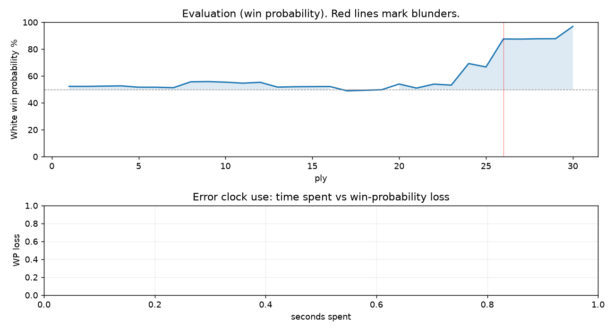

# (free, so lmk) Game analysis: newchessplr vs DanielKetterer

Date: 2026.07.20  |  Time control: rapid (1800)  |  You played: white
Game ID: a9f7a99c-83dc-11f1-b9ec-2f831301000f
Analysis: depth=24 multipv=3 findability=honest floor=6 stable_run=3 threads=1 hash_mb=256 deterministic=True engine_id=Stockfish_18 generated=2026-07-25T16:54:00Z
Game end time UTC: 2026-07-20T01:54:53+00:00
Game: https://www.chess.com/game/live/171808415550

## Summary

- Lichess accuracy: you 95.6%, opponent 72.6%
- Opening: C45 Scotch Game (theory followed through ply 7)
- First deviation from theory: ply 8, Opponent played 4... d5
- Your moves: 9 best, 2 excellent, 4 good, 0 inaccuracy, 0 mistake, 0 blunder

METRICS:

Best: The played move exactly matches Stockfish's top move

Excellent: A non-best move that loses 2 WP points or less.

Good: WP loss is over 2, but under 5 points; also used for losses under 20 when the position remains already decided.

Inaccuracy: WP loss is at least 5 but under 10 points.

Mistake: WP loss is at least 10 but under 20 points; also generally used when a forced mate is missed with under 10 points of WP loss.

Blunder: WP loss is 20 points or more, or a forced mate is missed with at least 10 points of WP loss.

See: https://support.chess.com/en/articles/8572705-how-are-moves-classified-what-is-a-blunder-or-brilliant-etc 

(Brillint, Great and Miss are rating subjective)
- Puzzles: 16 open, 0 solved

## Critical positions

- Ply 10 (opponent), 5...bxc6: +0.64 -> +0.59 [only-move situation]
- Ply 14 (opponent), 7...cxd5: +0.19 -> +0.22 [only-move situation]
- Ply 18 (opponent), 9...Kxd7: -0.11 -> -0.07 [only-move situation]
- Ply 26 (opponent), 13...d3: +1.89 -> +5.30
- Ply 27 (you), 14.Nxc5+: +5.30 -> +5.28 [only-move situation]

## Full move table

| Ply | Move | Eval before | Eval after | Best | CP loss | WP loss | Class |
|-----|------|-------------|------------|------|---------|---------|-------|
| 1 | 1.e4* | +0.31 | +0.25 | e4 | 6 | 1% | best |
| 2 | 1...e5 | +0.25 | +0.25 | e5 | 0 | 0% | best |
| 3 | 2.Nf3* | +0.25 | +0.27 | Nf3 | 0 | 0% | best |
| 4 | 2...Nc6 | +0.27 | +0.29 | Nc6 | 2 | 0% | best |
| 5 | 3.d4* | +0.29 | +0.18 | Bc4 | 11 | 1% | excellent |
| 6 | 3...exd4 | +0.18 | +0.18 | exd4 | 0 | 0% | best |
| 7 | 4.Nxd4* | +0.18 | +0.14 | Nxd4 | 4 | 0% | best |
| 8 | 4...d5 | +0.14 | +0.62 | Nf6 | 48 | 4% | good |
| 9 | 5.Nxc6* | +0.62 | +0.64 | Nxc6 | 0 | 0% | best |
| 10 | 5...bxc6 | +0.64 | +0.59 | bxc6 | 0 | 0% | best |
| 11 | 6.exd5* | +0.59 | +0.51 | exd5 | 8 | 1% | best |
| 12 | 6...Qxd5 | +0.51 | +0.58 | Nf6 | 7 | 1% | excellent |
| 13 | 7.Qxd5* | +0.58 | +0.19 | Qe2+ | 39 | 4% | good |
| 14 | 7...cxd5 | +0.19 | +0.22 | cxd5 | 3 | 0% | best |
| 15 | 8.Bb5+* | +0.22 | +0.23 | Nc3 | 0 | 0% | excellent |
| 16 | 8...Bd7 | +0.23 | +0.24 | Bd7 | 1 | 0% | best |
| 17 | 9.Bxd7+* | +0.24 | -0.11 | Bd3 | 35 | 3% | good |
| 18 | 9...Kxd7 | -0.11 | -0.07 | Kxd7 | 4 | 0% | best |
| 19 | 10.O-O* | -0.07 | -0.02 | O-O | 0 | 0% | best |
| 20 | 10...Re8 | -0.02 | +0.44 | c5 | 46 | 4% | good |
| 21 | 11.Nc3* | +0.44 | +0.11 | Rd1 | 33 | 3% | good |
| 22 | 11...d4 | +0.11 | +0.43 | Nf6 | 32 | 3% | good |
| 23 | 12.Rd1* | +0.43 | +0.35 | Rd1 | 8 | 1% | best |
| 24 | 12...Bc5 | +0.35 | +2.21 | c5 | 186 | 16% | mistake |
| 25 | 13.Na4* | +2.21 | +1.89 | Be3 | 32 | 3% | good |
| 26 | 13...d3 | +1.89 | +5.30 | Bd6 | 341 | 21% | blunder |
| 27 | 14.Nxc5+* | +5.30 | +5.28 | Nxc5+ | 2 | 0% | best |
| 28 | 14...Kc6 | +5.28 | +5.34 | Kc8 | 6 | 0% | excellent |
| 29 | 15.Nxd3* | +5.34 | +5.35 | Nxd3 | 0 | 0% | best |
| 30 | 15...Rd8 | +5.35 | +9.36 | Kb7 | 401 | 9% | inaccuracy |

Rows marked * are your moves. WP loss is win-probability loss; it is the primary signal, CP loss is shown for reference.

## Patterns in this game

- Error categories: .
- Attention errors per 100 moves: 0.0.
