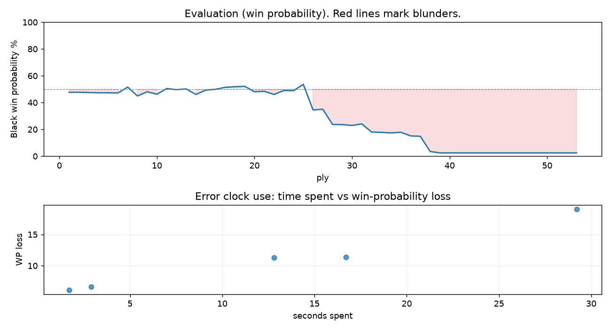

# (free, so lmk) Game analysis: DanielKetterer vs Joey20151122

Date: 2026.07.20  |  Time control: rapid (1800)  |  You played: black
Game ID: 06e53923-83de-11f1-958f-35f4f601000f
Analysis: depth=24 multipv=3 findability=honest floor=6 stable_run=3 threads=1 hash_mb=256 deterministic=True engine_id=Stockfish_18 generated=2026-07-25T17:04:50Z
Game end time UTC: 2026-07-20T02:15:08+00:00
Game: https://www.chess.com/game/live/171808612292

## Summary

- Lichess accuracy: you 83.5%, opponent 96.2%
- Opening: C47 Four Knights Game: Italian Variation (theory followed through ply 7)
- First deviation from theory: ply 8, You played 4... h6
- Your moves: 10 best, 7 excellent, 4 good, 2 inaccuracy, 3 mistake, 0 blunder

METRICS:

Best: The played move exactly matches Stockfish's top move

Excellent: A non-best move that loses 2 WP points or less.

Good: WP loss is over 2, but under 5 points; also used for losses under 20 when the position remains already decided.

Inaccuracy: WP loss is at least 5 but under 10 points.

Mistake: WP loss is at least 10 but under 20 points; also generally used when a forced mate is missed with under 10 points of WP loss.

Blunder: WP loss is 20 points or more, or a forced mate is missed with at least 10 points of WP loss.

See: https://support.chess.com/en/articles/8572705-how-are-moves-classified-what-is-a-blunder-or-brilliant-etc 

(Brillint, Great and Miss are rating subjective)
- Puzzles: 17 open, 0 solved

### Puzzle gate tally (this game)

Gates: category in ['brilliant_sacrifice', 'missed_tactic', 'allowed_tactic', 'endgame'], refute depth in [3, 8], best-vs-second WP gap >= 5. Refute bar per move: max(5, 0.6 x WP loss).

| outcome | errors |
|---|---|
| accepted | 1 |
| category:attention | 1 |
| refute_too_deep | 1 |
| wp_gap_too_small | 2 |

Four gates pass at once or nothing is generated, so a zero here is a product of four pass rates rather than a fault. Read the binding gate off this table before changing any threshold.

### Sacrifices in the engine's line

Real sacrifices are listed but never served as puzzles: compensation that never resolves back into material has no gradable answer.

| Move | Offered | Kind | Quiet | Line ends | Verdict |
|---|---|---|---|---|---|
| 4 | -2.0 (exchange) | sham | no | +0.0 pawns | opening_ply |
| 13 | -5.0 (piece) | sham | yes | +0.0 pawns | obvious |
| 14 | -7.0 (piece) | real | yes | -2.0 pawns | real_sacrifice_not_gradable |
| 19 | -9.0 (piece) | sham | yes | +1.0 pawns | obvious |

## Biggest missed opportunity

You played 13...exd4. Stockfish preferred c5, after which the main line runs 13...c5 14. dxe5 dxe5 15. Bb2 Bg4 16. h3. The evaluation crossed from equal to losing, which matters more than the raw number. Why it went wrong: left pawn on d4 insufficiently defended; motif: creates threat on e4. Before committing to a quiet move here, the checklist is checks, captures, threats, in that order. The engine prefers this move from at or below depth 6, which is as shallow as this measurement resolves; it sits near the surface, a forcing move, the kind a checks-and-captures scan catches. Candidates considered by the engine: c5 (-0.39), Nxe4 (+0.79), Rd8 (+1.26).

## Critical positions

- Ply 27 (opponent), 14.e5: +1.74 -> +1.68 [only-move situation; evaluation crossed winning -> equal]

## Your errors, move by move

| Move | Class | Category | WP loss | Refute depth | Seconds spent | Pre-error eval |
|---|---|---|---:|---|---:|---|
| 4...h6 | inaccuracy | allowed_tactic | 7% | 7 | 3 | balanced |
| 13...exd4 | mistake | missed_tactic | 19% | 5 | 29 | balanced |
| 14...Nd7 | mistake | missed_tactic | 11% | 12 | 17 | balanced |
| 16...Kxf8 | inaccuracy | attention | 6% | 1 | 2 | losing |
| 19...Rb8 | mistake | allowed_tactic | 11% | 4 | 13 | losing |

### 4...h6 (inaccuracy, positional, wp loss 7%)

You played 4...h6. Stockfish preferred Nxe4, after which the main line runs 4...Nxe4 5. Nxe4 d5 6. Bd3 dxe4 7. Bxe4. This was a judgment error rather than a missed tactic; compare the pawn structure and piece activity after both moves. The engine first prefers this move at depth 7 and holds it; findable, but it takes a deliberate look rather than a scan. Candidates considered by the engine: Nxe4 (-0.17), Bc5 (+0.09), Be7 (+0.19).

### 13...exd4 (mistake, tactical, wp loss 19%)

You played 13...exd4. Stockfish preferred c5, after which the main line runs 13...c5 14. dxe5 dxe5 15. Bb2 Bg4 16. h3. The evaluation crossed from equal to losing, which matters more than the raw number. Why it went wrong: left pawn on d4 insufficiently defended; motif: creates threat on e4. Before committing to a quiet move here, the checklist is checks, captures, threats, in that order. The engine prefers this move from at or below depth 6, which is as shallow as this measurement resolves; it sits near the surface, a forcing move, the kind a checks-and-captures scan catches. Candidates considered by the engine: c5 (-0.39), Nxe4 (+0.79), Rd8 (+1.26).

### 14...Nd7 (mistake, tactical, wp loss 11%)

You played 14...Nd7. Stockfish preferred c5, after which the main line runs 14...c5 15. exf6 Qxf6 16. c3 dxc3 17. Qb3. The evaluation crossed from equal to losing, which matters more than the raw number. Why it went wrong: left pawn on d4 insufficiently defended. Before committing to a quiet move here, the checklist is checks, captures, threats, in that order. The engine does not settle on this move until depth 12; reachable with real calculation, but not on a scan. Candidates considered by the engine: c5 (+1.68), Ne4 (+2.23), Ne8 (+3.03).

### 16...Kxf8 (inaccuracy, positional, wp loss 6%)

You played 16...Kxf8. Stockfish preferred Nxf8, after which the main line runs 16...Nxf8 17. Qxd4 Qg6 18. Rfb1 Bg4 19. Qd3. Why it went wrong: left pawn on d4 insufficiently defended; a favorable capture was available (Kxf8). This was a judgment error rather than a missed tactic; compare the pawn structure and piece activity after both moves. The engine prefers this move from at or below depth 6, which is as shallow as this measurement resolves; it sits near the surface, a quiet move, but one whose point shows at a glance. Candidates considered by the engine: Nxf8 (+3.12), Kxf8 (+3.99), c5 (+4.25).

### 19...Rb8 (mistake, positional, wp loss 11%)

You played 19...Rb8. Stockfish preferred Qe6, after which the main line runs 19...Qe6 20. Nd2 Kg8 21. Qxe6 fxe6 22. f4. This was a judgment error rather than a missed tactic; compare the pawn structure and piece activity after both moves. The engine prefers this move from at or below depth 6, which is as shallow as this measurement resolves; it sits near the surface, a quiet move, but one whose point shows at a glance. Candidates considered by the engine: Qe6 (+4.75), Qc6 (+4.93), Qb6 (+5.20).

## Full move table

| Ply | Move | Eval before | Eval after | Best | CP loss | WP loss | Class |
|-----|------|-------------|------------|------|---------|---------|-------|
| 1 | 1.e4 | +0.31 | +0.25 | e4 | 6 | 1% | best |
| 2 | 1...e5* | +0.25 | +0.25 | e5 | 0 | 0% | best |
| 3 | 2.Nf3 | +0.25 | +0.27 | Nf3 | 0 | 0% | best |
| 4 | 2...Nc6* | +0.27 | +0.29 | Nc6 | 2 | 0% | best |
| 5 | 3.Bc4 | +0.29 | +0.29 | Bc4 | 0 | 0% | best |
| 6 | 3...Nf6* | +0.29 | +0.31 | Nf6 | 2 | 0% | best |
| 7 | 4.Nc3 | +0.31 | -0.17 | d3 | 48 | 4% | good |
| 8 | 4...h6* | -0.17 | +0.55 | Nxe4 | 72 | 7% | inaccuracy |
| 9 | 5.Nd5 | +0.55 | +0.21 | d4 | 34 | 3% | good |
| 10 | 5...Be7* | +0.21 | +0.41 | Bc5 | 20 | 2% | excellent |
| 11 | 6.Nxe7 | +0.41 | -0.05 | O-O | 46 | 4% | good |
| 12 | 6...Qxe7* | -0.05 | +0.04 | Qxe7 | 9 | 1% | best |
| 13 | 7.O-O | +0.04 | -0.02 | d3 | 6 | 1% | excellent |
| 14 | 7...O-O* | -0.02 | +0.43 | Nxe4 | 45 | 4% | good |
| 15 | 8.d3 | +0.43 | +0.08 | Re1 | 35 | 3% | good |
| 16 | 8...Na5* | +0.08 | +0.01 | d6 | 0 | 0% | excellent |
| 17 | 9.b3 | +0.01 | -0.15 | Nd2 | 16 | 1% | excellent |
| 18 | 9...Nxc4* | -0.15 | -0.20 | Nxc4 | 0 | 0% | best |
| 19 | 10.bxc4 | -0.20 | -0.23 | bxc4 | 3 | 0% | best |
| 20 | 10...c6* | -0.23 | +0.21 | d6 | 44 | 4% | good |
| 21 | 11.a4 | +0.21 | +0.17 | a4 | 4 | 0% | best |
| 22 | 11...a5* | +0.17 | +0.43 | d6 | 26 | 2% | good |
| 23 | 12.Ba3 | +0.43 | +0.11 | h3 | 32 | 3% | good |
| 24 | 12...d6* | +0.11 | +0.12 | d6 | 1 | 0% | best |
| 25 | 13.d4 | +0.12 | -0.39 | Qe2 | 51 | 5% | good |
| 26 | 13...exd4* | -0.39 | +1.74 | c5 | 213 | 19% | mistake |
| 27 | 14.e5 | +1.74 | +1.68 | e5 | 6 | 1% | best |
| 28 | 14...Nd7* | +1.68 | +3.18 | c5 | 150 | 11% | mistake |
| 29 | 15.Bxd6 | +3.18 | +3.20 | Bxd6 | 0 | 0% | best |
| 30 | 15...Qe6* | +3.20 | +3.29 | Qe6 | 9 | 1% | best |
| 31 | 16.Bxf8 | +3.29 | +3.12 | Bxf8 | 17 | 1% | best |
| 32 | 16...Kxf8* | +3.12 | +4.12 | Nxf8 | 100 | 6% | inaccuracy |
| 33 | 17.Qxd4 | +4.12 | +4.16 | Qxd4 | 0 | 0% | best |
| 34 | 17...c5* | +4.16 | +4.24 | c5 | 8 | 0% | best |
| 35 | 18.Qd5 | +4.24 | +4.15 | Qe4 | 9 | 0% | excellent |
| 36 | 18...Qa6* | +4.15 | +4.68 | Qe7 | 53 | 3% | good |
| 37 | 19.Rfe1 | +4.68 | +4.75 | Rfe1 | 0 | 0% | best |
| 38 | 19...Rb8* | +4.75 | +9.01 | Qe6 | 426 | 11% | mistake |
| 39 | 20.e6 | +9.01 | +10.82 | e6 | 0 | 0% | best |
| 40 | 20...fxe6* | +10.82 | +12.96 | Kg8 | 214 | 0% | excellent |
| 41 | 21.Rxe6 | +12.96 | +11.87 | Rxe6 | 109 | 0% | best |
| 42 | 21...b6* | +11.87 | M6 | Nf6 |  | 0% | excellent |
| 43 | 22.Rae1 | M6 | M6 | Qd6+ |  | 0% | excellent |
| 44 | 22...Nf6* | M6 | M4 | Bb7 |  | 0% | excellent |
| 45 | 23.Qd6+ | M4 | M7 | Qd8+ |  | 0% | excellent |
| 46 | 23...Kg8* | M7 | M7 | Kg8 |  | 0% | best |
| 47 | 24.Re8+ | M7 | M6 | Re8+ |  | 0% | best |
| 48 | 24...Nxe8* | M6 | M4 | Kf7 |  | 0% | excellent |
| 49 | 25.Rxe8+ | M4 | M3 | Rxe8+ |  | 0% | best |
| 50 | 25...Kh7* | M3 | M3 | Kh7 |  | 0% | best |
| 51 | 26.Qd3+ | M3 | M2 | Qd3+ |  | 0% | best |
| 52 | 26...g6* | M2 | M2 | Bf5 |  | 0% | excellent |
| 53 | 27.Re7+ | M2 | M1 | Re7+ |  | 0% | best |

Rows marked * are your moves. WP loss is win-probability loss; it is the primary signal, CP loss is shown for reference.

## Patterns in this game

- Error categories: 2 allowed_tactic, 1 attention, 2 missed_tactic.
- Attention errors per 100 moves: 3.8.
- Pre-error eval buckets: 0 winning, 3 balanced, 2 losing.
- Opening: 1 error(s) (avg wp loss 7%).
- Middlegame: 4 error(s) (avg wp loss 12%).
