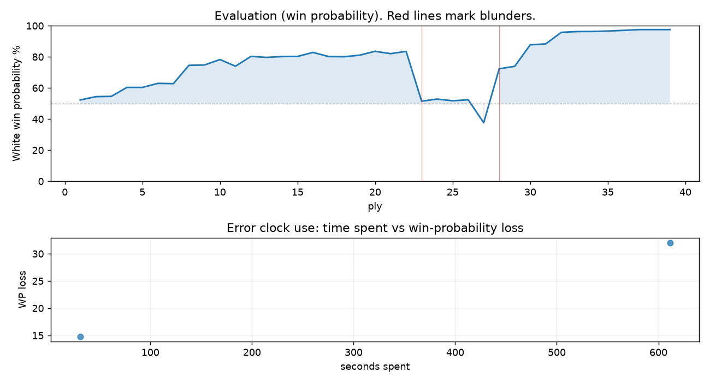

# (free, so lmk) Game analysis: DanielKetterer vs Candongas47

Date: 2026.07.19  |  Time control: daily (1/259200)  |  You played: white
Game ID: 8e1357de-8307-11f1-80f3-72a72901000b
Analysis: depth=24 multipv=3 findability=honest floor=6 stable_run=3 threads=1 hash_mb=256 deterministic=True engine_id=Stockfish_18 generated=2026-07-25T14:59:40Z
Game end time UTC: 2026-07-20T20:44:35+00:00
Game: https://www.chess.com/game/daily/1001249768

## Summary

- Lichess accuracy: you 80.3%, opponent 70.1%
- Opening: B02 Alekhine Defense: Mokele Mbembe, Vavra Defense (theory followed through ply 6)
- First deviation from theory: ply 7, You played 4. Bd3
- Your moves: 14 best, 2 excellent, 2 good, 0 inaccuracy, 1 mistake, 1 blunder

METRICS:

Best: The played move exactly matches Stockfish's top move

Excellent: A non-best move that loses 2 WP points or less.

Good: WP loss is over 2, but under 5 points; also used for losses under 20 when the position remains already decided.

Inaccuracy: WP loss is at least 5 but under 10 points.

Mistake: WP loss is at least 10 but under 20 points; also generally used when a forced mate is missed with under 10 points of WP loss.

Blunder: WP loss is 20 points or more, or a forced mate is missed with at least 10 points of WP loss.

See: https://support.chess.com/en/articles/8572705-how-are-moves-classified-what-is-a-blunder-or-brilliant-etc 

(Brillint, Great and Miss are rating subjective)
- Puzzles: 12 open, 0 solved

### Puzzle gate tally (this game)

Gates: category in ['brilliant_sacrifice', 'missed_tactic', 'allowed_tactic', 'endgame'], refute depth in [3, 8], best-vs-second WP gap >= 5. Refute bar per move: max(5, 0.6 x WP loss).

| outcome | errors |
|---|---|
| category:attention | 1 |
| wp_gap_too_small | 1 |

Four gates pass at once or nothing is generated, so a zero here is a product of four pass rates rather than a fault. Read the binding gate off this table before changing any threshold.

### Sacrifices in the engine's line

Real sacrifices are listed but never served as puzzles: compensation that never resolves back into material has no gradable answer.

| Move | Offered | Kind | Quiet | Line ends | Verdict |
|---|---|---|---|---|---|
| 12 | -5.0 (piece) | sham | yes | +0.0 pawns | obvious |
| 14 | -4.0 (piece) | sham | no | +0.0 pawns | puzzle |

## Biggest missed opportunity

You played 12.Nd4. Stockfish preferred Be4, after which the main line runs 12. Be4 O-O 13. Qxd7 Bxd7 14. Rad1 Be8. The evaluation crossed from winning to equal, which matters more than the raw number. Why it went wrong: left pawn on e5 insufficiently defended. Before committing to a quiet move here, the checklist is checks, captures, threats, in that order. The engine prefers this move from at or below depth 6, which is as shallow as this measurement resolves; it sits near the surface, a forcing move, the kind a checks-and-captures scan catches. Candidates considered by the engine: Be4 (+4.41), h5 (+4.22), Bb5 (+4.07).

## Critical positions

- Ply 9 (you), 5.Kxf2: +2.92 -> +2.95 [only-move situation]
- Ply 23 (you), 12.Nd4: +4.41 -> +0.16 [evaluation crossed winning -> equal]
- Ply 24 (opponent), 12...Nxd4: +0.16 -> +0.31 [only-move situation]
- Ply 26 (opponent), 13...Nc6: +0.19 -> +0.26 [only-move situation]
- Ply 28 (opponent), 14...Bb7: -1.37 -> +2.61 [only-move situation; evaluation crossed equal -> losing]

## Your errors, move by move

| Move | Class | Category | WP loss | Refute depth | Seconds spent | Pre-error eval |
|---|---|---|---:|---|---:|---|
| 12.Nd4 | blunder | attention | 32% | 1 | 611 | winning |
| 14.Qf3 | mistake | brilliant_sacrifice | 15% | 8 | 31 | balanced |

### 12.Nd4 (blunder, tactical, wp loss 32%)

You played 12.Nd4. Stockfish preferred Be4, after which the main line runs 12. Be4 O-O 13. Qxd7 Bxd7 14. Rad1 Be8. The evaluation crossed from winning to equal, which matters more than the raw number. Why it went wrong: left pawn on e5 insufficiently defended. Before committing to a quiet move here, the checklist is checks, captures, threats, in that order. The engine prefers this move from at or below depth 6, which is as shallow as this measurement resolves; it sits near the surface, a forcing move, the kind a checks-and-captures scan catches. Candidates considered by the engine: Be4 (+4.41), h5 (+4.22), Bb5 (+4.07).

### 14.Qf3 (mistake, tactical, wp loss 15%)

You played 14.Qf3. Stockfish preferred Qxd7+, after which the main line runs 14. Qxd7+ Bxd7 15. Rad1 Rd8 16. Rxd7 Kxd7. Why it went wrong: left pawn on e5 insufficiently defended; the best move was a forcing check. Before committing to a quiet move here, the checklist is checks, captures, threats, in that order. The engine does not settle on this move until depth 24, which is outside what a human reasonably calculates over the board; this is not a training target. Candidates considered by the engine: Qxd7+ (+0.26), Qg1 (+0.17), Qe2 (-0.14).

## Full move table

| Ply | Move | Eval before | Eval after | Best | CP loss | WP loss | Class |
|-----|------|-------------|------------|------|---------|---------|-------|
| 1 | 1.e4* | +0.31 | +0.25 | e4 | 6 | 1% | best |
| 2 | 1...e6 | +0.25 | +0.48 | e5 | 23 | 2% | good |
| 3 | 2.d4* | +0.48 | +0.50 | d4 | 0 | 0% | best |
| 4 | 2...Nf6 | +0.50 | +1.14 | d5 | 64 | 6% | inaccuracy |
| 5 | 3.e5* | +1.14 | +1.14 | e5 | 0 | 0% | best |
| 6 | 3...Ne4 | +1.14 | +1.44 | Nd5 | 30 | 3% | good |
| 7 | 4.Bd3* | +1.44 | +1.42 | Nh3 | 2 | 0% | excellent |
| 8 | 4...Nxf2 | +1.42 | +2.92 | d5 | 150 | 12% | mistake |
| 9 | 5.Kxf2* | +2.92 | +2.95 | Kxf2 | 0 | 0% | best |
| 10 | 5...Nc6 | +2.95 | +3.48 | Qh4+ | 53 | 4% | good |
| 11 | 6.Be3* | +3.48 | +2.84 | c3 | 64 | 4% | good |
| 12 | 6...d6 | +2.84 | +3.82 | Nxd4 | 98 | 6% | inaccuracy |
| 13 | 7.Nf3* | +3.82 | +3.71 | Nf3 | 11 | 1% | best |
| 14 | 7...dxe5 | +3.71 | +3.80 | Nb4 | 9 | 1% | excellent |
| 15 | 8.dxe5* | +3.80 | +3.81 | dxe5 | 0 | 0% | best |
| 16 | 8...Be7 | +3.81 | +4.28 | Qe7 | 47 | 3% | good |
| 17 | 9.h4* | +4.28 | +3.80 | Qe2 | 48 | 3% | good |
| 18 | 9...Qd5 | +3.80 | +3.78 | Qd5 | 0 | 0% | best |
| 19 | 10.Nc3* | +3.78 | +3.95 | Nc3 | 0 | 0% | best |
| 20 | 10...Qd7 | +3.95 | +4.42 | Qa5 | 47 | 3% | good |
| 21 | 11.g4* | +4.42 | +4.13 | h5 | 29 | 2% | excellent |
| 22 | 11...b6 | +4.13 | +4.41 | f6 | 28 | 1% | excellent |
| 23 | 12.Nd4* | +4.41 | +0.16 | Be4 | 425 | 32% | blunder |
| 24 | 12...Nxd4 | +0.16 | +0.31 | Nxd4 | 15 | 1% | best |
| 25 | 13.Be4* | +0.31 | +0.19 | Be4 | 12 | 1% | best |
| 26 | 13...Nc6 | +0.19 | +0.26 | Nc6 | 7 | 1% | best |
| 27 | 14.Qf3* | +0.26 | -1.37 | Qxd7+ | 163 | 15% | mistake |
| 28 | 14...Bb7 | -1.37 | +2.61 | Nxe5 | 398 | 35% | blunder |
| 29 | 15.Rad1* | +2.61 | +2.83 | Rad1 | 0 | 0% | best |
| 30 | 15...Bxh4+ | +2.83 | +5.35 | Nxe5 | 252 | 14% | mistake |
| 31 | 16.Rxh4* | +5.35 | +5.50 | Rxh4 | 0 | 0% | best |
| 32 | 16...Qe7 | +5.50 | +8.47 | Nxe5 | 297 | 7% | inaccuracy |
| 33 | 17.Bxc6+* | +8.47 | +8.83 | Bxc6+ | 0 | 0% | best |
| 34 | 17...Kf8 | +8.83 | +8.87 | Kf8 | 4 | 0% | best |
| 35 | 18.g5* | +8.87 | +9.11 | g5 | 0 | 0% | best |
| 36 | 18...Bxc6 | +9.11 | +9.47 | Bxc6 | 36 | 0% | best |
| 37 | 19.Qxc6* | +9.47 | +10.24 | Qxc6 | 0 | 0% | best |
| 38 | 19...Re8 | +10.24 | +11.71 | Qe8 | 147 | 0% | excellent |
| 39 | 20.Rd7* | +11.71 | +12.93 | Rd7 | 0 | 0% | best |

Rows marked * are your moves. WP loss is win-probability loss; it is the primary signal, CP loss is shown for reference.

## Patterns in this game

- Error categories: 1 attention, 1 brilliant_sacrifice.
- Attention errors per 100 moves: 5.0.
- Pre-error eval buckets: 1 winning, 1 balanced, 0 losing.
- Middlegame: 2 error(s) (avg wp loss 23%).
- 1 of your errors came with under a minute on the clock.
