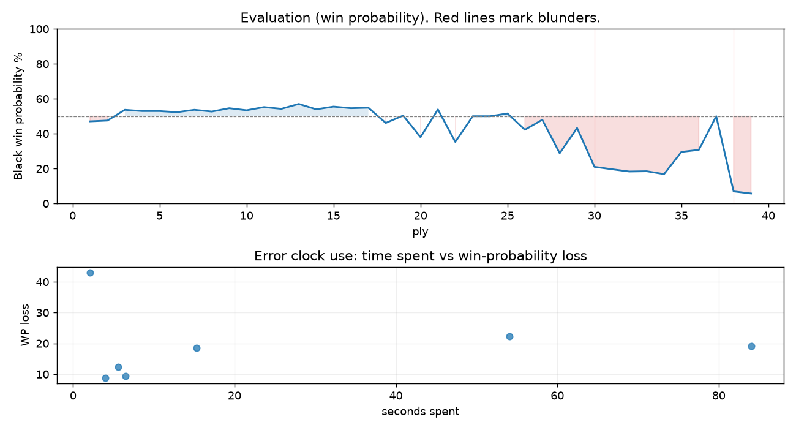

# (free, so lmk) Game analysis: kmlkrn vs DanielKetterer

Date: 2026.07.20  |  Time control: rapid (1800)  |  You played: black
Game ID: 11ef4557-848b-11f1-a2b8-d7df4901000f
Analysis: depth=24 multipv=3 findability=honest floor=6 stable_run=3 threads=1 hash_mb=256 deterministic=True engine_id=Stockfish_18 generated=2026-07-25T15:09:25Z
Game end time UTC: 2026-07-20T22:43:16+00:00
Game: https://www.chess.com/game/live/171848454352

## Summary

- Lichess accuracy: you 59.1%, opponent 74.6%
- Opening: A45 Indian Defense: Pawn Push Variation (theory followed through ply 3)
- First deviation from theory: ply 4, You played 2... c6
- Your moves: 6 best, 5 excellent, 1 good, 2 inaccuracy, 3 mistake, 2 blunder

METRICS:

Best: The played move exactly matches Stockfish's top move

Excellent: A non-best move that loses 2 WP points or less.

Good: WP loss is over 2, but under 5 points; also used for losses under 20 when the position remains already decided.

Inaccuracy: WP loss is at least 5 but under 10 points.

Mistake: WP loss is at least 10 but under 20 points; also generally used when a forced mate is missed with under 10 points of WP loss.

Blunder: WP loss is 20 points or more, or a forced mate is missed with at least 10 points of WP loss.

See: https://support.chess.com/en/articles/8572705-how-are-moves-classified-what-is-a-blunder-or-brilliant-etc 

(Brillint, Great and Miss are rating subjective)
- Puzzles: 13 open, 0 solved

### Puzzle gate tally (this game)

Gates: category in ['brilliant_sacrifice', 'missed_tactic', 'allowed_tactic', 'endgame'], refute depth in [3, 8], best-vs-second WP gap >= 5. Refute bar per move: max(5, 0.6 x WP loss).

| outcome | errors |
|---|---|
| category:attention | 1 |
| category:positional | 1 |
| refute_too_deep | 1 |
| refute_too_shallow | 2 |
| wp_gap_too_small | 2 |

Four gates pass at once or nothing is generated, so a zero here is a product of four pass rates rather than a fault. Read the binding gate off this table before changing any threshold.

### Sacrifices in the engine's line

Real sacrifices are listed but never served as puzzles: compensation that never resolves back into material has no gradable answer.

| Move | Offered | Kind | Quiet | Line ends | Verdict |
|---|---|---|---|---|---|
| 9 | -3.0 (piece) | sham | yes | +2.0 pawns | opening_ply |
| 10 | -9.0 (piece) | sham | yes | +0.0 pawns | opening_ply |

## Biggest missed opportunity

You played 19...Nxf1. Stockfish preferred Rg6, after which the main line runs 19...Rg6 20. Qd1 Qh1+ 21. Kf2 Qh4 22. Kg1. The evaluation crossed from equal to losing, which matters more than the raw number. Why it went wrong: left queen on h4, knight on f1 insufficiently defended; motif: creates threat on f1. Before committing to a quiet move here, the checklist is checks, captures, threats, in that order. The engine does not settle on this move until depth 14; reachable with real calculation, but not on a scan. Candidates considered by the engine: Rg6 (+0.00), Nd7 (+0.03), Qh1+ (+1.48).

## Critical positions

- Ply 30 (you), 15...Bxh2+: +0.74 -> +3.60 [evaluation crossed equal -> losing]
- Ply 31 (opponent), 16.Kxh2: +3.60 -> +3.83 [only-move situation]
- Ply 38 (you), 19...Nxf1: +0.00 -> +7.06 [evaluation crossed equal -> losing]
- Ply 39 (opponent), 20.Qxh4: +7.06 -> +7.61 [only-move situation]

## Your errors, move by move

| Move | Class | Category | WP loss | Refute depth | Seconds spent | Pre-error eval |
|---|---|---|---:|---|---:|---|
| 9...Bd7 | inaccuracy | allowed_tactic | 9% | 6 | 4 | balanced |
| 10...a6 | mistake | allowed_tactic | 12% | 7 | 6 | balanced |
| 11...Bb5 | mistake | attention | 19% | 1 | 15 | balanced |
| 13...b5 | inaccuracy | positional | 9% | 3 | 6 | balanced |
| 14...Ne4 | mistake | allowed_tactic | 19% | 1 | 84 | balanced |
| 15...Bxh2+ | blunder | missed_tactic | 22% | 11 | 54 | balanced |
| 19...Nxf1 | blunder | missed_tactic | 43% | 1 | 2 | balanced |

### 9...Bd7 (inaccuracy, positional, wp loss 9%)

You played 9...Bd7. Stockfish preferred Nc6, after which the main line runs 9...Nc6 10. O-O a6 11. b3 Bd7 12. Bb2. This was a judgment error rather than a missed tactic; compare the pawn structure and piece activity after both moves. The engine prefers this move from at or below depth 6, which is as shallow as this measurement resolves; it sits near the surface, a quiet move, but one whose point shows at a glance. Candidates considered by the engine: Nc6 (-0.53), a6 (-0.44), h6 (-0.35).

### 10...a6 (mistake, positional, wp loss 12%)

You played 10...a6. Stockfish preferred Qe7, after which the main line runs 10...Qe7 11. e4 dxe4 12. Ng5 Be5 13. Ngxe4. This was a judgment error rather than a missed tactic; compare the pawn structure and piece activity after both moves. The engine first prefers this move at depth 9 and holds it; findable, but it takes a deliberate look rather than a scan. Candidates considered by the engine: Qe7 (-0.04), Bc6 (+0.00), Bc7 (+0.18).

### 11...Bb5 (mistake, positional, wp loss 19%)

You played 11...Bb5. Stockfish preferred Qc7, after which the main line runs 11...Qc7 12. h3 Nc6 13. b3 Ne5 14. Bb2. This was a judgment error rather than a missed tactic; compare the pawn structure and piece activity after both moves. The engine prefers this move from at or below depth 6, which is as shallow as this measurement resolves; it sits near the surface, a quiet move, but one whose point shows at a glance. Candidates considered by the engine: Qc7 (-0.42), Bc6 (-0.26), Qe7 (-0.22).

### 13...b5 (inaccuracy, positional, wp loss 9%)

You played 13...b5. Stockfish preferred Nc6, after which the main line runs 13...Nc6 14. h3 Rc8 15. Bb2 Bb8 16. b5. This was a judgment error rather than a missed tactic; compare the pawn structure and piece activity after both moves. The engine prefers this move from at or below depth 6, which is as shallow as this measurement resolves; it sits near the surface, a quiet move, but one whose point shows at a glance. Candidates considered by the engine: Nc6 (-0.17), Nbd7 (-0.04), Qc7 (+0.04).

### 14...Ne4 (mistake, positional, wp loss 19%)

You played 14...Ne4. Stockfish preferred Nc6, after which the main line runs 14...Nc6 15. h3 Rc8 16. a4 bxa4 17. b5. The evaluation crossed from equal to losing, which matters more than the raw number. This was a judgment error rather than a missed tactic; compare the pawn structure and piece activity after both moves. The engine does not settle on this move until depth 11; reachable with real calculation, but not on a scan. Candidates considered by the engine: Nc6 (+0.22), Nbd7 (+0.43), Re8 (+0.80).

### 15...Bxh2+ (blunder, tactical, wp loss 22%)

You played 15...Bxh2+. Stockfish preferred Nxc3, after which the main line runs 15...Nxc3 16. Bxc3 Re8 17. Rfc1 Ra7 18. Qg4. The evaluation crossed from equal to losing, which matters more than the raw number. Why it went wrong: left pawn on e6, bishop on h2 insufficiently defended. Before committing to a quiet move here, the checklist is checks, captures, threats, in that order. The engine prefers this move from at or below depth 6, which is as shallow as this measurement resolves; it sits near the surface, a forcing move, the kind a checks-and-captures scan catches. Candidates considered by the engine: Nxc3 (+0.74), Qh4 (+1.60), Qg5 (+2.46).

### 19...Nxf1 (blunder, tactical, wp loss 43%)

You played 19...Nxf1. Stockfish preferred Rg6, after which the main line runs 19...Rg6 20. Qd1 Qh1+ 21. Kf2 Qh4 22. Kg1. The evaluation crossed from equal to losing, which matters more than the raw number. Why it went wrong: left queen on h4, knight on f1 insufficiently defended; motif: creates threat on f1. Before committing to a quiet move here, the checklist is checks, captures, threats, in that order. The engine does not settle on this move until depth 14; reachable with real calculation, but not on a scan. Candidates considered by the engine: Rg6 (+0.00), Nd7 (+0.03), Qh1+ (+1.48).

## Full move table

| Ply | Move | Eval before | Eval after | Best | CP loss | WP loss | Class |
|-----|------|-------------|------------|------|---------|---------|-------|
| 1 | 1.d4 | +0.31 | +0.32 | e4 | 0 | 0% | excellent |
| 2 | 1...Nf6* | +0.32 | +0.27 | d5 | 0 | 0% | excellent |
| 3 | 2.d5 | +0.27 | -0.40 | Nf3 | 67 | 6% | inaccuracy |
| 4 | 2...c6* | -0.40 | -0.32 | e6 | 8 | 1% | excellent |
| 5 | 3.c4 | -0.32 | -0.32 | c4 | 0 | 0% | best |
| 6 | 3...cxd5* | -0.32 | -0.25 | cxd5 | 7 | 1% | best |
| 7 | 4.cxd5 | -0.25 | -0.40 | cxd5 | 15 | 1% | best |
| 8 | 4...e6* | -0.40 | -0.29 | Qa5+ | 11 | 1% | excellent |
| 9 | 5.dxe6 | -0.29 | -0.50 | Nc3 | 21 | 2% | excellent |
| 10 | 5...fxe6* | -0.50 | -0.37 | fxe6 | 13 | 1% | best |
| 11 | 6.Nc3 | -0.37 | -0.57 | Bg5 | 20 | 2% | excellent |
| 12 | 6...d5* | -0.57 | -0.46 | d5 | 11 | 1% | best |
| 13 | 7.e3 | -0.46 | -0.77 | Nf3 | 31 | 3% | good |
| 14 | 7...Bd6* | -0.77 | -0.43 | e5 | 34 | 3% | good |
| 15 | 8.Nf3 | -0.43 | -0.60 | g3 | 17 | 2% | excellent |
| 16 | 8...O-O* | -0.60 | -0.50 | Nc6 | 10 | 1% | excellent |
| 17 | 9.Be2 | -0.50 | -0.53 | Be2 | 3 | 0% | best |
| 18 | 9...Bd7* | -0.53 | +0.42 | Nc6 | 95 | 9% | inaccuracy |
| 19 | 10.O-O | +0.42 | -0.04 | e4 | 46 | 4% | good |
| 20 | 10...a6* | -0.04 | +1.33 | Qe7 | 137 | 12% | mistake |
| 21 | 11.a3 | +1.33 | -0.42 | e4 | 175 | 16% | mistake |
| 22 | 11...Bb5* | -0.42 | +1.65 | Qc7 | 207 | 19% | mistake |
| 23 | 12.b4 | +1.65 | +0.00 | Nxb5 | 165 | 15% | mistake |
| 24 | 12...Bxe2* | +0.00 | +0.00 | Bxe2 | 0 | 0% | best |
| 25 | 13.Qxe2 | +0.00 | -0.17 | Nxe2 | 17 | 2% | excellent |
| 26 | 13...b5* | -0.17 | +0.85 | Nc6 | 102 | 9% | inaccuracy |
| 27 | 14.Bb2 | +0.85 | +0.22 | e4 | 63 | 6% | inaccuracy |
| 28 | 14...Ne4* | +0.22 | +2.46 | Nc6 | 224 | 19% | mistake |
| 29 | 15.Nd4 | +2.46 | +0.74 | Nxe4 | 172 | 14% | mistake |
| 30 | 15...Bxh2+* | +0.74 | +3.60 | Nxc3 | 286 | 22% | blunder |
| 31 | 16.Kxh2 | +3.60 | +3.83 | Kxh2 | 0 | 0% | best |
| 32 | 16...Qh4+* | +3.83 | +4.06 | Qh4+ | 23 | 1% | best |
| 33 | 17.Kg1 | +4.06 | +4.03 | Kg1 | 3 | 0% | best |
| 34 | 17...Rf6* | +4.03 | +4.34 | Nf6 | 31 | 2% | excellent |
| 35 | 18.f3 | +4.34 | +2.36 | Nf3 | 198 | 13% | mistake |
| 36 | 18...Ng3* | +2.36 | +2.21 | Ng3 | 0 | 0% | best |
| 37 | 19.Qe1 | +2.21 | +0.00 | Qc2 | 221 | 19% | mistake |
| 38 | 19...Nxf1* | +0.00 | +7.06 | Rg6 | 706 | 43% | blunder |
| 39 | 20.Qxh4 | +7.06 | +7.61 | Qxh4 | 0 | 0% | best |

Rows marked * are your moves. WP loss is win-probability loss; it is the primary signal, CP loss is shown for reference.

## Patterns in this game

- Error categories: 3 allowed_tactic, 1 attention, 2 missed_tactic, 1 positional.
- Attention errors per 100 moves: 5.3.
- Pre-error eval buckets: 0 winning, 7 balanced, 0 losing.
- Opening: 2 error(s) (avg wp loss 11%).
- Middlegame: 5 error(s) (avg wp loss 22%).
