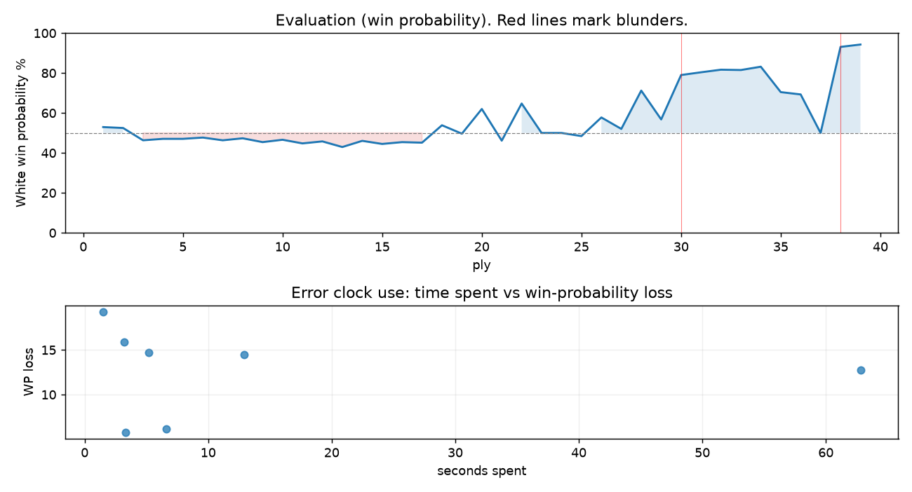

# (free, so lmk) Game analysis: kmlkrn vs DanielKetterer

Date: 2026.07.20  |  Time control: rapid (1800)  |  You played: white
Game ID: 11ef4557-848b-11f1-a2b8-d7df4901000f
Analysis: depth=24 multipv=3 findability=honest floor=6 stable_run=3 threads=1 hash_mb=256 deterministic=True engine_id=Stockfish_18 generated=2026-07-25T15:09:25Z
Game end time UTC: 2026-07-20T22:43:16+00:00
Game: https://www.chess.com/game/live/171848454352

## Summary

- Lichess accuracy: you 74.6%, opponent 59.1%
- Opening: A45 Indian Defense: Pawn Push Variation (theory followed through ply 3)
- First deviation from theory: ply 4, Opponent played 2... c6
- Your moves: 6 best, 5 excellent, 2 good, 2 inaccuracy, 5 mistake, 0 blunder

METRICS:

Best: The played move exactly matches Stockfish's top move

Excellent: A non-best move that loses 2 WP points or less.

Good: WP loss is over 2, but under 5 points; also used for losses under 20 when the position remains already decided.

Inaccuracy: WP loss is at least 5 but under 10 points.

Mistake: WP loss is at least 10 but under 20 points; also generally used when a forced mate is missed with under 10 points of WP loss.

Blunder: WP loss is 20 points or more, or a forced mate is missed with at least 10 points of WP loss.

See: https://support.chess.com/en/articles/8572705-how-are-moves-classified-what-is-a-blunder-or-brilliant-etc 

(Brillint, Great and Miss are rating subjective)
- Puzzles: 13 open, 0 solved

### Puzzle gate tally (this game)

Gates: category in ['brilliant_sacrifice', 'missed_tactic', 'allowed_tactic', 'endgame'], refute depth in [3, 8], best-vs-second WP gap >= 5. Refute bar per move: max(5, 0.6 x WP loss).

| outcome | errors |
|---|---|
| category:attention | 3 |
| category:positional | 3 |
| wp_gap_too_small | 1 |

Four gates pass at once or nothing is generated, so a zero here is a product of four pass rates rather than a fault. Read the binding gate off this table before changing any threshold.

### Sacrifices in the engine's line

Real sacrifices are listed but never served as puzzles: compensation that never resolves back into material has no gradable answer.

| Move | Offered | Kind | Quiet | Line ends | Verdict |
|---|---|---|---|---|---|
| 2 | -3.0 (piece) | sham | yes | +0.0 pawns | opening_ply |
| 11 | -2.0 (exchange) | sham | yes | +1.0 pawns | opening_ply |
| 14 | -4.0 (piece) | sham | yes | +1.0 pawns | obvious |
| 15 | -2.0 (exchange) | sham | no | +1.0 pawns | obvious |
| 18 | -7.0 (piece) | sham | yes | +0.0 pawns | obvious |
| 19 | -5.0 (piece) | real | yes | -1.0 pawns | real_sacrifice_not_gradable |

## Biggest missed opportunity

You played 19.Qe1. Stockfish preferred Qc2, after which the main line runs 19. Qc2 Nd7 20. Nce2 Qh1+ 21. Kf2 Ne4+. The evaluation crossed from winning to equal, which matters more than the raw number. Why it went wrong: left rook on f1 insufficiently defended. Before committing to a quiet move here, the checklist is checks, captures, threats, in that order. The engine first prefers this move at depth 9 and holds it; findable, but it takes a deliberate look rather than a scan. Candidates considered by the engine: Qc2 (+2.21), Qd1 (+1.24), Qe1 (+0.00).

## Critical positions

- Ply 30 (opponent), 15...Bxh2+: +0.74 -> +3.60 [evaluation crossed equal -> losing]
- Ply 31 (you), 16.Kxh2: +3.60 -> +3.83 [only-move situation]
- Ply 38 (opponent), 19...Nxf1: +0.00 -> +7.06 [evaluation crossed equal -> losing]
- Ply 39 (you), 20.Qxh4: +7.06 -> +7.61 [only-move situation]

## Your errors, move by move

| Move | Class | Category | WP loss | Refute depth | Seconds spent | Pre-error eval |
|---|---|---|---:|---|---:|---|
| 2.d5 | inaccuracy | allowed_tactic | 6% | 3 | 7 | balanced |
| 11.a3 | mistake | positional | 16% | 5 | 3 | balanced |
| 12.b4 | mistake | attention | 15% | 1 | 5 | balanced |
| 14.Bb2 | inaccuracy | positional | 6% | 5 | 3 | balanced |
| 15.Nd4 | mistake | attention | 14% | 1 | 13 | winning |
| 18.f3 | mistake | attention | 13% | 1 | 63 | winning |
| 19.Qe1 | mistake | positional | 19% | 10 | 2 | winning |

### 2.d5 (inaccuracy, positional, wp loss 6%)

You played 2.d5. Stockfish preferred Nf3, after which the main line runs 2. Nf3 e6 3. c4 d5 4. Nc3 Bb4. This was a judgment error rather than a missed tactic; compare the pawn structure and piece activity after both moves. The engine never settles on this move within the analysis depth, so how findable it was is not measured here; weigh this one lightly. Candidates considered by the engine: Nf3 (+0.27), c4 (+0.26), e3 (+0.13).

### 11.a3 (mistake, positional, wp loss 16%)

You played 11.a3. Stockfish preferred e4, after which the main line runs 11. e4 Nc6 12. exd5 exd5 13. Nxd5 Be8. This was a judgment error rather than a missed tactic; compare the pawn structure and piece activity after both moves. The engine prefers this move from at or below depth 6, which is as shallow as this measurement resolves; it sits near the surface, a quiet move, but one whose point shows at a glance. Candidates considered by the engine: e4 (+1.33), h3 (+0.10), g3 (+0.00).

### 12.b4 (mistake, tactical, wp loss 15%)

You played 12.b4. Stockfish preferred Nxb5, after which the main line runs 12. Nxb5 axb5 13. Nd4 Ne4 14. g3 Qd7. Before committing to a quiet move here, the checklist is checks, captures, threats, in that order. The engine prefers this move from at or below depth 6, which is as shallow as this measurement resolves; it sits near the surface, a forcing move, the kind a checks-and-captures scan catches. Candidates considered by the engine: Nxb5 (+1.65), Bxb5 (+1.26), Bd2 (+0.19).

### 14.Bb2 (inaccuracy, positional, wp loss 6%)

You played 14.Bb2. Stockfish preferred e4, after which the main line runs 14. e4 Nc6 15. exd5 exd5 16. Bg5 h6. This was a judgment error rather than a missed tactic; compare the pawn structure and piece activity after both moves. The engine prefers this move from at or below depth 6, which is as shallow as this measurement resolves; it sits near the surface, a quiet move, but one whose point shows at a glance. Candidates considered by the engine: e4 (+0.85), Bb2 (+0.29), Rd1 (+0.18).

### 15.Nd4 (mistake, tactical, wp loss 14%)

You played 15.Nd4. Stockfish preferred Nxe4, after which the main line runs 15. Nxe4 dxe4 16. Nd4 Qg5 17. Rad1 Ra7. The evaluation crossed from winning to equal, which matters more than the raw number. Before committing to a quiet move here, the checklist is checks, captures, threats, in that order. The engine prefers this move from at or below depth 6, which is as shallow as this measurement resolves; it sits near the surface, a forcing move, the kind a checks-and-captures scan catches. Candidates considered by the engine: Nxe4 (+2.46), Rac1 (+1.53), Rfc1 (+1.29).

### 18.f3 (mistake, positional, wp loss 13%)

You played 18.f3. Stockfish preferred Nf3, after which the main line runs 18. Nf3 Rxf3 19. Qxf3 Nd2 20. Qf4 Qxf4. Why it went wrong: motif: creates threat on h4. This was a judgment error rather than a missed tactic; compare the pawn structure and piece activity after both moves. The engine prefers this move from at or below depth 6, which is as shallow as this measurement resolves; it sits near the surface, a quiet move, but one whose point shows at a glance. Candidates considered by the engine: Nf3 (+4.34), Nxe4 (+3.99), f4 (+3.24).

### 19.Qe1 (mistake, tactical, wp loss 19%)

You played 19.Qe1. Stockfish preferred Qc2, after which the main line runs 19. Qc2 Nd7 20. Nce2 Qh1+ 21. Kf2 Ne4+. The evaluation crossed from winning to equal, which matters more than the raw number. Why it went wrong: left rook on f1 insufficiently defended. Before committing to a quiet move here, the checklist is checks, captures, threats, in that order. The engine first prefers this move at depth 9 and holds it; findable, but it takes a deliberate look rather than a scan. Candidates considered by the engine: Qc2 (+2.21), Qd1 (+1.24), Qe1 (+0.00).

## Full move table

| Ply | Move | Eval before | Eval after | Best | CP loss | WP loss | Class |
|-----|------|-------------|------------|------|---------|---------|-------|
| 1 | 1.d4* | +0.31 | +0.32 | e4 | 0 | 0% | excellent |
| 2 | 1...Nf6 | +0.32 | +0.27 | d5 | 0 | 0% | excellent |
| 3 | 2.d5* | +0.27 | -0.40 | Nf3 | 67 | 6% | inaccuracy |
| 4 | 2...c6 | -0.40 | -0.32 | e6 | 8 | 1% | excellent |
| 5 | 3.c4* | -0.32 | -0.32 | c4 | 0 | 0% | best |
| 6 | 3...cxd5 | -0.32 | -0.25 | cxd5 | 7 | 1% | best |
| 7 | 4.cxd5* | -0.25 | -0.40 | cxd5 | 15 | 1% | best |
| 8 | 4...e6 | -0.40 | -0.29 | Qa5+ | 11 | 1% | excellent |
| 9 | 5.dxe6* | -0.29 | -0.50 | Nc3 | 21 | 2% | excellent |
| 10 | 5...fxe6 | -0.50 | -0.37 | fxe6 | 13 | 1% | best |
| 11 | 6.Nc3* | -0.37 | -0.57 | Bg5 | 20 | 2% | excellent |
| 12 | 6...d5 | -0.57 | -0.46 | d5 | 11 | 1% | best |
| 13 | 7.e3* | -0.46 | -0.77 | Nf3 | 31 | 3% | good |
| 14 | 7...Bd6 | -0.77 | -0.43 | e5 | 34 | 3% | good |
| 15 | 8.Nf3* | -0.43 | -0.60 | g3 | 17 | 2% | excellent |
| 16 | 8...O-O | -0.60 | -0.50 | Nc6 | 10 | 1% | excellent |
| 17 | 9.Be2* | -0.50 | -0.53 | Be2 | 3 | 0% | best |
| 18 | 9...Bd7 | -0.53 | +0.42 | Nc6 | 95 | 9% | inaccuracy |
| 19 | 10.O-O* | +0.42 | -0.04 | e4 | 46 | 4% | good |
| 20 | 10...a6 | -0.04 | +1.33 | Qe7 | 137 | 12% | mistake |
| 21 | 11.a3* | +1.33 | -0.42 | e4 | 175 | 16% | mistake |
| 22 | 11...Bb5 | -0.42 | +1.65 | Qc7 | 207 | 19% | mistake |
| 23 | 12.b4* | +1.65 | +0.00 | Nxb5 | 165 | 15% | mistake |
| 24 | 12...Bxe2 | +0.00 | +0.00 | Bxe2 | 0 | 0% | best |
| 25 | 13.Qxe2* | +0.00 | -0.17 | Nxe2 | 17 | 2% | excellent |
| 26 | 13...b5 | -0.17 | +0.85 | Nc6 | 102 | 9% | inaccuracy |
| 27 | 14.Bb2* | +0.85 | +0.22 | e4 | 63 | 6% | inaccuracy |
| 28 | 14...Ne4 | +0.22 | +2.46 | Nc6 | 224 | 19% | mistake |
| 29 | 15.Nd4* | +2.46 | +0.74 | Nxe4 | 172 | 14% | mistake |
| 30 | 15...Bxh2+ | +0.74 | +3.60 | Nxc3 | 286 | 22% | blunder |
| 31 | 16.Kxh2* | +3.60 | +3.83 | Kxh2 | 0 | 0% | best |
| 32 | 16...Qh4+ | +3.83 | +4.06 | Qh4+ | 23 | 1% | best |
| 33 | 17.Kg1* | +4.06 | +4.03 | Kg1 | 3 | 0% | best |
| 34 | 17...Rf6 | +4.03 | +4.34 | Nf6 | 31 | 2% | excellent |
| 35 | 18.f3* | +4.34 | +2.36 | Nf3 | 198 | 13% | mistake |
| 36 | 18...Ng3 | +2.36 | +2.21 | Ng3 | 0 | 0% | best |
| 37 | 19.Qe1* | +2.21 | +0.00 | Qc2 | 221 | 19% | mistake |
| 38 | 19...Nxf1 | +0.00 | +7.06 | Rg6 | 706 | 43% | blunder |
| 39 | 20.Qxh4* | +7.06 | +7.61 | Qxh4 | 0 | 0% | best |

Rows marked * are your moves. WP loss is win-probability loss; it is the primary signal, CP loss is shown for reference.

## Patterns in this game

- Error categories: 1 allowed_tactic, 3 attention, 3 positional.
- Attention errors per 100 moves: 15.0.
- Pre-error eval buckets: 3 winning, 4 balanced, 0 losing.
- Opening: 1 error(s) (avg wp loss 6%).
- Middlegame: 6 error(s) (avg wp loss 14%).
