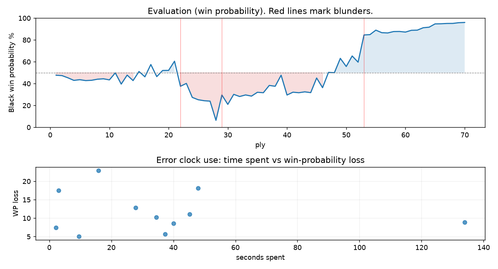

# (free, so lmk) Game analysis: DanielKetterer vs DavidManuelPalacios

Date: 2026.07.21  |  Time control: rapid (1800)  |  You played: black
Game ID: f465dcbc-8520-11f1-a7f2-dcc5ba01000f
Analysis: depth=24 multipv=3 findability=honest floor=6 stable_run=3 threads=1 hash_mb=256 deterministic=True engine_id=Stockfish_18 generated=2026-07-25T11:25:51Z
Game end time UTC: 2026-07-21T17:07:57+00:00
Game: https://www.chess.com/game/live/171880980358

## Summary

- Lichess accuracy: you 81.2%, opponent 75.7%
- Opening: B06 Modern Defense: Two Knights Variation, Suttles Variation (theory followed through ply 8)
- First deviation from theory: ply 9, Opponent played 5. Be3
- Your moves: 14 best, 7 excellent, 3 good, 5 inaccuracy, 5 mistake, 1 blunder

METRICS:

Best: The played move exactly matches Stockfish's top move

Excellent: A non-best move that loses 2 WP points or less.

Good: WP loss is over 2, but under 5 points; also used for losses under 20 when the position remains already decided.

Inaccuracy: WP loss is at least 5 but under 10 points.

Mistake: WP loss is at least 10 but under 20 points; also generally used when a forced mate is missed with under 10 points of WP loss.

Blunder: WP loss is 20 points or more, or a forced mate is missed with at least 10 points of WP loss.

See: https://support.chess.com/en/articles/8572705-how-are-moves-classified-what-is-a-blunder-or-brilliant-etc 

(Brillint, Great and Miss are rating subjective)
- Puzzles: 0 open, 0 solved

### Puzzle gate tally (this game)

Gates: category in ['brilliant_sacrifice', 'missed_tactic', 'allowed_tactic', 'endgame'], refute depth in [3, 8], best-vs-second WP gap >= 5. Refute bar per move: max(5, 0.6 x WP loss).

| outcome | errors |
|---|---|
| category:attention | 2 |
| category:opening | 3 |
| category:positional | 3 |
| refute_censored_high | 1 |
| refute_too_deep | 1 |
| refute_too_shallow | 1 |

Four gates pass at once or nothing is generated, so a zero here is a product of four pass rates rather than a fault. Read the binding gate off this table before changing any threshold.

### Sacrifices in the engine's line

Real sacrifices are listed but never served as puzzles: compensation that never resolves back into material has no gradable answer.

| Move | Offered | Kind | Quiet | Line ends | Verdict |
|---|---|---|---|---|---|
| 6 | -3.0 (piece) | sham | yes | +0.0 pawns | opening_ply |
| 7 | -3.0 (piece) | sham | yes | +0.0 pawns | opening_ply |
| 12 | -3.0 (piece) | sham | yes | +2.0 pawns | puzzle |
| 14 | -3.0 (piece) | sham | yes | +0.0 pawns | eval_out_of_band |
| 15 | -4.0 (piece) | real | yes | -1.0 pawns | real_sacrifice_not_gradable |
| 20 | -9.0 (piece) | sham | yes | +0.0 pawns | puzzle |
| 23 | -2.0 (exchange) | real | yes | -2.0 pawns | real_sacrifice_not_gradable |

## Biggest missed opportunity

You played 11...e5. Stockfish preferred b5, after which the main line runs 11...b5 12. a3 Nb6 13. Nd2 f5 14. gxf5. This was a judgment error rather than a missed tactic; compare the pawn structure and piece activity after both moves. The engine prefers this move from at or below depth 6, which is as shallow as this measurement resolves; it sits near the surface, a quiet move, but one whose point shows at a glance. Candidates considered by the engine: b5 (-1.16), Nb6 (-0.88), Qb6 (-0.52).

## Critical positions

- Ply 22 (you), 11...e5: -1.16 -> +1.38
- Ply 29 (opponent), 15.Qd2: +7.29 -> +2.36
- Ply 34 (you), 17...Rxg7: +2.35 -> +2.49 [only-move situation]
- Ply 36 (you), 18...Rh7: +2.04 -> +2.09 [only-move situation]
- Ply 42 (you), 21...Qf8: +2.03 -> +2.09 [only-move situation]
- Ply 43 (opponent), 22.Qxf8+: +2.09 -> +1.99 [only-move situation]
- Ply 53 (opponent), 27.Rdf1: -1.06 -> -4.62 [only-move situation; evaluation crossed equal -> losing]

## Your errors, move by move

| Move | Class | Category | WP loss | Refute depth | Seconds spent | Pre-error eval |
|---|---|---|---:|---|---:|---|
| 6...c5 | mistake | opening | 10% | 3 | 34 | balanced |
| 7...Nf6 | inaccuracy | opening | 5% | 8 | 10 | balanced |
| 9...f6 | mistake | opening | 11% | 3 | 45 | balanced |
| 11...e5 | blunder | attention | 23% | 2 | 16 | balanced |
| 12...h5 | mistake | brilliant_sacrifice | 13% | 1 | 28 | balanced |
| 14...Kh8 | mistake | positional | 18% | 6 | 3 | losing |
| 15...a5 | inaccuracy | positional | 9% | 4 | 40 | losing |
| 20...Qg7 | mistake | brilliant_sacrifice | 18% | 13 | 48 | balanced |
| 23...a4 | inaccuracy | attention | 9% | 1 | 134 | balanced |
| 25...Rxa2 | inaccuracy | positional | 7% | 3 | 2 | balanced |
| 26...Bg4 | inaccuracy | allowed_tactic | 6% | >18 | 37 | winning |

### 6...c5 (mistake, positional, wp loss 10%)

You played 6...c5. Stockfish preferred Qa5, after which the main line runs 6...Qa5 7. Qd2 Ngf6 8. Nd4 cxd5 9. exd5. This was a judgment error rather than a missed tactic; compare the pawn structure and piece activity after both moves. The engine does not settle on this move until depth 23, which is outside what a human reasonably calculates over the board; this is not a training target. Candidates considered by the engine: Qa5 (+0.02), Ngf6 (+0.17), a6 (+0.22).

### 7...Nf6 (inaccuracy, positional, wp loss 5%)

You played 7...Nf6. Stockfish preferred a6, after which the main line runs 7...a6 8. Bxd7+ Bxd7 9. O-O Nf6 10. h3. Why it went wrong: motif: creates threat on b5. This was a judgment error rather than a missed tactic; compare the pawn structure and piece activity after both moves. The engine prefers this move from at or below depth 6, which is as shallow as this measurement resolves; it sits near the surface, a quiet move, but one whose point shows at a glance. Candidates considered by the engine: a6 (+0.24), Nf6 (+0.87), Qb6 (+0.91).

### 9...f6 (mistake, positional, wp loss 11%)

You played 9...f6. Stockfish preferred b5, after which the main line runs 9...b5 10. a3 Nb6 11. O-O h6 12. Bd2. This was a judgment error rather than a missed tactic; compare the pawn structure and piece activity after both moves. The engine prefers this move from at or below depth 6, which is as shallow as this measurement resolves; it sits near the surface, a quiet move, but one whose point shows at a glance. Candidates considered by the engine: b5 (-0.82), Qa5 (-0.60), Qb6 (-0.42).

### 11...e5 (blunder, positional, wp loss 23%)

You played 11...e5. Stockfish preferred b5, after which the main line runs 11...b5 12. a3 Nb6 13. Nd2 f5 14. gxf5. This was a judgment error rather than a missed tactic; compare the pawn structure and piece activity after both moves. The engine prefers this move from at or below depth 6, which is as shallow as this measurement resolves; it sits near the surface, a quiet move, but one whose point shows at a glance. Candidates considered by the engine: b5 (-1.16), Nb6 (-0.88), Qb6 (-0.52).

### 12...h5 (mistake, positional, wp loss 13%)

You played 12...h5. Stockfish preferred b5, after which the main line runs 12...b5 13. Nxb5 Qa5+ 14. Nc3 Rb8 15. h5. The evaluation crossed from equal to losing, which matters more than the raw number. This was a judgment error rather than a missed tactic; compare the pawn structure and piece activity after both moves. The engine first prefers this move at depth 10 and holds it; findable, but it takes a deliberate look rather than a scan. Candidates considered by the engine: b5 (+1.08), Nb6 (+1.23), f5 (+1.42).

### 14...Kh8 (mistake, positional, wp loss 18%)

You played 14...Kh8. Stockfish preferred Rf7, after which the main line runs 14...Rf7 15. Nd2 f5 16. Bg5 Nf6 17. Bxf6. This was a judgment error rather than a missed tactic; compare the pawn structure and piece activity after both moves. The engine does not settle on this move until depth 12; reachable with real calculation, but not on a scan. Candidates considered by the engine: Rf7 (+3.14), Nb6 (+3.71), Qe7 (+3.82).

### 15...a5 (inaccuracy, positional, wp loss 9%)

You played 15...a5. Stockfish preferred Nb6, after which the main line runs 15...Nb6 16. Nh2 Bd7 17. a4 a5 18. Qe2. This was a judgment error rather than a missed tactic; compare the pawn structure and piece activity after both moves. The engine prefers this move from at or below depth 6, which is as shallow as this measurement resolves; it sits near the surface, a quiet move, but one whose point shows at a glance. Candidates considered by the engine: Nb6 (+2.36), a6 (+2.46), Qe7 (+2.57).

### 20...Qg7 (mistake, positional, wp loss 18%)

You played 20...Qg7. Stockfish preferred b5, after which the main line runs 20...b5 21. Nd2 Nb6 22. Qg3 Bd7 23. O-O-O. The evaluation crossed from equal to losing, which matters more than the raw number. This was a judgment error rather than a missed tactic; compare the pawn structure and piece activity after both moves. The engine first prefers this move at depth 9 and holds it; findable, but it takes a deliberate look rather than a scan. Candidates considered by the engine: b5 (+0.25), a4 (+0.54), Nb6 (+0.62).

### 23...a4 (inaccuracy, positional, wp loss 9%)

You played 23...a4. Stockfish preferred Bg4, after which the main line runs 23...Bg4 24. Rg3 f5 25. exf5 e4 26. Nfg1. Why it went wrong: motif: creates threat on f3. This was a judgment error rather than a missed tactic; compare the pawn structure and piece activity after both moves. The engine prefers this move from at or below depth 6, which is as shallow as this measurement resolves; it sits near the surface, a quiet move, but one whose point shows at a glance. Candidates considered by the engine: Bg4 (+0.53), Rh6 (+1.26), Rg7 (+1.40).

### 25...Rxa2 (inaccuracy, positional, wp loss 7%)

You played 25...Rxa2. Stockfish preferred Bg4, after which the main line runs 25...Bg4 26. Rg3 Rxa2 27. Rd2 Ra1+ 28. Kb2. Why it went wrong: motif: creates threat on f3, a2. This was a judgment error rather than a missed tactic; compare the pawn structure and piece activity after both moves. The engine prefers this move from at or below depth 6, which is as shallow as this measurement resolves; it sits near the surface, a quiet move, but one whose point shows at a glance. Candidates considered by the engine: Bg4 (-1.46), Rxa2 (-0.67), b5 (-0.17).

### 26...Bg4 (inaccuracy, positional, wp loss 6%)

You played 26...Bg4. Stockfish preferred Rxf2, after which the main line runs 26...Rxf2 27. Rdf1 Rxf1+ 28. Rxf1 Bh3 29. Rg1. The evaluation crossed from winning to equal, which matters more than the raw number. Why it went wrong: a favorable capture was available (Rxf2). This was a judgment error rather than a missed tactic; compare the pawn structure and piece activity after both moves. The engine prefers this move from at or below depth 6, which is as shallow as this measurement resolves; it sits near the surface, a quiet move, but one whose point shows at a glance. Candidates considered by the engine: Rxf2 (-1.72), Bg4 (-1.20), Ng6 (-1.19).

## Full move table

| Ply | Move | Eval before | Eval after | Best | CP loss | WP loss | Class |
|-----|------|-------------|------------|------|---------|---------|-------|
| 1 | 1.e4 | +0.31 | +0.25 | e4 | 6 | 1% | best |
| 2 | 1...c6* | +0.25 | +0.29 | e5 | 4 | 0% | excellent |
| 3 | 2.d4 | +0.29 | +0.51 | c3 | 0 | 0% | excellent |
| 4 | 2...d6* | +0.51 | +0.77 | d5 | 26 | 2% | good |
| 5 | 3.Nc3 | +0.77 | +0.70 | c4 | 7 | 1% | excellent |
| 6 | 3...g6* | +0.70 | +0.79 | e5 | 9 | 1% | excellent |
| 7 | 4.Nf3 | +0.79 | +0.76 | Nf3 | 3 | 0% | best |
| 8 | 4...Bg7* | +0.76 | +0.65 | Nf6 | 0 | 0% | excellent |
| 9 | 5.Be3 | +0.65 | +0.61 | a4 | 4 | 0% | excellent |
| 10 | 5...Nd7* | +0.61 | +0.72 | Nf6 | 11 | 1% | excellent |
| 11 | 6.d5 | +0.72 | +0.02 | Qd2 | 70 | 6% | inaccuracy |
| 12 | 6...c5* | +0.02 | +1.15 | Qa5 | 113 | 10% | mistake |
| 13 | 7.Bb5 | +1.15 | +0.24 | Bd3 | 91 | 8% | inaccuracy |
| 14 | 7...Nf6* | +0.24 | +0.79 | a6 | 55 | 5% | inaccuracy |
| 15 | 8.Bxd7+ | +0.79 | -0.12 | a4 | 91 | 8% | inaccuracy |
| 16 | 8...Nxd7* | -0.12 | +0.41 | Bxd7 | 53 | 5% | good |
| 17 | 9.Bg5 | +0.41 | -0.82 | O-O | 123 | 11% | mistake |
| 18 | 9...f6* | -0.82 | +0.39 | b5 | 121 | 11% | mistake |
| 19 | 10.Be3 | +0.39 | -0.22 | Bc1 | 61 | 6% | inaccuracy |
| 20 | 10...O-O* | -0.22 | -0.23 | O-O | 0 | 0% | best |
| 21 | 11.g4 | -0.23 | -1.16 | O-O | 93 | 8% | inaccuracy |
| 22 | 11...e5* | -1.16 | +1.38 | b5 | 254 | 23% | blunder |
| 23 | 12.h4 | +1.38 | +1.08 | Rg1 | 30 | 3% | good |
| 24 | 12...h5* | +1.08 | +2.65 | b5 | 157 | 13% | mistake |
| 25 | 13.gxh5 | +2.65 | +2.95 | gxh5 | 0 | 0% | best |
| 26 | 13...gxh5* | +2.95 | +3.08 | gxh5 | 13 | 1% | best |
| 27 | 14.Rg1 | +3.08 | +3.14 | Rg1 | 0 | 0% | best |
| 28 | 14...Kh8* | +3.14 | +7.29 | Rf7 | 415 | 18% | mistake |
| 29 | 15.Qd2 | +7.29 | +2.36 | Nd4 | 493 | 23% | blunder |
| 30 | 15...a5* | +2.36 | +3.60 | Nb6 | 124 | 9% | inaccuracy |
| 31 | 16.Bh6 | +3.60 | +2.28 | O-O-O | 132 | 9% | inaccuracy |
| 32 | 16...Rf7* | +2.28 | +2.54 | Rg8 | 26 | 2% | excellent |
| 33 | 17.Bxg7+ | +2.54 | +2.35 | O-O-O | 19 | 1% | excellent |
| 34 | 17...Rxg7* | +2.35 | +2.49 | Rxg7 | 14 | 1% | best |
| 35 | 18.Qh6+ | +2.49 | +2.04 | O-O-O | 45 | 3% | good |
| 36 | 18...Rh7* | +2.04 | +2.09 | Rh7 | 5 | 0% | best |
| 37 | 19.Qg6 | +2.09 | +1.29 | Qe3 | 80 | 7% | inaccuracy |
| 38 | 19...Qf8* | +1.29 | +1.38 | Qf8 | 9 | 1% | best |
| 39 | 20.Ne2 | +1.38 | +0.25 | a4 | 113 | 10% | mistake |
| 40 | 20...Qg7* | +0.25 | +2.36 | b5 | 211 | 18% | mistake |
| 41 | 21.Qe8+ | +2.36 | +2.03 | Nd2 | 33 | 3% | good |
| 42 | 21...Qf8* | +2.03 | +2.09 | Qf8 | 6 | 0% | best |
| 43 | 22.Qxf8+ | +2.09 | +1.99 | Qxf8+ | 10 | 1% | best |
| 44 | 22...Nxf8* | +1.99 | +2.08 | Nxf8 | 9 | 1% | best |
| 45 | 23.O-O-O | +2.08 | +0.53 | Nd2 | 155 | 13% | mistake |
| 46 | 23...a4* | +0.53 | +1.53 | Bg4 | 100 | 9% | inaccuracy |
| 47 | 24.b3 | +1.53 | -0.03 | Nd2 | 156 | 14% | mistake |
| 48 | 24...axb3* | -0.03 | +0.00 | axb3 | 3 | 0% | best |
| 49 | 25.cxb3 | +0.00 | -1.46 | axb3 | 146 | 13% | mistake |
| 50 | 25...Rxa2* | -1.46 | -0.62 | Bg4 | 84 | 7% | inaccuracy |
| 51 | 26.Ng3 | -0.62 | -1.72 | Nd2 | 110 | 10% | inaccuracy |
| 52 | 26...Bg4* | -1.72 | -1.06 | Rxf2 | 66 | 6% | inaccuracy |
| 53 | 27.Rdf1 | -1.06 | -4.62 | Rd2 | 356 | 25% | blunder |
| 54 | 27...Bxf3* | -4.62 | -4.68 | Bxf3 | 0 | 0% | best |
| 55 | 28.Nf5 | -4.68 | -5.67 | Kb1 | 99 | 4% | good |
| 56 | 28...Ra1+* | -5.67 | -5.08 | Bxe4 | 59 | 2% | good |
| 57 | 29.Kd2 | -5.08 | -5.02 | Kd2 | 0 | 0% | best |
| 58 | 29...Rxf1* | -5.02 | -5.33 | Rxf1 | 0 | 0% | best |
| 59 | 30.Rxf1 | -5.33 | -5.35 | Rxf1 | 2 | 0% | best |
| 60 | 30...Bxe4* | -5.35 | -5.21 | Bxe4 | 14 | 1% | best |
| 61 | 31.Nxd6 | -5.21 | -5.63 | Nxd6 | 42 | 2% | best |
| 62 | 31...Bxd5* | -5.63 | -5.67 | Bxd5 | 0 | 0% | best |
| 63 | 32.Ra1 | -5.67 | -6.34 | Kc3 | 67 | 2% | good |
| 64 | 32...Rd7* | -6.34 | -6.52 | Rd7 | 0 | 0% | best |
| 65 | 33.Nb5 | -6.52 | -7.83 | Nc8 | 131 | 3% | good |
| 66 | 33...Bc4+* | -7.83 | -7.89 | Bc6+ | 0 | 0% | excellent |
| 67 | 34.Kc3 | -7.89 | -8.05 | Kc3 | 16 | 0% | best |
| 68 | 34...Bxb5* | -8.05 | -8.08 | Bxb5 | 0 | 0% | best |
| 69 | 35.Ra8 | -8.08 | -8.49 | Ra5 | 41 | 1% | excellent |
| 70 | 35...Kg8* | -8.49 | -8.63 | Kg7 | 0 | 0% | excellent |

Rows marked * are your moves. WP loss is win-probability loss; it is the primary signal, CP loss is shown for reference.

## Patterns in this game

- Error categories: 1 allowed_tactic, 2 attention, 2 brilliant_sacrifice, 3 opening, 3 positional.
- Attention errors per 100 moves: 5.7.
- Pre-error eval buckets: 1 winning, 8 balanced, 2 losing.
- Opening: 3 error(s) (avg wp loss 9%).
- Middlegame: 8 error(s) (avg wp loss 13%).
