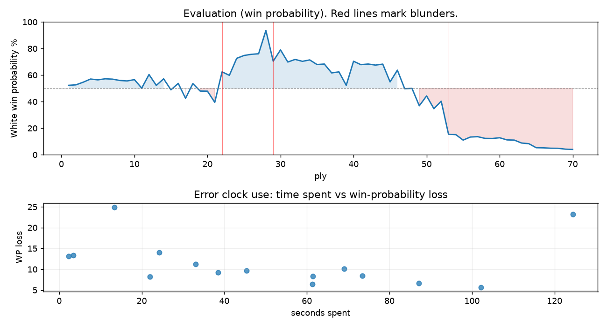

# (free, so lmk) Game analysis: DanielKetterer vs DavidManuelPalacios

Date: 2026.07.21  |  Time control: rapid (1800)  |  You played: white
Game ID: f465dcbc-8520-11f1-a7f2-dcc5ba01000f
Analysis: depth=24 multipv=3 findability=honest floor=6 stable_run=3 threads=1 hash_mb=256 deterministic=True engine_id=Stockfish_18 generated=2026-07-25T11:25:51Z
Game end time UTC: 2026-07-21T17:07:57+00:00
Game: https://www.chess.com/game/live/171880980358

## Summary

- Lichess accuracy: you 75.7%, opponent 81.2%
- Opening: B06 Modern Defense: Two Knights Variation, Suttles Variation (theory followed through ply 8)
- First deviation from theory: ply 9, You played 5. Be3
- Your moves: 9 best, 5 excellent, 6 good, 8 inaccuracy, 5 mistake, 2 blunder

METRICS:

Best: The played move exactly matches Stockfish's top move

Excellent: A non-best move that loses 2 WP points or less.

Good: WP loss is over 2, but under 5 points; also used for losses under 20 when the position remains already decided.

Inaccuracy: WP loss is at least 5 but under 10 points.

Mistake: WP loss is at least 10 but under 20 points; also generally used when a forced mate is missed with under 10 points of WP loss.

Blunder: WP loss is 20 points or more, or a forced mate is missed with at least 10 points of WP loss.

See: https://support.chess.com/en/articles/8572705-how-are-moves-classified-what-is-a-blunder-or-brilliant-etc 

(Brillint, Great and Miss are rating subjective)
- Puzzles: 0 open, 0 solved

### Puzzle gate tally (this game)

Gates: category in ['brilliant_sacrifice', 'missed_tactic', 'allowed_tactic', 'endgame'], refute depth in [3, 8], best-vs-second WP gap >= 5. Refute bar per move: max(5, 0.6 x WP loss).

| outcome | errors |
|---|---|
| category:attention | 5 |
| category:opening | 3 |
| category:positional | 6 |
| wp_gap_too_small | 1 |

Four gates pass at once or nothing is generated, so a zero here is a product of four pass rates rather than a fault. Read the binding gate off this table before changing any threshold.

### Sacrifices in the engine's line

Real sacrifices are listed but never served as puzzles: compensation that never resolves back into material has no gradable answer.

| Move | Offered | Kind | Quiet | Line ends | Verdict |
|---|---|---|---|---|---|
| 6 | -3.0 (piece) | sham | yes | +0.0 pawns | opening_ply |
| 9 | -3.0 (piece) | sham | yes | +0.0 pawns | opening_ply |
| 19 | -5.0 (piece) | sham | yes | +0.0 pawns | desperado |
| 26 | -3.0 (piece) | real | yes | -1.0 pawns | real_sacrifice_not_gradable |
| 27 | -5.0 (piece) | sham | yes | +0.0 pawns | obvious |

## Biggest missed opportunity

You played 27.Rdf1. Stockfish preferred Rd2, after which the main line runs 27. Rd2 Ra1+ 28. Kb2 Rxg1 29. Nxg1 Ng6. The evaluation crossed from equal to losing, which matters more than the raw number. Why it went wrong: left knight on f3 insufficiently defended; motif: creates threat on a2. Before committing to a quiet move here, the checklist is checks, captures, threats, in that order. The engine prefers this move from at or below depth 6, which is as shallow as this measurement resolves; it sits near the surface, a forcing move, the kind a checks-and-captures scan catches. Candidates considered by the engine: Rd2 (-1.06), Nd2 (-3.44), Rd3 (-3.52).

## Critical positions

- Ply 22 (opponent), 11...e5: -1.16 -> +1.38
- Ply 29 (you), 15.Qd2: +7.29 -> +2.36
- Ply 34 (opponent), 17...Rxg7: +2.35 -> +2.49 [only-move situation]
- Ply 36 (opponent), 18...Rh7: +2.04 -> +2.09 [only-move situation]
- Ply 42 (opponent), 21...Qf8: +2.03 -> +2.09 [only-move situation]
- Ply 43 (you), 22.Qxf8+: +2.09 -> +1.99 [only-move situation]
- Ply 53 (you), 27.Rdf1: -1.06 -> -4.62 [only-move situation; evaluation crossed equal -> losing]

## Your errors, move by move

| Move | Class | Category | WP loss | Refute depth | Seconds spent | Pre-error eval |
|---|---|---|---:|---|---:|---|
| 6.d5 | inaccuracy | attention | 6% | 2 | 61 | balanced |
| 7.Bb5 | inaccuracy | opening | 8% | 6 | 22 | balanced |
| 8.Bxd7+ | inaccuracy | attention | 8% | 2 | 61 | balanced |
| 9.Bg5 | mistake | opening | 11% | 5 | 33 | balanced |
| 10.Be3 | inaccuracy | opening | 6% | >18 | 102 | balanced |
| 11.g4 | inaccuracy | positional | 8% | 4 | 73 | balanced |
| 15.Qd2 | blunder | positional | 23% | 15 | 124 | winning |
| 16.Bh6 | inaccuracy | positional | 9% | >18 | 38 | winning |
| 19.Qg6 | inaccuracy | positional | 7% | >18 | 87 | winning |
| 20.Ne2 | mistake | positional | 10% | 1 | 69 | balanced |
| 23.O-O-O | mistake | positional | 13% | 5 | 3 | winning |
| 24.b3 | mistake | allowed_tactic | 14% | 4 | 24 | balanced |
| 25.cxb3 | mistake | attention | 13% | 1 | 2 | balanced |
| 26.Ng3 | inaccuracy | attention | 10% | 1 | 45 | balanced |
| 27.Rdf1 | blunder | attention | 25% | 1 | 13 | balanced |

### 6.d5 (inaccuracy, positional, wp loss 6%)

You played 6.d5. Stockfish preferred Qd2, after which the main line runs 6. Qd2 Ngf6 7. Bh6 Bxh6 8. Qxh6 e5. This was a judgment error rather than a missed tactic; compare the pawn structure and piece activity after both moves. The engine prefers this move from at or below depth 6, which is as shallow as this measurement resolves; it sits near the surface, a quiet move, but one whose point shows at a glance. Candidates considered by the engine: Qd2 (+0.72), h3 (+0.64), Bc4 (+0.58).

### 7.Bb5 (inaccuracy, positional, wp loss 8%)

You played 7.Bb5. Stockfish preferred Bd3, after which the main line runs 7. Bd3 a6 8. a4 Ne5 9. Nxe5 Bxe5. This was a judgment error rather than a missed tactic; compare the pawn structure and piece activity after both moves. The engine never settles on this move within the analysis depth, so how findable it was is not measured here; weigh this one lightly. Candidates considered by the engine: Bd3 (+1.15), h3 (+1.13), a4 (+1.10).

### 8.Bxd7+ (inaccuracy, positional, wp loss 8%)

You played 8.Bxd7+. Stockfish preferred a4, after which the main line runs 8. a4 a6 9. Be2 O-O 10. O-O Rb8. Why it went wrong: left bishop on d7 insufficiently defended. This was a judgment error rather than a missed tactic; compare the pawn structure and piece activity after both moves. The engine prefers this move from at or below depth 6, which is as shallow as this measurement resolves; it sits near the surface, a quiet move, but one whose point shows at a glance. Candidates considered by the engine: a4 (+0.79), Be2 (+0.75), Bc4 (+0.55).

### 9.Bg5 (mistake, positional, wp loss 11%)

You played 9.Bg5. Stockfish preferred O-O, after which the main line runs 9. O-O O-O 10. a4 f5 11. exf5 Rxf5. This was a judgment error rather than a missed tactic; compare the pawn structure and piece activity after both moves. The engine first prefers this move at depth 10 and holds it; findable, but it takes a deliberate look rather than a scan. Candidates considered by the engine: O-O (+0.41), a4 (+0.34), Qe2 (+0.27).

### 10.Be3 (inaccuracy, positional, wp loss 6%)

You played 10.Be3. Stockfish preferred Bc1, after which the main line runs 10. Bc1 O-O 11. O-O f5 12. Ng5 Nb6. This was a judgment error rather than a missed tactic; compare the pawn structure and piece activity after both moves. The engine does not settle on this move until depth 23, which is outside what a human reasonably calculates over the board; this is not a training target. Candidates considered by the engine: Bc1 (+0.39), Bd2 (+0.29), Bf4 (+0.04).

### 11.g4 (inaccuracy, positional, wp loss 8%)

You played 11.g4. Stockfish preferred O-O, after which the main line runs 11. O-O f5 12. exf5 Rxf5 13. Re1 Qf8. This was a judgment error rather than a missed tactic; compare the pawn structure and piece activity after both moves. The engine does not settle on this move until depth 13; reachable with real calculation, but not on a scan. Candidates considered by the engine: O-O (-0.23), a4 (-0.23), Qe2 (-0.27).

### 15.Qd2 (blunder, positional, wp loss 23%)

You played 15.Qd2. Stockfish preferred Nd4, after which the main line runs 15. Nd4 Qe8 16. Nf5 Nb6 17. Nxd6 Bd7. Why it went wrong: motif: creates threat on h5. This was a judgment error rather than a missed tactic; compare the pawn structure and piece activity after both moves. The engine never settles on this move within the analysis depth, so how findable it was is not measured here; weigh this one lightly. Candidates considered by the engine: Nd4 (+7.29), Nh2 (+6.81), Nd2 (+6.44).

### 16.Bh6 (inaccuracy, positional, wp loss 9%)

You played 16.Bh6. Stockfish preferred O-O-O, after which the main line runs 16. O-O-O Rf7 17. Qe2 Bf8 18. Rg3 Rh7. This was a judgment error rather than a missed tactic; compare the pawn structure and piece activity after both moves. The engine prefers this move from at or below depth 6, which is as shallow as this measurement resolves; it sits near the surface, a quiet move, but one whose point shows at a glance. Candidates considered by the engine: O-O-O (+3.60), Nb5 (+3.53), Rg2 (+3.23).

### 19.Qg6 (inaccuracy, positional, wp loss 7%)

You played 19.Qg6. Stockfish preferred Qe3, after which the main line runs 19. Qe3 Rb8 20. a4 Nb6 21. O-O-O Bg4. The evaluation crossed from winning to equal, which matters more than the raw number. This was a judgment error rather than a missed tactic; compare the pawn structure and piece activity after both moves. The engine first prefers this move at depth 10 and holds it; findable, but it takes a deliberate look rather than a scan. Candidates considered by the engine: Qe3 (+2.09), Qd2 (+1.69), Qc1 (+1.50).

### 20.Ne2 (mistake, positional, wp loss 10%)

You played 20.Ne2. Stockfish preferred a4, after which the main line runs 20. a4 Nb6 21. Nh2 Bd7 22. Nf1 Nc8. This was a judgment error rather than a missed tactic; compare the pawn structure and piece activity after both moves. The engine never settles on this move within the analysis depth, so how findable it was is not measured here; weigh this one lightly. Candidates considered by the engine: a4 (+1.38), Nb5 (+1.30), Nh2 (+1.30).

### 23.O-O-O (mistake, positional, wp loss 13%)

You played 23.O-O-O. Stockfish preferred Nd2, after which the main line runs 23. Nd2 Rg7 24. Ng3 b5 25. O-O-O Rg6. The evaluation crossed from winning to equal, which matters more than the raw number. This was a judgment error rather than a missed tactic; compare the pawn structure and piece activity after both moves. The engine prefers this move from at or below depth 6, which is as shallow as this measurement resolves; it sits near the surface, a quiet move, but one whose point shows at a glance. Candidates considered by the engine: Nd2 (+2.08), a4 (+1.52), Ng3 (+1.48).

### 24.b3 (mistake, positional, wp loss 14%)

You played 24.b3. Stockfish preferred Nd2, after which the main line runs 24. Nd2 a3 25. b3 b5 26. Ng3 Ng6. This was a judgment error rather than a missed tactic; compare the pawn structure and piece activity after both moves. The engine prefers this move from at or below depth 6, which is as shallow as this measurement resolves; it sits near the surface, a quiet move, but one whose point shows at a glance. Candidates considered by the engine: Nd2 (+1.53), Nh2 (+1.19), Rg3 (+0.75).

### 25.cxb3 (mistake, tactical, wp loss 13%)

You played 25.cxb3. Stockfish preferred axb3, after which the main line runs 25. axb3 Bg4 26. Rg3 f5 27. exf5 e4. Why it went wrong: left pawn on a2 insufficiently defended; a favorable capture was available (cxb3). Before committing to a quiet move here, the checklist is checks, captures, threats, in that order. The engine prefers this move from at or below depth 6, which is as shallow as this measurement resolves; it sits near the surface, a forcing move, the kind a checks-and-captures scan catches. Candidates considered by the engine: axb3 (+0.00), Nd2 (-1.33), cxb3 (-1.53).

### 26.Ng3 (inaccuracy, positional, wp loss 10%)

You played 26.Ng3. Stockfish preferred Nd2, after which the main line runs 26. Nd2 b5 27. Rg3 Ra1+ 28. Nb1 b4. The evaluation crossed from equal to losing, which matters more than the raw number. Why it went wrong: left pawn on f2 insufficiently defended. This was a judgment error rather than a missed tactic; compare the pawn structure and piece activity after both moves. The engine prefers this move from at or below depth 6, which is as shallow as this measurement resolves; it sits near the surface, a quiet move, but one whose point shows at a glance. Candidates considered by the engine: Nd2 (-0.62), Ng3 (-1.43), Nc3 (-1.50).

### 27.Rdf1 (blunder, tactical, wp loss 25%)

You played 27.Rdf1. Stockfish preferred Rd2, after which the main line runs 27. Rd2 Ra1+ 28. Kb2 Rxg1 29. Nxg1 Ng6. The evaluation crossed from equal to losing, which matters more than the raw number. Why it went wrong: left knight on f3 insufficiently defended; motif: creates threat on a2. Before committing to a quiet move here, the checklist is checks, captures, threats, in that order. The engine prefers this move from at or below depth 6, which is as shallow as this measurement resolves; it sits near the surface, a forcing move, the kind a checks-and-captures scan catches. Candidates considered by the engine: Rd2 (-1.06), Nd2 (-3.44), Rd3 (-3.52).

## Full move table

| Ply | Move | Eval before | Eval after | Best | CP loss | WP loss | Class |
|-----|------|-------------|------------|------|---------|---------|-------|
| 1 | 1.e4* | +0.31 | +0.25 | e4 | 6 | 1% | best |
| 2 | 1...c6 | +0.25 | +0.29 | e5 | 4 | 0% | excellent |
| 3 | 2.d4* | +0.29 | +0.51 | c3 | 0 | 0% | excellent |
| 4 | 2...d6 | +0.51 | +0.77 | d5 | 26 | 2% | good |
| 5 | 3.Nc3* | +0.77 | +0.70 | c4 | 7 | 1% | excellent |
| 6 | 3...g6 | +0.70 | +0.79 | e5 | 9 | 1% | excellent |
| 7 | 4.Nf3* | +0.79 | +0.76 | Nf3 | 3 | 0% | best |
| 8 | 4...Bg7 | +0.76 | +0.65 | Nf6 | 0 | 0% | excellent |
| 9 | 5.Be3* | +0.65 | +0.61 | a4 | 4 | 0% | excellent |
| 10 | 5...Nd7 | +0.61 | +0.72 | Nf6 | 11 | 1% | excellent |
| 11 | 6.d5* | +0.72 | +0.02 | Qd2 | 70 | 6% | inaccuracy |
| 12 | 6...c5 | +0.02 | +1.15 | Qa5 | 113 | 10% | mistake |
| 13 | 7.Bb5* | +1.15 | +0.24 | Bd3 | 91 | 8% | inaccuracy |
| 14 | 7...Nf6 | +0.24 | +0.79 | a6 | 55 | 5% | inaccuracy |
| 15 | 8.Bxd7+* | +0.79 | -0.12 | a4 | 91 | 8% | inaccuracy |
| 16 | 8...Nxd7 | -0.12 | +0.41 | Bxd7 | 53 | 5% | good |
| 17 | 9.Bg5* | +0.41 | -0.82 | O-O | 123 | 11% | mistake |
| 18 | 9...f6 | -0.82 | +0.39 | b5 | 121 | 11% | mistake |
| 19 | 10.Be3* | +0.39 | -0.22 | Bc1 | 61 | 6% | inaccuracy |
| 20 | 10...O-O | -0.22 | -0.23 | O-O | 0 | 0% | best |
| 21 | 11.g4* | -0.23 | -1.16 | O-O | 93 | 8% | inaccuracy |
| 22 | 11...e5 | -1.16 | +1.38 | b5 | 254 | 23% | blunder |
| 23 | 12.h4* | +1.38 | +1.08 | Rg1 | 30 | 3% | good |
| 24 | 12...h5 | +1.08 | +2.65 | b5 | 157 | 13% | mistake |
| 25 | 13.gxh5* | +2.65 | +2.95 | gxh5 | 0 | 0% | best |
| 26 | 13...gxh5 | +2.95 | +3.08 | gxh5 | 13 | 1% | best |
| 27 | 14.Rg1* | +3.08 | +3.14 | Rg1 | 0 | 0% | best |
| 28 | 14...Kh8 | +3.14 | +7.29 | Rf7 | 415 | 18% | mistake |
| 29 | 15.Qd2* | +7.29 | +2.36 | Nd4 | 493 | 23% | blunder |
| 30 | 15...a5 | +2.36 | +3.60 | Nb6 | 124 | 9% | inaccuracy |
| 31 | 16.Bh6* | +3.60 | +2.28 | O-O-O | 132 | 9% | inaccuracy |
| 32 | 16...Rf7 | +2.28 | +2.54 | Rg8 | 26 | 2% | excellent |
| 33 | 17.Bxg7+* | +2.54 | +2.35 | O-O-O | 19 | 1% | excellent |
| 34 | 17...Rxg7 | +2.35 | +2.49 | Rxg7 | 14 | 1% | best |
| 35 | 18.Qh6+* | +2.49 | +2.04 | O-O-O | 45 | 3% | good |
| 36 | 18...Rh7 | +2.04 | +2.09 | Rh7 | 5 | 0% | best |
| 37 | 19.Qg6* | +2.09 | +1.29 | Qe3 | 80 | 7% | inaccuracy |
| 38 | 19...Qf8 | +1.29 | +1.38 | Qf8 | 9 | 1% | best |
| 39 | 20.Ne2* | +1.38 | +0.25 | a4 | 113 | 10% | mistake |
| 40 | 20...Qg7 | +0.25 | +2.36 | b5 | 211 | 18% | mistake |
| 41 | 21.Qe8+* | +2.36 | +2.03 | Nd2 | 33 | 3% | good |
| 42 | 21...Qf8 | +2.03 | +2.09 | Qf8 | 6 | 0% | best |
| 43 | 22.Qxf8+* | +2.09 | +1.99 | Qxf8+ | 10 | 1% | best |
| 44 | 22...Nxf8 | +1.99 | +2.08 | Nxf8 | 9 | 1% | best |
| 45 | 23.O-O-O* | +2.08 | +0.53 | Nd2 | 155 | 13% | mistake |
| 46 | 23...a4 | +0.53 | +1.53 | Bg4 | 100 | 9% | inaccuracy |
| 47 | 24.b3* | +1.53 | -0.03 | Nd2 | 156 | 14% | mistake |
| 48 | 24...axb3 | -0.03 | +0.00 | axb3 | 3 | 0% | best |
| 49 | 25.cxb3* | +0.00 | -1.46 | axb3 | 146 | 13% | mistake |
| 50 | 25...Rxa2 | -1.46 | -0.62 | Bg4 | 84 | 7% | inaccuracy |
| 51 | 26.Ng3* | -0.62 | -1.72 | Nd2 | 110 | 10% | inaccuracy |
| 52 | 26...Bg4 | -1.72 | -1.06 | Rxf2 | 66 | 6% | inaccuracy |
| 53 | 27.Rdf1* | -1.06 | -4.62 | Rd2 | 356 | 25% | blunder |
| 54 | 27...Bxf3 | -4.62 | -4.68 | Bxf3 | 0 | 0% | best |
| 55 | 28.Nf5* | -4.68 | -5.67 | Kb1 | 99 | 4% | good |
| 56 | 28...Ra1+ | -5.67 | -5.08 | Bxe4 | 59 | 2% | good |
| 57 | 29.Kd2* | -5.08 | -5.02 | Kd2 | 0 | 0% | best |
| 58 | 29...Rxf1 | -5.02 | -5.33 | Rxf1 | 0 | 0% | best |
| 59 | 30.Rxf1* | -5.33 | -5.35 | Rxf1 | 2 | 0% | best |
| 60 | 30...Bxe4 | -5.35 | -5.21 | Bxe4 | 14 | 1% | best |
| 61 | 31.Nxd6* | -5.21 | -5.63 | Nxd6 | 42 | 2% | best |
| 62 | 31...Bxd5 | -5.63 | -5.67 | Bxd5 | 0 | 0% | best |
| 63 | 32.Ra1* | -5.67 | -6.34 | Kc3 | 67 | 2% | good |
| 64 | 32...Rd7 | -6.34 | -6.52 | Rd7 | 0 | 0% | best |
| 65 | 33.Nb5* | -6.52 | -7.83 | Nc8 | 131 | 3% | good |
| 66 | 33...Bc4+ | -7.83 | -7.89 | Bc6+ | 0 | 0% | excellent |
| 67 | 34.Kc3* | -7.89 | -8.05 | Kc3 | 16 | 0% | best |
| 68 | 34...Bxb5 | -8.05 | -8.08 | Bxb5 | 0 | 0% | best |
| 69 | 35.Ra8* | -8.08 | -8.49 | Ra5 | 41 | 1% | excellent |
| 70 | 35...Kg8 | -8.49 | -8.63 | Kg7 | 0 | 0% | excellent |

Rows marked * are your moves. WP loss is win-probability loss; it is the primary signal, CP loss is shown for reference.

## Patterns in this game

- Error categories: 1 allowed_tactic, 5 attention, 3 opening, 6 positional.
- Attention errors per 100 moves: 14.3.
- Pre-error eval buckets: 4 winning, 11 balanced, 0 losing.
- Opening: 5 error(s) (avg wp loss 8%).
- Middlegame: 10 error(s) (avg wp loss 13%).
