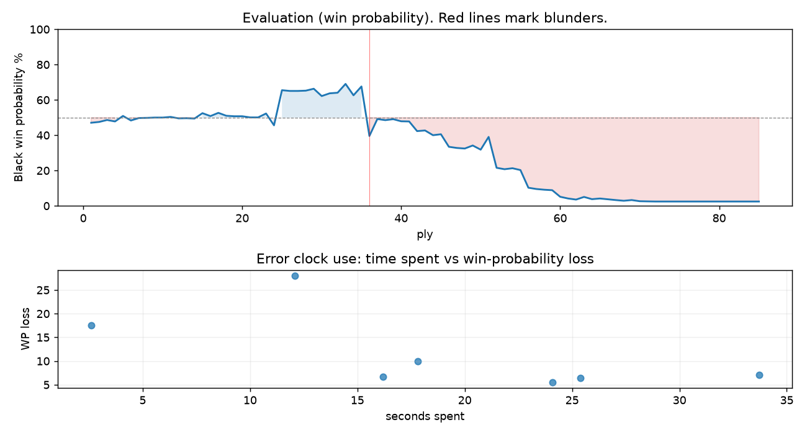

# (free, so lmk) Game analysis: mohammed9413 vs DanielKetterer

Date: 2026.07.21  |  Time control: rapid (600)  |  You played: black
Game ID: a67dbaef-8533-11f1-bd1d-370ea001000f
Analysis: depth=24 multipv=3 findability=honest floor=6 stable_run=3 threads=1 hash_mb=256 deterministic=True engine_id=Stockfish_18 generated=2026-07-25T11:55:13Z
Game end time UTC: 2026-07-21T18:55:36+00:00
Game: https://www.chess.com/game/live/171886517316

## Summary

- Lichess accuracy: you 86.1%, opponent 92.5%
- Opening: D01 Rapport-Jobava System (theory followed through ply 5)
- First deviation from theory: ply 6, You played 3... Bf5
- Your moves: 14 best, 16 excellent, 5 good, 4 inaccuracy, 2 mistake, 1 blunder

METRICS:

Best: The played move exactly matches Stockfish's top move

Excellent: A non-best move that loses 2 WP points or less.

Good: WP loss is over 2, but under 5 points; also used for losses under 20 when the position remains already decided.

Inaccuracy: WP loss is at least 5 but under 10 points.

Mistake: WP loss is at least 10 but under 20 points; also generally used when a forced mate is missed with under 10 points of WP loss.

Blunder: WP loss is 20 points or more, or a forced mate is missed with at least 10 points of WP loss.

See: https://support.chess.com/en/articles/8572705-how-are-moves-classified-what-is-a-blunder-or-brilliant-etc 

(Brillint, Great and Miss are rating subjective)
- Puzzles: 1 open, 0 solved

### Puzzle gate tally (this game)

Gates: category in ['brilliant_sacrifice', 'missed_tactic', 'allowed_tactic', 'endgame'], refute depth in [3, 8], best-vs-second WP gap >= 5. Refute bar per move: max(5, 0.6 x WP loss).

| outcome | errors |
|---|---|
| category:attention | 1 |
| category:positional | 3 |
| refute_too_deep | 1 |
| refute_too_shallow | 1 |
| wp_gap_too_small | 1 |

Four gates pass at once or nothing is generated, so a zero here is a product of four pass rates rather than a fault. Read the binding gate off this table before changing any threshold.

### Sacrifices in the engine's line

Real sacrifices are listed but never served as puzzles: compensation that never resolves back into material has no gradable answer.

| Move | Offered | Kind | Quiet | Line ends | Verdict |
|---|---|---|---|---|---|
| 17 | -3.0 (piece) | sham | yes | +0.0 pawns | obvious |
| 21 | -4.0 (piece) | real | yes | -1.0 pawns | real_sacrifice_not_gradable |
| 23 | -6.0 (piece) | real | yes | -2.0 pawns | real_sacrifice_not_gradable |
| 28 | -6.0 (piece) | real | yes | -2.0 pawns | real_sacrifice_not_gradable |

## Biggest missed opportunity

You played 18...g5. Stockfish preferred Rad8, after which the main line runs 18...Rad8 19. Raf1 h6 20. R3f2 Qe7 21. e4. The evaluation crossed from winning to equal, which matters more than the raw number. This was a judgment error rather than a missed tactic; compare the pawn structure and piece activity after both moves. The engine does not settle on this move until depth 15; reachable with real calculation, but not on a scan. Candidates considered by the engine: Rad8 (-2.00), Rfd8 (-1.96), h6 (-1.90).

## Critical positions

- Ply 20 (you), 10...Qxd6: -0.08 -> -0.08 [only-move situation]
- Ply 27 (opponent), 14.dxe5: -1.69 -> -1.69 [only-move situation]
- Ply 36 (you), 18...g5: -2.00 -> +1.15 [evaluation crossed winning -> equal]
- Ply 41 (opponent), 21.cxd3: +0.23 -> +0.24 [only-move situation]
- Ply 53 (opponent), 27.Rhg3: +3.51 -> +3.64 [only-move situation]
- Ply 55 (opponent), 28.h4: +3.55 -> +3.72 [only-move situation]
- Ply 61 (opponent), 31.exf4: +7.92 -> +8.52 [only-move situation]
- Ply 77 (opponent), 39.hxg5+: M21 -> +14.07 [forced mate was on the board]

## Your errors, move by move

| Move | Class | Category | WP loss | Refute depth | Seconds spent | Pre-error eval |
|---|---|---|---:|---|---:|---|
| 12...Ng4 | inaccuracy | positional | 7% | 4 | 16 | balanced |
| 17...Nc7 | inaccuracy | positional | 6% | 13 | 25 | winning |
| 18...g5 | blunder | allowed_tactic | 28% | 2 | 12 | winning |
| 21...e5 | inaccuracy | positional | 5% | >18 | 24 | balanced |
| 23...Kg7 | inaccuracy | allowed_tactic | 7% | 5 | 34 | balanced |
| 26...Nxg5 | mistake | missed_tactic | 17% | 16 | 3 | balanced |
| 28...f4 | mistake | attention | 10% | 1 | 18 | losing |

### 12...Ng4 (inaccuracy, positional, wp loss 7%)

You played 12...Ng4. Stockfish preferred c5, after which the main line runs 12...c5 13. Ne2 Nc6 14. c3 Rfb8 15. Rfe1. This was a judgment error rather than a missed tactic; compare the pawn structure and piece activity after both moves. The engine prefers this move from at or below depth 6, which is as shallow as this measurement resolves; it sits near the surface, a quiet move, but one whose point shows at a glance. Candidates considered by the engine: c5 (-0.25), Rfd8 (-0.11), Na6 (-0.10).

### 17...Nc7 (inaccuracy, positional, wp loss 6%)

You played 17...Nc7. Stockfish preferred Nc5, after which the main line runs 17...Nc5 18. Qd4 Qxd4 19. exd4 Nd7 20. h3. The evaluation crossed from winning to equal, which matters more than the raw number. Why it went wrong: motif: creates threat on d3. This was a judgment error rather than a missed tactic; compare the pawn structure and piece activity after both moves. The engine prefers this move from at or below depth 6, which is as shallow as this measurement resolves; it sits near the surface, a quiet move, but one whose point shows at a glance. Candidates considered by the engine: Nc5 (-2.18), Rfd8 (-2.06), h6 (-2.00).

### 18...g5 (blunder, positional, wp loss 28%)

You played 18...g5. Stockfish preferred Rad8, after which the main line runs 18...Rad8 19. Raf1 h6 20. R3f2 Qe7 21. e4. The evaluation crossed from winning to equal, which matters more than the raw number. This was a judgment error rather than a missed tactic; compare the pawn structure and piece activity after both moves. The engine does not settle on this move until depth 15; reachable with real calculation, but not on a scan. Candidates considered by the engine: Rad8 (-2.00), Rfd8 (-1.96), h6 (-1.90).

### 21...e5 (inaccuracy, positional, wp loss 5%)

You played 21...e5. Stockfish preferred f6, after which the main line runs 21...f6 22. Rg3 f5 23. Rf1 e5 24. g6. Why it went wrong: motif: creates threat on g5. This was a judgment error rather than a missed tactic; compare the pawn structure and piece activity after both moves. The engine prefers this move from at or below depth 6, which is as shallow as this measurement resolves; it sits near the surface, a quiet move, but one whose point shows at a glance. Candidates considered by the engine: f6 (+0.24), Nb5 (+0.33), f5 (+0.41).

### 23...Kg7 (inaccuracy, positional, wp loss 7%)

You played 23...Kg7. Stockfish preferred Rae8, after which the main line runs 23...Rae8 24. Rxe5 Nc5 25. Rxe8 Rxe8 26. d4. The evaluation crossed from equal to losing, which matters more than the raw number. Why it went wrong: left pawn on e5 insufficiently defended; your king's zone came under heavier attack after this move. This was a judgment error rather than a missed tactic; compare the pawn structure and piece activity after both moves. The engine prefers this move from at or below depth 6, which is as shallow as this measurement resolves; it sits near the surface, a quiet move, but one whose point shows at a glance. Candidates considered by the engine: Rae8 (+1.04), Rfe8 (+1.45), e4 (+1.45).

### 26...Nxg5 (mistake, tactical, wp loss 17%)

You played 26...Nxg5. Stockfish preferred d4, after which the main line runs 26...d4 27. exd4 Nxd4 28. Rf6+ Kxg5 29. Rf1. The evaluation crossed from equal to losing, which matters more than the raw number. Why it went wrong: motif: fork; creates threat on g5, c3. Before committing to a quiet move here, the checklist is checks, captures, threats, in that order. The engine does not settle on this move until depth 14; reachable with real calculation, but not on a scan. Candidates considered by the engine: d4 (+1.21), Kg7 (+1.90), f5 (+2.04).

### 28...f4 (mistake, tactical, wp loss 10%)

You played 28...f4. Stockfish preferred h6, after which the main line runs 28...h6 29. Ne2 Kh5 30. hxg5 hxg5 31. Rh3+. Why it went wrong: left knight on g5 insufficiently defended; motif: creates threat on f3. Before committing to a quiet move here, the checklist is checks, captures, threats, in that order. The engine prefers this move from at or below depth 6, which is as shallow as this measurement resolves; it sits near the surface, a forcing move, the kind a checks-and-captures scan catches. Candidates considered by the engine: h6 (+3.72), Kg7 (+5.06), Kf7 (+5.34).

## Full move table

| Ply | Move | Eval before | Eval after | Best | CP loss | WP loss | Class |
|-----|------|-------------|------------|------|---------|---------|-------|
| 1 | 1.d4 | +0.31 | +0.32 | e4 | 0 | 0% | excellent |
| 2 | 1...Nf6* | +0.32 | +0.27 | d5 | 0 | 0% | excellent |
| 3 | 2.Bf4 | +0.27 | +0.15 | Nf3 | 12 | 1% | excellent |
| 4 | 2...d5* | +0.15 | +0.24 | g6 | 9 | 1% | excellent |
| 5 | 3.Nc3 | +0.24 | -0.10 | e3 | 34 | 3% | good |
| 6 | 3...Bf5* | -0.10 | +0.18 | e6 | 28 | 3% | good |
| 7 | 4.Nb5 | +0.18 | +0.03 | e3 | 15 | 1% | excellent |
| 8 | 4...Na6* | +0.03 | +0.02 | Na6 | 0 | 0% | best |
| 9 | 5.e3 | +0.02 | +0.00 | a3 | 2 | 0% | excellent |
| 10 | 5...c6* | +0.00 | +0.00 | c6 | 0 | 0% | best |
| 11 | 6.Nc3 | +0.00 | -0.04 | Nc3 | 4 | 0% | best |
| 12 | 6...e6* | -0.04 | +0.05 | e6 | 9 | 1% | best |
| 13 | 7.Bd3 | +0.05 | +0.04 | Bxa6 | 1 | 0% | excellent |
| 14 | 7...Bxd3* | +0.04 | +0.06 | Be7 | 2 | 0% | excellent |
| 15 | 8.Qxd3 | +0.06 | -0.27 | cxd3 | 33 | 3% | good |
| 16 | 8...Nb4* | -0.27 | -0.09 | Qb6 | 18 | 2% | excellent |
| 17 | 9.Qd2 | -0.09 | -0.29 | Qe2 | 20 | 2% | excellent |
| 18 | 9...Bd6* | -0.29 | -0.11 | c5 | 18 | 2% | excellent |
| 19 | 10.Bxd6 | -0.11 | -0.08 | a3 | 0 | 0% | excellent |
| 20 | 10...Qxd6* | -0.08 | -0.08 | Qxd6 | 0 | 0% | best |
| 21 | 11.Nf3 | -0.08 | -0.01 | Nf3 | 0 | 0% | best |
| 22 | 11...O-O* | -0.01 | -0.01 | c5 | 0 | 0% | excellent |
| 23 | 12.O-O | -0.01 | -0.25 | a3 | 24 | 2% | good |
| 24 | 12...Ng4* | -0.25 | +0.48 | c5 | 73 | 7% | inaccuracy |
| 25 | 13.Ne5 | +0.48 | -1.74 | e4 | 222 | 20% | mistake |
| 26 | 13...Nxe5* | -1.74 | -1.69 | Nxe5 | 5 | 0% | best |
| 27 | 14.dxe5 | -1.69 | -1.69 | dxe5 | 0 | 0% | best |
| 28 | 14...Qxe5* | -1.69 | -1.71 | Qxe5 | 0 | 0% | best |
| 29 | 15.f4 | -1.71 | -1.84 | Rae1 | 13 | 1% | excellent |
| 30 | 15...Qf6* | -1.84 | -1.35 | Qc7 | 49 | 4% | good |
| 31 | 16.a3 | -1.35 | -1.53 | e4 | 18 | 2% | excellent |
| 32 | 16...Na6* | -1.53 | -1.57 | Na6 | 0 | 0% | best |
| 33 | 17.Qd3 | -1.57 | -2.18 | e4 | 61 | 5% | good |
| 34 | 17...Nc7* | -2.18 | -1.40 | Nc5 | 78 | 6% | inaccuracy |
| 35 | 18.Rf3 | -1.40 | -2.00 | e4 | 60 | 5% | inaccuracy |
| 36 | 18...g5* | -2.00 | +1.15 | Rad8 | 315 | 28% | blunder |
| 37 | 19.Rh3 | +1.15 | +0.09 | fxg5 | 106 | 10% | inaccuracy |
| 38 | 19...Qg6* | +0.09 | +0.16 | Qg6 | 7 | 1% | best |
| 39 | 20.fxg5 | +0.16 | +0.10 | fxg5 | 6 | 1% | best |
| 40 | 20...Qxd3* | +0.10 | +0.23 | f6 | 13 | 1% | excellent |
| 41 | 21.cxd3 | +0.23 | +0.24 | cxd3 | 0 | 0% | best |
| 42 | 21...e5* | +0.24 | +0.84 | f6 | 60 | 5% | inaccuracy |
| 43 | 22.Rf1 | +0.84 | +0.80 | Rf1 | 4 | 0% | best |
| 44 | 22...Ne6* | +0.80 | +1.10 | Rad8 | 30 | 3% | good |
| 45 | 23.Rf5 | +1.10 | +1.04 | Rf5 | 6 | 1% | best |
| 46 | 23...Kg7* | +1.04 | +1.87 | Rae8 | 83 | 7% | inaccuracy |
| 47 | 24.Rxe5 | +1.87 | +1.95 | Rxe5 | 0 | 0% | best |
| 48 | 24...Rae8* | +1.95 | +1.99 | Rae8 | 4 | 0% | best |
| 49 | 25.Rf5 | +1.99 | +1.78 | d4 | 21 | 2% | excellent |
| 50 | 25...Kg6* | +1.78 | +2.07 | d4 | 29 | 2% | good |
| 51 | 26.Rff3 | +2.07 | +1.21 | Rf1 | 86 | 7% | inaccuracy |
| 52 | 26...Nxg5* | +1.21 | +3.51 | d4 | 230 | 17% | mistake |
| 53 | 27.Rhg3 | +3.51 | +3.64 | Rhg3 | 0 | 0% | best |
| 54 | 27...f5* | +3.64 | +3.55 | f5 | 0 | 0% | best |
| 55 | 28.h4 | +3.55 | +3.72 | h4 | 0 | 0% | best |
| 56 | 28...f4* | +3.72 | +5.89 | h6 | 217 | 10% | mistake |
| 57 | 29.Rxg5+ | +5.89 | +6.11 | Rxg5+ | 0 | 0% | best |
| 58 | 29...Kh6* | +6.11 | +6.24 | Kh6 | 13 | 0% | best |
| 59 | 30.Rxf4 | +6.24 | +6.33 | Rxf4 | 0 | 0% | best |
| 60 | 30...Rxf4* | +6.33 | +7.92 | Rg8 | 159 | 4% | good |
| 61 | 31.exf4 | +7.92 | +8.52 | exf4 | 0 | 0% | best |
| 62 | 31...Re1+* | +8.52 | +8.97 | b5 | 45 | 1% | excellent |
| 63 | 32.Kh2 | +8.97 | +7.97 | Kf2 | 100 | 1% | excellent |
| 64 | 32...Re6* | +7.97 | +8.79 | a6 | 82 | 1% | excellent |
| 65 | 33.g4 | +8.79 | +8.52 | f5 | 27 | 0% | excellent |
| 66 | 33...Rg6* | +8.52 | +8.84 | Rg6 | 32 | 0% | best |
| 67 | 34.Rxg6+ | +8.84 | +9.20 | Rxg6+ | 0 | 0% | best |
| 68 | 34...Kxg6* | +9.20 | +9.56 | Kxg6 | 36 | 0% | best |
| 69 | 35.f5+ | +9.56 | +9.19 | f5+ | 37 | 0% | best |
| 70 | 35...Kf6* | +9.19 | +9.82 | Kf6 | 63 | 1% | best |
| 71 | 36.Kg3 | +9.82 | +9.92 | Kg3 | 0 | 0% | best |
| 72 | 36...h6* | +9.92 | +12.06 | Ke5 | 214 | 0% | excellent |
| 73 | 37.Kf4 | +12.06 | +13.39 | Kf4 | 0 | 0% | best |
| 74 | 37...b5* | +13.39 | +13.98 | Kg7 | 59 | 0% | excellent |
| 75 | 38.g5+ | +13.98 | +13.53 | d4 | 45 | 0% | excellent |
| 76 | 38...hxg5+* | +13.53 | M21 | Ke7 |  | 0% | excellent |
| 77 | 39.hxg5+ | M21 | +14.07 | hxg5+ |  | 0% | best |
| 78 | 39...Kg7* | +14.07 | M19 | Ke7 |  | 0% | excellent |
| 79 | 40.f6+ | M19 | M19 | Ke5 |  | 0% | excellent |
| 80 | 40...Kg6* | M19 | M19 | Kh7 |  | 0% | excellent |
| 81 | 41.Ne2 | M19 | +14.83 | Ke5 |  | 0% | mistake |
| 82 | 41...Kf7* | +14.83 | M12 | a6 |  | 0% | excellent |
| 83 | 42.Ng3 | M12 | +11.59 | Kf5 |  | 0% | mistake |
| 84 | 42...Kg6* | +11.59 | M17 | Ke6 |  | 0% | excellent |
| 85 | 43.Ne2 | M17 | M15 | Kg4 |  | 0% | excellent |

Rows marked * are your moves. WP loss is win-probability loss; it is the primary signal, CP loss is shown for reference.

## Patterns in this game

- Error categories: 2 allowed_tactic, 1 attention, 1 missed_tactic, 3 positional.
- Attention errors per 100 moves: 2.4.
- Pre-error eval buckets: 2 winning, 4 balanced, 1 losing.
- Middlegame: 7 error(s) (avg wp loss 12%).
- 1 of your errors came with under a minute on the clock.
