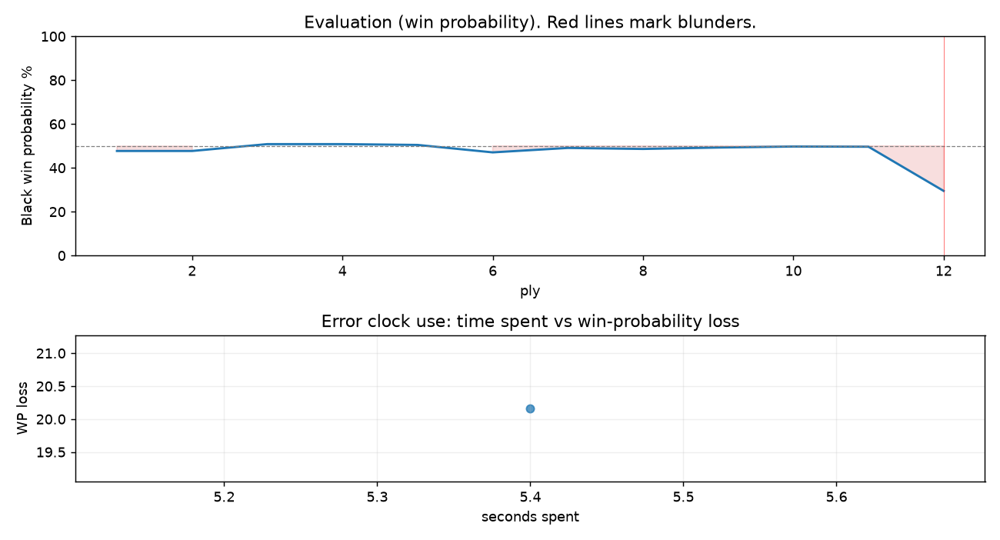

# (free, so lmk) Game analysis: Mirrorwahl vs DanielKetterer

Date: 2026.07.21  |  Time control: rapid (1800)  |  You played: black
Game ID: 7f79091a-855c-11f1-b3a4-a0dc1301000f
Analysis: depth=24 multipv=3 findability=honest floor=6 stable_run=3 threads=1 hash_mb=256 deterministic=True engine_id=Stockfish_18 generated=2026-07-25T11:57:29Z
Game end time UTC: 2026-07-21T23:34:15+00:00
Game: https://www.chess.com/game/live/171896191634

## Summary

- Lichess accuracy: you 66.9%, opponent 95.0%
- Opening: C21 Center Game: Kieseritzky Variation (theory followed through ply 6)
- First deviation from theory: ply 7, Opponent played 4. c3
- Your moves: 4 best, 0 excellent, 1 good, 0 inaccuracy, 0 mistake, 1 blunder

METRICS:

Best: The played move exactly matches Stockfish's top move

Excellent: A non-best move that loses 2 WP points or less.

Good: WP loss is over 2, but under 5 points; also used for losses under 20 when the position remains already decided.

Inaccuracy: WP loss is at least 5 but under 10 points.

Mistake: WP loss is at least 10 but under 20 points; also generally used when a forced mate is missed with under 10 points of WP loss.

Blunder: WP loss is 20 points or more, or a forced mate is missed with at least 10 points of WP loss.

See: https://support.chess.com/en/articles/8572705-how-are-moves-classified-what-is-a-blunder-or-brilliant-etc 

(Brillint, Great and Miss are rating subjective)
- Puzzles: 1 open, 0 solved

### Puzzle gate tally (this game)

Gates: category in ['brilliant_sacrifice', 'missed_tactic', 'allowed_tactic', 'endgame'], refute depth in [3, 8], best-vs-second WP gap >= 5. Refute bar per move: max(5, 0.6 x WP loss).

| outcome | errors |
|---|---|
| category:opening | 1 |

Four gates pass at once or nothing is generated, so a zero here is a product of four pass rates rather than a fault. Read the binding gate off this table before changing any threshold.

### Sacrifices in the engine's line

Real sacrifices are listed but never served as puzzles: compensation that never resolves back into material has no gradable answer.

| Move | Offered | Kind | Quiet | Line ends | Verdict |
|---|---|---|---|---|---|
| 6 | -5.0 (piece) | real | yes | -1.0 pawns | real_sacrifice_not_gradable |

## Biggest missed opportunity

You played 6...Nb4. Stockfish preferred Nf6, after which the main line runs 6...Nf6 7. Nc3 Bb4 8. Bc4 Nxe4 9. O-O. The evaluation crossed from equal to losing, which matters more than the raw number. Why it went wrong: motif: creates threat on e4. This was a judgment error rather than a missed tactic; compare the pawn structure and piece activity after both moves. The engine first prefers this move at depth 7 and holds it; findable, but it takes a deliberate look rather than a scan. Candidates considered by the engine: Nf6 (+0.04), Bb4+ (+0.04), Bc5 (+0.35).

## Critical positions

- Ply 12 (you), 6...Nb4: +0.04 -> +2.37 [evaluation crossed equal -> losing]

## Your errors, move by move

| Move | Class | Category | WP loss | Refute depth | Seconds spent | Pre-error eval |
|---|---|---|---:|---|---:|---|
| 6...Nb4 | blunder | opening | 20% | 1 | 5 | balanced |

### 6...Nb4 (blunder, positional, wp loss 20%)

You played 6...Nb4. Stockfish preferred Nf6, after which the main line runs 6...Nf6 7. Nc3 Bb4 8. Bc4 Nxe4 9. O-O. The evaluation crossed from equal to losing, which matters more than the raw number. Why it went wrong: motif: creates threat on e4. This was a judgment error rather than a missed tactic; compare the pawn structure and piece activity after both moves. The engine first prefers this move at depth 7 and holds it; findable, but it takes a deliberate look rather than a scan. Candidates considered by the engine: Nf6 (+0.04), Bb4+ (+0.04), Bc5 (+0.35).

## Full move table

| Ply | Move | Eval before | Eval after | Best | CP loss | WP loss | Class |
|-----|------|-------------|------------|------|---------|---------|-------|
| 1 | 1.e4 | +0.31 | +0.25 | e4 | 6 | 1% | best |
| 2 | 1...e5* | +0.25 | +0.25 | e5 | 0 | 0% | best |
| 3 | 2.d4 | +0.25 | -0.09 | Nf3 | 34 | 3% | good |
| 4 | 2...exd4* | -0.09 | -0.09 | exd4 | 0 | 0% | best |
| 5 | 3.Nf3 | -0.09 | -0.05 | Nf3 | 0 | 0% | best |
| 6 | 3...c5* | -0.05 | +0.32 | Bb4+ | 37 | 3% | good |
| 7 | 4.c3 | +0.32 | +0.10 | Bc4 | 22 | 2% | good |
| 8 | 4...Nc6* | +0.10 | +0.15 | Nc6 | 5 | 0% | best |
| 9 | 5.cxd4 | +0.15 | +0.08 | Bc4 | 7 | 1% | excellent |
| 10 | 5...cxd4* | +0.08 | +0.03 | cxd4 | 0 | 0% | best |
| 11 | 6.Nxd4 | +0.03 | +0.04 | Nxd4 | 0 | 0% | best |
| 12 | 6...Nb4* | +0.04 | +2.37 | Nf6 | 233 | 20% | blunder |

Rows marked * are your moves. WP loss is win-probability loss; it is the primary signal, CP loss is shown for reference.

## Patterns in this game

- Error categories: 1 opening.
- Attention errors per 100 moves: 0.0.
- Pre-error eval buckets: 0 winning, 1 balanced, 0 losing.
- Opening: 1 error(s) (avg wp loss 20%).
