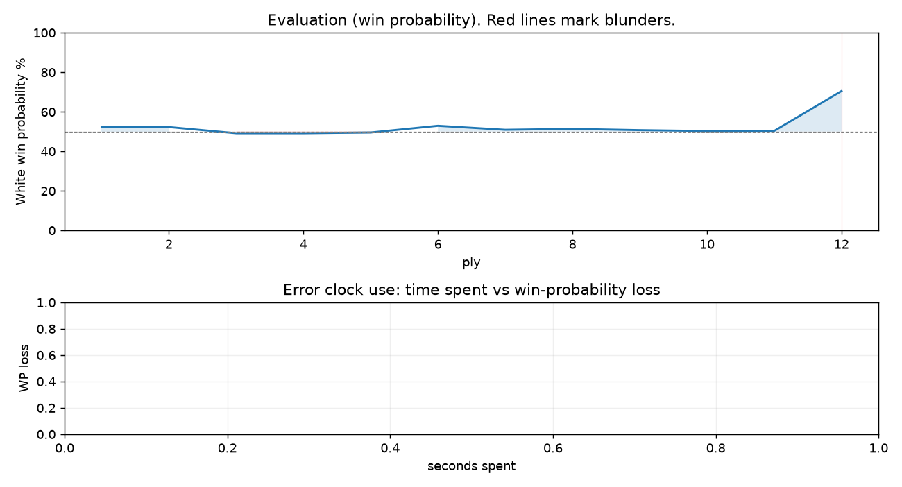

# (free, so lmk) Game analysis: Mirrorwahl vs DanielKetterer

Date: 2026.07.21  |  Time control: rapid (1800)  |  You played: white
Game ID: 7f79091a-855c-11f1-b3a4-a0dc1301000f
Analysis: depth=24 multipv=3 findability=honest floor=6 stable_run=3 threads=1 hash_mb=256 deterministic=True engine_id=Stockfish_18 generated=2026-07-25T11:57:29Z
Game end time UTC: 2026-07-21T23:34:15+00:00
Game: https://www.chess.com/game/live/171896191634

## Summary

- Lichess accuracy: you 95.0%, opponent 66.9%
- Opening: C21 Center Game: Kieseritzky Variation (theory followed through ply 6)
- First deviation from theory: ply 7, You played 4. c3
- Your moves: 3 best, 1 excellent, 2 good, 0 inaccuracy, 0 mistake, 0 blunder

METRICS:

Best: The played move exactly matches Stockfish's top move

Excellent: A non-best move that loses 2 WP points or less.

Good: WP loss is over 2, but under 5 points; also used for losses under 20 when the position remains already decided.

Inaccuracy: WP loss is at least 5 but under 10 points.

Mistake: WP loss is at least 10 but under 20 points; also generally used when a forced mate is missed with under 10 points of WP loss.

Blunder: WP loss is 20 points or more, or a forced mate is missed with at least 10 points of WP loss.

See: https://support.chess.com/en/articles/8572705-how-are-moves-classified-what-is-a-blunder-or-brilliant-etc 

(Brillint, Great and Miss are rating subjective)
- Puzzles: 1 open, 0 solved

## Critical positions

- Ply 12 (opponent), 6...Nb4: +0.04 -> +2.37 [evaluation crossed equal -> losing]

## Full move table

| Ply | Move | Eval before | Eval after | Best | CP loss | WP loss | Class |
|-----|------|-------------|------------|------|---------|---------|-------|
| 1 | 1.e4* | +0.31 | +0.25 | e4 | 6 | 1% | best |
| 2 | 1...e5 | +0.25 | +0.25 | e5 | 0 | 0% | best |
| 3 | 2.d4* | +0.25 | -0.09 | Nf3 | 34 | 3% | good |
| 4 | 2...exd4 | -0.09 | -0.09 | exd4 | 0 | 0% | best |
| 5 | 3.Nf3* | -0.09 | -0.05 | Nf3 | 0 | 0% | best |
| 6 | 3...c5 | -0.05 | +0.32 | Bb4+ | 37 | 3% | good |
| 7 | 4.c3* | +0.32 | +0.10 | Bc4 | 22 | 2% | good |
| 8 | 4...Nc6 | +0.10 | +0.15 | Nc6 | 5 | 0% | best |
| 9 | 5.cxd4* | +0.15 | +0.08 | Bc4 | 7 | 1% | excellent |
| 10 | 5...cxd4 | +0.08 | +0.03 | cxd4 | 0 | 0% | best |
| 11 | 6.Nxd4* | +0.03 | +0.04 | Nxd4 | 0 | 0% | best |
| 12 | 6...Nb4 | +0.04 | +2.37 | Nf6 | 233 | 20% | blunder |

Rows marked * are your moves. WP loss is win-probability loss; it is the primary signal, CP loss is shown for reference.

## Patterns in this game

- Error categories: .
- Attention errors per 100 moves: 0.0.
