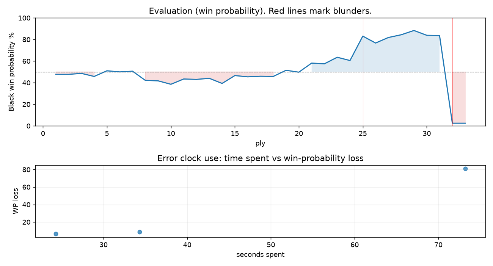

# (free, so lmk) Game analysis: Mirrorwahl vs DanielKetterer

Date: 2026.07.21  |  Time control: rapid (1800)  |  You played: black
Game ID: da8858f7-855c-11f1-8391-941ec601000f
Analysis: depth=24 multipv=3 findability=honest floor=6 stable_run=3 threads=1 hash_mb=256 deterministic=True engine_id=Stockfish_18 generated=2026-07-25T12:08:26Z
Game end time UTC: 2026-07-21T23:50:26+00:00
Game: https://www.chess.com/game/live/171896252908

## Summary

- Lichess accuracy: you 39.6%, opponent 79.4%
- Opening: C25 Vienna Game (theory followed through ply 3)
- First deviation from theory: ply 4, You played 2... Bb4
- Your moves: 4 best, 4 excellent, 5 good, 2 inaccuracy, 0 mistake, 1 blunder

METRICS:

Best: The played move exactly matches Stockfish's top move

Excellent: A non-best move that loses 2 WP points or less.

Good: WP loss is over 2, but under 5 points; also used for losses under 20 when the position remains already decided.

Inaccuracy: WP loss is at least 5 but under 10 points.

Mistake: WP loss is at least 10 but under 20 points; also generally used when a forced mate is missed with under 10 points of WP loss.

Blunder: WP loss is 20 points or more, or a forced mate is missed with at least 10 points of WP loss.

See: https://support.chess.com/en/articles/8572705-how-are-moves-classified-what-is-a-blunder-or-brilliant-etc 

(Brillint, Great and Miss are rating subjective)
- Puzzles: 1 open, 0 solved

### Puzzle gate tally (this game)

Gates: category in ['brilliant_sacrifice', 'missed_tactic', 'allowed_tactic', 'endgame'], refute depth in [3, 8], best-vs-second WP gap >= 5. Refute bar per move: max(5, 0.6 x WP loss).

| outcome | errors |
|---|---|
| category:attention | 2 |
| category:positional | 1 |

Four gates pass at once or nothing is generated, so a zero here is a product of four pass rates rather than a fault. Read the binding gate off this table before changing any threshold.

### Sacrifices in the engine's line

Real sacrifices are listed but never served as puzzles: compensation that never resolves back into material has no gradable answer.

| Move | Offered | Kind | Quiet | Line ends | Verdict |
|---|---|---|---|---|---|
| 4 | -3.0 (piece) | real | yes | -3.0 pawns | real_sacrifice_not_gradable |
| 16 | -5.0 (piece) | real | yes | -2.0 pawns | real_sacrifice_not_gradable |

## Biggest missed opportunity

You played 16...Re5. Stockfish preferred Kg7, after which the main line runs 16...Kg7 17. Rdf1 Rh8 18. Qxh8+ Qxh8 19. Rxh8. The evaluation crossed from winning to losing, which matters more than the raw number. Nothing was hanging and no capture was on offer, but the engine's continuation is forcing: this was a combination landing several moves out, not a judgment error. The engine prefers this move from at or below depth 6, which is as shallow as this measurement resolves; it sits near the surface, a forcing move, the kind a checks-and-captures scan catches. Candidates considered by the engine: Kg7 (-4.44), Kf8 (-4.03), f5 (+5.42).

## Critical positions

- Ply 25 (opponent), 13.Bxh6: -1.16 -> -4.33 [evaluation crossed equal -> losing]
- Ply 32 (you), 16...Re5: -4.44 -> M1 [evaluation crossed winning -> losing]
- Ply 33 (opponent), 17.Qh8#: M1 -> M1 [only-move situation]

## Your errors, move by move

| Move | Class | Category | WP loss | Refute depth | Seconds spent | Pre-error eval |
|---|---|---|---:|---|---:|---|
| 4...Bxc3 | inaccuracy | attention | 8% | 2 | 34 | balanced |
| 13...gxh6 | inaccuracy | positional | 6% | 6 | 24 | winning |
| 16...Re5 | blunder | attention | 81% | 2 | 73 | winning |

### 4...Bxc3 (inaccuracy, positional, wp loss 8%)

You played 4...Bxc3. Stockfish preferred Ne7, after which the main line runs 4...Ne7 5. d4 d5 6. Bd3 dxe4 7. Bxe4. Why it went wrong: left bishop on c3 insufficiently defended. This was a judgment error rather than a missed tactic; compare the pawn structure and piece activity after both moves. The engine prefers this move from at or below depth 6, which is as shallow as this measurement resolves; it sits near the surface, a quiet move, but one whose point shows at a glance. Candidates considered by the engine: Ne7 (-0.07), Nc6 (+0.15), Nf6 (+0.16).

### 13...gxh6 (inaccuracy, positional, wp loss 6%)

You played 13...gxh6. Stockfish preferred Ng4, after which the main line runs 13...Ng4 14. Qd2 Nxh6 15. g4 Bxg4 16. Rdg1. Why it went wrong: motif: fork; creates threat on h6, f2. This was a judgment error rather than a missed tactic; compare the pawn structure and piece activity after both moves. The engine prefers this move from at or below depth 6, which is as shallow as this measurement resolves; it sits near the surface, a quiet move, but one whose point shows at a glance. Candidates considered by the engine: Ng4 (-4.33), gxh6 (-3.09), Ne4 (+0.34).

### 16...Re5 (blunder, deep tactic, wp loss 81%)

You played 16...Re5. Stockfish preferred Kg7, after which the main line runs 16...Kg7 17. Rdf1 Rh8 18. Qxh8+ Qxh8 19. Rxh8. The evaluation crossed from winning to losing, which matters more than the raw number. Nothing was hanging and no capture was on offer, but the engine's continuation is forcing: this was a combination landing several moves out, not a judgment error. The engine prefers this move from at or below depth 6, which is as shallow as this measurement resolves; it sits near the surface, a forcing move, the kind a checks-and-captures scan catches. Candidates considered by the engine: Kg7 (-4.44), Kf8 (-4.03), f5 (+5.42).

## Full move table

| Ply | Move | Eval before | Eval after | Best | CP loss | WP loss | Class |
|-----|------|-------------|------------|------|---------|---------|-------|
| 1 | 1.e4 | +0.31 | +0.25 | e4 | 6 | 1% | best |
| 2 | 1...e5* | +0.25 | +0.25 | e5 | 0 | 0% | best |
| 3 | 2.Nc3 | +0.25 | +0.15 | Nf3 | 10 | 1% | excellent |
| 4 | 2...Bb4* | +0.15 | +0.46 | Nf6 | 31 | 3% | good |
| 5 | 3.f4 | +0.46 | -0.11 | Nd5 | 57 | 5% | inaccuracy |
| 6 | 3...exf4* | -0.11 | +0.00 | exf4 | 11 | 1% | best |
| 7 | 4.Nf3 | +0.00 | -0.07 | Qg4 | 7 | 1% | excellent |
| 8 | 4...Bxc3* | -0.07 | +0.86 | Ne7 | 93 | 8% | inaccuracy |
| 9 | 5.dxc3 | +0.86 | +0.91 | dxc3 | 0 | 0% | best |
| 10 | 5...Nf6* | +0.91 | +1.27 | Ne7 | 36 | 3% | good |
| 11 | 6.Bxf4 | +1.27 | +0.72 | e5 | 55 | 5% | good |
| 12 | 6...Nxe4* | +0.72 | +0.76 | Nxe4 | 4 | 0% | best |
| 13 | 7.Qd4 | +0.76 | +0.65 | Qd5 | 11 | 1% | excellent |
| 14 | 7...Nf6* | +0.65 | +1.18 | O-O | 53 | 5% | good |
| 15 | 8.Bd3 | +1.18 | +0.37 | Qe3+ | 81 | 7% | inaccuracy |
| 16 | 8...O-O* | +0.37 | +0.50 | Nc6 | 13 | 1% | excellent |
| 17 | 9.O-O-O | +0.50 | +0.44 | O-O-O | 6 | 1% | best |
| 18 | 9...Nc6* | +0.44 | +0.46 | Nc6 | 2 | 0% | best |
| 19 | 10.Qe3 | +0.46 | -0.16 | Qf2 | 62 | 6% | inaccuracy |
| 20 | 10...d6* | -0.16 | +0.03 | Re8 | 19 | 2% | excellent |
| 21 | 11.h4 | +0.03 | -0.89 | Bg5 | 92 | 8% | inaccuracy |
| 22 | 11...Re8* | -0.89 | -0.82 | Ng4 | 7 | 1% | excellent |
| 23 | 12.Qf2 | -0.82 | -1.51 | Qd2 | 69 | 6% | inaccuracy |
| 24 | 12...h6* | -1.51 | -1.16 | Ne4 | 35 | 3% | good |
| 25 | 13.Bxh6 | -1.16 | -4.33 | Rhe1 | 317 | 23% | blunder |
| 26 | 13...gxh6* | -4.33 | -3.24 | Ng4 | 109 | 6% | inaccuracy |
| 27 | 14.Ng5 | -3.24 | -4.09 | g4 | 85 | 5% | inaccuracy |
| 28 | 14...hxg5* | -4.09 | -4.58 | Ne5 | 0 | 0% | excellent |
| 29 | 15.hxg5 | -4.58 | -5.50 | Qd2 | 92 | 4% | good |
| 30 | 15...Ng4* | -5.50 | -4.48 | Ne4 | 102 | 4% | good |
| 31 | 16.Qh4 | -4.48 | -4.44 | Qh4 | 0 | 0% | best |
| 32 | 16...Re5* | -4.44 | M1 | Kg7 |  | 81% | blunder |
| 33 | 17.Qh8# | M1 | M1 | Qh8# |  | 0% | best |

Rows marked * are your moves. WP loss is win-probability loss; it is the primary signal, CP loss is shown for reference.

## Patterns in this game

- Error categories: 2 attention, 1 positional.
- Attention errors per 100 moves: 12.5.
- Pre-error eval buckets: 2 winning, 1 balanced, 0 losing.
- Opening: 1 error(s) (avg wp loss 8%).
- Middlegame: 2 error(s) (avg wp loss 44%).
