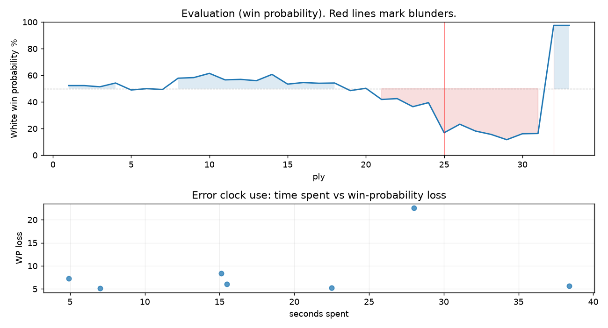

# (free, so lmk) Game analysis: Mirrorwahl vs DanielKetterer

Date: 2026.07.21  |  Time control: rapid (1800)  |  You played: white
Game ID: da8858f7-855c-11f1-8391-941ec601000f
Analysis: depth=24 multipv=3 findability=honest floor=6 stable_run=3 threads=1 hash_mb=256 deterministic=True engine_id=Stockfish_18 generated=2026-07-25T12:08:26Z
Game end time UTC: 2026-07-21T23:50:26+00:00
Game: https://www.chess.com/game/live/171896252908

## Summary

- Lichess accuracy: you 79.4%, opponent 39.6%
- Opening: C25 Vienna Game (theory followed through ply 3)
- First deviation from theory: ply 4, Opponent played 2... Bb4
- Your moves: 5 best, 3 excellent, 2 good, 6 inaccuracy, 0 mistake, 1 blunder

METRICS:

Best: The played move exactly matches Stockfish's top move

Excellent: A non-best move that loses 2 WP points or less.

Good: WP loss is over 2, but under 5 points; also used for losses under 20 when the position remains already decided.

Inaccuracy: WP loss is at least 5 but under 10 points.

Mistake: WP loss is at least 10 but under 20 points; also generally used when a forced mate is missed with under 10 points of WP loss.

Blunder: WP loss is 20 points or more, or a forced mate is missed with at least 10 points of WP loss.

See: https://support.chess.com/en/articles/8572705-how-are-moves-classified-what-is-a-blunder-or-brilliant-etc 

(Brillint, Great and Miss are rating subjective)
- Puzzles: 1 open, 0 solved

### Puzzle gate tally (this game)

Gates: category in ['brilliant_sacrifice', 'missed_tactic', 'allowed_tactic', 'endgame'], refute depth in [3, 8], best-vs-second WP gap >= 5. Refute bar per move: max(5, 0.6 x WP loss).

| outcome | errors |
|---|---|
| category:attention | 3 |
| category:opening | 1 |
| category:positional | 2 |
| wp_gap_too_small | 1 |

Four gates pass at once or nothing is generated, so a zero here is a product of four pass rates rather than a fault. Read the binding gate off this table before changing any threshold.

### Sacrifices in the engine's line

Real sacrifices are listed but never served as puzzles: compensation that never resolves back into material has no gradable answer.

| Move | Offered | Kind | Quiet | Line ends | Verdict |
|---|---|---|---|---|---|
| 3 | -2.0 (exchange) | real | yes | -1.0 pawns | real_sacrifice_not_gradable |
| 10 | -2.0 (exchange) | sham | yes | +2.0 pawns | desperado |
| 12 | -7.0 (piece) | sham | yes | +1.0 pawns | desperado |
| 13 | -5.0 (piece) | sham | yes | +0.0 pawns | puzzle |
| 14 | -4.0 (piece) | real | yes | -2.0 pawns | real_sacrifice_not_gradable |

## Biggest missed opportunity

You played 13.Bxh6. Stockfish preferred Rhe1, after which the main line runs 13. Rhe1 Bd7 14. b3 b6 15. Kb2 Rxe1. The evaluation crossed from equal to losing, which matters more than the raw number. Why it went wrong: left bishop on h6 insufficiently defended. Before committing to a quiet move here, the checklist is checks, captures, threats, in that order. The engine does not settle on this move until depth 16; reachable with real calculation, but not on a scan. Candidates considered by the engine: Rhe1 (-1.16), Rde1 (-1.21), Rdf1 (-1.50).

## Critical positions

- Ply 25 (you), 13.Bxh6: -1.16 -> -4.33 [evaluation crossed equal -> losing]
- Ply 32 (opponent), 16...Re5: -4.44 -> M1 [evaluation crossed winning -> losing]
- Ply 33 (you), 17.Qh8#: M1 -> M1 [only-move situation]

## Your errors, move by move

| Move | Class | Category | WP loss | Refute depth | Seconds spent | Pre-error eval |
|---|---|---|---:|---|---:|---|
| 3.f4 | inaccuracy | attention | 5% | 1 | 22 | balanced |
| 8.Bd3 | inaccuracy | opening | 7% | 1 | 5 | balanced |
| 10.Qe3 | inaccuracy | attention | 6% | 1 | 38 | balanced |
| 11.h4 | inaccuracy | attention | 8% | 1 | 15 | balanced |
| 12.Qf2 | inaccuracy | positional | 6% | 15 | 16 | balanced |
| 13.Bxh6 | blunder | brilliant_sacrifice | 23% | 8 | 28 | balanced |
| 14.Ng5 | inaccuracy | positional | 5% | 6 | 7 | losing |

### 3.f4 (inaccuracy, positional, wp loss 5%)

You played 3.f4. Stockfish preferred Nd5, after which the main line runs 3. Nd5 Bc5 4. d4 Bxd4 5. Nf3 Nc6. Why it went wrong: left pawn on f4 insufficiently defended; motif: creates threat on b4. This was a judgment error rather than a missed tactic; compare the pawn structure and piece activity after both moves. The engine prefers this move from at or below depth 6, which is as shallow as this measurement resolves; it sits near the surface, a quiet move, but one whose point shows at a glance. Candidates considered by the engine: Nd5 (+0.46), d4 (+0.45), Nf3 (+0.43).

### 8.Bd3 (inaccuracy, positional, wp loss 7%)

You played 8.Bd3. Stockfish preferred Qe3+, after which the main line runs 8. Qe3+ Qe7 9. Qxe7+ Kxe7 10. Bxc7 d6. Why it went wrong: the best move was a forcing check. This was a judgment error rather than a missed tactic; compare the pawn structure and piece activity after both moves. The engine first prefers this move at depth 8 and holds it; findable, but it takes a deliberate look rather than a scan. Candidates considered by the engine: Qe3+ (+1.18), Qe5+ (+0.96), O-O-O (+0.80).

### 10.Qe3 (inaccuracy, positional, wp loss 6%)

You played 10.Qe3. Stockfish preferred Qf2, after which the main line runs 10. Qf2 d6 11. Rhf1 Re8 12. Bg5 h6. This was a judgment error rather than a missed tactic; compare the pawn structure and piece activity after both moves. The engine prefers this move from at or below depth 6, which is as shallow as this measurement resolves; it sits near the surface, a quiet move, but one whose point shows at a glance. Candidates considered by the engine: Qf2 (+0.46), Qa4 (+0.35), Qc4 (+0.10).

### 11.h4 (inaccuracy, positional, wp loss 8%)

You played 11.h4. Stockfish preferred Bg5, after which the main line runs 11. Bg5 Qe8 12. Qf4 Ng4 13. Rhe1 Nce5. This was a judgment error rather than a missed tactic; compare the pawn structure and piece activity after both moves. The engine prefers this move from at or below depth 6, which is as shallow as this measurement resolves; it sits near the surface, a quiet move, but one whose point shows at a glance. Candidates considered by the engine: Bg5 (+0.03), Rhf1 (-0.03), Qf2 (-0.03).

### 12.Qf2 (inaccuracy, positional, wp loss 6%)

You played 12.Qf2. Stockfish preferred Qd2, after which the main line runs 12. Qd2 Bg4 13. Bg5 Ne5 14. Rdf1 Bxf3. This was a judgment error rather than a missed tactic; compare the pawn structure and piece activity after both moves. The engine prefers this move from at or below depth 6, which is as shallow as this measurement resolves; it sits near the surface, a quiet move, but one whose point shows at a glance. Candidates considered by the engine: Qd2 (-0.82), Qf2 (-1.47), Qg1 (-1.69).

### 13.Bxh6 (blunder, tactical, wp loss 23%)

You played 13.Bxh6. Stockfish preferred Rhe1, after which the main line runs 13. Rhe1 Bd7 14. b3 b6 15. Kb2 Rxe1. The evaluation crossed from equal to losing, which matters more than the raw number. Why it went wrong: left bishop on h6 insufficiently defended. Before committing to a quiet move here, the checklist is checks, captures, threats, in that order. The engine does not settle on this move until depth 16; reachable with real calculation, but not on a scan. Candidates considered by the engine: Rhe1 (-1.16), Rde1 (-1.21), Rdf1 (-1.50).

### 14.Ng5 (inaccuracy, positional, wp loss 5%)

You played 14.Ng5. Stockfish preferred g4, after which the main line runs 14. g4 Nxg4 15. Qd2 Kf8 16. Nd4 Nxd4. Why it went wrong: left knight on g5 insufficiently defended. This was a judgment error rather than a missed tactic; compare the pawn structure and piece activity after both moves. The engine prefers this move from at or below depth 6, which is as shallow as this measurement resolves; it sits near the surface, a quiet move, but one whose point shows at a glance. Candidates considered by the engine: g4 (-3.24), Qd2 (-3.49), Rdf1 (-3.60).

## Full move table

| Ply | Move | Eval before | Eval after | Best | CP loss | WP loss | Class |
|-----|------|-------------|------------|------|---------|---------|-------|
| 1 | 1.e4* | +0.31 | +0.25 | e4 | 6 | 1% | best |
| 2 | 1...e5 | +0.25 | +0.25 | e5 | 0 | 0% | best |
| 3 | 2.Nc3* | +0.25 | +0.15 | Nf3 | 10 | 1% | excellent |
| 4 | 2...Bb4 | +0.15 | +0.46 | Nf6 | 31 | 3% | good |
| 5 | 3.f4* | +0.46 | -0.11 | Nd5 | 57 | 5% | inaccuracy |
| 6 | 3...exf4 | -0.11 | +0.00 | exf4 | 11 | 1% | best |
| 7 | 4.Nf3* | +0.00 | -0.07 | Qg4 | 7 | 1% | excellent |
| 8 | 4...Bxc3 | -0.07 | +0.86 | Ne7 | 93 | 8% | inaccuracy |
| 9 | 5.dxc3* | +0.86 | +0.91 | dxc3 | 0 | 0% | best |
| 10 | 5...Nf6 | +0.91 | +1.27 | Ne7 | 36 | 3% | good |
| 11 | 6.Bxf4* | +1.27 | +0.72 | e5 | 55 | 5% | good |
| 12 | 6...Nxe4 | +0.72 | +0.76 | Nxe4 | 4 | 0% | best |
| 13 | 7.Qd4* | +0.76 | +0.65 | Qd5 | 11 | 1% | excellent |
| 14 | 7...Nf6 | +0.65 | +1.18 | O-O | 53 | 5% | good |
| 15 | 8.Bd3* | +1.18 | +0.37 | Qe3+ | 81 | 7% | inaccuracy |
| 16 | 8...O-O | +0.37 | +0.50 | Nc6 | 13 | 1% | excellent |
| 17 | 9.O-O-O* | +0.50 | +0.44 | O-O-O | 6 | 1% | best |
| 18 | 9...Nc6 | +0.44 | +0.46 | Nc6 | 2 | 0% | best |
| 19 | 10.Qe3* | +0.46 | -0.16 | Qf2 | 62 | 6% | inaccuracy |
| 20 | 10...d6 | -0.16 | +0.03 | Re8 | 19 | 2% | excellent |
| 21 | 11.h4* | +0.03 | -0.89 | Bg5 | 92 | 8% | inaccuracy |
| 22 | 11...Re8 | -0.89 | -0.82 | Ng4 | 7 | 1% | excellent |
| 23 | 12.Qf2* | -0.82 | -1.51 | Qd2 | 69 | 6% | inaccuracy |
| 24 | 12...h6 | -1.51 | -1.16 | Ne4 | 35 | 3% | good |
| 25 | 13.Bxh6* | -1.16 | -4.33 | Rhe1 | 317 | 23% | blunder |
| 26 | 13...gxh6 | -4.33 | -3.24 | Ng4 | 109 | 6% | inaccuracy |
| 27 | 14.Ng5* | -3.24 | -4.09 | g4 | 85 | 5% | inaccuracy |
| 28 | 14...hxg5 | -4.09 | -4.58 | Ne5 | 0 | 0% | excellent |
| 29 | 15.hxg5* | -4.58 | -5.50 | Qd2 | 92 | 4% | good |
| 30 | 15...Ng4 | -5.50 | -4.48 | Ne4 | 102 | 4% | good |
| 31 | 16.Qh4* | -4.48 | -4.44 | Qh4 | 0 | 0% | best |
| 32 | 16...Re5 | -4.44 | M1 | Kg7 |  | 81% | blunder |
| 33 | 17.Qh8#* | M1 | M1 | Qh8# |  | 0% | best |

Rows marked * are your moves. WP loss is win-probability loss; it is the primary signal, CP loss is shown for reference.

## Patterns in this game

- Error categories: 3 attention, 1 brilliant_sacrifice, 1 opening, 2 positional.
- Attention errors per 100 moves: 17.6.
- Pre-error eval buckets: 0 winning, 6 balanced, 1 losing.
- Opening: 3 error(s) (avg wp loss 6%).
- Middlegame: 4 error(s) (avg wp loss 11%).
