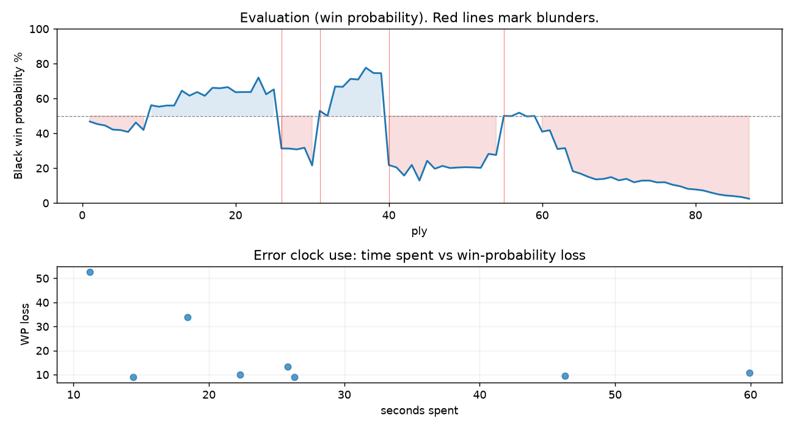

# (free, so lmk) Game analysis: DanielKetterer vs dido_7441

Date: 2026.07.22  |  Time control: rapid (1800)  |  You played: black
Game ID: 6cea6a25-85e6-11f1-8391-941ec601000f
Analysis: depth=18 multipv=3 findability=honest floor=6 stable_run=3 threads=1 hash_mb=256 deterministic=True engine_id=Stockfish_18 generated=2026-07-25T11:02:10Z
Game end time UTC: 2026-07-22T16:27:48+00:00
Game: https://www.chess.com/game/live/171926193190

## Summary

- Lichess accuracy: you 74.6%, opponent 82.0%
- Opening: B00 Nimzowitsch Defense: Mikenas Variation (theory followed through ply 4)
- First deviation from theory: ply 5, Opponent played 3. d5
- Your moves: 17 best, 10 excellent, 8 good, 3 inaccuracy, 3 mistake, 2 blunder

METRICS:

Best: The played move exactly matches Stockfish's top move

Excellent: A non-best move that loses 2 WP points or less.

Good: WP loss is over 2, but under 5 points; also used for losses under 20 when the position remains already decided.

Inaccuracy: WP loss is at least 5 but under 10 points.

Mistake: WP loss is at least 10 but under 20 points; also generally used when a forced mate is missed with under 10 points of WP loss.

Blunder: WP loss is 20 points or more, or a forced mate is missed with at least 10 points of WP loss.

See: https://support.chess.com/en/articles/8572705-how-are-moves-classified-what-is-a-blunder-or-brilliant-etc 

(Brillint, Great and Miss are rating subjective)
- Puzzles: 1 open, 0 solved

### Puzzle gate tally (this game)

Gates: category in ['brilliant_sacrifice', 'missed_tactic', 'allowed_tactic', 'endgame'], refute depth in [3, 8], best-vs-second WP gap >= 5. Refute bar per move: max(5, 0.6 x WP loss).

| outcome | errors |
|---|---|
| accepted | 1 |
| category:attention | 1 |
| category:positional | 2 |
| refute_too_deep | 1 |
| refute_too_shallow | 3 |

Four gates pass at once or nothing is generated, so a zero here is a product of four pass rates rather than a fault. Read the binding gate off this table before changing any threshold.

### Sacrifices in the engine's line

Real sacrifices are listed but never served as puzzles: compensation that never resolves back into material has no gradable answer.

| Move | Offered | Kind | Quiet | Line ends | Verdict |
|---|---|---|---|---|---|
| 12 | -9.0 (piece) | sham | yes | +0.0 pawns | puzzle |
| 15 | -8.0 (piece) | sham | yes | +3.0 pawns | eval_out_of_band |
| 32 | -3.0 (piece) | sham | yes | +1.0 pawns | obvious |

## Biggest missed opportunity

You played 20...Nf2+. Stockfish preferred Qxd2+, after which the main line runs 20...Qxd2+ 21. Kxd2 Be7 22. Raf1 g5 23. f4. The evaluation crossed from winning to losing, which matters more than the raw number. Why it went wrong: left queen on f4, knight on f2 insufficiently defended; a favorable capture was available (Qxf3+); the best move was a forcing check. Before committing to a quiet move here, the checklist is checks, captures, threats, in that order. The engine first prefers this move at depth 7 and holds it; findable, but it takes a deliberate look rather than a scan. Candidates considered by the engine: Qxd2+ (-2.92), Be7 (-1.88), Qxf3+ (-1.66).

## Critical positions

- Ply 26 (you), 13...Qe5: -1.71 -> +2.13 [only-move situation; evaluation crossed winning -> losing]
- Ply 29 (opponent), 15.Nxa8: +2.20 -> +2.08 [only-move situation]
- Ply 31 (opponent), 16.Bh3: +3.50 -> -0.32 [evaluation crossed winning -> equal]
- Ply 32 (you), 16...Nf4+: -0.32 -> +0.00 [only-move situation]
- Ply 36 (you), 18...Nxh3+: -2.47 -> -2.42 [only-move situation]
- Ply 40 (you), 20...Nf2+: -2.92 -> +3.47 [evaluation crossed winning -> losing]
- Ply 41 (opponent), 21.Qxf2: +3.47 -> +3.69 [only-move situation]
- Ply 49 (opponent), 25.Kxc4: +3.75 -> +3.70 [only-move situation]

## Your errors, move by move

| Move | Class | Category | WP loss | Refute depth | Seconds spent | Pre-error eval |
|---|---|---|---:|---|---:|---|
| 12...Qe7 | inaccuracy | brilliant_sacrifice | 10% | 1 | 46 | winning |
| 13...Qe5 | blunder | allowed_tactic | 34% | 3 | 18 | winning |
| 15...Bxf5 | mistake | missed_tactic | 10% | 1 | 22 | losing |
| 20...Nf2+ | blunder | missed_tactic | 53% | 1 | 11 | winning |
| 22...Qe5 | inaccuracy | allowed_tactic | 9% | 16 | 14 | losing |
| 30...d5+ | inaccuracy | positional | 9% | 1 | 26 | balanced |
| 31...Ke8 | mistake | positional | 11% | 1 | 60 | balanced |
| 32...b6 | mistake | attention | 13% | 1 | 26 | losing |

### 12...Qe7 (inaccuracy, positional, wp loss 10%)

You played 12...Qe7. Stockfish preferred O-O-O, after which the main line runs 12...O-O-O 13. Nh3 g6 14. Qg5 Be7 15. Qxh4. The evaluation crossed from winning to equal, which matters more than the raw number. This was a judgment error rather than a missed tactic; compare the pawn structure and piece activity after both moves. The engine does not settle on this move until depth 15; reachable with real calculation, but not on a scan. Candidates considered by the engine: O-O-O (-2.57), c6 (-2.41), g6 (-2.17).

### 13...Qe5 (blunder, tactical, wp loss 34%)

You played 13...Qe5. Stockfish preferred Qd8, after which the main line runs 13...Qd8 14. Nh3 c6 15. Ndf4 Nxf4+ 16. Nxf4. The evaluation crossed from winning to losing, which matters more than the raw number. Why it went wrong: left pawn on c7 insufficiently defended. Before committing to a quiet move here, the checklist is checks, captures, threats, in that order. The engine prefers this move from at or below depth 6, which is as shallow as this measurement resolves; it sits near the surface, a forcing move, the kind a checks-and-captures scan catches. Candidates considered by the engine: Qd8 (-1.71), Qe5 (+2.03), Qh4 (+2.31).

### 15...Bxf5 (mistake, tactical, wp loss 10%)

You played 15...Bxf5. Stockfish preferred g6, after which the main line runs 15...g6 16. Qc3 gxf5 17. Qxe5 dxe5 18. exf5. Why it went wrong: left bishop on f5 insufficiently defended; motif: creates threat on b2. Before committing to a quiet move here, the checklist is checks, captures, threats, in that order. The engine never settles on this move within the analysis depth, so how findable it was is not measured here; weigh this one lightly. Candidates considered by the engine: g6 (+2.08), Be7 (+2.12), Kc8 (+2.33).

### 20...Nf2+ (blunder, tactical, wp loss 53%)

You played 20...Nf2+. Stockfish preferred Qxd2+, after which the main line runs 20...Qxd2+ 21. Kxd2 Be7 22. Raf1 g5 23. f4. The evaluation crossed from winning to losing, which matters more than the raw number. Why it went wrong: left queen on f4, knight on f2 insufficiently defended; a favorable capture was available (Qxf3+); the best move was a forcing check. Before committing to a quiet move here, the checklist is checks, captures, threats, in that order. The engine first prefers this move at depth 7 and holds it; findable, but it takes a deliberate look rather than a scan. Candidates considered by the engine: Qxd2+ (-2.92), Be7 (-1.88), Qxf3+ (-1.66).

### 22...Qe5 (inaccuracy, positional, wp loss 9%)

You played 22...Qe5. Stockfish preferred Qxe3+, after which the main line runs 22...Qxe3+ 23. Kxe3 Kd7 24. Rhg1 Bf6 25. Rad1. Why it went wrong: left pawn on a7 insufficiently defended; the best move was a forcing check. This was a judgment error rather than a missed tactic; compare the pawn structure and piece activity after both moves. The engine first prefers this move at depth 9 and holds it; findable, but it takes a deliberate look rather than a scan. Candidates considered by the engine: Qxe3+ (+3.46), Bg5 (+3.79), g5 (+5.01).

### 30...d5+ (inaccuracy, positional, wp loss 9%)

You played 30...d5+. Stockfish preferred Re2, after which the main line runs 30...Re2 31. Kb3 Rxh2 32. Ra4 a6 33. Rb4. Why it went wrong: motif: creates threat on h2, c2. This was a judgment error rather than a missed tactic; compare the pawn structure and piece activity after both moves. The engine first prefers this move at depth 9 and holds it; findable, but it takes a deliberate look rather than a scan. Candidates considered by the engine: Re2 (+0.00), Re3 (+0.00), Rf5 (+0.15).

### 31...Ke8 (mistake, positional, wp loss 11%)

You played 31...Ke8. Stockfish preferred Rh5, after which the main line runs 31...Rh5 32. Rd2 Bd6 33. Rad1 Ke6 34. Re2+. The evaluation crossed from equal to losing, which matters more than the raw number. Why it went wrong: motif: creates threat on h2. This was a judgment error rather than a missed tactic; compare the pawn structure and piece activity after both moves. The engine does not settle on this move until depth 12; reachable with real calculation, but not on a scan. Candidates considered by the engine: Rh5 (+0.90), Ke6 (+1.05), Kc7 (+1.29).

### 32...b6 (mistake, tactical, wp loss 13%)

You played 32...b6. Stockfish preferred Re6, after which the main line runs 32...Re6 33. b4 Rc6 34. Ka4 Rxc2 35. R1d2. Why it went wrong: left pawn on b6 insufficiently defended. Before committing to a quiet move here, the checklist is checks, captures, threats, in that order. The engine prefers this move from at or below depth 6, which is as shallow as this measurement resolves; it sits near the surface, a forcing move, the kind a checks-and-captures scan catches. Candidates considered by the engine: Re6 (+2.11), Re2 (+2.99), g5 (+3.02).

## Full move table

| Ply | Move | Eval before | Eval after | Best | CP loss | WP loss | Class |
|-----|------|-------------|------------|------|---------|---------|-------|
| 1 | 1.e4 | +0.38 | +0.35 | e4 | 3 | 0% | best |
| 2 | 1...d6* | +0.35 | +0.51 | c6 | 16 | 1% | excellent |
| 3 | 2.d4 | +0.51 | +0.60 | d4 | 0 | 0% | best |
| 4 | 2...Nc6* | +0.60 | +0.86 | Nf6 | 26 | 2% | good |
| 5 | 3.d5 | +0.86 | +0.89 | d5 | 0 | 0% | best |
| 6 | 3...Ne5* | +0.89 | +1.01 | Nb8 | 12 | 1% | excellent |
| 7 | 4.Bf4 | +1.01 | +0.41 | f4 | 60 | 5% | inaccuracy |
| 8 | 4...Ng6* | +0.41 | +0.88 | Nf6 | 47 | 4% | good |
| 9 | 5.g3 | +0.88 | -0.67 | Bg3 | 155 | 14% | mistake |
| 10 | 5...Nxf4* | -0.67 | -0.58 | Nxf4 | 9 | 1% | best |
| 11 | 6.gxf4 | -0.58 | -0.65 | Bb5+ | 7 | 1% | excellent |
| 12 | 6...Nf6* | -0.65 | -0.65 | c6 | 0 | 0% | excellent |
| 13 | 7.f3 | -0.65 | -1.62 | Bb5+ | 97 | 9% | inaccuracy |
| 14 | 7...e6* | -1.62 | -1.29 | c6 | 33 | 3% | good |
| 15 | 8.dxe6 | -1.29 | -1.53 | Nc3 | 24 | 2% | good |
| 16 | 8...Bxe6* | -1.53 | -1.28 | fxe6 | 25 | 2% | good |
| 17 | 9.Nc3 | -1.28 | -1.82 | f5 | 54 | 5% | good |
| 18 | 9...Nh5* | -1.82 | -1.79 | Nh5 | 3 | 0% | best |
| 19 | 10.f5 | -1.79 | -1.87 | h4 | 8 | 1% | excellent |
| 20 | 10...Bd7* | -1.87 | -1.52 | Qh4+ | 35 | 3% | good |
| 21 | 11.Qd2 | -1.52 | -1.53 | Qd4 | 1 | 0% | excellent |
| 22 | 11...Qh4+* | -1.53 | -1.53 | Qh4+ | 0 | 0% | best |
| 23 | 12.Ke2 | -1.53 | -2.57 | Qf2 | 104 | 8% | inaccuracy |
| 24 | 12...Qe7* | -2.57 | -1.38 | O-O-O | 119 | 10% | inaccuracy |
| 25 | 13.Nd5 | -1.38 | -1.71 | Re1 | 33 | 3% | good |
| 26 | 13...Qe5* | -1.71 | +2.13 | Qd8 | 384 | 34% | blunder |
| 27 | 14.Nxc7+ | +2.13 | +2.14 | Nxc7+ | 0 | 0% | best |
| 28 | 14...Kd8* | +2.14 | +2.20 | Kd8 | 6 | 0% | best |
| 29 | 15.Nxa8 | +2.20 | +2.08 | Nxa8 | 12 | 1% | best |
| 30 | 15...Bxf5* | +2.08 | +3.50 | g6 | 142 | 10% | mistake |
| 31 | 16.Bh3 | +3.50 | -0.32 | Qg5+ | 382 | 31% | blunder |
| 32 | 16...Nf4+* | -0.32 | +0.00 | Nf4+ | 32 | 3% | best |
| 33 | 17.Kf2 | +0.00 | -1.91 | Kd1 | 191 | 17% | mistake |
| 34 | 17...Bxh3* | -1.91 | -1.89 | Bxh3 | 2 | 0% | best |
| 35 | 18.Nxh3 | -1.89 | -2.47 | Qe3 | 58 | 5% | good |
| 36 | 18...Nxh3+* | -2.47 | -2.42 | Nxh3+ | 5 | 0% | best |
| 37 | 19.Ke3 | -2.42 | -3.39 | Kf1 | 97 | 7% | inaccuracy |
| 38 | 19...Qf4+* | -3.39 | -2.93 | Be7 | 46 | 3% | good |
| 39 | 20.Kd3 | -2.93 | -2.92 | Kd3 | 0 | 0% | best |
| 40 | 20...Nf2+* | -2.92 | +3.47 | Qxd2+ | 639 | 53% | blunder |
| 41 | 21.Qxf2 | +3.47 | +3.69 | Qxf2 | 0 | 0% | best |
| 42 | 21...Be7* | +3.69 | +4.55 | Be7 | 86 | 5% | best |
| 43 | 22.Qe3 | +4.55 | +3.46 | Rhf1 | 109 | 6% | inaccuracy |
| 44 | 22...Qe5* | +3.46 | +5.18 | Qxe3+ | 172 | 9% | inaccuracy |
| 45 | 23.Qd4 | +5.18 | +3.09 | Qxa7 | 209 | 11% | mistake |
| 46 | 23...Qb5+* | +3.09 | +3.82 | Qxd4+ | 73 | 5% | good |
| 47 | 24.Qc4 | +3.82 | +3.55 | c4 | 27 | 2% | excellent |
| 48 | 24...Qxc4+* | +3.55 | +3.75 | Qc6 | 20 | 1% | excellent |
| 49 | 25.Kxc4 | +3.75 | +3.70 | Kxc4 | 5 | 0% | best |
| 50 | 25...Kd7* | +3.70 | +3.67 | Kd7 | 0 | 0% | best |
| 51 | 26.Rhd1 | +3.67 | +3.69 | Rad1 | 0 | 0% | excellent |
| 52 | 26...Rxa8* | +3.69 | +3.73 | Rxa8 | 4 | 0% | best |
| 53 | 27.e5 | +3.73 | +2.54 | Rd5 | 119 | 8% | inaccuracy |
| 54 | 27...Rc8+* | +2.54 | +2.62 | Rc8+ | 8 | 1% | best |
| 55 | 28.Kb5 | +2.62 | +0.00 | Kb3 | 262 | 22% | blunder |
| 56 | 28...Rc5+* | +0.00 | +0.01 | Rxc2 | 1 | 0% | excellent |
| 57 | 29.Kb4 | +0.01 | -0.20 | Ka4 | 21 | 2% | excellent |
| 58 | 29...Rxe5* | -0.20 | +0.03 | Rxc2 | 23 | 2% | good |
| 59 | 30.Rd4 | +0.03 | +0.00 | Rd2 | 3 | 0% | excellent |
| 60 | 30...d5+* | +0.00 | +0.99 | Re2 | 99 | 9% | inaccuracy |
| 61 | 31.Kb5 | +0.99 | +0.90 | Kb5 | 9 | 1% | best |
| 62 | 31...Ke8* | +0.90 | +2.17 | Rh5 | 127 | 11% | mistake |
| 63 | 32.Rad1 | +2.17 | +2.11 | Rad1 | 6 | 0% | best |
| 64 | 32...b6* | +2.11 | +4.07 | Re6 | 196 | 13% | mistake |
| 65 | 33.Rxd5 | +4.07 | +4.33 | Ka6 | 0 | 0% | excellent |
| 66 | 33...f6* | +4.33 | +4.70 | Re3 | 37 | 2% | excellent |
| 67 | 34.Rxe5 | +4.70 | +5.03 | Rxe5 | 0 | 0% | best |
| 68 | 34...fxe5* | +5.03 | +4.97 | fxe5 | 0 | 0% | best |
| 69 | 35.Kc4 | +4.97 | +4.74 | b4 | 23 | 1% | excellent |
| 70 | 35...a6* | +4.74 | +5.16 | h6 | 42 | 2% | excellent |
| 71 | 36.Rd5 | +5.16 | +4.96 | Kd5 | 20 | 1% | excellent |
| 72 | 36...Bf6* | +4.96 | +5.44 | Kf7 | 48 | 2% | excellent |
| 73 | 37.a4 | +5.44 | +5.20 | Rd6 | 24 | 1% | excellent |
| 74 | 37...Ke7* | +5.20 | +5.19 | Ke7 | 0 | 0% | best |
| 75 | 38.a5 | +5.19 | +5.46 | Kd3 | 0 | 0% | excellent |
| 76 | 38...b5+* | +5.46 | +5.43 | b5+ | 0 | 0% | best |
| 77 | 39.Kc5 | +5.43 | +5.82 | Kc5 | 0 | 0% | best |
| 78 | 39...Ke6* | +5.82 | +6.08 | g5 | 26 | 1% | excellent |
| 79 | 40.Rd6+ | +6.08 | +6.58 | Rd6+ | 0 | 0% | best |
| 80 | 40...Kf5* | +6.58 | +6.72 | Kf5 | 14 | 0% | best |
| 81 | 41.Rxa6 | +6.72 | +6.94 | Rxa6 | 0 | 0% | best |
| 82 | 41...Kf4* | +6.94 | +7.46 | Bh4 | 52 | 1% | excellent |
| 83 | 42.Rxf6+ | +7.46 | +8.03 | Rxf6+ | 0 | 0% | best |
| 84 | 42...gxf6* | +8.03 | +8.42 | gxf6 | 39 | 1% | best |
| 85 | 43.a6 | +8.42 | +8.66 | a6 | 0 | 0% | best |
| 86 | 43...Kxf3* | +8.66 | +9.07 | Kxf3 | 41 | 1% | best |
| 87 | 44.a7 | +9.07 | +11.47 | a7 | 0 | 0% | best |

Rows marked * are your moves. WP loss is win-probability loss; it is the primary signal, CP loss is shown for reference.

## Patterns in this game

- Error categories: 2 allowed_tactic, 1 attention, 1 brilliant_sacrifice, 2 missed_tactic, 2 positional.
- Attention errors per 100 moves: 2.3.
- Pre-error eval buckets: 3 winning, 2 balanced, 3 losing.
- Middlegame: 6 error(s) (avg wp loss 21%).
- Endgame: 2 error(s) (avg wp loss 12%).
