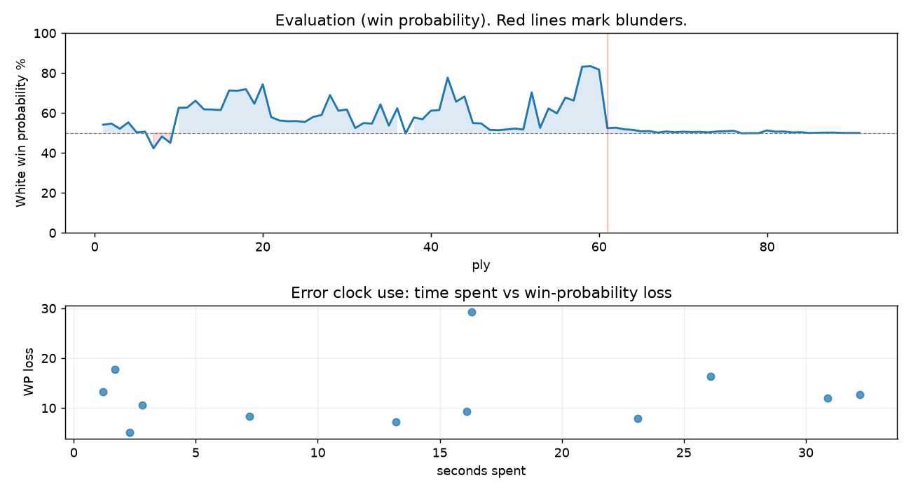

# (free, so lmk) Game analysis: Mirrorwahl vs DanielKetterer

Date: 2026.07.24  |  Time control: rapid (1800)  |  You played: white
Game ID: c435548d-87ac-11f1-8391-941ec601000f
Analysis: depth=10 multipv=3 findability=honest floor=6 stable_run=3 threads=1 hash_mb=256 deterministic=True engine_id=Stockfish_18 generated=2026-07-25T10:45:03Z
Game end time UTC: 2026-07-24T22:31:08+00:00
Game: https://www.chess.com/game/live/172032754886

## Summary

- Lichess accuracy: you 82.6%, opponent 83.2%
- Opening: C33 King's Gambit Accepted: Bishop's Gambit, Paulsen Attack (theory followed through ply 9)
- First deviation from theory: ply 10, Opponent played 5... Bxc3
- Your moves: 21 best, 10 excellent, 3 good, 5 inaccuracy, 6 mistake, 1 blunder

METRICS:

Best: The played move exactly matches Stockfish's top move

Excellent: A non-best move that loses 2 WP points or less.

Good: WP loss is over 2, but under 5 points; also used for losses under 20 when the position remains already decided.

Inaccuracy: WP loss is at least 5 but under 10 points.

Mistake: WP loss is at least 10 but under 20 points; also generally used when a forced mate is missed with under 10 points of WP loss.

Blunder: WP loss is 20 points or more, or a forced mate is missed with at least 10 points of WP loss.

See: https://support.chess.com/en/articles/8572705-how-are-moves-classified-what-is-a-blunder-or-brilliant-etc 

(Brillint, Great and Miss are rating subjective)
- Puzzles: 0 open, 0 solved

### Puzzle gate tally (this game)

Gates: category in ['brilliant_sacrifice', 'missed_tactic', 'allowed_tactic', 'endgame'], refute depth in [3, 8], best-vs-second WP gap >= 5. Refute bar per move: max(5, 0.6 x WP loss).

| outcome | errors |
|---|---|
| category:attention | 4 |
| category:positional | 3 |
| refute_too_deep | 1 |
| refute_too_shallow | 4 |

Four gates pass at once or nothing is generated, so a zero here is a product of four pass rates rather than a fault. Read the binding gate off this table before changing any threshold.

### Sacrifices in the engine's line

Real sacrifices are listed but never served as puzzles: compensation that never resolves back into material has no gradable answer.

| Move | Offered | Kind | Quiet | Line ends | Verdict |
|---|---|---|---|---|---|
| 4 | -3.0 (piece) | sham | yes | +0.0 pawns | opening_ply |
| 16 | -3.0 (piece) | real | yes | -1.0 pawns | real_sacrifice_not_gradable |

## Biggest missed opportunity

You played 31.b4+. Stockfish preferred Kc2, after which the main line runs 31. Kc2 h4 32. Kc3 Bxd5 33. cxd5 g4. The evaluation crossed from winning to equal, which matters more than the raw number. Why it went wrong: left pawn on d5, pawn on c4 insufficiently defended. Before committing to a quiet move here, the checklist is checks, captures, threats, in that order. The engine never settles on this move within the analysis depth, so how findable it was is not measured here; weigh this one lightly. Candidates considered by the engine: Kc2 (+4.07), Kd2 (+3.84), Kb2 (+3.61).

## Critical positions

- Ply 15 (you), 8.Qd5+: +1.30 -> +1.27 [only-move situation]
- Ply 17 (you), 9.Qxe4: +2.47 -> +2.45 [only-move situation]
- Ply 22 (opponent), 11...Qxf4: +0.87 -> +0.68 [only-move situation]
- Ply 23 (you), 12.Bxf4: +0.68 -> +0.64 [only-move situation]
- Ply 32 (opponent), 16...Nxd4: +0.27 -> +0.54 [only-move situation]
- Ply 33 (you), 17.cxd4: +0.54 -> +0.51 [only-move situation]
- Ply 44 (opponent), 22...cxd6: +1.76 -> +2.08 [only-move situation]
- Ply 48 (opponent), 24...Bxa8: +0.17 -> +0.15 [only-move situation]

## Your errors, move by move

| Move | Class | Category | WP loss | Refute depth | Seconds spent | Pre-error eval |
|---|---|---|---:|---|---:|---|
| 3.f4 | inaccuracy | attention | 5% | 1 | 2 | balanced |
| 4.Bc4 | inaccuracy | allowed_tactic | 8% | 1 | 7 | balanced |
| 10.Kd1 | inaccuracy | attention | 7% | 1 | 13 | winning |
| 11.Qxf4+ | mistake | missed_tactic | 16% | 1 | 26 | winning |
| 15.Rae1 | inaccuracy | positional | 8% | 6 | 23 | winning |
| 16.Nd4+ | inaccuracy | allowed_tactic | 9% | 1 | 16 | balanced |
| 18.Rhf1 | mistake | positional | 11% | 4 | 3 | balanced |
| 19.Kc1 | mistake | attention | 13% | 1 | 32 | balanced |
| 22.exd6 | mistake | attention | 12% | 1 | 31 | winning |
| 23.Rf8 | mistake | positional | 13% | 4 | 1 | winning |
| 27.Bxd6 | mistake | missed_tactic | 18% | 10 | 2 | winning |
| 31.b4+ | blunder | allowed_tactic | 29% | 1 | 16 | winning |

### 3.f4 (inaccuracy, positional, wp loss 5%)

You played 3.f4. Stockfish preferred Nd5, after which the main line runs 3. Nd5 Be7 4. d4 d6 5. Ne2. Why it went wrong: left pawn on f4 insufficiently defended; motif: creates threat on b4. This was a judgment error rather than a missed tactic; compare the pawn structure and piece activity after both moves. The engine prefers this move from at or below depth 6, which is as shallow as this measurement resolves; it sits near the surface, a quiet move, but one whose point shows at a glance. Candidates considered by the engine: Nd5 (+0.58), d4 (+0.56), Qh5 (+0.29).

### 4.Bc4 (inaccuracy, positional, wp loss 8%)

You played 4.Bc4. Stockfish preferred Nf3, after which the main line runs 4. Nf3 Ne7 5. a3 Bxc3 6. dxc3 Ng6. This was a judgment error rather than a missed tactic; compare the pawn structure and piece activity after both moves. The engine never settles on this move within the analysis depth, so how findable it was is not measured here; weigh this one lightly. Candidates considered by the engine: Nf3 (+0.07), Nd5 (-0.07), Qg4 (-0.19).

### 10.Kd1 (inaccuracy, positional, wp loss 7%)

You played 10.Kd1. Stockfish preferred g3, after which the main line runs 10. g3 Qg4 11. Bxf4 Qg6 12. Qe2 Ke8. The evaluation crossed from winning to equal, which matters more than the raw number. Why it went wrong: motif: fork; creates threat on h4. This was a judgment error rather than a missed tactic; compare the pawn structure and piece activity after both moves. The engine prefers this move from at or below depth 6, which is as shallow as this measurement resolves; it sits near the surface, a quiet move, but one whose point shows at a glance. Candidates considered by the engine: g3 (+2.55), Kd1 (+1.72), Kf1 (+1.24).

### 11.Qxf4+ (mistake, tactical, wp loss 16%)

You played 11.Qxf4+. Stockfish preferred Nf3, after which the main line runs 11. Nf3 Nc6 12. Bxf4 Qxg2 13. Rg1 Qh3. The evaluation crossed from winning to equal, which matters more than the raw number. Why it went wrong: left pawn on g2 insufficiently defended; motif: creates threat on f4. Before committing to a quiet move here, the checklist is checks, captures, threats, in that order. The engine first prefers this move at depth 10 and holds it; findable, but it takes a deliberate look rather than a scan. Candidates considered by the engine: Nf3 (+2.89), Ne2 (+2.76), Nh3 (+1.80).

### 15.Rae1 (inaccuracy, positional, wp loss 8%)

You played 15.Rae1. Stockfish preferred e6+, after which the main line runs 15. e6+ dxe6 16. Bxc7 Rf8 17. Rhe1 b6. The evaluation crossed from winning to equal, which matters more than the raw number. Why it went wrong: the best move was a forcing check; motif: fork; creates threat on c7. This was a judgment error rather than a missed tactic; compare the pawn structure and piece activity after both moves. The engine prefers this move from at or below depth 6, which is as shallow as this measurement resolves; it sits near the surface, a quiet move, but one whose point shows at a glance. Candidates considered by the engine: e6+ (+2.17), Nd4 (+1.32), Rhf1 (+1.27).

### 16.Nd4+ (inaccuracy, positional, wp loss 9%)

You played 16.Nd4+. Stockfish preferred Bg3, after which the main line runs 16. Bg3 b6 17. Re4 Bb7 18. h4 Nd8. Why it went wrong: left pawn on e5 insufficiently defended. This was a judgment error rather than a missed tactic; compare the pawn structure and piece activity after both moves. The engine never settles on this move within the analysis depth, so how findable it was is not measured here; weigh this one lightly. Candidates considered by the engine: Bg3 (+1.30), h4 (+1.29), Re4 (+1.22).

### 18.Rhf1 (mistake, tactical, wp loss 11%)

You played 18.Rhf1. Stockfish preferred c4, after which the main line runs 18. c4 c6 19. Be3 Ba6 20. Kc3 b5. Why it went wrong: left pawn on e5 insufficiently defended. Before committing to a quiet move here, the checklist is checks, captures, threats, in that order. The engine prefers this move from at or below depth 6, which is as shallow as this measurement resolves; it sits near the surface, a forcing move, the kind a checks-and-captures scan catches. Candidates considered by the engine: c4 (+1.60), b3 (+1.16), h4 (+1.07).

### 19.Kc1 (mistake, tactical, wp loss 13%)

You played 19.Kc1. Stockfish preferred c4, after which the main line runs 19. c4 c6 20. Kc3 Ba6 21. a4 Rf7. Why it went wrong: left pawn on e5 insufficiently defended. Before committing to a quiet move here, the checklist is checks, captures, threats, in that order. The engine prefers this move from at or below depth 6, which is as shallow as this measurement resolves; it sits near the surface, a forcing move, the kind a checks-and-captures scan catches. Candidates considered by the engine: c4 (+1.37), b3 (+0.78), Be3 (+0.73).

### 22.exd6 (mistake, tactical, wp loss 12%)

You played 22.exd6. Stockfish preferred Rf6+, after which the main line runs 22. Rf6+ Ke7 23. Rxh6 dxe5 24. Rh7+ Ke6. Why it went wrong: left pawn on d6 insufficiently defended; the best move was a forcing check; motif: creates threat on h6. Before committing to a quiet move here, the checklist is checks, captures, threats, in that order. The engine prefers this move from at or below depth 6, which is as shallow as this measurement resolves; it sits near the surface, a forcing move, the kind a checks-and-captures scan catches. Candidates considered by the engine: Rf6+ (+3.39), c4 (+3.07), b3 (+2.11).

### 23.Rf8 (mistake, positional, wp loss 13%)

You played 23.Rf8. Stockfish preferred c4, after which the main line runs 23. c4 d5 24. Re1+ Kf7 25. cxd5 Bb7. The evaluation crossed from winning to equal, which matters more than the raw number. This was a judgment error rather than a missed tactic; compare the pawn structure and piece activity after both moves. The engine prefers this move from at or below depth 6, which is as shallow as this measurement resolves; it sits near the surface, a quiet move, but one whose point shows at a glance. Candidates considered by the engine: c4 (+2.08), d5+ (+1.84), Re1+ (+1.39).

### 27.Bxd6 (mistake, tactical, wp loss 18%)

You played 27.Bxd6. Stockfish preferred Kd2, after which the main line runs 27. Kd2 Ke4 28. Kc3 Bh3 29. Bxd6 Bd7. The evaluation crossed from winning to equal, which matters more than the raw number. Why it went wrong: motif: creates threat on d6. Before committing to a quiet move here, the checklist is checks, captures, threats, in that order. The engine first prefers this move at depth 9 and holds it; findable, but it takes a deliberate look rather than a scan. Candidates considered by the engine: Kd2 (+2.34), Kc2 (+1.85), a4 (+1.46).

### 31.b4+ (blunder, tactical, wp loss 29%)

You played 31.b4+. Stockfish preferred Kc2, after which the main line runs 31. Kc2 h4 32. Kc3 Bxd5 33. cxd5 g4. The evaluation crossed from winning to equal, which matters more than the raw number. Why it went wrong: left pawn on d5, pawn on c4 insufficiently defended. Before committing to a quiet move here, the checklist is checks, captures, threats, in that order. The engine never settles on this move within the analysis depth, so how findable it was is not measured here; weigh this one lightly. Candidates considered by the engine: Kc2 (+4.07), Kd2 (+3.84), Kb2 (+3.61).

## Full move table

| Ply | Move | Eval before | Eval after | Best | CP loss | WP loss | Class |
|-----|------|-------------|------------|------|---------|---------|-------|
| 1 | 1.e4* | +0.45 | +0.45 | e4 | 0 | 0% | best |
| 2 | 1...e5 | +0.45 | +0.51 | e5 | 6 | 1% | best |
| 3 | 2.Nc3* | +0.51 | +0.23 | Nf3 | 28 | 3% | good |
| 4 | 2...Bb4 | +0.23 | +0.58 | Nf6 | 35 | 3% | good |
| 5 | 3.f4* | +0.58 | +0.03 | Nd5 | 55 | 5% | inaccuracy |
| 6 | 3...exf4 | +0.03 | +0.07 | exf4 | 4 | 0% | best |
| 7 | 4.Bc4* | +0.07 | -0.84 | Nf3 | 91 | 8% | inaccuracy |
| 8 | 4...Nf6 | -0.84 | -0.19 | Bxc3 | 65 | 6% | inaccuracy |
| 9 | 5.e5* | -0.19 | -0.54 | e5 | 35 | 3% | best |
| 10 | 5...Bxc3 | -0.54 | +1.40 | d5 | 194 | 18% | mistake |
| 11 | 6.dxc3* | +1.40 | +1.41 | dxc3 | 0 | 0% | best |
| 12 | 6...Ne4 | +1.41 | +1.82 | d5 | 41 | 3% | good |
| 13 | 7.Bxf7+* | +1.82 | +1.31 | Nf3 | 51 | 4% | good |
| 14 | 7...Kxf7 | +1.31 | +1.30 | Kxf7 | 0 | 0% | best |
| 15 | 8.Qd5+* | +1.30 | +1.27 | Qd5+ | 3 | 0% | best |
| 16 | 8...Kf8 | +1.27 | +2.47 | Ke8 | 120 | 10% | inaccuracy |
| 17 | 9.Qxe4* | +2.47 | +2.45 | Qxe4 | 2 | 0% | best |
| 18 | 9...Qh4+ | +2.45 | +2.55 | Qh4+ | 10 | 1% | best |
| 19 | 10.Kd1* | +2.55 | +1.64 | g3 | 91 | 7% | inaccuracy |
| 20 | 10...Qf2 | +1.64 | +2.89 | Qg4+ | 125 | 10% | inaccuracy |
| 21 | 11.Qxf4+* | +2.89 | +0.87 | Nf3 | 202 | 16% | mistake |
| 22 | 11...Qxf4 | +0.87 | +0.68 | Qxf4 | 0 | 0% | best |
| 23 | 12.Bxf4* | +0.68 | +0.64 | Bxf4 | 4 | 0% | best |
| 24 | 12...Nc6 | +0.64 | +0.65 | Nc6 | 1 | 0% | best |
| 25 | 13.Nf3* | +0.65 | +0.60 | Nf3 | 5 | 0% | best |
| 26 | 13...h6 | +0.60 | +0.88 | Ke8 | 28 | 3% | good |
| 27 | 14.Kd2* | +0.88 | +0.99 | Kd2 | 0 | 0% | best |
| 28 | 14...Kf7 | +0.99 | +2.17 | Nd8 | 118 | 10% | inaccuracy |
| 29 | 15.Rae1* | +2.17 | +1.23 | e6+ | 94 | 8% | inaccuracy |
| 30 | 15...Ke6 | +1.23 | +1.30 | Ke8 | 7 | 1% | excellent |
| 31 | 16.Nd4+* | +1.30 | +0.27 | Bg3 | 103 | 9% | inaccuracy |
| 32 | 16...Nxd4 | +0.27 | +0.54 | Nxd4 | 27 | 2% | best |
| 33 | 17.cxd4* | +0.54 | +0.51 | cxd4 | 3 | 0% | best |
| 34 | 17...b6 | +0.51 | +1.60 | b5 | 109 | 10% | inaccuracy |
| 35 | 18.Rhf1* | +1.60 | +0.40 | c4 | 120 | 11% | mistake |
| 36 | 18...Rf8 | +0.40 | +1.37 | Ba6 | 97 | 9% | inaccuracy |
| 37 | 19.Kc1* | +1.37 | -0.03 | c4 | 140 | 13% | mistake |
| 38 | 19...g5 | -0.03 | +0.85 | Ba6 | 88 | 8% | inaccuracy |
| 39 | 20.Bg3* | +0.85 | +0.75 | Bg3 | 10 | 1% | best |
| 40 | 20...Rxf1 | +0.75 | +1.23 | Bb7 | 48 | 4% | good |
| 41 | 21.Rxf1* | +1.23 | +1.27 | Rxf1 | 0 | 0% | best |
| 42 | 21...d6 | +1.27 | +3.39 | Kd5 | 212 | 16% | mistake |
| 43 | 22.exd6* | +3.39 | +1.76 | Rf6+ | 163 | 12% | mistake |
| 44 | 22...cxd6 | +1.76 | +2.08 | cxd6 | 32 | 3% | best |
| 45 | 23.Rf8* | +2.08 | +0.54 | c4 | 154 | 13% | mistake |
| 46 | 23...Bb7 | +0.54 | +0.52 | Bb7 | 0 | 0% | best |
| 47 | 24.Rxa8* | +0.52 | +0.17 | Rf2 | 35 | 3% | good |
| 48 | 24...Bxa8 | +0.17 | +0.15 | Bxa8 | 0 | 0% | best |
| 49 | 25.c4* | +0.15 | +0.19 | c4 | 0 | 0% | best |
| 50 | 25...Bxg2 | +0.19 | +0.24 | d5 | 5 | 0% | excellent |
| 51 | 26.d5+* | +0.24 | +0.19 | d5+ | 5 | 0% | best |
| 52 | 26...Kf5 | +0.19 | +2.34 | Ke7 | 215 | 19% | mistake |
| 53 | 27.Bxd6* | +2.34 | +0.28 | Kd2 | 206 | 18% | mistake |
| 54 | 27...Ke4 | +0.28 | +1.36 | Bf1 | 108 | 10% | inaccuracy |
| 55 | 28.Bb8* | +1.36 | +1.08 | Bb8 | 28 | 2% | best |
| 56 | 28...Kd4 | +1.08 | +2.01 | a6 | 93 | 8% | inaccuracy |
| 57 | 29.b3* | +2.01 | +1.83 | b3 | 18 | 1% | best |
| 58 | 29...h5 | +1.83 | +4.34 | b5 | 251 | 17% | mistake |
| 59 | 30.Bxa7* | +4.34 | +4.39 | Bxa7 | 0 | 0% | best |
| 60 | 30...Kc5 | +4.39 | +4.07 | Kc5 | 0 | 0% | best |
| 61 | 31.b4+* | +4.07 | +0.26 | Kc2 | 381 | 29% | blunder |
| 62 | 31...Kxc4 | +0.26 | +0.29 | Kxb4 | 3 | 0% | excellent |
| 63 | 32.d6* | +0.29 | +0.20 | d6 | 9 | 1% | best |
| 64 | 32...Bc6 | +0.20 | +0.17 | Bc6 | 0 | 0% | best |
| 65 | 33.Bxb6* | +0.17 | +0.09 | Bxb6 | 8 | 1% | best |
| 66 | 33...Kxb4 | +0.09 | +0.10 | Kxb4 | 1 | 0% | best |
| 67 | 34.Bd8* | +0.10 | +0.02 | Kc2 | 8 | 1% | excellent |
| 68 | 34...g4 | +0.02 | +0.08 | Kc5 | 6 | 1% | excellent |
| 69 | 35.Kb2* | +0.08 | +0.04 | Kc2 | 4 | 0% | excellent |
| 70 | 35...Kc5 | +0.04 | +0.07 | Kc5 | 3 | 0% | best |
| 71 | 36.Be7* | +0.07 | +0.05 | Be7 | 2 | 0% | best |
| 72 | 36...Bd7 | +0.05 | +0.06 | Kc4 | 1 | 0% | excellent |
| 73 | 37.Kb3* | +0.06 | +0.03 | Kc3 | 3 | 0% | excellent |
| 74 | 37...Kb5 | +0.03 | +0.08 | h4 | 5 | 0% | excellent |
| 75 | 38.a4+* | +0.08 | +0.09 | a3 | 0 | 0% | excellent |
| 76 | 38...Ka5 | +0.09 | +0.12 | Kc5 | 3 | 0% | excellent |
| 77 | 39.Kc4* | +0.12 | -0.02 | Bd8+ | 14 | 1% | excellent |
| 78 | 39...Bxa4 | -0.02 | -0.01 | Bxa4 | 1 | 0% | best |
| 79 | 40.Kd4* | -0.01 | -0.01 | Bd8+ | 0 | 0% | excellent |
| 80 | 40...Bd7 | -0.01 | +0.14 | Bd7 | 15 | 1% | best |
| 81 | 41.Ke5* | +0.14 | +0.07 | Ke5 | 7 | 1% | best |
| 82 | 41...Kb6 | +0.07 | +0.08 | g3 | 1 | 0% | excellent |
| 83 | 42.Kf4* | +0.08 | +0.03 | Bh4 | 5 | 0% | excellent |
| 84 | 42...Kc6 | +0.03 | +0.04 | g3 | 1 | 0% | excellent |
| 85 | 43.Kg5* | +0.04 | +0.00 | Kg5 | 4 | 0% | best |
| 86 | 43...Be8 | +0.00 | +0.01 | g3 | 1 | 0% | excellent |
| 87 | 44.Kh4* | +0.01 | +0.02 | Bf8 | 0 | 0% | excellent |
| 88 | 44...Kd7 | +0.02 | +0.02 | Kb6 | 0 | 0% | excellent |
| 89 | 45.h3* | +0.02 | +0.00 | Kg5 | 2 | 0% | excellent |
| 90 | 45...gxh3 | +0.00 | +0.00 | gxh3 | 0 | 0% | best |
| 91 | 46.Kxh3* | +0.00 | +0.00 | Kg3 | 0 | 0% | excellent |

Rows marked * are your moves. WP loss is win-probability loss; it is the primary signal, CP loss is shown for reference.

## Patterns in this game

- Error categories: 3 allowed_tactic, 4 attention, 2 missed_tactic, 3 positional.
- Attention errors per 100 moves: 8.7.
- Pre-error eval buckets: 7 winning, 5 balanced, 0 losing.
- Opening: 3 error(s) (avg wp loss 7%).
- Middlegame: 8 error(s) (avg wp loss 12%).
- Endgame: 1 error(s) (avg wp loss 29%).
