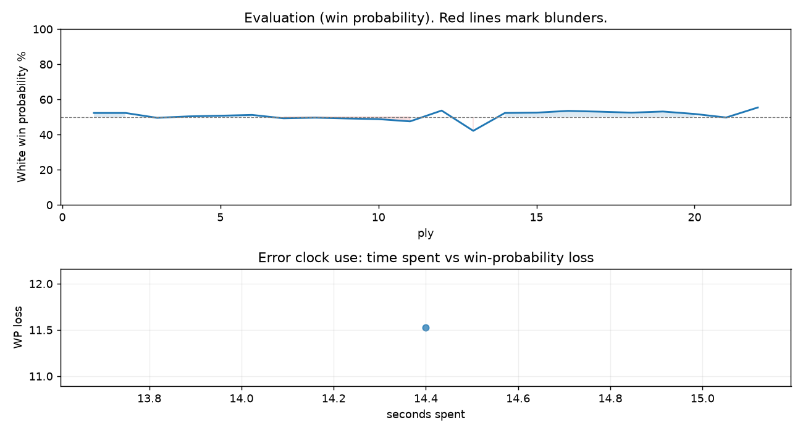

# (free, so lmk) Game analysis: saharatef vs DanielKetterer

Date: 2026.07.27  |  Time control: rapid (1800)  |  You played: white
Game ID: 3f45c3e7-8958-11f1-bd1d-370ea001000f
Analysis: depth=24 multipv=3 findability=honest floor=6 stable_run=3 threads=1 hash_mb=256 deterministic=True engine_id=Stockfish_18 generated=2026-07-27T03:51:53Z
Game end time UTC: 2026-07-27T01:34:44+00:00
Game: https://www.chess.com/game/live/172127911816

## Summary

- Lichess accuracy: you 85.5%, opponent 84.5%
- Opening: C26 Vienna Game: Stanley Variation (theory followed through ply 5)
- First deviation from theory: ply 6, Opponent played 3... Bc5
- Your moves: 5 best, 3 excellent, 2 good, 0 inaccuracy, 1 mistake, 0 blunder

METRICS:

Best: The played move exactly matches Stockfish's top move

Excellent: A non-best move that loses 2 WP points or less.

Good: WP loss is over 2, but under 5 points; also used for losses under 20 when the position remains already decided.

Inaccuracy: WP loss is at least 5 but under 10 points.

Mistake: WP loss is at least 10 but under 20 points; also generally used when a forced mate is missed with under 10 points of WP loss.

Blunder: WP loss is 20 points or more, or a forced mate is missed with at least 10 points of WP loss.

See: https://support.chess.com/en/articles/8572705-how-are-moves-classified-what-is-a-blunder-or-brilliant-etc 

(Brillint, Great and Miss are rating subjective)
- Puzzles: 17 open, 0 solved

### Puzzle gate tally (this game)

Gates: category in ['brilliant_sacrifice', 'missed_tactic', 'allowed_tactic', 'endgame'], refute depth in [3, 8], best-vs-second WP gap >= 5. Refute bar per move: max(5, 0.6 x WP loss).

| outcome | errors |
|---|---|
| wp_gap_too_small | 1 |

Four gates pass at once or nothing is generated, so a zero here is a product of four pass rates rather than a fault. Read the binding gate off this table before changing any threshold.

### Sacrifices in the engine's line

Real sacrifices are listed but never served as puzzles: compensation that never resolves back into material has no gradable answer.

| Move | Offered | Kind | Quiet | Line ends | Verdict |
|---|---|---|---|---|---|
| 7 | -9.0 (piece) | sham | no | +0.0 pawns | opening_ply |

## Biggest missed opportunity

You played 7.Nd5. Stockfish preferred Bxe6, after which the main line runs 7. Bxe6 fxe6 8. Bxc5 dxc5 9. Nf3 Nc6. Before committing to a quiet move here, the checklist is checks, captures, threats, in that order. The engine prefers this move from at or below depth 6, which is as shallow as this measurement resolves; it sits near the surface, a forcing move, the kind a checks-and-captures scan catches. Candidates considered by the engine: Bxe6 (+0.40), Bxc5 (+0.33), Bb3 (-0.07).

## Your errors, move by move

| Move | Class | Category | WP loss | Refute depth | Seconds spent | Pre-error eval |
|---|---|---|---:|---|---:|---|
| 7.Nd5 | mistake | missed_tactic | 12% | 5 | 14 | balanced |

### 7.Nd5 (mistake, tactical, wp loss 12%)

You played 7.Nd5. Stockfish preferred Bxe6, after which the main line runs 7. Bxe6 fxe6 8. Bxc5 dxc5 9. Nf3 Nc6. Before committing to a quiet move here, the checklist is checks, captures, threats, in that order. The engine prefers this move from at or below depth 6, which is as shallow as this measurement resolves; it sits near the surface, a forcing move, the kind a checks-and-captures scan catches. Candidates considered by the engine: Bxe6 (+0.40), Bxc5 (+0.33), Bb3 (-0.07).

## Full move table

| Ply | Move | Eval before | Eval after | Best | CP loss | WP loss | Class |
|-----|------|-------------|------------|------|---------|---------|-------|
| 1 | 1.e4* | +0.31 | +0.25 | e4 | 6 | 1% | best |
| 2 | 1...e5 | +0.25 | +0.25 | e5 | 0 | 0% | best |
| 3 | 2.Bc4* | +0.25 | -0.05 | Nf3 | 30 | 3% | good |
| 4 | 2...Nf6 | -0.05 | +0.04 | Nf6 | 9 | 1% | best |
| 5 | 3.Nc3* | +0.04 | +0.08 | Nc3 | 0 | 0% | best |
| 6 | 3...Bc5 | +0.08 | +0.13 | Nc6 | 5 | 0% | excellent |
| 7 | 4.h3* | +0.13 | -0.08 | Nf3 | 21 | 2% | excellent |
| 8 | 4...O-O | -0.08 | -0.04 | a5 | 4 | 0% | excellent |
| 9 | 5.d3* | -0.04 | -0.09 | Nf3 | 5 | 0% | excellent |
| 10 | 5...d6 | -0.09 | -0.13 | d6 | 0 | 0% | best |
| 11 | 6.Be3* | -0.13 | -0.27 | Nf3 | 14 | 1% | excellent |
| 12 | 6...Be6 | -0.27 | +0.40 | Bxe3 | 67 | 6% | inaccuracy |
| 13 | 7.Nd5* | +0.40 | -0.86 | Bxe6 | 126 | 12% | mistake |
| 14 | 7...c6 | -0.86 | +0.25 | Bxd5 | 111 | 10% | mistake |
| 15 | 8.Nxf6+* | +0.25 | +0.27 | Nxf6+ | 0 | 0% | best |
| 16 | 8...Qxf6 | +0.27 | +0.38 | Qxf6 | 11 | 1% | best |
| 17 | 9.Bxc5* | +0.38 | +0.33 | Bxc5 | 5 | 0% | best |
| 18 | 9...dxc5 | +0.33 | +0.27 | dxc5 | 0 | 0% | best |
| 19 | 10.Bxe6* | +0.27 | +0.34 | Bxe6 | 0 | 0% | best |
| 20 | 10...Qxe6 | +0.34 | +0.19 | Qxe6 | 0 | 0% | best |
| 21 | 11.Nf3* | +0.19 | -0.03 | Qg4 | 22 | 2% | good |
| 22 | 11...f5 | -0.03 | +0.59 | a5 | 62 | 6% | inaccuracy |

Rows marked * are your moves. WP loss is win-probability loss; it is the primary signal, CP loss is shown for reference.

## Patterns in this game

- Error categories: 1 missed_tactic.
- Attention errors per 100 moves: 0.0.
- Pre-error eval buckets: 0 winning, 1 balanced, 0 losing.
- Opening: 1 error(s) (avg wp loss 12%).
