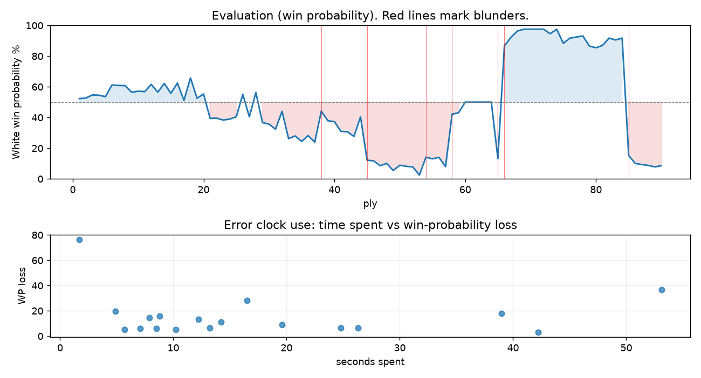

# (free, so lmk) Game analysis: DanielKetterer vs mohammed9413

Date: 2026.07.27  |  Time control: rapid (600)  |  You played: white
Game ID: 67178564-895b-11f1-bfe1-0a232701000f
Analysis: depth=24 multipv=3 findability=honest floor=6 stable_run=3 threads=1 hash_mb=256 deterministic=True engine_id=Stockfish_18 generated=2026-07-27T04:25:46Z
Game end time UTC: 2026-07-27T01:52:21+00:00
Game: https://www.chess.com/game/live/172128408076

## Summary

- Lichess accuracy: you 57.4%, opponent 62.4%
- Opening: B15 Caro-Kann Defense: Campomanes Attack (theory followed through ply 6)
- First deviation from theory: ply 7, You played 4. e5
- Your moves: 15 best, 6 excellent, 6 good, 8 inaccuracy, 7 mistake, 3 blunder

METRICS:

Best: The played move exactly matches Stockfish's top move

Excellent: A non-best move that loses 2 WP points or less.

Good: WP loss is over 2, but under 5 points; also used for losses under 20 when the position remains already decided.

Inaccuracy: WP loss is at least 5 but under 10 points.

Mistake: WP loss is at least 10 but under 20 points; also generally used when a forced mate is missed with under 10 points of WP loss.

Blunder: WP loss is 20 points or more, or a forced mate is missed with at least 10 points of WP loss.

See: https://support.chess.com/en/articles/8572705-how-are-moves-classified-what-is-a-blunder-or-brilliant-etc 

(Brillint, Great and Miss are rating subjective)
- Puzzles: 18 open, 0 solved

### Puzzle gate tally (this game)

Gates: category in ['brilliant_sacrifice', 'missed_tactic', 'allowed_tactic', 'endgame'], refute depth in [3, 8], best-vs-second WP gap >= 5. Refute bar per move: max(5, 0.6 x WP loss).

| outcome | errors |
|---|---|
| accepted | 1 |
| category:attention | 2 |
| category:opening | 4 |
| category:positional | 4 |
| refute_censored_high | 1 |
| refute_too_deep | 2 |
| refute_too_shallow | 2 |
| wp_gap_too_small | 2 |

Four gates pass at once or nothing is generated, so a zero here is a product of four pass rates rather than a fault. Read the binding gate off this table before changing any threshold.

### Sacrifices in the engine's line

Real sacrifices are listed but never served as puzzles: compensation that never resolves back into material has no gradable answer.

| Move | Offered | Kind | Quiet | Line ends | Verdict |
|---|---|---|---|---|---|
| 7 | -3.0 (piece) | real | yes | -1.0 pawns | real_sacrifice_not_gradable |
| 8 | -5.0 (piece) | sham | yes | +0.0 pawns | opening_ply |
| 9 | -3.0 (piece) | sham | yes | +0.0 pawns | opening_ply |
| 11 | -2.0 (exchange) | sham | yes | +1.0 pawns | opening_ply |
| 14 | -3.0 (piece) | sham | yes | +2.0 pawns | desperado |
| 17 | -7.0 (piece) | sham | yes | +1.0 pawns | puzzle |
| 21 | -4.0 (piece) | sham | yes | +5.0 pawns | puzzle |
| 23 | -5.0 (piece) | sham | yes | +1.0 pawns | puzzle |
| 27 | -7.0 (piece) | real | yes | -5.0 pawns | real_sacrifice_not_gradable |
| 29 | -4.0 (piece) | sham | yes | +0.0 pawns | eval_out_of_band |

## Biggest missed opportunity

You played 43.Kc2. Stockfish preferred Kc1, after which the main line runs 43. Kc1 Rc8 44. Ng5+ Kg8 45. Qg4 Rc6. The evaluation crossed from winning to losing, which matters more than the raw number. Why it went wrong: your king's zone came under heavier attack after this move. This was a judgment error rather than a missed tactic; compare the pawn structure and piece activity after both moves. The engine prefers this move from at or below depth 6, which is as shallow as this measurement resolves; it sits near the surface, a quiet move, but one whose point shows at a glance. Candidates considered by the engine: Kc1 (+6.55), Ka1 (+6.46), Ka2 (+6.46).

## Critical positions

- Ply 38 (opponent), 19...f5: -3.14 -> -0.64 [evaluation crossed winning -> equal]
- Ply 45 (you), 23.c3: -1.05 -> -5.37 [evaluation crossed equal -> losing]
- Ply 54 (opponent), 27...Qf5+: -M7 -> -4.90 [forced mate was on the board]
- Ply 56 (opponent), 28...Rxf5: -5.15 -> -4.92 [only-move situation]
- Ply 58 (opponent), 29...Bg6: -6.66 -> -0.86 [evaluation crossed winning -> equal]
- Ply 59 (you), 30.Nxg6: -0.86 -> -0.75 [only-move situation]
- Ply 61 (you), 31.Rxf1: +0.00 -> +0.00 [only-move situation]
- Ply 62 (opponent), 31...hxg6: +0.00 -> +0.00 [only-move situation]

## Your errors, move by move

| Move | Class | Category | WP loss | Refute depth | Seconds spent | Pre-error eval |
|---|---|---|---:|---|---:|---|
| 7.Bd2 | inaccuracy | opening | 5% | 1 | 10 | balanced |
| 8.Qf3 | inaccuracy | opening | 6% | 5 | 13 | balanced |
| 9.O-O-O | mistake | opening | 11% | 12 | 14 | balanced |
| 10.a3 | mistake | opening | 13% | 5 | 12 | winning |
| 11.b3 | mistake | attention | 16% | 1 | 9 | balanced |
| 14.Na2 | mistake | positional | 15% | 1 | 8 | balanced |
| 15.f5 | mistake | allowed_tactic | 20% | 12 | 5 | balanced |
| 17.Bxd7 | mistake | brilliant_sacrifice | 18% | 1 | 39 | balanced |
| 20.e6 | inaccuracy | allowed_tactic | 6% | >18 | 8 | balanced |
| 21.g4 | inaccuracy | brilliant_sacrifice | 6% | 1 | 26 | balanced |
| 23.c3 | blunder | brilliant_sacrifice | 28% | 5 | 16 | balanced |
| 27.Rdf1 | inaccuracy | allowed_tactic | 5% | 4 | 6 | losing |
| 29.e7 | inaccuracy | positional | 6% | 14 | 7 | losing |
| 33.Nd8 | blunder | positional | 37% | 10 | 53 | balanced |
| 37.Qe1 | mistake | positional | 3% | 3 | 42 | winning |
| 38.Qb1 | inaccuracy | allowed_tactic | 9% | 3 | 20 | winning |
| 40.Qd1 | inaccuracy | allowed_tactic | 7% | 14 | 25 | winning |
| 43.Kc2 | blunder | attention | 77% | 2 | 2 | winning |

### 7.Bd2 (inaccuracy, positional, wp loss 5%)

You played 7.Bd2. Stockfish preferred a3, after which the main line runs 7. a3 Bxc3+ 8. bxc3 Qh4+ 9. g3 Qe7. Why it went wrong: motif: creates threat on b4. This was a judgment error rather than a missed tactic; compare the pawn structure and piece activity after both moves. The engine does not settle on this move until depth 15; reachable with real calculation, but not on a scan. Candidates considered by the engine: a3 (+1.28), Qg4 (+1.24), Nf3 (+1.04).

### 8.Qf3 (inaccuracy, positional, wp loss 6%)

You played 8.Qf3. Stockfish preferred Qh5, after which the main line runs 8. Qh5 c5 9. a3 Bxc3 10. bxc3 b6. This was a judgment error rather than a missed tactic; compare the pawn structure and piece activity after both moves. The engine does not settle on this move until depth 12; reachable with real calculation, but not on a scan. Candidates considered by the engine: Qh5 (+1.35), Bd3 (+1.11), Nf3 (+1.07).

### 9.O-O-O (mistake, positional, wp loss 11%)

You played 9.O-O-O. Stockfish preferred Bd3, after which the main line runs 9. Bd3 c5 10. a3 Bxc3 11. bxc3 f5. This was a judgment error rather than a missed tactic; compare the pawn structure and piece activity after both moves. The engine prefers this move from at or below depth 6, which is as shallow as this measurement resolves; it sits near the surface, a quiet move, but one whose point shows at a glance. Candidates considered by the engine: Bd3 (+1.38), Qh3 (+1.31), Qh5 (+1.14).

### 10.a3 (mistake, positional, wp loss 13%)

You played 10.a3. Stockfish preferred Qh3, after which the main line runs 10. Qh3 Nc4 11. Bd3 h6 12. g4 c5. The evaluation crossed from winning to equal, which matters more than the raw number. This was a judgment error rather than a missed tactic; compare the pawn structure and piece activity after both moves. The engine first prefers this move at depth 7 and holds it; findable, but it takes a deliberate look rather than a scan. Candidates considered by the engine: Qh3 (+1.78), Bd3 (+1.54), g4 (+1.40).

### 11.b3 (mistake, tactical, wp loss 16%)

You played 11.b3. Stockfish preferred h4, after which the main line runs 11. h4 b4 12. axb4 a5 13. b5 cxb5. Why it went wrong: left pawn on a3 insufficiently defended. Before committing to a quiet move here, the checklist is checks, captures, threats, in that order. The engine prefers this move from at or below depth 6, which is as shallow as this measurement resolves; it sits near the surface, a forcing move, the kind a checks-and-captures scan catches. Candidates considered by the engine: h4 (+0.58), Bd3 (+0.25), Nb1 (+0.01).

### 14.Na2 (mistake, positional, wp loss 15%)

You played 14.Na2. Stockfish preferred Nce2, after which the main line runs 14. Nce2 f5 15. exf6 Qxf6 16. Nh3 Ba6. This was a judgment error rather than a missed tactic; compare the pawn structure and piece activity after both moves. The engine does not settle on this move until depth 20; reachable with real calculation, but not on a scan. Candidates considered by the engine: Nce2 (+0.56), Qh3 (+0.21), Bxh7+ (+0.00).

### 15.f5 (mistake, positional, wp loss 20%)

You played 15.f5. Stockfish preferred Qh3, after which the main line runs 15. Qh3 h6 16. Ne2 a4 17. f5 axb3. This was a judgment error rather than a missed tactic; compare the pawn structure and piece activity after both moves. The engine first prefers this move at depth 10 and holds it; findable, but it takes a deliberate look rather than a scan. Candidates considered by the engine: Qh3 (+0.69), Nh3 (+0.25), Qh5 (-0.70).

### 17.Bxd7 (mistake, tactical, wp loss 18%)

You played 17.Bxd7. Stockfish preferred Rf1, after which the main line runs 17. Rf1 Re7 18. Bg5 a4 19. Ne2 Qe8. The evaluation crossed from equal to losing, which matters more than the raw number. Why it went wrong: left bishop on d7 insufficiently defended. Before committing to a quiet move here, the checklist is checks, captures, threats, in that order. The engine first prefers this move at depth 7 and holds it; findable, but it takes a deliberate look rather than a scan. Candidates considered by the engine: Rf1 (-0.65), Ne2 (-1.09), Nh3 (-1.25).

### 20.e6 (inaccuracy, positional, wp loss 6%)

You played 20.e6. Stockfish preferred h4, after which the main line runs 20. h4 a4 21. h5 axb3 22. cxb3 Qe7. This was a judgment error rather than a missed tactic; compare the pawn structure and piece activity after both moves. The engine prefers this move from at or below depth 6, which is as shallow as this measurement resolves; it sits near the surface, a quiet move, but one whose point shows at a glance. Candidates considered by the engine: h4 (-0.64), Rhe1 (-0.87), Rhf1 (-1.27).

### 21.g4 (inaccuracy, positional, wp loss 6%)

You played 21.g4. Stockfish preferred Nd3, after which the main line runs 21. Nd3 f4 22. Bxf4 a4 23. Qe3 axb3. The evaluation crossed from equal to losing, which matters more than the raw number. This was a judgment error rather than a missed tactic; compare the pawn structure and piece activity after both moves. The engine does not settle on this move until depth 18; reachable with real calculation, but not on a scan. Candidates considered by the engine: Nd3 (-1.41), h4 (-1.43), Nc1 (-1.58).

### 23.c3 (blunder, deep tactic, wp loss 28%)

You played 23.c3. Stockfish preferred Rhf1, after which the main line runs 23. Rhf1 a4 24. Bxb4 Bxb4 25. Nxb4 axb3. The evaluation crossed from equal to losing, which matters more than the raw number. Nothing was hanging and no capture was on offer, but the engine's continuation is forcing: this was a combination landing several moves out, not a judgment error. The engine first prefers this move at depth 9 and holds it; findable, but it takes a deliberate look rather than a scan. Candidates considered by the engine: Rhf1 (-1.05), Nd3 (-1.99), Rhe1 (-2.10).

### 27.Rdf1 (inaccuracy, positional, wp loss 5%)

You played 27.Rdf1. Stockfish preferred Rhg1, after which the main line runs 27. Rhg1 Nc4 28. Rg3 Ra7 29. Rxb3 Qxf4. Why it went wrong: left pawn on d4 insufficiently defended. This was a judgment error rather than a missed tactic; compare the pawn structure and piece activity after both moves. The engine does not settle on this move until depth 13; reachable with real calculation, but not on a scan. Candidates considered by the engine: Rhg1 (-6.73), h4 (-6.93), Rhf1 (-6.97).

### 29.e7 (inaccuracy, positional, wp loss 6%)

You played 29.e7. Stockfish preferred Kb2, after which the main line runs 29. Kb2 Nc4+ 30. Kc3 b2 31. Nbd3 g5. Why it went wrong: motif: creates threat on b3. This was a judgment error rather than a missed tactic; compare the pawn structure and piece activity after both moves. The engine does not settle on this move until depth 13; reachable with real calculation, but not on a scan. Candidates considered by the engine: Kb2 (-4.92), Nfxd5 (-5.25), Nfd3 (-5.39).

### 33.Nd8 (blunder, positional, wp loss 37%)

You played 33.Nd8. Stockfish preferred Rf4, after which the main line runs 33. Rf4 Re8 34. Rf2 b2 35. h4 Ne3. The evaluation crossed from equal to losing, which matters more than the raw number. This was a judgment error rather than a missed tactic; compare the pawn structure and piece activity after both moves. The engine never settles on this move within the analysis depth, so how findable it was is not measured here; weigh this one lightly. Candidates considered by the engine: Rf4 (+0.00), Re1 (+0.00), Rf2 (+0.00).

### 37.Qe1 (mistake, positional, wp loss 3%)

You played 37.Qe1. Stockfish preferred Nf7, after which the main line runs 37. Nf7 Rc2+ 38. Kb4 Rc4+ 39. Kb5 g5. There was a forced mate on the board and this move let it slip. Why it went wrong: left pawn on h2 insufficiently defended; motif: creates threat on b3. This was a judgment error rather than a missed tactic; compare the pawn structure and piece activity after both moves. The engine prefers this move from at or below depth 6, which is as shallow as this measurement resolves; it sits near the surface, a quiet move, but one whose point shows at a glance. Candidates considered by the engine: Nf7 (M10), Ne6 (+9.22), Qf7 (+8.12).

### 38.Qb1 (inaccuracy, positional, wp loss 9%)

You played 38.Qb1. Stockfish preferred Qxf1, after which the main line runs 38. Qxf1 Ra7 39. Kxb2 g5 40. Qf5+ Kg8. Why it went wrong: left pawn on h2 insufficiently defended; a favorable capture was available (Qxf1). This was a judgment error rather than a missed tactic; compare the pawn structure and piece activity after both moves. The engine prefers this move from at or below depth 6, which is as shallow as this measurement resolves; it sits near the surface, a quiet move, but one whose point shows at a glance. Candidates considered by the engine: Qxf1 (+19.36), Ne6 (+11.83), Kb3 (+5.24).

### 40.Qd1 (inaccuracy, positional, wp loss 7%)

You played 40.Qd1. Stockfish preferred Qc2, after which the main line runs 40. Qc2 Ra8 41. Qxd2 Rb8+ 42. Kc2 Rc8+. Why it went wrong: motif: creates threat on a3, d2. This was a judgment error rather than a missed tactic; compare the pawn structure and piece activity after both moves. The engine does not settle on this move until depth 14; reachable with real calculation, but not on a scan. Candidates considered by the engine: Qc2 (+7.08), Qc1 (+6.90), Qe1 (+5.81).

### 43.Kc2 (blunder, positional, wp loss 77%)

You played 43.Kc2. Stockfish preferred Kc1, after which the main line runs 43. Kc1 Rc8 44. Ng5+ Kg8 45. Qg4 Rc6. The evaluation crossed from winning to losing, which matters more than the raw number. Why it went wrong: your king's zone came under heavier attack after this move. This was a judgment error rather than a missed tactic; compare the pawn structure and piece activity after both moves. The engine prefers this move from at or below depth 6, which is as shallow as this measurement resolves; it sits near the surface, a quiet move, but one whose point shows at a glance. Candidates considered by the engine: Kc1 (+6.55), Ka1 (+6.46), Ka2 (+6.46).

## Full move table

| Ply | Move | Eval before | Eval after | Best | CP loss | WP loss | Class |
|-----|------|-------------|------------|------|---------|---------|-------|
| 1 | 1.e4* | +0.31 | +0.25 | e4 | 6 | 1% | best |
| 2 | 1...c6 | +0.25 | +0.29 | e5 | 4 | 0% | excellent |
| 3 | 2.d4* | +0.29 | +0.51 | c3 | 0 | 0% | excellent |
| 4 | 2...d5 | +0.51 | +0.49 | d5 | 0 | 0% | best |
| 5 | 3.Nc3* | +0.49 | +0.39 | e5 | 10 | 1% | excellent |
| 6 | 3...Nf6 | +0.39 | +1.24 | dxe4 | 85 | 8% | inaccuracy |
| 7 | 4.e5* | +1.24 | +1.20 | e5 | 4 | 0% | best |
| 8 | 4...Nfd7 | +1.20 | +1.19 | Nfd7 | 0 | 0% | best |
| 9 | 5.Be3* | +1.19 | +0.71 | Nf3 | 48 | 4% | good |
| 10 | 5...e6 | +0.71 | +0.78 | e6 | 7 | 1% | best |
| 11 | 6.f4* | +0.78 | +0.75 | f4 | 3 | 0% | best |
| 12 | 6...Bb4 | +0.75 | +1.28 | c5 | 53 | 5% | good |
| 13 | 7.Bd2* | +1.28 | +0.71 | a3 | 57 | 5% | inaccuracy |
| 14 | 7...O-O | +0.71 | +1.35 | Be7 | 64 | 6% | inaccuracy |
| 15 | 8.Qf3* | +1.35 | +0.63 | Qh5 | 72 | 6% | inaccuracy |
| 16 | 8...b5 | +0.63 | +1.38 | c5 | 75 | 7% | inaccuracy |
| 17 | 9.O-O-O* | +1.38 | +0.13 | Bd3 | 125 | 11% | mistake |
| 18 | 9...Nb6 | +0.13 | +1.78 | c5 | 165 | 15% | mistake |
| 19 | 10.a3* | +1.78 | +0.28 | Qh3 | 150 | 13% | mistake |
| 20 | 10...Be7 | +0.28 | +0.58 | Be7 | 30 | 3% | best |
| 21 | 11.b3* | +0.58 | -1.17 | h4 | 175 | 16% | mistake |
| 22 | 11...a5 | -1.17 | -1.15 | a5 | 2 | 0% | best |
| 23 | 12.Bd3* | -1.15 | -1.29 | Kb1 | 14 | 1% | excellent |
| 24 | 12...Bxa3+ | -1.29 | -1.22 | b4 | 7 | 1% | excellent |
| 25 | 13.Kb1* | -1.22 | -1.05 | Kb1 | 0 | 0% | best |
| 26 | 13...b4 | -1.05 | +0.56 | f5 | 161 | 15% | mistake |
| 27 | 14.Na2* | +0.56 | -1.05 | Nce2 | 161 | 15% | mistake |
| 28 | 14...N8d7 | -1.05 | +0.69 | f5 | 174 | 16% | mistake |
| 29 | 15.f5* | +0.69 | -1.48 | Qh3 | 217 | 20% | mistake |
| 30 | 15...exf5 | -1.48 | -1.60 | exf5 | 0 | 0% | best |
| 31 | 16.Bxf5* | -1.60 | -2.00 | Ne2 | 40 | 3% | good |
| 32 | 16...Re8 | -2.00 | -0.65 | a4 | 135 | 12% | mistake |
| 33 | 17.Bxd7* | -0.65 | -2.81 | Rf1 | 216 | 18% | mistake |
| 34 | 17...Bxd7 | -2.81 | -2.57 | Qxd7 | 24 | 2% | excellent |
| 35 | 18.Ne2* | -2.57 | -3.07 | Rf1 | 50 | 4% | good |
| 36 | 18...Rf8 | -3.07 | -2.54 | a4 | 53 | 4% | good |
| 37 | 19.Nf4* | -2.54 | -3.14 | Qg3 | 60 | 4% | good |
| 38 | 19...f5 | -3.14 | -0.64 | a4 | 250 | 20% | blunder |
| 39 | 20.e6* | -0.64 | -1.34 | h4 | 70 | 6% | inaccuracy |
| 40 | 20...Be8 | -1.34 | -1.41 | Be8 | 0 | 0% | best |
| 41 | 21.g4* | -1.41 | -2.18 | Nd3 | 77 | 6% | inaccuracy |
| 42 | 21...fxg4 | -2.18 | -2.21 | fxg4 | 0 | 0% | best |
| 43 | 22.Qxg4* | -2.21 | -2.61 | Qxg4 | 40 | 3% | best |
| 44 | 22...Qf6 | -2.61 | -1.05 | a4 | 156 | 13% | mistake |
| 45 | 23.c3* | -1.05 | -5.37 | Rhf1 | 432 | 28% | blunder |
| 46 | 23...bxc3 | -5.37 | -5.47 | a4 | 0 | 0% | excellent |
| 47 | 24.Bxc3* | -5.47 | -6.43 | Nxc3 | 96 | 3% | good |
| 48 | 24...a4 | -6.43 | -5.95 | Qxf4 | 48 | 1% | excellent |
| 49 | 25.Bb4* | -5.95 | -7.75 | Rhg1 | 180 | 5% | good |
| 50 | 25...Bxb4 | -7.75 | -6.32 | Qxf4 | 143 | 3% | good |
| 51 | 26.Nxb4* | -6.32 | -6.57 | Nxb4 | 25 | 1% | best |
| 52 | 26...axb3 | -6.57 | -6.73 | Qxf4 | 0 | 0% | excellent |
| 53 | 27.Rdf1* | -6.73 | -M7 | Rhg1 |  | 5% | inaccuracy |
| 54 | 27...Qf5+ | -M7 | -4.90 | Qxd4 |  | 12% | blunder |
| 55 | 28.Qxf5* | -4.90 | -5.15 | Qxf5 | 25 | 1% | best |
| 56 | 28...Rxf5 | -5.15 | -4.92 | Rxf5 | 23 | 1% | best |
| 57 | 29.e7* | -4.92 | -6.66 | Kb2 | 174 | 6% | inaccuracy |
| 58 | 29...Bg6 | -6.66 | -0.86 | Nc4 | 580 | 34% | blunder |
| 59 | 30.Nxg6* | -0.86 | -0.75 | Nxg6 | 0 | 0% | best |
| 60 | 30...Rxf1+ | -0.75 | +0.00 | hxg6 | 75 | 7% | inaccuracy |
| 61 | 31.Rxf1* | +0.00 | +0.00 | Rxf1 | 0 | 0% | best |
| 62 | 31...hxg6 | +0.00 | +0.00 | hxg6 | 0 | 0% | best |
| 63 | 32.Nxc6* | +0.00 | +0.00 | Nxc6 | 0 | 0% | best |
| 64 | 32...Nc4 | +0.00 | +0.00 | Re8 | 0 | 0% | excellent |
| 65 | 33.Nd8* | +0.00 | -5.10 | Rf4 | 510 | 37% | blunder |
| 66 | 33...Nd2+ | -5.10 | +5.10 | Ra2 | 1020 | 73% | blunder |
| 67 | 34.Kb2* | +5.10 | +6.72 | Kb2 | 0 | 0% | best |
| 68 | 34...Ra2+ | +6.72 | +8.91 | Nc4+ | 219 | 4% | good |
| 69 | 35.Kc3* | +8.91 | +12.00 | Kc3 | 0 | 0% | best |
| 70 | 35...Nxf1 | +12.00 | M11 | Ne4+ |  | 0% | excellent |
| 71 | 36.e8=Q+* | M11 | M10 | e8=Q+ |  | 0% | best |
| 72 | 36...Kh7 | M10 | M10 | Kh7 |  | 0% | best |
| 73 | 37.Qe1* | M10 | +7.78 | Nf7 |  | 3% | mistake |
| 74 | 37...b2 | +7.78 | +19.36 | Rg2 | 1158 | 3% | good |
| 75 | 38.Qb1* | +19.36 | +5.50 | Qxf1 | 1386 | 9% | inaccuracy |
| 76 | 38...Ra3+ | +5.50 | +6.52 | Ra3+ | 102 | 3% | best |
| 77 | 39.Kxb2* | +6.52 | +6.81 | Kxb2 | 0 | 0% | best |
| 78 | 39...Nd2 | +6.81 | +7.08 | Rf3 | 27 | 1% | excellent |
| 79 | 40.Qd1* | +7.08 | +5.05 | Qc2 | 203 | 7% | inaccuracy |
| 80 | 40...Nc4+ | +5.05 | +4.81 | Nc4+ | 0 | 0% | best |
| 81 | 41.Kb1* | +4.81 | +5.16 | Kb1 | 0 | 0% | best |
| 82 | 41...Ra8 | +5.16 | +6.55 | Nd6 | 139 | 5% | good |
| 83 | 42.Ne6* | +6.55 | +6.12 | Qg4 | 43 | 1% | excellent |
| 84 | 42...Rb8+ | +6.12 | +6.55 | Na3+ | 43 | 1% | excellent |
| 85 | 43.Kc2* | +6.55 | -4.66 | Kc1 | 1121 | 77% | blunder |
| 86 | 43...Ne3+ | -4.66 | -5.94 | Ne3+ | 0 | 0% | best |
| 87 | 44.Kd3* | -5.94 | -6.17 | Kc1 | 23 | 1% | excellent |
| 88 | 44...Nxd1 | -6.17 | -6.36 | Nxd1 | 0 | 0% | best |
| 89 | 45.Kd2* | -6.36 | -6.71 | Nf4 | 35 | 1% | excellent |
| 90 | 45...Nb2 | -6.71 | -6.41 | Rb2+ | 30 | 1% | excellent |

Rows marked * are your moves. WP loss is win-probability loss; it is the primary signal, CP loss is shown for reference.

## Patterns in this game

- Error categories: 5 allowed_tactic, 2 attention, 3 brilliant_sacrifice, 4 opening, 4 positional.
- Attention errors per 100 moves: 4.4.
- Pre-error eval buckets: 5 winning, 11 balanced, 2 losing.
- Opening: 4 error(s) (avg wp loss 9%).
- Middlegame: 9 error(s) (avg wp loss 13%).
- Endgame: 5 error(s) (avg wp loss 26%).
- 3 of your errors came with under a minute on the clock.
