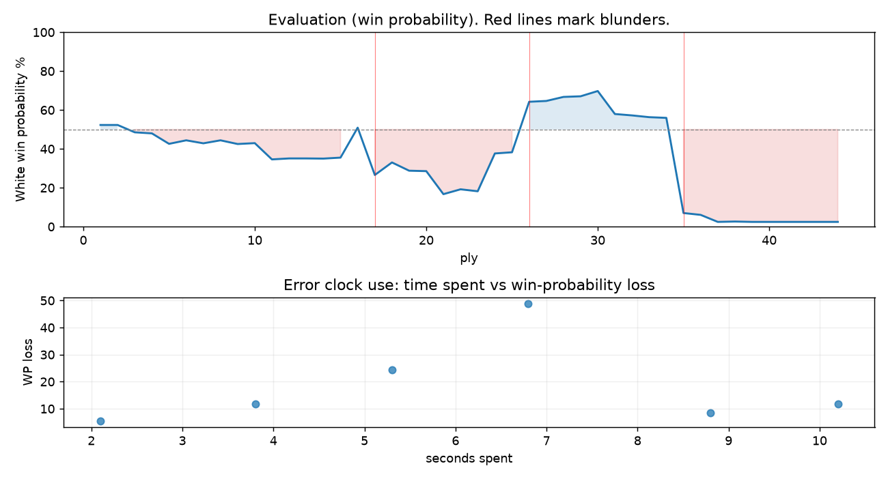

# (free, so lmk) Game analysis: Sfinx53 vs DanielKetterer

Date: 2026.07.27  |  Time control: rapid (1800)  |  You played: white
Game ID: 787f5274-8968-11f1-a0ce-ee874101000f
Analysis: depth=24 multipv=3 findability=honest floor=6 stable_run=3 threads=1 hash_mb=256 deterministic=True engine_id=Stockfish_18 generated=2026-07-27T04:35:02Z
Game end time UTC: 2026-07-27T03:16:13+00:00
Game: https://www.chess.com/game/live/172130459976

## Summary

- Lichess accuracy: you 68.2%, opponent 78.9%
- Opening: A00 Hungarian Opening (theory followed through ply 1)
- First deviation from theory: ply 2, Opponent played 1... e5
- Your moves: 7 best, 6 excellent, 3 good, 2 inaccuracy, 2 mistake, 2 blunder

METRICS:

Best: The played move exactly matches Stockfish's top move

Excellent: A non-best move that loses 2 WP points or less.

Good: WP loss is over 2, but under 5 points; also used for losses under 20 when the position remains already decided.

Inaccuracy: WP loss is at least 5 but under 10 points.

Mistake: WP loss is at least 10 but under 20 points; also generally used when a forced mate is missed with under 10 points of WP loss.

Blunder: WP loss is 20 points or more, or a forced mate is missed with at least 10 points of WP loss.

See: https://support.chess.com/en/articles/8572705-how-are-moves-classified-what-is-a-blunder-or-brilliant-etc 

(Brillint, Great and Miss are rating subjective)
- Puzzles: 18 open, 0 solved

### Puzzle gate tally (this game)

Gates: category in ['brilliant_sacrifice', 'missed_tactic', 'allowed_tactic', 'endgame'], refute depth in [3, 8], best-vs-second WP gap >= 5. Refute bar per move: max(5, 0.6 x WP loss).

| outcome | errors |
|---|---|
| category:attention | 3 |
| category:opening | 1 |
| refute_too_deep | 1 |
| refute_too_shallow | 1 |

Four gates pass at once or nothing is generated, so a zero here is a product of four pass rates rather than a fault. Read the binding gate off this table before changing any threshold.

### Sacrifices in the engine's line

Real sacrifices are listed but never served as puzzles: compensation that never resolves back into material has no gradable answer.

| Move | Offered | Kind | Quiet | Line ends | Verdict |
|---|---|---|---|---|---|
| 3 | -9.0 (piece) | sham | yes | +0.0 pawns | opening_ply |
| 9 | -5.0 (piece) | sham | no | +1.0 pawns | opening_ply |
| 16 | -9.0 (piece) | real | yes | -1.0 pawns | real_sacrifice_not_gradable |
| 18 | -4.0 (piece) | real | yes | -1.0 pawns | real_sacrifice_not_gradable |

## Biggest missed opportunity

You played 18.Bf3. Stockfish preferred f4, after which the main line runs 18. f4 Bd7 19. Kf2 Ba4 20. Qe1 b5. The evaluation crossed from equal to losing, which matters more than the raw number. Why it went wrong: left bishop on f3 insufficiently defended. Before committing to a quiet move here, the checklist is checks, captures, threats, in that order. The engine first prefers this move at depth 10 and holds it; findable, but it takes a deliberate look rather than a scan. Candidates considered by the engine: f4 (+0.65), f3 (+0.40), Bf1 (-0.11).

## Critical positions

- Ply 15 (you), 8.Bxa1: -1.68 -> -1.62 [only-move situation]
- Ply 17 (you), 9.Nc3: +0.10 -> -2.76 [evaluation crossed equal -> losing]
- Ply 26 (opponent), 13...d3: -1.30 -> +1.59
- Ply 27 (you), 14.Nxd3: +1.59 -> +1.64 [only-move situation]
- Ply 29 (you), 15.cxd3: +1.89 -> +1.93 [only-move situation]
- Ply 34 (opponent), 17...Re8: +0.69 -> +0.65 [only-move situation]
- Ply 35 (you), 18.Bf3: +0.65 -> -7.02 [evaluation crossed equal -> losing]
- Ply 36 (opponent), 18...Qxf3: -7.02 -> -7.44 [only-move situation]

## Your errors, move by move

| Move | Class | Category | WP loss | Refute depth | Seconds spent | Pre-error eval |
|---|---|---|---:|---|---:|---|
| 3.h3 | inaccuracy | opening | 5% | >18 | 2 | balanced |
| 6.Bb2 | inaccuracy | attention | 8% | 1 | 9 | balanced |
| 9.Nc3 | blunder | attention | 24% | 1 | 5 | balanced |
| 11.exd4 | mistake | missed_tactic | 12% | 9 | 4 | losing |
| 16.Bxf6 | mistake | attention | 12% | 1 | 10 | winning |
| 18.Bf3 | blunder | allowed_tactic | 49% | 1 | 7 | balanced |

### 3.h3 (inaccuracy, positional, wp loss 5%)

You played 3.h3. Stockfish preferred d3, after which the main line runs 3. d3 Nc6 4. Nf3 Be6 5. O-O Qd7. This was a judgment error rather than a missed tactic; compare the pawn structure and piece activity after both moves. The engine does not settle on this move until depth 14; reachable with real calculation, but not on a scan. Candidates considered by the engine: d3 (-0.22), c4 (-0.23), d4 (-0.37).

### 6.Bb2 (inaccuracy, positional, wp loss 8%)

You played 6.Bb2. Stockfish preferred b5, after which the main line runs 6. b5 Na7 7. a4 c6 8. Bb2 Bd6. The evaluation crossed from equal to losing, which matters more than the raw number. Why it went wrong: motif: creates threat on c6. This was a judgment error rather than a missed tactic; compare the pawn structure and piece activity after both moves. The engine prefers this move from at or below depth 6, which is as shallow as this measurement resolves; it sits near the surface, a quiet move, but one whose point shows at a glance. Candidates considered by the engine: b5 (-0.77), bxa5 (-1.25), Bb2 (-1.71).

### 9.Nc3 (blunder, tactical, wp loss 24%)

You played 9.Nc3. Stockfish preferred Bxe5, after which the main line runs 9. Bxe5 Be7 10. Nf3 O-O 11. O-O c5. The evaluation crossed from equal to losing, which matters more than the raw number. Why it went wrong: a favorable capture was available (Bxe5). Before committing to a quiet move here, the checklist is checks, captures, threats, in that order. The engine prefers this move from at or below depth 6, which is as shallow as this measurement resolves; it sits near the surface, a forcing move, the kind a checks-and-captures scan catches. Candidates considered by the engine: Bxe5 (+0.10), Nf3 (-1.50), d3 (-1.70).

### 11.exd4 (mistake, tactical, wp loss 12%)

You played 11.exd4. Stockfish preferred Na4, after which the main line runs 11. Na4 Bd6 12. exd4 Bf5 13. d3 Qa8. Why it went wrong: left pawn on d4 insufficiently defended; motif: creates threat on c5. Before committing to a quiet move here, the checklist is checks, captures, threats, in that order. The engine prefers this move from at or below depth 6, which is as shallow as this measurement resolves; it sits near the surface, a forcing move, the kind a checks-and-captures scan catches. Candidates considered by the engine: Na4 (-2.49), Ne4 (-2.69), Nf3 (-3.32).

### 16.Bxf6 (mistake, tactical, wp loss 12%)

You played 16.Bxf6. Stockfish preferred f3, after which the main line runs 16. f3 Bd7 17. Ne2 Re8 18. Kf2 Ba4. The evaluation crossed from winning to equal, which matters more than the raw number. Why it went wrong: left bishop on f6 insufficiently defended. Before committing to a quiet move here, the checklist is checks, captures, threats, in that order. The engine prefers this move from at or below depth 6, which is as shallow as this measurement resolves; it sits near the surface, a forcing move, the kind a checks-and-captures scan catches. Candidates considered by the engine: f3 (+2.27), Ne2 (+2.17), Bf3 (+1.40).

### 18.Bf3 (blunder, tactical, wp loss 49%)

You played 18.Bf3. Stockfish preferred f4, after which the main line runs 18. f4 Bd7 19. Kf2 Ba4 20. Qe1 b5. The evaluation crossed from equal to losing, which matters more than the raw number. Why it went wrong: left bishop on f3 insufficiently defended. Before committing to a quiet move here, the checklist is checks, captures, threats, in that order. The engine first prefers this move at depth 10 and holds it; findable, but it takes a deliberate look rather than a scan. Candidates considered by the engine: f4 (+0.65), f3 (+0.40), Bf1 (-0.11).

## Full move table

| Ply | Move | Eval before | Eval after | Best | CP loss | WP loss | Class |
|-----|------|-------------|------------|------|---------|---------|-------|
| 1 | 1.g3* | +0.31 | +0.25 | e4 | 6 | 1% | excellent |
| 2 | 1...e5 | +0.25 | +0.25 | e5 | 0 | 0% | best |
| 3 | 2.Bg2* | +0.25 | -0.16 | c4 | 41 | 4% | good |
| 4 | 2...d5 | -0.16 | -0.22 | d5 | 0 | 0% | best |
| 5 | 3.h3* | -0.22 | -0.81 | d3 | 59 | 5% | inaccuracy |
| 6 | 3...Nf6 | -0.81 | -0.61 | Nc6 | 20 | 2% | excellent |
| 7 | 4.a3* | -0.61 | -0.78 | c4 | 17 | 2% | excellent |
| 8 | 4...Nc6 | -0.78 | -0.61 | c5 | 17 | 2% | excellent |
| 9 | 5.b4* | -0.61 | -0.82 | d3 | 21 | 2% | excellent |
| 10 | 5...a5 | -0.82 | -0.77 | Bd6 | 5 | 0% | excellent |
| 11 | 6.Bb2* | -0.77 | -1.73 | b5 | 96 | 8% | inaccuracy |
| 12 | 6...axb4 | -1.73 | -1.67 | axb4 | 6 | 1% | best |
| 13 | 7.axb4* | -1.67 | -1.67 | axb4 | 0 | 0% | best |
| 14 | 7...Rxa1 | -1.67 | -1.68 | Rxa1 | 0 | 0% | best |
| 15 | 8.Bxa1* | -1.68 | -1.62 | Bxa1 | 0 | 0% | best |
| 16 | 8...Nxb4 | -1.62 | +0.10 | Bxb4 | 172 | 15% | mistake |
| 17 | 9.Nc3* | +0.10 | -2.76 | Bxe5 | 286 | 24% | blunder |
| 18 | 9...Bc5 | -2.76 | -1.92 | Bf5 | 84 | 6% | inaccuracy |
| 19 | 10.e3* | -1.92 | -2.46 | Nf3 | 54 | 4% | good |
| 20 | 10...d4 | -2.46 | -2.49 | d4 | 0 | 0% | best |
| 21 | 11.exd4* | -2.49 | -4.36 | Na4 | 187 | 12% | mistake |
| 22 | 11...exd4 | -4.36 | -3.90 | Qxd4 | 46 | 2% | good |
| 23 | 12.Ne4* | -3.90 | -4.08 | Na4 | 18 | 1% | excellent |
| 24 | 12...O-O | -4.08 | -1.37 | Nxe4 | 271 | 19% | mistake |
| 25 | 13.Nxc5* | -1.37 | -1.30 | Nxc5 | 0 | 0% | best |
| 26 | 13...d3 | -1.30 | +1.59 | Bf5 | 289 | 26% | blunder |
| 27 | 14.Nxd3* | +1.59 | +1.64 | Nxd3 | 0 | 0% | best |
| 28 | 14...Nxd3+ | +1.64 | +1.89 | Nxd3+ | 25 | 2% | best |
| 29 | 15.cxd3* | +1.89 | +1.93 | cxd3 | 0 | 0% | best |
| 30 | 15...Qxd3 | +1.93 | +2.27 | Qxd3 | 34 | 3% | best |
| 31 | 16.Bxf6* | +2.27 | +0.87 | f3 | 140 | 12% | mistake |
| 32 | 16...gxf6 | +0.87 | +0.79 | Re8+ | 0 | 0% | excellent |
| 33 | 17.Ne2* | +0.79 | +0.69 | Ne2 | 10 | 1% | best |
| 34 | 17...Re8 | +0.69 | +0.65 | Re8 | 0 | 0% | best |
| 35 | 18.Bf3* | +0.65 | -7.02 | f4 | 767 | 49% | blunder |
| 36 | 18...Qxf3 | -7.02 | -7.44 | Qxf3 | 0 | 0% | best |
| 37 | 19.Rg1* | -7.44 | -12.79 | d3 | 535 | 4% | good |
| 38 | 19...b6 | -12.79 | -9.80 | Bf5 | 299 | 0% | excellent |
| 39 | 20.g4* | -9.80 | -10.78 | Rg2 | 98 | 0% | excellent |
| 40 | 20...Ba6 | -10.78 | -12.18 | Ba6 | 0 | 0% | best |
| 41 | 21.Rg3* | -12.18 | -M2 | d3 |  | 0% | excellent |
| 42 | 21...Rxe2+ | -M2 | -M1 | Rxe2+ |  | 0% | best |
| 43 | 22.Qxe2* | -M1 | -M1 | Qxe2 |  | 0% | best |
| 44 | 22...Qxe2# | -M1 | -M1 | Qxe2# |  | 0% | best |

Rows marked * are your moves. WP loss is win-probability loss; it is the primary signal, CP loss is shown for reference.

## Patterns in this game

- Error categories: 1 allowed_tactic, 3 attention, 1 missed_tactic, 1 opening.
- Attention errors per 100 moves: 13.6.
- Pre-error eval buckets: 1 winning, 4 balanced, 1 losing.
- Opening: 3 error(s) (avg wp loss 13%).
- Middlegame: 3 error(s) (avg wp loss 24%).
