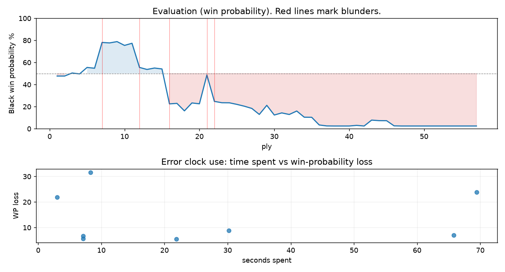

# (free, so lmk) Game analysis: luismen67 vs DanielKetterer

Date: 2026.07.27  |  Time control: rapid (1800)  |  You played: black
Game ID: 066dc8af-896b-11f1-bfe1-0a232701000f
Analysis: depth=24 multipv=3 findability=honest floor=6 stable_run=3 threads=1 hash_mb=256 deterministic=True engine_id=Stockfish_18 generated=2026-07-27T05:07:31Z
Game end time UTC: 2026-07-27T03:44:56+00:00
Game: https://www.chess.com/game/live/172130857754

## Summary

- Lichess accuracy: you 75.6%, opponent 83.8%
- Opening: C42 Petrov's Defense: Italian Variation (theory followed through ply 5)
- First deviation from theory: ply 6, You played 3... Nxe4
- Your moves: 13 best, 5 excellent, 2 good, 5 inaccuracy, 0 mistake, 3 blunder

METRICS:

Best: The played move exactly matches Stockfish's top move

Excellent: A non-best move that loses 2 WP points or less.

Good: WP loss is over 2, but under 5 points; also used for losses under 20 when the position remains already decided.

Inaccuracy: WP loss is at least 5 but under 10 points.

Mistake: WP loss is at least 10 but under 20 points; also generally used when a forced mate is missed with under 10 points of WP loss.

Blunder: WP loss is 20 points or more, or a forced mate is missed with at least 10 points of WP loss.

See: https://support.chess.com/en/articles/8572705-how-are-moves-classified-what-is-a-blunder-or-brilliant-etc 

(Brillint, Great and Miss are rating subjective)
- Puzzles: 20 open, 0 solved

### Puzzle gate tally (this game)

Gates: category in ['brilliant_sacrifice', 'missed_tactic', 'allowed_tactic', 'endgame'], refute depth in [3, 8], best-vs-second WP gap >= 5. Refute bar per move: max(5, 0.6 x WP loss).

| outcome | errors |
|---|---|
| accepted | 2 |
| category:attention | 2 |
| category:positional | 3 |
| refute_censored_high | 1 |

Four gates pass at once or nothing is generated, so a zero here is a product of four pass rates rather than a fault. Read the binding gate off this table before changing any threshold.

### Sacrifices in the engine's line

Real sacrifices are listed but never served as puzzles: compensation that never resolves back into material has no gradable answer.

| Move | Offered | Kind | Quiet | Line ends | Verdict |
|---|---|---|---|---|---|
| 6 | -3.0 (piece) | sham | yes | +0.0 pawns | desperado |
| 8 | -11.0 (piece) | real | no | -1.0 pawns | real_sacrifice_not_gradable |
| 9 | -12.0 (piece) | real | yes | -4.0 pawns | real_sacrifice_not_gradable |
| 11 | -11.0 (piece) | real | yes | -1.0 pawns | real_sacrifice_not_gradable |
| 14 | -6.0 (piece) | real | yes | -1.0 pawns | real_sacrifice_not_gradable |
| 15 | -6.0 (piece) | real | yes | -3.0 pawns | real_sacrifice_not_gradable |
| 17 | -3.0 (piece) | real | yes | -2.0 pawns | real_sacrifice_not_gradable |
| 18 | -3.0 (piece) | real | yes | -2.0 pawns | real_sacrifice_not_gradable |

## Biggest missed opportunity

You played 8...Rg8. Stockfish preferred hxg6, after which the main line runs 8...hxg6 9. Qxh8 Qf6 10. Qh7 Qf7 11. Qh8. The evaluation crossed from equal to losing, which matters more than the raw number. Why it went wrong: left pawn on h7 insufficiently defended; a favorable capture was available (hxg6). Before committing to a quiet move here, the checklist is checks, captures, threats, in that order. The engine prefers this move from at or below depth 6, which is as shallow as this measurement resolves; it sits near the surface, a forcing move, the kind a checks-and-captures scan catches. Candidates considered by the engine: hxg6 (-0.45), Nf6 (+0.58), Qg5 (+1.40).

## Critical positions

- Ply 7 (opponent), 4.Bxf7+: -0.52 -> -3.46 [evaluation crossed equal -> losing]
- Ply 8 (you), 4...Kxf7: -3.46 -> -3.39 [only-move situation]
- Ply 12 (you), 6...Ke8: -3.34 -> -0.60 [only-move situation; evaluation crossed winning -> equal]
- Ply 14 (you), 7...g6: -0.40 -> -0.54 [only-move situation]
- Ply 15 (opponent), 8.Nxg6: -0.54 -> -0.45 [only-move situation]
- Ply 16 (you), 8...Rg8: -0.45 -> +3.36 [evaluation crossed equal -> losing]
- Ply 21 (opponent), 11.Qh4: +3.35 -> +0.15 [evaluation crossed winning -> equal]
- Ply 22 (you), 11...d4: +0.15 -> +3.02 [evaluation crossed equal -> losing]

## Your errors, move by move

| Move | Class | Category | WP loss | Refute depth | Seconds spent | Pre-error eval |
|---|---|---|---:|---|---:|---|
| 6...Ke8 | blunder | allowed_tactic | 22% | 6 | 3 | winning |
| 8...Rg8 | blunder | missed_tactic | 32% | 4 | 8 | balanced |
| 9...Ke7 | inaccuracy | allowed_tactic | 7% | >18 | 7 | losing |
| 11...d4 | blunder | positional | 24% | 6 | 69 | balanced |
| 14...Qd5 | inaccuracy | positional | 5% | 11 | 22 | losing |
| 15...c5 | inaccuracy | attention | 9% | 1 | 30 | losing |
| 17...cxd4 | inaccuracy | positional | 6% | 12 | 7 | losing |
| 18...Qc5 | inaccuracy | attention | 7% | 1 | 66 | losing |

### 6...Ke8 (blunder, positional, wp loss 22%)

You played 6...Ke8. Stockfish preferred Kg8, after which the main line runs 6...Kg8 7. d3 Nd6 8. Nc3 Nc6 9. d4. The evaluation crossed from winning to equal, which matters more than the raw number. This was a judgment error rather than a missed tactic; compare the pawn structure and piece activity after both moves. The engine prefers this move from at or below depth 6, which is as shallow as this measurement resolves; it sits near the surface, a quiet move, but one whose point shows at a glance. Candidates considered by the engine: Kg8 (-3.34), Ke8 (-0.75), Ke7 (+0.00).

### 8...Rg8 (blunder, tactical, wp loss 32%)

You played 8...Rg8. Stockfish preferred hxg6, after which the main line runs 8...hxg6 9. Qxh8 Qf6 10. Qh7 Qf7 11. Qh8. The evaluation crossed from equal to losing, which matters more than the raw number. Why it went wrong: left pawn on h7 insufficiently defended; a favorable capture was available (hxg6). Before committing to a quiet move here, the checklist is checks, captures, threats, in that order. The engine prefers this move from at or below depth 6, which is as shallow as this measurement resolves; it sits near the surface, a forcing move, the kind a checks-and-captures scan catches. Candidates considered by the engine: hxg6 (-0.45), Nf6 (+0.58), Qg5 (+1.40).

### 9...Ke7 (inaccuracy, positional, wp loss 7%)

You played 9...Ke7. Stockfish preferred Rg6, after which the main line runs 9...Rg6 10. Nxg6 hxg6 11. Qxg6+ Kd7 12. d3. Why it went wrong: left pawn on h7 insufficiently defended. This was a judgment error rather than a missed tactic; compare the pawn structure and piece activity after both moves. The engine does not settle on this move until depth 13; reachable with real calculation, but not on a scan. Candidates considered by the engine: Rg6 (+3.29), Ke7 (+4.47).

### 11...d4 (blunder, positional, wp loss 24%)

You played 11...d4. Stockfish preferred Nd7, after which the main line runs 11...Nd7 12. f4 Ke8 13. Nf3 Be7 14. f5. The evaluation crossed from equal to losing, which matters more than the raw number. Why it went wrong: motif: creates threat on e5. This was a judgment error rather than a missed tactic; compare the pawn structure and piece activity after both moves. The engine does not settle on this move until depth 13; reachable with real calculation, but not on a scan. Candidates considered by the engine: Nd7 (+0.15), Nc6 (+0.52), Be6 (+1.34).

### 14...Qd5 (inaccuracy, positional, wp loss 5%)

You played 14...Qd5. Stockfish preferred Nd7, after which the main line runs 14...Nd7 15. Na3 Nxe5 16. Qxe5 Qd5 17. Nb5. This was a judgment error rather than a missed tactic; compare the pawn structure and piece activity after both moves. The engine does not settle on this move until depth 12; reachable with real calculation, but not on a scan. Candidates considered by the engine: Nd7 (+4.05), h6 (+4.44), Qe8 (+4.53).

### 15...c5 (inaccuracy, positional, wp loss 9%)

You played 15...c5. Stockfish preferred Nd7, after which the main line runs 15...Nd7 16. c4 Qc5 17. f4 Nxe5 18. fxe5. This was a judgment error rather than a missed tactic; compare the pawn structure and piece activity after both moves. The engine prefers this move from at or below depth 6, which is as shallow as this measurement resolves; it sits near the surface, a quiet move, but one whose point shows at a glance. Candidates considered by the engine: Nd7 (+3.57), h6 (+3.79), c6 (+4.77).

### 17...cxd4 (inaccuracy, positional, wp loss 6%)

You played 17...cxd4. Stockfish preferred Nd7, after which the main line runs 17...Nd7 18. Nac4 Kd8 19. Nb6 Nxb6 20. Qxf6+. Why it went wrong: motif: creates threat on d4. This was a judgment error rather than a missed tactic; compare the pawn structure and piece activity after both moves. The engine prefers this move from at or below depth 6, which is as shallow as this measurement resolves; it sits near the surface, a quiet move, but one whose point shows at a glance. Candidates considered by the engine: Nd7 (+4.50), h6 (+4.98), cxd4 (+5.02).

### 18...Qc5 (inaccuracy, positional, wp loss 7%)

You played 18...Qc5. Stockfish preferred Nd7, after which the main line runs 18...Nd7 19. f4 b5 20. Nb6 Nxb6 21. f5. This was a judgment error rather than a missed tactic; compare the pawn structure and piece activity after both moves. The engine prefers this move from at or below depth 6, which is as shallow as this measurement resolves; it sits near the surface, a quiet move, but one whose point shows at a glance. Candidates considered by the engine: Nd7 (+5.87), Qb5 (+7.21), Qd8 (+7.37).

## Full move table

| Ply | Move | Eval before | Eval after | Best | CP loss | WP loss | Class |
|-----|------|-------------|------------|------|---------|---------|-------|
| 1 | 1.e4 | +0.31 | +0.25 | e4 | 6 | 1% | best |
| 2 | 1...e5* | +0.25 | +0.25 | e5 | 0 | 0% | best |
| 3 | 2.Bc4 | +0.25 | -0.05 | Nf3 | 30 | 3% | good |
| 4 | 2...Nf6* | -0.05 | +0.04 | Nf6 | 9 | 1% | best |
| 5 | 3.Nf3 | +0.04 | -0.60 | Nc3 | 64 | 6% | inaccuracy |
| 6 | 3...Nxe4* | -0.60 | -0.52 | Nxe4 | 8 | 1% | best |
| 7 | 4.Bxf7+ | -0.52 | -3.46 | Nxe5 | 294 | 23% | blunder |
| 8 | 4...Kxf7* | -3.46 | -3.39 | Kxf7 | 7 | 0% | best |
| 9 | 5.O-O | -3.39 | -3.58 | d3 | 19 | 1% | excellent |
| 10 | 5...d5* | -3.58 | -3.05 | Nc6 | 53 | 3% | good |
| 11 | 6.Nxe5+ | -3.05 | -3.34 | d3 | 29 | 2% | excellent |
| 12 | 6...Ke8* | -3.34 | -0.60 | Kg8 | 274 | 22% | blunder |
| 13 | 7.Qh5+ | -0.60 | -0.40 | Qh5+ | 0 | 0% | best |
| 14 | 7...g6* | -0.40 | -0.54 | g6 | 0 | 0% | best |
| 15 | 8.Nxg6 | -0.54 | -0.45 | Nxg6 | 0 | 0% | best |
| 16 | 8...Rg8* | -0.45 | +3.36 | hxg6 | 381 | 32% | blunder |
| 17 | 9.Ne5+ | +3.36 | +3.29 | Ne5+ | 7 | 0% | best |
| 18 | 9...Ke7* | +3.29 | +4.47 | Rg6 | 118 | 7% | inaccuracy |
| 19 | 10.d3 | +4.47 | +3.23 | Qf7+ | 124 | 7% | inaccuracy |
| 20 | 10...Nf6* | +3.23 | +3.35 | Nf6 | 12 | 1% | best |
| 21 | 11.Qh4 | +3.35 | +0.15 | Qf7+ | 320 | 26% | blunder |
| 22 | 11...d4* | +0.15 | +3.02 | Nd7 | 287 | 24% | blunder |
| 23 | 12.Re1 | +3.02 | +3.20 | Nd2 | 0 | 0% | excellent |
| 24 | 12...Be6* | +3.20 | +3.21 | Be6 | 1 | 0% | best |
| 25 | 13.Bg5 | +3.21 | +3.43 | Nd2 | 0 | 0% | excellent |
| 26 | 13...Rxg5* | +3.43 | +3.70 | Bg7 | 27 | 2% | excellent |
| 27 | 14.Qxg5 | +3.70 | +4.05 | Qxg5 | 0 | 0% | best |
| 28 | 14...Qd5* | +4.05 | +5.18 | Nd7 | 113 | 5% | inaccuracy |
| 29 | 15.c3 | +5.18 | +3.57 | c4 | 161 | 8% | inaccuracy |
| 30 | 15...c5* | +3.57 | +5.31 | Nd7 | 174 | 9% | inaccuracy |
| 31 | 16.Na3 | +5.31 | +4.86 | c4 | 45 | 2% | excellent |
| 32 | 16...a6* | +4.86 | +5.19 | a6 | 33 | 1% | best |
| 33 | 17.cxd4 | +5.19 | +4.50 | f4 | 69 | 3% | good |
| 34 | 17...cxd4* | +4.50 | +5.84 | Nd7 | 134 | 6% | inaccuracy |
| 35 | 18.Nac4 | +5.84 | +5.87 | Nac4 | 0 | 0% | best |
| 36 | 18...Qc5* | +5.87 | +9.10 | Nd7 | 323 | 7% | inaccuracy |
| 37 | 19.Ng6+ | +9.10 | +9.92 | Ng6+ | 0 | 0% | best |
| 38 | 19...hxg6* | +9.92 | +10.39 | hxg6 | 47 | 0% | best |
| 39 | 20.Qxc5+ | +10.39 | +10.73 | Qxc5+ | 0 | 0% | best |
| 40 | 20...Kf7* | +10.73 | +10.55 | Kf7 | 0 | 0% | best |
| 41 | 21.Qc7+ | +10.55 | +9.43 | Nd6+ | 112 | 1% | excellent |
| 42 | 21...Nbd7* | +9.43 | +10.49 | Bd7 | 106 | 1% | excellent |
| 43 | 22.Qxb7 | +10.49 | +6.71 | Rxe6 | 378 | 5% | inaccuracy |
| 44 | 22...Rb8* | +6.71 | +6.90 | Rb8 | 19 | 0% | best |
| 45 | 23.Qxa6 | +6.90 | +6.92 | Qc7 | 0 | 0% | excellent |
| 46 | 23...Bh6* | +6.92 | +9.85 | Bxc4 | 293 | 5% | good |
| 47 | 24.Qxe6+ | +9.85 | +10.44 | Qxe6+ | 0 | 0% | best |
| 48 | 24...Kg7* | +10.44 | +10.54 | Kg7 | 10 | 0% | best |
| 49 | 25.Nd6 | +10.54 | +11.35 | Qh3 | 0 | 0% | excellent |
| 50 | 25...Rb6* | +11.35 | M7 | Rf8 |  | 0% | excellent |
| 51 | 26.Qf7+ | M7 | M6 | Qf7+ |  | 0% | best |
| 52 | 26...Kh8* | M6 | M6 | Kh8 |  | 0% | best |
| 53 | 27.Re6 | M6 | M12 | Qxg6 |  | 0% | excellent |
| 54 | 27...Ng8* | M12 | M5 | Nf8 |  | 0% | excellent |
| 55 | 28.Qxg6 | M5 | M11 | Rxg6 |  | 0% | excellent |
| 56 | 28...Nf8* | M11 | M1 | Rxd6 |  | 0% | excellent |
| 57 | 29.Nf7# | M1 | M1 | Nf7# |  | 0% | best |

Rows marked * are your moves. WP loss is win-probability loss; it is the primary signal, CP loss is shown for reference.

## Patterns in this game

- Error categories: 2 allowed_tactic, 2 attention, 1 missed_tactic, 3 positional.
- Attention errors per 100 moves: 7.1.
- Pre-error eval buckets: 1 winning, 2 balanced, 5 losing.
- Opening: 3 error(s) (avg wp loss 20%).
- Middlegame: 5 error(s) (avg wp loss 10%).
