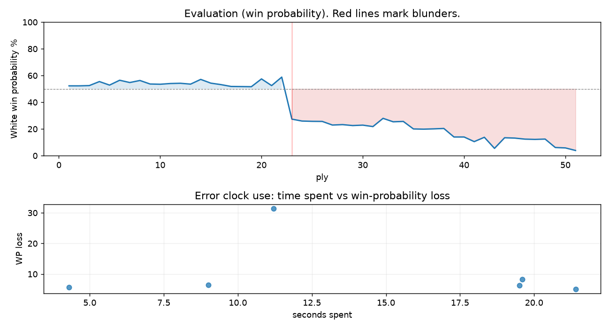

# (free, so lmk) Game analysis: DanielKetterer vs alive6716

Date: 2026.07.27  |  Time control: rapid (1800)  |  You played: white
Game ID: 586795ea-89b7-11f1-9b48-c227dc01000f
Analysis: depth=24 multipv=3 findability=honest floor=6 stable_run=3 threads=1 hash_mb=256 deterministic=True engine_id=Stockfish_18 generated=2026-07-27T17:48:36Z
Game end time UTC: 2026-07-27T12:49:52+00:00
Game: https://www.chess.com/game/live/172146706356

## Summary

- Lichess accuracy: you 81.3%, opponent 93.6%
- Opening: C41 Philidor Defense (theory followed through ply 5)
- First deviation from theory: ply 6, Opponent played 3... h6
- Your moves: 9 best, 5 excellent, 6 good, 5 inaccuracy, 0 mistake, 1 blunder

METRICS:

Best: The played move exactly matches Stockfish's top move

Excellent: A non-best move that loses 2 WP points or less.

Good: WP loss is over 2, but under 5 points; also used for losses under 20 when the position remains already decided.

Inaccuracy: WP loss is at least 5 but under 10 points.

Mistake: WP loss is at least 10 but under 20 points; also generally used when a forced mate is missed with under 10 points of WP loss.

Blunder: WP loss is 20 points or more, or a forced mate is missed with at least 10 points of WP loss.

See: https://support.chess.com/en/articles/8572705-how-are-moves-classified-what-is-a-blunder-or-brilliant-etc 

(Brillint, Great and Miss are rating subjective)
- Puzzles: 20 open, 0 solved

### Puzzle gate tally (this game)

Gates: category in ['brilliant_sacrifice', 'missed_tactic', 'allowed_tactic', 'endgame'], refute depth in [3, 8], best-vs-second WP gap >= 5. Refute bar per move: max(5, 0.6 x WP loss).

| outcome | errors |
|---|---|
| category:attention | 1 |
| category:positional | 2 |
| refute_too_deep | 1 |
| wp_gap_too_small | 2 |

Four gates pass at once or nothing is generated, so a zero here is a product of four pass rates rather than a fault. Read the binding gate off this table before changing any threshold.

### Sacrifices in the engine's line

Real sacrifices are listed but never served as puzzles: compensation that never resolves back into material has no gradable answer.

| Move | Offered | Kind | Quiet | Line ends | Verdict |
|---|---|---|---|---|---|
| 11 | -4.0 (piece) | sham | yes | +1.0 pawns | opening_ply |
| 12 | -5.0 (piece) | sham | yes | +0.0 pawns | obvious |
| 18 | -8.0 (piece) | sham | no | +1.0 pawns | eval_out_of_band |
| 22 | -4.0 (piece) | real | yes | -1.0 pawns | real_sacrifice_not_gradable |
| 25 | -9.0 (piece) | real | yes | -2.0 pawns | real_sacrifice_not_gradable |

## Biggest missed opportunity

You played 12.Nd2. Stockfish preferred Qg3, after which the main line runs 12. Qg3 Qe7 13. Na3 dxe4 14. dxe4 O-O-O. The evaluation crossed from equal to losing, which matters more than the raw number. Why it went wrong: motif: creates threat on e5. This was a judgment error rather than a missed tactic; compare the pawn structure and piece activity after both moves. The engine prefers this move from at or below depth 6, which is as shallow as this measurement resolves; it sits near the surface, a quiet move, but one whose point shows at a glance. Candidates considered by the engine: Qg3 (+0.97), a4 (+0.62), Re1 (+0.54).

## Critical positions

- Ply 23 (you), 12.Nd2: +0.97 -> -2.65 [evaluation crossed equal -> losing]
- Ply 24 (opponent), 12...d4: -2.65 -> -2.85 [only-move situation]
- Ply 26 (opponent), 13...cxd4: -2.88 -> -2.89 [only-move situation]
- Ply 28 (opponent), 14...exf4: -3.29 -> -3.24 [only-move situation]
- Ply 48 (opponent), 24...Bg5: -5.36 -> -5.30 [only-move situation]
- Ply 50 (opponent), 25...Be3: -7.41 -> -7.56 [only-move situation]

## Your errors, move by move

| Move | Class | Category | WP loss | Refute depth | Seconds spent | Pre-error eval |
|---|---|---|---:|---|---:|---|
| 11.Be3 | inaccuracy | allowed_tactic | 5% | 12 | 21 | balanced |
| 12.Nd2 | blunder | allowed_tactic | 31% | 5 | 11 | balanced |
| 18.e6 | inaccuracy | positional | 6% | 1 | 4 | losing |
| 20.f4 | inaccuracy | attention | 6% | 1 | 9 | losing |
| 22.h4 | inaccuracy | allowed_tactic | 8% | 8 | 20 | losing |
| 25.Qf2 | inaccuracy | positional | 6% | 11 | 20 | losing |

### 11.Be3 (inaccuracy, positional, wp loss 5%)

You played 11.Be3. Stockfish preferred Nd2, after which the main line runs 11. Nd2 Qd7 12. exd5 Qxd5 13. Qxd5 Nxd5. This was a judgment error rather than a missed tactic; compare the pawn structure and piece activity after both moves. The engine prefers this move from at or below depth 6, which is as shallow as this measurement resolves; it sits near the surface, a quiet move, but one whose point shows at a glance. Candidates considered by the engine: Nd2 (+0.82), Be3 (+0.19), Rd1 (+0.13).

### 12.Nd2 (blunder, positional, wp loss 31%)

You played 12.Nd2. Stockfish preferred Qg3, after which the main line runs 12. Qg3 Qe7 13. Na3 dxe4 14. dxe4 O-O-O. The evaluation crossed from equal to losing, which matters more than the raw number. Why it went wrong: motif: creates threat on e5. This was a judgment error rather than a missed tactic; compare the pawn structure and piece activity after both moves. The engine prefers this move from at or below depth 6, which is as shallow as this measurement resolves; it sits near the surface, a quiet move, but one whose point shows at a glance. Candidates considered by the engine: Qg3 (+0.97), a4 (+0.62), Re1 (+0.54).

### 18.e6 (inaccuracy, positional, wp loss 6%)

You played 18.e6. Stockfish preferred Qxb7, after which the main line runs 18. Qxb7 Nf4 19. Qf3 Ne6 20. Qg4 Nc5. Why it went wrong: a favorable capture was available (Qxb7). This was a judgment error rather than a missed tactic; compare the pawn structure and piece activity after both moves. The engine does not settle on this move until depth 17; reachable with real calculation, but not on a scan. Candidates considered by the engine: Qxb7 (-2.89), Nb3 (-3.06), Nf3 (-3.14).

### 20.f4 (inaccuracy, positional, wp loss 6%)

You played 20.f4. Stockfish preferred g3, after which the main line runs 20. g3 Nf6 21. Rac1 Re8 22. Nf3 Qd5. This was a judgment error rather than a missed tactic; compare the pawn structure and piece activity after both moves. The engine prefers this move from at or below depth 6, which is as shallow as this measurement resolves; it sits near the surface, a quiet move, but one whose point shows at a glance. Candidates considered by the engine: g3 (-3.70), Qe4 (-4.40), Qg4 (-4.46).

### 22.h4 (inaccuracy, positional, wp loss 8%)

You played 22.h4. Stockfish preferred Nf3, after which the main line runs 22. Nf3 Re8 23. Nxg5 hxg5 24. Qf3 Re3. Why it went wrong: left pawn on h4 insufficiently defended; motif: creates threat on b7. This was a judgment error rather than a missed tactic; compare the pawn structure and piece activity after both moves. The engine does not settle on this move until depth 15; reachable with real calculation, but not on a scan. Candidates considered by the engine: Nf3 (-4.98), Nc4 (-5.00), Kh1 (-5.20).

### 25.Qf2 (inaccuracy, positional, wp loss 6%)

You played 25.Qf2. Stockfish preferred Qf3, after which the main line runs 25. Qf3 Be3+ 26. Kh1 Qh4+ 27. Qh3 Qxh3+. Why it went wrong: motif: creates threat on b7. This was a judgment error rather than a missed tactic; compare the pawn structure and piece activity after both moves. The engine does not settle on this move until depth 24, which is outside what a human reasonably calculates over the board; this is not a training target. Candidates considered by the engine: Qf3 (-5.30), Qg3 (-5.38), Qg4 (-5.39).

## Full move table

| Ply | Move | Eval before | Eval after | Best | CP loss | WP loss | Class |
|-----|------|-------------|------------|------|---------|---------|-------|
| 1 | 1.e4* | +0.31 | +0.25 | e4 | 6 | 1% | best |
| 2 | 1...e5 | +0.25 | +0.25 | e5 | 0 | 0% | best |
| 3 | 2.Nf3* | +0.25 | +0.27 | Nf3 | 0 | 0% | best |
| 4 | 2...d6 | +0.27 | +0.60 | Nc6 | 33 | 3% | good |
| 5 | 3.Bc4* | +0.60 | +0.31 | d4 | 29 | 3% | good |
| 6 | 3...h6 | +0.31 | +0.71 | Be7 | 40 | 4% | good |
| 7 | 4.O-O* | +0.71 | +0.52 | d4 | 19 | 2% | excellent |
| 8 | 4...Bg4 | +0.52 | +0.69 | Nd7 | 17 | 2% | excellent |
| 9 | 5.Be2* | +0.69 | +0.40 | d4 | 29 | 3% | good |
| 10 | 5...Nf6 | +0.40 | +0.38 | Nd7 | 0 | 0% | excellent |
| 11 | 6.h3* | +0.38 | +0.44 | d4 | 0 | 0% | excellent |
| 12 | 6...Bxf3 | +0.44 | +0.46 | Bxf3 | 2 | 0% | best |
| 13 | 7.Bxf3* | +0.46 | +0.39 | Bxf3 | 7 | 1% | best |
| 14 | 7...Nc6 | +0.39 | +0.78 | Nbd7 | 39 | 4% | good |
| 15 | 8.d3* | +0.78 | +0.47 | c3 | 31 | 3% | good |
| 16 | 8...Nd4 | +0.47 | +0.35 | Nd4 | 0 | 0% | best |
| 17 | 9.c3* | +0.35 | +0.20 | Be3 | 15 | 1% | excellent |
| 18 | 9...Nxf3+ | +0.20 | +0.19 | Nxf3+ | 0 | 0% | best |
| 19 | 10.Qxf3* | +0.19 | +0.18 | Qxf3 | 1 | 0% | best |
| 20 | 10...d5 | +0.18 | +0.82 | Be7 | 64 | 6% | inaccuracy |
| 21 | 11.Be3* | +0.82 | +0.27 | Nd2 | 55 | 5% | inaccuracy |
| 22 | 11...c5 | +0.27 | +0.97 | dxe4 | 70 | 6% | inaccuracy |
| 23 | 12.Nd2* | +0.97 | -2.65 | Qg3 | 362 | 31% | blunder |
| 24 | 12...d4 | -2.65 | -2.85 | d4 | 0 | 0% | best |
| 25 | 13.cxd4* | -2.85 | -2.88 | cxd4 | 3 | 0% | best |
| 26 | 13...cxd4 | -2.88 | -2.89 | cxd4 | 0 | 0% | best |
| 27 | 14.Bf4* | -2.89 | -3.29 | Qf5 | 40 | 3% | good |
| 28 | 14...exf4 | -3.29 | -3.24 | exf4 | 5 | 0% | best |
| 29 | 15.Qxf4* | -3.24 | -3.35 | Qxf4 | 11 | 1% | best |
| 30 | 15...Be7 | -3.35 | -3.30 | Be7 | 5 | 0% | best |
| 31 | 16.e5* | -3.30 | -3.47 | Nf3 | 17 | 1% | excellent |
| 32 | 16...Nh5 | -3.47 | -2.57 | Nd7 | 90 | 6% | inaccuracy |
| 33 | 17.Qe4* | -2.57 | -2.93 | Qf3 | 36 | 3% | good |
| 34 | 17...O-O | -2.93 | -2.89 | O-O | 4 | 0% | best |
| 35 | 18.e6* | -2.89 | -3.76 | Qxb7 | 87 | 6% | inaccuracy |
| 36 | 18...fxe6 | -3.76 | -3.79 | Bd6 | 0 | 0% | excellent |
| 37 | 19.Qxe6+* | -3.79 | -3.75 | Qxe6+ | 0 | 0% | best |
| 38 | 19...Kh8 | -3.75 | -3.70 | Rf7 | 5 | 0% | excellent |
| 39 | 20.f4* | -3.70 | -4.93 | g3 | 123 | 6% | inaccuracy |
| 40 | 20...Nxf4 | -4.93 | -4.93 | Nxf4 | 0 | 0% | best |
| 41 | 21.Qe4* | -4.93 | -5.81 | Qg4 | 88 | 3% | good |
| 42 | 21...Bg5 | -5.81 | -4.98 | Bd6 | 83 | 3% | good |
| 43 | 22.h4* | -4.98 | -7.73 | Nf3 | 275 | 8% | inaccuracy |
| 44 | 22...Bxh4 | -7.73 | -5.06 | Ne2+ | 267 | 8% | inaccuracy |
| 45 | 23.Rxf4* | -5.06 | -5.12 | Rxf4 | 6 | 0% | best |
| 46 | 23...Rxf4 | -5.12 | -5.31 | Rxf4 | 0 | 0% | best |
| 47 | 24.Qxf4* | -5.31 | -5.36 | Qxf4 | 5 | 0% | best |
| 48 | 24...Bg5 | -5.36 | -5.30 | Bg5 | 6 | 0% | best |
| 49 | 25.Qf2* | -5.30 | -7.41 | Qf3 | 211 | 6% | inaccuracy |
| 50 | 25...Be3 | -7.41 | -7.56 | Be3 | 0 | 0% | best |
| 51 | 26.Rb1* | -7.56 | -8.70 | Nf3 | 114 | 2% | excellent |

Rows marked * are your moves. WP loss is win-probability loss; it is the primary signal, CP loss is shown for reference.

## Patterns in this game

- Error categories: 3 allowed_tactic, 1 attention, 2 positional.
- Attention errors per 100 moves: 3.8.
- Pre-error eval buckets: 0 winning, 2 balanced, 4 losing.
- Middlegame: 6 error(s) (avg wp loss 11%).
