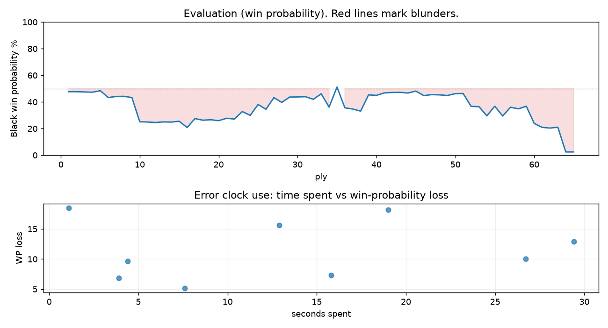

# (free, so lmk) Game analysis: Amit9908 vs DanielKetterer

Date: 2026.07.27  |  Time control: rapid (1800)  |  You played: black
Game ID: b9f65678-89b9-11f1-9b48-c227dc01000f
Analysis: depth=24 multipv=3 findability=honest floor=6 stable_run=3 threads=1 hash_mb=256 deterministic=True engine_id=Stockfish_18 generated=2026-07-27T18:03:27Z
Game end time UTC: 2026-07-27T13:02:17+00:00
Game: https://www.chess.com/game/live/172147390612

## Summary

- Lichess accuracy: you 81.1%, opponent 88.3%
- Opening: C46 Three Knights Opening (theory followed through ply 5)
- First deviation from theory: ply 6, You played 3... Bc5
- Your moves: 12 best, 6 excellent, 5 good, 4 inaccuracy, 5 mistake, 0 blunder

METRICS:

Best: The played move exactly matches Stockfish's top move

Excellent: A non-best move that loses 2 WP points or less.

Good: WP loss is over 2, but under 5 points; also used for losses under 20 when the position remains already decided.

Inaccuracy: WP loss is at least 5 but under 10 points.

Mistake: WP loss is at least 10 but under 20 points; also generally used when a forced mate is missed with under 10 points of WP loss.

Blunder: WP loss is 20 points or more, or a forced mate is missed with at least 10 points of WP loss.

See: https://support.chess.com/en/articles/8572705-how-are-moves-classified-what-is-a-blunder-or-brilliant-etc 

(Brillint, Great and Miss are rating subjective)
- Puzzles: 20 open, 0 solved

### Puzzle gate tally (this game)

Gates: category in ['brilliant_sacrifice', 'missed_tactic', 'allowed_tactic', 'endgame'], refute depth in [3, 8], best-vs-second WP gap >= 5. Refute bar per move: max(5, 0.6 x WP loss).

| outcome | errors |
|---|---|
| category:attention | 2 |
| category:positional | 2 |
| refute_censored_high | 1 |
| refute_too_deep | 1 |
| refute_too_shallow | 2 |
| wp_gap_too_small | 1 |

Four gates pass at once or nothing is generated, so a zero here is a product of four pass rates rather than a fault. Read the binding gate off this table before changing any threshold.

### Sacrifices in the engine's line

Real sacrifices are listed but never served as puzzles: compensation that never resolves back into material has no gradable answer.

| Move | Offered | Kind | Quiet | Line ends | Verdict |
|---|---|---|---|---|---|
| 3 | -3.0 (piece) | sham | yes | +0.0 pawns | opening_ply |
| 5 | -3.0 (piece) | real | yes | -2.0 pawns | real_sacrifice_not_gradable |
| 18 | -8.0 (piece) | sham | no | +0.0 pawns | puzzle |
| 27 | -4.0 (piece) | sham | yes | +1.0 pawns | puzzle |

## Biggest missed opportunity

You played 32...h5. Stockfish preferred Kf8, after which the main line runs 32...Kf8 33. Rd6 Bf5 34. Bc5 Ke8 35. Rb6. This was a judgment error rather than a missed tactic; compare the pawn structure and piece activity after both moves. The engine prefers this move from at or below depth 6, which is as shallow as this measurement resolves; it sits near the surface, a quiet move, but one whose point shows at a glance. Candidates considered by the engine: Kf8 (+3.60), Kh8 (+6.70), Rxc2+ (+7.47).

## Critical positions

- Ply 9 (opponent), 5.d4: +0.63 -> +0.73 [only-move situation]
- Ply 40 (you), 20...Qxd4: +0.51 -> +0.55 [only-move situation]
- Ply 42 (you), 21...Rxd4: +0.35 -> +0.31 [only-move situation]
- Ply 48 (you), 24...Rxe4: +0.49 -> +0.51 [only-move situation]
- Ply 51 (opponent), 26.Rxe1: +0.41 -> +0.40 [only-move situation]

## Your errors, move by move

| Move | Class | Category | WP loss | Refute depth | Seconds spent | Pre-error eval |
|---|---|---|---:|---|---:|---|
| 3...Bc5 | inaccuracy | allowed_tactic | 5% | >18 | 8 | balanced |
| 5...Nd3+ | mistake | attention | 18% | 2 | 19 | balanced |
| 17...Rad8 | mistake | positional | 10% | 8 | 27 | balanced |
| 18...Bf5 | mistake | brilliant_sacrifice | 16% | 3 | 13 | balanced |
| 26...Rd5 | inaccuracy | allowed_tactic | 10% | 1 | 4 | balanced |
| 27...b5 | inaccuracy | brilliant_sacrifice | 7% | 2 | 4 | balanced |
| 28...Rd2 | inaccuracy | positional | 7% | 7 | 16 | balanced |
| 30...h6 | mistake | missed_tactic | 13% | 12 | 29 | balanced |
| 32...h5 | mistake | attention | 19% | 2 | 1 | losing |

### 3...Bc5 (inaccuracy, positional, wp loss 5%)

You played 3...Bc5. Stockfish preferred Nf6, after which the main line runs 3...Nf6 4. d4 exd4 5. Nxd4 Bb4 6. Nxc6. This was a judgment error rather than a missed tactic; compare the pawn structure and piece activity after both moves. The engine prefers this move from at or below depth 6, which is as shallow as this measurement resolves; it sits near the surface, a quiet move, but one whose point shows at a glance. Candidates considered by the engine: Nf6 (+0.17), d6 (+0.61), Bb4 (+0.64).

### 5...Nd3+ (mistake, tactical, wp loss 18%)

You played 5...Nd3+. Stockfish preferred Bd6, after which the main line runs 5...Bd6 6. dxe5 Bxe5 7. Bd3 Nf6 8. O-O. The evaluation crossed from equal to losing, which matters more than the raw number. Why it went wrong: left bishop on c5, knight on d3 insufficiently defended. Before committing to a quiet move here, the checklist is checks, captures, threats, in that order. The engine prefers this move from at or below depth 6, which is as shallow as this measurement resolves; it sits near the surface, a forcing move, the kind a checks-and-captures scan catches. Candidates considered by the engine: Bd6 (+0.73), Bxd4 (+1.78), Bb4 (+1.92).

### 17...Rad8 (mistake, positional, wp loss 10%)

You played 17...Rad8. Stockfish preferred a5, after which the main line runs 17...a5 18. h5 h6 19. Qc5 Qd7 20. Kb2. This was a judgment error rather than a missed tactic; compare the pawn structure and piece activity after both moves. The engine first prefers this move at depth 10 and holds it; findable, but it takes a deliberate look rather than a scan. Candidates considered by the engine: a5 (+0.42), h5 (+0.76), Rfc8 (+0.83).

### 18...Bf5 (mistake, tactical, wp loss 16%)

You played 18...Bf5. Stockfish preferred exf3, after which the main line runs 18...exf3 19. gxf3 Qxd4 20. Qxd4 Rxd4 21. Be3. Before committing to a quiet move here, the checklist is checks, captures, threats, in that order. The engine first prefers this move at depth 8 and holds it; findable, but it takes a deliberate look rather than a scan. Candidates considered by the engine: exf3 (-0.13), Qxd4 (+0.27), h5 (+0.48).

### 26...Rd5 (inaccuracy, positional, wp loss 10%)

You played 26...Rd5. Stockfish preferred Rd2, after which the main line runs 26...Rd2 27. Kc1 Rg2 28. Rd1 h6 29. gxh6. Why it went wrong: left pawn on a7 insufficiently defended. This was a judgment error rather than a missed tactic; compare the pawn structure and piece activity after both moves. The engine does not settle on this move until depth 16; reachable with real calculation, but not on a scan. Candidates considered by the engine: Rd2 (+0.40), b6 (+0.86), a5 (+0.93).

### 27...b5 (inaccuracy, positional, wp loss 7%)

You played 27...b5. Stockfish preferred Bf5, after which the main line runs 27...Bf5 28. Re2 Bg4 29. Re4 Bxh5 30. a4. The evaluation crossed from equal to losing, which matters more than the raw number. This was a judgment error rather than a missed tactic; compare the pawn structure and piece activity after both moves. The engine first prefers this move at depth 8 and holds it; findable, but it takes a deliberate look rather than a scan. Candidates considered by the engine: Bf5 (+1.51), Rd2 (+1.67), Kf8 (+2.02).

### 28...Rd2 (inaccuracy, positional, wp loss 7%)

You played 28...Rd2. Stockfish preferred Kf8, after which the main line runs 28...Kf8 29. Kb2 Ke7 30. Bc5+ Kd7 31. Re3. The evaluation crossed from equal to losing, which matters more than the raw number. This was a judgment error rather than a missed tactic; compare the pawn structure and piece activity after both moves. The engine first prefers this move at depth 8 and holds it; findable, but it takes a deliberate look rather than a scan. Candidates considered by the engine: Kf8 (+1.47), Bg4 (+1.96), g6 (+1.97).

### 30...h6 (mistake, tactical, wp loss 13%)

You played 30...h6. Stockfish preferred Kf8, after which the main line runs 30...Kf8 31. Rd8+ Ke7 32. Rb8 Bc4 33. Bc5+. The evaluation crossed from equal to losing, which matters more than the raw number. Why it went wrong: motif: creates threat on h5. Before committing to a quiet move here, the checklist is checks, captures, threats, in that order. The engine prefers this move from at or below depth 6, which is as shallow as this measurement resolves; it sits near the surface, a forcing move, the kind a checks-and-captures scan catches. Candidates considered by the engine: Kf8 (+1.47), h6 (+2.90), f5 (+3.78).

### 32...h5 (mistake, positional, wp loss 19%)

You played 32...h5. Stockfish preferred Kf8, after which the main line runs 32...Kf8 33. Rd6 Bf5 34. Bc5 Ke8 35. Rb6. This was a judgment error rather than a missed tactic; compare the pawn structure and piece activity after both moves. The engine prefers this move from at or below depth 6, which is as shallow as this measurement resolves; it sits near the surface, a quiet move, but one whose point shows at a glance. Candidates considered by the engine: Kf8 (+3.60), Kh8 (+6.70), Rxc2+ (+7.47).

## Full move table

| Ply | Move | Eval before | Eval after | Best | CP loss | WP loss | Class |
|-----|------|-------------|------------|------|---------|---------|-------|
| 1 | 1.e4 | +0.31 | +0.25 | e4 | 6 | 1% | best |
| 2 | 1...e5* | +0.25 | +0.25 | e5 | 0 | 0% | best |
| 3 | 2.Nf3 | +0.25 | +0.27 | Nf3 | 0 | 0% | best |
| 4 | 2...Nc6* | +0.27 | +0.29 | Nc6 | 2 | 0% | best |
| 5 | 3.Nc3 | +0.29 | +0.17 | Bc4 | 12 | 1% | excellent |
| 6 | 3...Bc5* | +0.17 | +0.73 | Nf6 | 56 | 5% | inaccuracy |
| 7 | 4.Nxe5 | +0.73 | +0.64 | Nxe5 | 9 | 1% | best |
| 8 | 4...Nxe5* | +0.64 | +0.63 | Nxe5 | 0 | 0% | best |
| 9 | 5.d4 | +0.63 | +0.73 | d4 | 0 | 0% | best |
| 10 | 5...Nd3+* | +0.73 | +2.97 | Bd6 | 224 | 18% | mistake |
| 11 | 6.Qxd3 | +2.97 | +2.99 | Qxd3 | 0 | 0% | best |
| 12 | 6...Bb4* | +2.99 | +3.05 | Bb6 | 6 | 0% | excellent |
| 13 | 7.a3 | +3.05 | +2.98 | Qg3 | 7 | 0% | excellent |
| 14 | 7...Bxc3+* | +2.98 | +3.00 | Bxc3+ | 2 | 0% | best |
| 15 | 8.Qxc3 | +3.00 | +2.91 | Qxc3 | 9 | 1% | best |
| 16 | 8...Nf6* | +2.91 | +3.63 | d6 | 72 | 5% | good |
| 17 | 9.Bd3 | +3.63 | +2.63 | e5 | 100 | 7% | inaccuracy |
| 18 | 9...d5* | +2.63 | +2.80 | O-O | 17 | 1% | excellent |
| 19 | 10.e5 | +2.80 | +2.75 | e5 | 5 | 0% | best |
| 20 | 10...Ne4* | +2.75 | +2.85 | Ne4 | 10 | 1% | best |
| 21 | 11.Bxe4 | +2.85 | +2.60 | Qb3 | 25 | 2% | excellent |
| 22 | 11...dxe4* | +2.60 | +2.68 | dxe4 | 8 | 1% | best |
| 23 | 12.Bf4 | +2.68 | +1.95 | Qg3 | 73 | 6% | inaccuracy |
| 24 | 12...Qd5* | +1.95 | +2.31 | O-O | 36 | 3% | good |
| 25 | 13.O-O-O | +2.31 | +1.32 | Qxc7 | 99 | 8% | inaccuracy |
| 26 | 13...c6* | +1.32 | +1.74 | Be6 | 42 | 4% | good |
| 27 | 14.Kb1 | +1.74 | +0.74 | Qg3 | 100 | 9% | inaccuracy |
| 28 | 14...Bg4* | +0.74 | +1.14 | Be6 | 40 | 4% | good |
| 29 | 15.Rde1 | +1.14 | +0.69 | Rd2 | 45 | 4% | good |
| 30 | 15...Be6* | +0.69 | +0.68 | Be6 | 0 | 0% | best |
| 31 | 16.b3 | +0.68 | +0.66 | b3 | 2 | 0% | best |
| 32 | 16...O-O* | +0.66 | +0.88 | a5 | 22 | 2% | excellent |
| 33 | 17.h4 | +0.88 | +0.42 | Kb2 | 46 | 4% | good |
| 34 | 17...Rad8* | +0.42 | +1.55 | a5 | 113 | 10% | mistake |
| 35 | 18.f3 | +1.55 | -0.13 | Bg5 | 168 | 15% | mistake |
| 36 | 18...Bf5* | -0.13 | +1.61 | exf3 | 174 | 16% | mistake |
| 37 | 19.g4 | +1.61 | +1.72 | g4 | 0 | 0% | best |
| 38 | 19...Be6* | +1.72 | +1.91 | Be6 | 19 | 2% | best |
| 39 | 20.fxe4 | +1.91 | +0.51 | Rxe4 | 140 | 12% | mistake |
| 40 | 20...Qxd4* | +0.51 | +0.55 | Qxd4 | 4 | 0% | best |
| 41 | 21.Qxd4 | +0.55 | +0.35 | Qf3 | 20 | 2% | excellent |
| 42 | 21...Rxd4* | +0.35 | +0.31 | Rxd4 | 0 | 0% | best |
| 43 | 22.g5 | +0.31 | +0.30 | h5 | 1 | 0% | excellent |
| 44 | 22...Rfd8* | +0.30 | +0.36 | b6 | 6 | 1% | excellent |
| 45 | 23.h5 | +0.36 | +0.20 | Be3 | 16 | 1% | excellent |
| 46 | 23...c5* | +0.20 | +0.57 | b6 | 37 | 3% | good |
| 47 | 24.Be3 | +0.57 | +0.49 | Be3 | 8 | 1% | best |
| 48 | 24...Rxe4* | +0.49 | +0.51 | Rxe4 | 2 | 0% | best |
| 49 | 25.Bxc5 | +0.51 | +0.56 | Bxc5 | 0 | 0% | best |
| 50 | 25...Rxe1+* | +0.56 | +0.41 | Rg4 | 0 | 0% | excellent |
| 51 | 26.Rxe1 | +0.41 | +0.40 | Rxe1 | 1 | 0% | best |
| 52 | 26...Rd5* | +0.40 | +1.48 | Rd2 | 108 | 10% | inaccuracy |
| 53 | 27.Bxa7 | +1.48 | +1.51 | Bxa7 | 0 | 0% | best |
| 54 | 27...b5* | +1.51 | +2.35 | Bf5 | 84 | 7% | inaccuracy |
| 55 | 28.b4 | +2.35 | +1.47 | Kb2 | 88 | 7% | inaccuracy |
| 56 | 28...Rd2* | +1.47 | +2.37 | Kf8 | 90 | 7% | inaccuracy |
| 57 | 29.Kc1 | +2.37 | +1.56 | Bc5 | 81 | 7% | inaccuracy |
| 58 | 29...Rh2* | +1.56 | +1.70 | Rg2 | 14 | 1% | excellent |
| 59 | 30.Rd1 | +1.70 | +1.47 | a4 | 23 | 2% | excellent |
| 60 | 30...h6* | +1.47 | +3.15 | Kf8 | 168 | 13% | mistake |
| 61 | 31.g6 | +3.15 | +3.61 | g6 | 0 | 0% | best |
| 62 | 31...fxg6* | +3.61 | +3.70 | fxg6 | 9 | 1% | best |
| 63 | 32.hxg6 | +3.70 | +3.60 | hxg6 | 10 | 1% | best |
| 64 | 32...h5* | +3.60 | M1 | Kf8 |  | 19% | mistake |
| 65 | 33.Rd8# | M1 | M1 | Rd8# |  | 0% | best |

Rows marked * are your moves. WP loss is win-probability loss; it is the primary signal, CP loss is shown for reference.

## Patterns in this game

- Error categories: 2 allowed_tactic, 2 attention, 2 brilliant_sacrifice, 1 missed_tactic, 2 positional.
- Attention errors per 100 moves: 6.2.
- Pre-error eval buckets: 0 winning, 8 balanced, 1 losing.
- Opening: 2 error(s) (avg wp loss 12%).
- Middlegame: 6 error(s) (avg wp loss 10%).
- Endgame: 1 error(s) (avg wp loss 19%).
