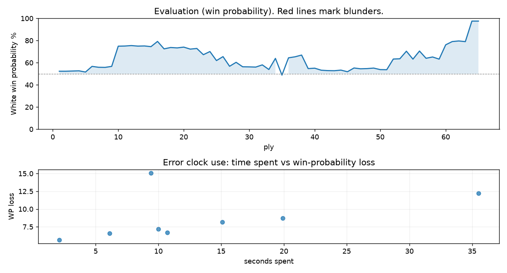

# (free, so lmk) Game analysis: Amit9908 vs DanielKetterer

Date: 2026.07.27  |  Time control: rapid (1800)  |  You played: white
Game ID: b9f65678-89b9-11f1-9b48-c227dc01000f
Analysis: depth=24 multipv=3 findability=honest floor=6 stable_run=3 threads=1 hash_mb=256 deterministic=True engine_id=Stockfish_18 generated=2026-07-27T18:03:27Z
Game end time UTC: 2026-07-27T13:02:17+00:00
Game: https://www.chess.com/game/live/172147390612

## Summary

- Lichess accuracy: you 88.3%, opponent 81.1%
- Opening: C46 Three Knights Opening (theory followed through ply 5)
- First deviation from theory: ply 6, Opponent played 3... Bc5
- Your moves: 16 best, 7 excellent, 2 good, 6 inaccuracy, 2 mistake, 0 blunder

METRICS:

Best: The played move exactly matches Stockfish's top move

Excellent: A non-best move that loses 2 WP points or less.

Good: WP loss is over 2, but under 5 points; also used for losses under 20 when the position remains already decided.

Inaccuracy: WP loss is at least 5 but under 10 points.

Mistake: WP loss is at least 10 but under 20 points; also generally used when a forced mate is missed with under 10 points of WP loss.

Blunder: WP loss is 20 points or more, or a forced mate is missed with at least 10 points of WP loss.

See: https://support.chess.com/en/articles/8572705-how-are-moves-classified-what-is-a-blunder-or-brilliant-etc 

(Brillint, Great and Miss are rating subjective)
- Puzzles: 20 open, 0 solved

### Puzzle gate tally (this game)

Gates: category in ['brilliant_sacrifice', 'missed_tactic', 'allowed_tactic', 'endgame'], refute depth in [3, 8], best-vs-second WP gap >= 5. Refute bar per move: max(5, 0.6 x WP loss).

| outcome | errors |
|---|---|
| category:attention | 2 |
| category:opening | 1 |
| category:positional | 4 |
| wp_gap_too_small | 1 |

Four gates pass at once or nothing is generated, so a zero here is a product of four pass rates rather than a fault. Read the binding gate off this table before changing any threshold.

### Sacrifices in the engine's line

Real sacrifices are listed but never served as puzzles: compensation that never resolves back into material has no gradable answer.

| Move | Offered | Kind | Quiet | Line ends | Verdict |
|---|---|---|---|---|---|
| 18 | -8.0 (piece) | sham | yes | +1.0 pawns | puzzle |
| 20 | -9.0 (piece) | sham | no | +0.0 pawns | obvious |
| 28 | -2.0 (exchange) | real | yes | -1.0 pawns | real_sacrifice_not_gradable |
| 29 | -2.0 (exchange) | real | yes | -2.0 pawns | real_sacrifice_not_gradable |

## Biggest missed opportunity

You played 18.f3. Stockfish preferred Bg5, after which the main line runs 18. Bg5 Rd7 19. Qg3 h5 20. Bf6 g6. Why it went wrong: motif: creates threat on d8. This was a judgment error rather than a missed tactic; compare the pawn structure and piece activity after both moves. The engine never settles on this move within the analysis depth, so how findable it was is not measured here; weigh this one lightly. Candidates considered by the engine: Bg5 (+1.55), Qg3 (+1.53), h5 (+1.42).

## Critical positions

- Ply 9 (you), 5.d4: +0.63 -> +0.73 [only-move situation]
- Ply 40 (opponent), 20...Qxd4: +0.51 -> +0.55 [only-move situation]
- Ply 42 (opponent), 21...Rxd4: +0.35 -> +0.31 [only-move situation]
- Ply 48 (opponent), 24...Rxe4: +0.49 -> +0.51 [only-move situation]
- Ply 51 (you), 26.Rxe1: +0.41 -> +0.40 [only-move situation]

## Your errors, move by move

| Move | Class | Category | WP loss | Refute depth | Seconds spent | Pre-error eval |
|---|---|---|---:|---|---:|---|
| 9.Bd3 | inaccuracy | opening | 7% | >18 | 11 | winning |
| 12.Bf4 | inaccuracy | positional | 6% | 5 | 2 | winning |
| 13.O-O-O | inaccuracy | positional | 8% | 6 | 15 | winning |
| 14.Kb1 | inaccuracy | positional | 9% | 11 | 20 | winning |
| 18.f3 | mistake | brilliant_sacrifice | 15% | 4 | 9 | balanced |
| 20.fxe4 | mistake | attention | 12% | 2 | 36 | winning |
| 28.b4 | inaccuracy | attention | 7% | 1 | 10 | winning |
| 29.Kc1 | inaccuracy | positional | 7% | 16 | 6 | winning |

### 9.Bd3 (inaccuracy, positional, wp loss 7%)

You played 9.Bd3. Stockfish preferred e5, after which the main line runs 9. e5 Ng8 10. Qg3 Kf8 11. Bd3 d5. Why it went wrong: motif: creates threat on f6. This was a judgment error rather than a missed tactic; compare the pawn structure and piece activity after both moves. The engine first prefers this move at depth 7 and holds it; findable, but it takes a deliberate look rather than a scan. Candidates considered by the engine: e5 (+3.63), Qg3 (+2.98), d5 (+2.80).

### 12.Bf4 (inaccuracy, positional, wp loss 6%)

You played 12.Bf4. Stockfish preferred Qg3, after which the main line runs 12. Qg3 Kf8 13. O-O Be6 14. Be3 c6. Why it went wrong: motif: creates threat on g7. This was a judgment error rather than a missed tactic; compare the pawn structure and piece activity after both moves. The engine prefers this move from at or below depth 6, which is as shallow as this measurement resolves; it sits near the surface, a quiet move, but one whose point shows at a glance. Candidates considered by the engine: Qg3 (+2.68), b3 (+2.07), a4 (+2.05).

### 13.O-O-O (inaccuracy, positional, wp loss 8%)

You played 13.O-O-O. Stockfish preferred Qxc7, after which the main line runs 13. Qxc7 Bg4 14. Qc3 O-O 15. O-O Rfc8. The evaluation crossed from winning to equal, which matters more than the raw number. Why it went wrong: a favorable capture was available (Qxc7). This was a judgment error rather than a missed tactic; compare the pawn structure and piece activity after both moves. The engine prefers this move from at or below depth 6, which is as shallow as this measurement resolves; it sits near the surface, a quiet move, but one whose point shows at a glance. Candidates considered by the engine: Qxc7 (+2.31), O-O (+2.10), b3 (+1.90).

### 14.Kb1 (inaccuracy, positional, wp loss 9%)

You played 14.Kb1. Stockfish preferred Qg3, after which the main line runs 14. Qg3 Rg8 15. b3 b5 16. Qh4 h6. The evaluation crossed from winning to equal, which matters more than the raw number. Why it went wrong: motif: creates threat on g7. This was a judgment error rather than a missed tactic; compare the pawn structure and piece activity after both moves. The engine first prefers this move at depth 7 and holds it; findable, but it takes a deliberate look rather than a scan. Candidates considered by the engine: Qg3 (+1.74), b3 (+1.60), a4 (+1.41).

### 18.f3 (mistake, positional, wp loss 15%)

You played 18.f3. Stockfish preferred Bg5, after which the main line runs 18. Bg5 Rd7 19. Qg3 h5 20. Bf6 g6. Why it went wrong: motif: creates threat on d8. This was a judgment error rather than a missed tactic; compare the pawn structure and piece activity after both moves. The engine never settles on this move within the analysis depth, so how findable it was is not measured here; weigh this one lightly. Candidates considered by the engine: Bg5 (+1.55), Qg3 (+1.53), h5 (+1.42).

### 20.fxe4 (mistake, tactical, wp loss 12%)

You played 20.fxe4. Stockfish preferred Rxe4, after which the main line runs 20. Rxe4 a5 21. Bg5 Rde8 22. Qd2 a4. The evaluation crossed from winning to equal, which matters more than the raw number. Why it went wrong: left pawn on g4 insufficiently defended. Before committing to a quiet move here, the checklist is checks, captures, threats, in that order. The engine prefers this move from at or below depth 6, which is as shallow as this measurement resolves; it sits near the surface, a forcing move, the kind a checks-and-captures scan catches. Candidates considered by the engine: Rxe4 (+1.91), fxe4 (+0.83), Bg5 (+0.22).

### 28.b4 (inaccuracy, positional, wp loss 7%)

You played 28.b4. Stockfish preferred Kb2, after which the main line runs 28. Kb2 Rd2 29. Kc3 Rh2 30. Bc5 Rxh5. The evaluation crossed from winning to equal, which matters more than the raw number. This was a judgment error rather than a missed tactic; compare the pawn structure and piece activity after both moves. The engine prefers this move from at or below depth 6, which is as shallow as this measurement resolves; it sits near the surface, a quiet move, but one whose point shows at a glance. Candidates considered by the engine: Kb2 (+2.35), Re3 (+2.03), Kc1 (+1.96).

### 29.Kc1 (inaccuracy, positional, wp loss 7%)

You played 29.Kc1. Stockfish preferred Bc5, after which the main line runs 29. Bc5 Bf5 30. Rc1 h6 31. gxh6 gxh6. The evaluation crossed from winning to equal, which matters more than the raw number. This was a judgment error rather than a missed tactic; compare the pawn structure and piece activity after both moves. The engine never settles on this move within the analysis depth, so how findable it was is not measured here; weigh this one lightly. Candidates considered by the engine: Bc5 (+2.37), Re3 (+2.17), Be3 (+1.74).

## Full move table

| Ply | Move | Eval before | Eval after | Best | CP loss | WP loss | Class |
|-----|------|-------------|------------|------|---------|---------|-------|
| 1 | 1.e4* | +0.31 | +0.25 | e4 | 6 | 1% | best |
| 2 | 1...e5 | +0.25 | +0.25 | e5 | 0 | 0% | best |
| 3 | 2.Nf3* | +0.25 | +0.27 | Nf3 | 0 | 0% | best |
| 4 | 2...Nc6 | +0.27 | +0.29 | Nc6 | 2 | 0% | best |
| 5 | 3.Nc3* | +0.29 | +0.17 | Bc4 | 12 | 1% | excellent |
| 6 | 3...Bc5 | +0.17 | +0.73 | Nf6 | 56 | 5% | inaccuracy |
| 7 | 4.Nxe5* | +0.73 | +0.64 | Nxe5 | 9 | 1% | best |
| 8 | 4...Nxe5 | +0.64 | +0.63 | Nxe5 | 0 | 0% | best |
| 9 | 5.d4* | +0.63 | +0.73 | d4 | 0 | 0% | best |
| 10 | 5...Nd3+ | +0.73 | +2.97 | Bd6 | 224 | 18% | mistake |
| 11 | 6.Qxd3* | +2.97 | +2.99 | Qxd3 | 0 | 0% | best |
| 12 | 6...Bb4 | +2.99 | +3.05 | Bb6 | 6 | 0% | excellent |
| 13 | 7.a3* | +3.05 | +2.98 | Qg3 | 7 | 0% | excellent |
| 14 | 7...Bxc3+ | +2.98 | +3.00 | Bxc3+ | 2 | 0% | best |
| 15 | 8.Qxc3* | +3.00 | +2.91 | Qxc3 | 9 | 1% | best |
| 16 | 8...Nf6 | +2.91 | +3.63 | d6 | 72 | 5% | good |
| 17 | 9.Bd3* | +3.63 | +2.63 | e5 | 100 | 7% | inaccuracy |
| 18 | 9...d5 | +2.63 | +2.80 | O-O | 17 | 1% | excellent |
| 19 | 10.e5* | +2.80 | +2.75 | e5 | 5 | 0% | best |
| 20 | 10...Ne4 | +2.75 | +2.85 | Ne4 | 10 | 1% | best |
| 21 | 11.Bxe4* | +2.85 | +2.60 | Qb3 | 25 | 2% | excellent |
| 22 | 11...dxe4 | +2.60 | +2.68 | dxe4 | 8 | 1% | best |
| 23 | 12.Bf4* | +2.68 | +1.95 | Qg3 | 73 | 6% | inaccuracy |
| 24 | 12...Qd5 | +1.95 | +2.31 | O-O | 36 | 3% | good |
| 25 | 13.O-O-O* | +2.31 | +1.32 | Qxc7 | 99 | 8% | inaccuracy |
| 26 | 13...c6 | +1.32 | +1.74 | Be6 | 42 | 4% | good |
| 27 | 14.Kb1* | +1.74 | +0.74 | Qg3 | 100 | 9% | inaccuracy |
| 28 | 14...Bg4 | +0.74 | +1.14 | Be6 | 40 | 4% | good |
| 29 | 15.Rde1* | +1.14 | +0.69 | Rd2 | 45 | 4% | good |
| 30 | 15...Be6 | +0.69 | +0.68 | Be6 | 0 | 0% | best |
| 31 | 16.b3* | +0.68 | +0.66 | b3 | 2 | 0% | best |
| 32 | 16...O-O | +0.66 | +0.88 | a5 | 22 | 2% | excellent |
| 33 | 17.h4* | +0.88 | +0.42 | Kb2 | 46 | 4% | good |
| 34 | 17...Rad8 | +0.42 | +1.55 | a5 | 113 | 10% | mistake |
| 35 | 18.f3* | +1.55 | -0.13 | Bg5 | 168 | 15% | mistake |
| 36 | 18...Bf5 | -0.13 | +1.61 | exf3 | 174 | 16% | mistake |
| 37 | 19.g4* | +1.61 | +1.72 | g4 | 0 | 0% | best |
| 38 | 19...Be6 | +1.72 | +1.91 | Be6 | 19 | 2% | best |
| 39 | 20.fxe4* | +1.91 | +0.51 | Rxe4 | 140 | 12% | mistake |
| 40 | 20...Qxd4 | +0.51 | +0.55 | Qxd4 | 4 | 0% | best |
| 41 | 21.Qxd4* | +0.55 | +0.35 | Qf3 | 20 | 2% | excellent |
| 42 | 21...Rxd4 | +0.35 | +0.31 | Rxd4 | 0 | 0% | best |
| 43 | 22.g5* | +0.31 | +0.30 | h5 | 1 | 0% | excellent |
| 44 | 22...Rfd8 | +0.30 | +0.36 | b6 | 6 | 1% | excellent |
| 45 | 23.h5* | +0.36 | +0.20 | Be3 | 16 | 1% | excellent |
| 46 | 23...c5 | +0.20 | +0.57 | b6 | 37 | 3% | good |
| 47 | 24.Be3* | +0.57 | +0.49 | Be3 | 8 | 1% | best |
| 48 | 24...Rxe4 | +0.49 | +0.51 | Rxe4 | 2 | 0% | best |
| 49 | 25.Bxc5* | +0.51 | +0.56 | Bxc5 | 0 | 0% | best |
| 50 | 25...Rxe1+ | +0.56 | +0.41 | Rg4 | 0 | 0% | excellent |
| 51 | 26.Rxe1* | +0.41 | +0.40 | Rxe1 | 1 | 0% | best |
| 52 | 26...Rd5 | +0.40 | +1.48 | Rd2 | 108 | 10% | inaccuracy |
| 53 | 27.Bxa7* | +1.48 | +1.51 | Bxa7 | 0 | 0% | best |
| 54 | 27...b5 | +1.51 | +2.35 | Bf5 | 84 | 7% | inaccuracy |
| 55 | 28.b4* | +2.35 | +1.47 | Kb2 | 88 | 7% | inaccuracy |
| 56 | 28...Rd2 | +1.47 | +2.37 | Kf8 | 90 | 7% | inaccuracy |
| 57 | 29.Kc1* | +2.37 | +1.56 | Bc5 | 81 | 7% | inaccuracy |
| 58 | 29...Rh2 | +1.56 | +1.70 | Rg2 | 14 | 1% | excellent |
| 59 | 30.Rd1* | +1.70 | +1.47 | a4 | 23 | 2% | excellent |
| 60 | 30...h6 | +1.47 | +3.15 | Kf8 | 168 | 13% | mistake |
| 61 | 31.g6* | +3.15 | +3.61 | g6 | 0 | 0% | best |
| 62 | 31...fxg6 | +3.61 | +3.70 | fxg6 | 9 | 1% | best |
| 63 | 32.hxg6* | +3.70 | +3.60 | hxg6 | 10 | 1% | best |
| 64 | 32...h5 | +3.60 | M1 | Kf8 |  | 19% | mistake |
| 65 | 33.Rd8#* | M1 | M1 | Rd8# |  | 0% | best |

Rows marked * are your moves. WP loss is win-probability loss; it is the primary signal, CP loss is shown for reference.

## Patterns in this game

- Error categories: 2 attention, 1 brilliant_sacrifice, 1 opening, 4 positional.
- Attention errors per 100 moves: 6.1.
- Pre-error eval buckets: 7 winning, 1 balanced, 0 losing.
- Opening: 1 error(s) (avg wp loss 7%).
- Middlegame: 7 error(s) (avg wp loss 9%).
