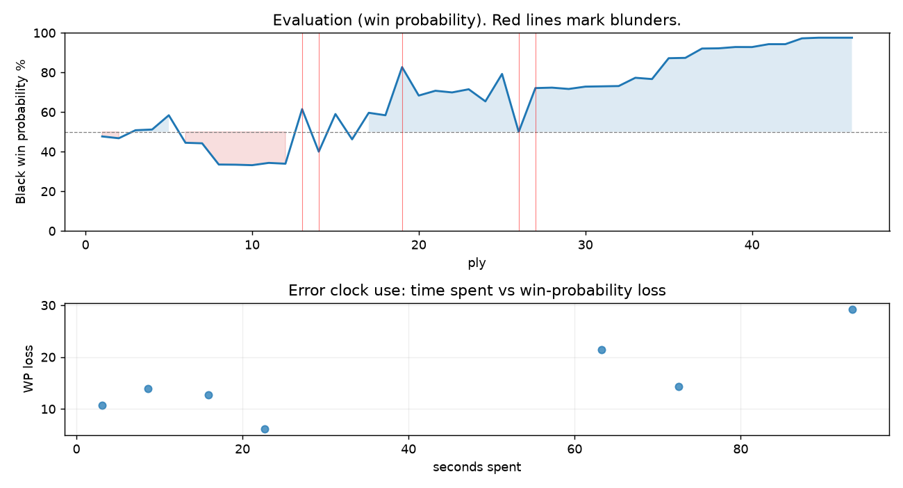

# (free, so lmk) Game analysis: DanielKetterer vs SkodaChess

Date: 2026.07.27  |  Time control: rapid (1800)  |  You played: black
Game ID: 6ebaee9c-89bb-11f1-9a9d-4a688f01000f
Analysis: depth=24 multipv=3 findability=honest floor=6 stable_run=3 threads=1 hash_mb=256 deterministic=True engine_id=Stockfish_18 generated=2026-07-27T18:16:39Z
Game end time UTC: 2026-07-27T13:20:10+00:00
Game: https://www.chess.com/game/live/172147882786

## Summary

- Lichess accuracy: you 72.6%, opponent 66.0%
- Opening: B20 Sicilian Defense: Bowdler Attack (theory followed through ply 3)
- First deviation from theory: ply 4, You played 2... e6
- Your moves: 14 best, 2 excellent, 0 good, 1 inaccuracy, 4 mistake, 2 blunder

METRICS:

Best: The played move exactly matches Stockfish's top move

Excellent: A non-best move that loses 2 WP points or less.

Good: WP loss is over 2, but under 5 points; also used for losses under 20 when the position remains already decided.

Inaccuracy: WP loss is at least 5 but under 10 points.

Mistake: WP loss is at least 10 but under 20 points; also generally used when a forced mate is missed with under 10 points of WP loss.

Blunder: WP loss is 20 points or more, or a forced mate is missed with at least 10 points of WP loss.

See: https://support.chess.com/en/articles/8572705-how-are-moves-classified-what-is-a-blunder-or-brilliant-etc 

(Brillint, Great and Miss are rating subjective)
- Puzzles: 22 open, 0 solved

### Puzzle gate tally (this game)

Gates: category in ['brilliant_sacrifice', 'missed_tactic', 'allowed_tactic', 'endgame'], refute depth in [3, 8], best-vs-second WP gap >= 5. Refute bar per move: max(5, 0.6 x WP loss).

| outcome | errors |
|---|---|
| accepted | 1 |
| category:attention | 3 |
| category:opening | 3 |

Four gates pass at once or nothing is generated, so a zero here is a product of four pass rates rather than a fault. Read the binding gate off this table before changing any threshold.

### Sacrifices in the engine's line

Real sacrifices are listed but never served as puzzles: compensation that never resolves back into material has no gradable answer.

| Move | Offered | Kind | Quiet | Line ends | Verdict |
|---|---|---|---|---|---|
| 3 | -2.0 (exchange) | sham | yes | +1.0 pawns | opening_ply |
| 8 | -4.0 (piece) | sham | yes | +1.0 pawns | opening_ply |
| 10 | -6.0 (piece) | sham | no | +2.0 pawns | opening_ply |
| 12 | -3.0 (piece) | sham | yes | +0.0 pawns | obvious |
| 13 | -2.0 (exchange) | sham | yes | +1.0 pawns | obvious |

## Biggest missed opportunity

You played 13...Be4. Stockfish preferred Ng6, after which the main line runs 13...Ng6 14. Be3 Nxe5 15. Rc3 Bb4 16. Bd2. The evaluation crossed from winning to equal, which matters more than the raw number. Why it went wrong: motif: creates threat on h6, e5. This was a judgment error rather than a missed tactic; compare the pawn structure and piece activity after both moves. The engine prefers this move from at or below depth 6, which is as shallow as this measurement resolves; it sits near the surface, a quiet move, but one whose point shows at a glance. Candidates considered by the engine: Ng6 (-3.64), g6 (-0.38), Be4 (-0.13).

## Critical positions

- Ply 7 (opponent), 4.Nf3: +0.60 -> +0.63 [only-move situation]
- Ply 9 (opponent), 5.Rg1: +1.86 -> +1.87 [only-move situation]
- Ply 13 (opponent), 7.Qd3: +1.81 -> -1.27 [evaluation crossed winning -> equal]
- Ply 14 (you), 7...Bc5: -1.27 -> +1.10
- Ply 19 (opponent), 10.O-O-O: -0.92 -> -4.25 [evaluation crossed equal -> losing]
- Ply 26 (you), 13...Be4: -3.64 -> +0.00 [only-move situation; evaluation crossed winning -> equal]
- Ply 27 (opponent), 14.Rdg3: +0.00 -> -2.58 [only-move situation; evaluation crossed equal -> losing]

## Your errors, move by move

| Move | Class | Category | WP loss | Refute depth | Seconds spent | Pre-error eval |
|---|---|---|---:|---|---:|---|
| 3...Qg5 | mistake | opening | 14% | 7 | 9 | balanced |
| 4...Qxg2 | mistake | opening | 11% | 8 | 3 | balanced |
| 7...Bc5 | blunder | attention | 21% | 1 | 63 | balanced |
| 8...b6 | mistake | opening | 13% | 3 | 16 | balanced |
| 10...Ne7 | mistake | missed_tactic | 14% | 3 | 72 | winning |
| 12...O-O | inaccuracy | attention | 6% | 1 | 23 | winning |
| 13...Be4 | blunder | attention | 29% | 1 | 93 | winning |

### 3...Qg5 (mistake, positional, wp loss 14%)

You played 3...Qg5. Stockfish preferred Nc6, after which the main line runs 3...Nc6 4. Nf3 Qc7 5. O-O Nxe5 6. Nxe5. Why it went wrong: motif: creates threat on e5. This was a judgment error rather than a missed tactic; compare the pawn structure and piece activity after both moves. The engine first prefers this move at depth 8 and holds it; findable, but it takes a deliberate look rather than a scan. Candidates considered by the engine: Nc6 (-0.92), Qc7 (-0.62), f6 (-0.46).

### 4...Qxg2 (mistake, tactical, wp loss 11%)

You played 4...Qxg2. Stockfish preferred Qd8, after which the main line runs 4...Qd8 5. c3 d6 6. O-O dxe5 7. Nxe5. The evaluation crossed from equal to losing, which matters more than the raw number. Before committing to a quiet move here, the checklist is checks, captures, threats, in that order. The engine prefers this move from at or below depth 6, which is as shallow as this measurement resolves; it sits near the surface, a forcing move, the kind a checks-and-captures scan catches. Candidates considered by the engine: Qd8 (+0.63), Qe7 (+0.80), Qg4 (+1.42).

### 7...Bc5 (blunder, tactical, wp loss 21%)

You played 7...Bc5. Stockfish preferred Nc6, after which the main line runs 7...Nc6 8. Rg3 Qh5 9. Rg5 Qh6 10. Na3. Why it went wrong: left pawn on g7 insufficiently defended. Before committing to a quiet move here, the checklist is checks, captures, threats, in that order. The engine prefers this move from at or below depth 6, which is as shallow as this measurement resolves; it sits near the surface, a forcing move, the kind a checks-and-captures scan catches. Candidates considered by the engine: Nc6 (-1.27), f6 (-0.95), a6 (-0.88).

### 8...b6 (mistake, tactical, wp loss 13%)

You played 8...b6. Stockfish preferred Ne7, after which the main line runs 8...Ne7 9. Nbd2 Ng6 10. Bg3 Nc6 11. O-O-O. Why it went wrong: left pawn on g7 insufficiently defended. Before committing to a quiet move here, the checklist is checks, captures, threats, in that order. The engine prefers this move from at or below depth 6, which is as shallow as this measurement resolves; it sits near the surface, a forcing move, the kind a checks-and-captures scan catches. Candidates considered by the engine: Ne7 (-0.99), g6 (-0.31), Nc6 (-0.12).

### 10...Ne7 (mistake, tactical, wp loss 14%)

You played 10...Ne7. Stockfish preferred Qxf3, after which the main line runs 10...Qxf3 11. Qxf3 Bxf3 12. Rd3 Bxa3 13. Rxa3. Why it went wrong: left pawn on g7 insufficiently defended. Before committing to a quiet move here, the checklist is checks, captures, threats, in that order. The engine prefers this move from at or below depth 6, which is as shallow as this measurement resolves; it sits near the surface, a forcing move, the kind a checks-and-captures scan catches. Candidates considered by the engine: Qxf3 (-4.25), Ne7 (-2.05), Bxf3 (-1.59).

### 12...O-O (inaccuracy, positional, wp loss 6%)

You played 12...O-O. Stockfish preferred Ng6, after which the main line runs 12...Ng6 13. Bg3 a6 14. h4 h5 15. Rd2. Why it went wrong: motif: creates threat on f4. This was a judgment error rather than a missed tactic; compare the pawn structure and piece activity after both moves. The engine prefers this move from at or below depth 6, which is as shallow as this measurement resolves; it sits near the surface, a quiet move, but one whose point shows at a glance. Candidates considered by the engine: Ng6 (-2.50), a6 (-2.25), Be4 (-1.87).

### 13...Be4 (blunder, positional, wp loss 29%)

You played 13...Be4. Stockfish preferred Ng6, after which the main line runs 13...Ng6 14. Be3 Nxe5 15. Rc3 Bb4 16. Bd2. The evaluation crossed from winning to equal, which matters more than the raw number. Why it went wrong: motif: creates threat on h6, e5. This was a judgment error rather than a missed tactic; compare the pawn structure and piece activity after both moves. The engine prefers this move from at or below depth 6, which is as shallow as this measurement resolves; it sits near the surface, a quiet move, but one whose point shows at a glance. Candidates considered by the engine: Ng6 (-3.64), g6 (-0.38), Be4 (-0.13).

## Full move table

| Ply | Move | Eval before | Eval after | Best | CP loss | WP loss | Class |
|-----|------|-------------|------------|------|---------|---------|-------|
| 1 | 1.e4 | +0.31 | +0.25 | e4 | 6 | 1% | best |
| 2 | 1...c5* | +0.25 | +0.35 | e5 | 10 | 1% | excellent |
| 3 | 2.Bc4 | +0.35 | -0.09 | Nc3 | 44 | 4% | good |
| 4 | 2...e6* | -0.09 | -0.13 | e6 | 0 | 0% | best |
| 5 | 3.e5 | -0.13 | -0.92 | Nf3 | 79 | 7% | inaccuracy |
| 6 | 3...Qg5* | -0.92 | +0.60 | Nc6 | 152 | 14% | mistake |
| 7 | 4.Nf3 | +0.60 | +0.63 | Nf3 | 0 | 0% | best |
| 8 | 4...Qxg2* | +0.63 | +1.86 | Qd8 | 123 | 11% | mistake |
| 9 | 5.Rg1 | +1.86 | +1.87 | Rg1 | 0 | 0% | best |
| 10 | 5...Qh3* | +1.87 | +1.90 | Qh3 | 3 | 0% | best |
| 11 | 6.d4 | +1.90 | +1.76 | Nc3 | 14 | 1% | excellent |
| 12 | 6...cxd4* | +1.76 | +1.81 | cxd4 | 5 | 0% | best |
| 13 | 7.Qd3 | +1.81 | -1.27 | Bf1 | 308 | 28% | blunder |
| 14 | 7...Bc5* | -1.27 | +1.10 | Nc6 | 237 | 21% | blunder |
| 15 | 8.Bf4 | +1.10 | -0.99 | Nbd2 | 209 | 19% | mistake |
| 16 | 8...b6* | -0.99 | +0.41 | Ne7 | 140 | 13% | mistake |
| 17 | 9.Na3 | +0.41 | -1.06 | a3 | 147 | 13% | mistake |
| 18 | 9...Bb7* | -1.06 | -0.92 | Ne7 | 14 | 1% | excellent |
| 19 | 10.O-O-O | -0.92 | -4.25 | Rg3 | 333 | 24% | blunder |
| 20 | 10...Ne7* | -4.25 | -2.09 | Qxf3 | 216 | 14% | mistake |
| 21 | 11.Nxd4 | -2.09 | -2.40 | Bg3 | 31 | 2% | good |
| 22 | 11...Qxd3* | -2.40 | -2.29 | Qxd3 | 11 | 1% | best |
| 23 | 12.Rxd3 | -2.29 | -2.50 | Rxd3 | 21 | 2% | best |
| 24 | 12...O-O* | -2.50 | -1.73 | Ng6 | 77 | 6% | inaccuracy |
| 25 | 13.Bh6 | -1.73 | -3.64 | Nab5 | 191 | 14% | mistake |
| 26 | 13...Be4* | -3.64 | +0.00 | Ng6 | 364 | 29% | blunder |
| 27 | 14.Rdg3 | +0.00 | -2.58 | Rxg7+ | 258 | 22% | blunder |
| 28 | 14...Bg6* | -2.58 | -2.61 | Bg6 | 0 | 0% | best |
| 29 | 15.Be3 | -2.61 | -2.52 | Be3 | 0 | 0% | best |
| 30 | 15...Bxd4* | -2.52 | -2.68 | Bxd4 | 0 | 0% | best |
| 31 | 16.Bxd4 | -2.68 | -2.70 | Bxd4 | 2 | 0% | best |
| 32 | 16...Nbc6* | -2.70 | -2.72 | Nbc6 | 0 | 0% | best |
| 33 | 17.c3 | -2.72 | -3.33 | Bc3 | 61 | 4% | good |
| 34 | 17...Nf5* | -3.33 | -3.23 | Nf5 | 10 | 1% | best |
| 35 | 18.Rd3 | -3.23 | -5.21 | Rg4 | 198 | 11% | mistake |
| 36 | 18...Nfxd4* | -5.21 | -5.25 | Nfxd4 | 0 | 0% | best |
| 37 | 19.Rd2 | -5.25 | -6.66 | Rxg6 | 141 | 5% | good |
| 38 | 19...Nf3* | -6.66 | -6.70 | Nf3 | 0 | 0% | best |
| 39 | 20.Rxg6 | -6.70 | -6.96 | Rg3 | 26 | 1% | excellent |
| 40 | 20...Nxd2* | -6.96 | -6.95 | Nxd2 | 1 | 0% | best |
| 41 | 21.Rxg7+ | -6.95 | -7.61 | Rg2 | 66 | 1% | excellent |
| 42 | 21...Kxg7* | -7.61 | -7.61 | Kxg7 | 0 | 0% | best |
| 43 | 22.Bxe6 | -7.61 | -9.65 | Kxd2 | 204 | 3% | good |
| 44 | 22...fxe6* | -9.65 | -10.47 | fxe6 | 0 | 0% | best |
| 45 | 23.Kxd2 | -10.47 | -12.85 | Kxd2 | 238 | 0% | best |
| 46 | 23...Rxf2+* | -12.85 | -12.71 | Rxf2+ | 14 | 0% | best |

Rows marked * are your moves. WP loss is win-probability loss; it is the primary signal, CP loss is shown for reference.

## Patterns in this game

- Error categories: 3 attention, 1 missed_tactic, 3 opening.
- Attention errors per 100 moves: 13.0.
- Pre-error eval buckets: 3 winning, 4 balanced, 0 losing.
- Opening: 5 error(s) (avg wp loss 15%).
- Middlegame: 2 error(s) (avg wp loss 18%).
