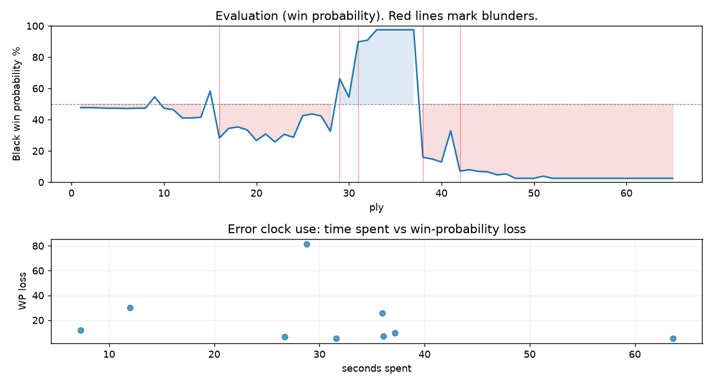

# (free, so lmk) Game analysis: Zhakentii vs DanielKetterer

Date: 2026.07.27  |  Time control: rapid (1800)  |  You played: black
Game ID: ec2c3458-89bd-11f1-a79f-19975b01000f
Analysis: depth=24 multipv=3 findability=honest floor=6 stable_run=3 threads=1 hash_mb=256 deterministic=True engine_id=Stockfish_18 generated=2026-07-27T14:40:11Z
Game end time UTC: 2026-07-27T13:37:25+00:00
Game: https://www.chess.com/game/live/172148616170

## Summary

- Lichess accuracy: you 47.1%, opponent 73.8%
- Opening: C50 Italian Game: Giuoco Pianissimo, Normal (theory followed through ply 8)
- First deviation from theory: ply 9, Opponent played 5. Ng5
- Your moves: 12 best, 10 excellent, 1 good, 5 inaccuracy, 1 mistake, 3 blunder

METRICS:

Best: The played move exactly matches Stockfish's top move

Excellent: A non-best move that loses 2 WP points or less.

Good: WP loss is over 2, but under 5 points; also used for losses under 20 when the position remains already decided.

Inaccuracy: WP loss is at least 5 but under 10 points.

Mistake: WP loss is at least 10 but under 20 points; also generally used when a forced mate is missed with under 10 points of WP loss.

Blunder: WP loss is 20 points or more, or a forced mate is missed with at least 10 points of WP loss.

See: https://support.chess.com/en/articles/8572705-how-are-moves-classified-what-is-a-blunder-or-brilliant-etc 

(Brillint, Great and Miss are rating subjective)
- Puzzles: 20 open, 0 solved

### Puzzle gate tally (this game)

Gates: category in ['brilliant_sacrifice', 'missed_tactic', 'allowed_tactic', 'endgame'], refute depth in [3, 8], best-vs-second WP gap >= 5. Refute bar per move: max(5, 0.6 x WP loss).

| outcome | errors |
|---|---|
| category:attention | 4 |
| category:opening | 2 |
| category:positional | 1 |
| refute_censored_high | 1 |
| refute_too_deep | 1 |

Four gates pass at once or nothing is generated, so a zero here is a product of four pass rates rather than a fault. Read the binding gate off this table before changing any threshold.

### Sacrifices in the engine's line

Real sacrifices are listed but never served as puzzles: compensation that never resolves back into material has no gradable answer.

| Move | Offered | Kind | Quiet | Line ends | Verdict |
|---|---|---|---|---|---|
| 5 | -3.0 (piece) | sham | yes | +5.0 pawns | opening_ply |
| 6 | -3.0 (piece) | real | yes | -1.0 pawns | real_sacrifice_not_gradable |
| 8 | -2.0 (exchange) | sham | no | +1.0 pawns | opening_ply |
| 10 | -2.0 (exchange) | sham | yes | +1.0 pawns | desperado |
| 11 | -2.0 (exchange) | sham | yes | +1.0 pawns | obvious |
| 14 | -9.0 (piece) | sham | yes | +0.0 pawns | obvious |

## Biggest missed opportunity

You played 19...Rg1+. Stockfish preferred Rxh6, after which the main line runs 19...Rxh6 20. Qf7+ Kxf7 21. Nd2 Rgh8 22. Rf2. The evaluation crossed from winning to losing, which matters more than the raw number. Why it went wrong: left rook on g1 insufficiently defended. Before committing to a quiet move here, the checklist is checks, captures, threats, in that order. The engine does not settle on this move until depth 16; reachable with real calculation, but not on a scan. Candidates considered by the engine: Rxh6 (-11.87), Be3 (-4.46), Rg5 (-2.25).

## Critical positions

- Ply 16 (you), 8...Be6: -0.91 -> +2.52 [evaluation crossed equal -> losing]
- Ply 26 (you), 13...gxf6: +0.82 -> +0.69 [only-move situation]
- Ply 29 (opponent), 15.g4: +1.98 -> -1.82 [evaluation crossed winning -> losing]
- Ply 31 (opponent), 16.Bxh6: -0.48 -> -5.90 [evaluation crossed equal -> losing]
- Ply 34 (you), 17...Rag8+: -10.39 -> -12.57 [only-move situation]
- Ply 38 (you), 19...Rg1+: -11.87 -> +4.52 [evaluation crossed winning -> losing]
- Ply 42 (you), 21...exf5: +1.94 -> +6.98 [only-move situation]

## Your errors, move by move

| Move | Class | Category | WP loss | Refute depth | Seconds spent | Pre-error eval |
|---|---|---|---:|---|---:|---|
| 5...d5 | inaccuracy | attention | 7% | 1 | 36 | balanced |
| 6...Nd4 | inaccuracy | opening | 5% | >18 | 32 | balanced |
| 8...Be6 | blunder | attention | 30% | 1 | 12 | balanced |
| 10...Qc8 | inaccuracy | opening | 7% | 5 | 27 | losing |
| 11...h6 | inaccuracy | allowed_tactic | 5% | >18 | 64 | losing |
| 14...Ke7 | inaccuracy | positional | 10% | 9 | 37 | balanced |
| 15...Rhg8 | mistake | attention | 12% | 2 | 7 | winning |
| 19...Rg1+ | blunder | missed_tactic | 82% | 12 | 29 | winning |
| 21...exf5 | blunder | attention | 26% | 1 | 36 | losing |

### 5...d5 (inaccuracy, positional, wp loss 7%)

You played 5...d5. Stockfish preferred O-O, after which the main line runs 5...O-O 6. a4 Ne7 7. Nf3 c6 8. Bb3. This was a judgment error rather than a missed tactic; compare the pawn structure and piece activity after both moves. The engine prefers this move from at or below depth 6, which is as shallow as this measurement resolves; it sits near the surface, a quiet move, but one whose point shows at a glance. Candidates considered by the engine: O-O (-0.50), d5 (+0.26), Rf8 (+0.77).

### 6...Nd4 (inaccuracy, positional, wp loss 5%)

You played 6...Nd4. Stockfish preferred Na5, after which the main line runs 6...Na5 7. Nc3 O-O 8. Nge4 Nxe4 9. Nxe4. This was a judgment error rather than a missed tactic; compare the pawn structure and piece activity after both moves. The engine prefers this move from at or below depth 6, which is as shallow as this measurement resolves; it sits near the surface, a quiet move, but one whose point shows at a glance. Candidates considered by the engine: Na5 (+0.39), b5 (+0.58), Nd4 (+0.92).

### 8...Be6 (blunder, tactical, wp loss 30%)

You played 8...Be6. Stockfish preferred Nxd6, after which the main line runs 8...Nxd6 9. Bb3 O-O 10. Nd2 Bf5 11. Qe2. The evaluation crossed from equal to losing, which matters more than the raw number. Why it went wrong: a favorable capture was available (Qxd6). Before committing to a quiet move here, the checklist is checks, captures, threats, in that order. The engine prefers this move from at or below depth 6, which is as shallow as this measurement resolves; it sits near the surface, a forcing move, the kind a checks-and-captures scan catches. Candidates considered by the engine: Nxd6 (-0.91), O-O (+0.05), Nh6 (+1.26).

### 10...Qc8 (inaccuracy, positional, wp loss 7%)

You played 10...Qc8. Stockfish preferred Qd5, after which the main line runs 10...Qd5 11. O-O O-O 12. Qe2 Bb6 13. Nd2. Why it went wrong: motif: creates threat on g2. This was a judgment error rather than a missed tactic; compare the pawn structure and piece activity after both moves. The engine does not settle on this move until depth 13; reachable with real calculation, but not on a scan. Candidates considered by the engine: Qd5 (+1.87), Qd7 (+2.25), Qd6 (+2.26).

### 11...h6 (inaccuracy, positional, wp loss 5%)

You played 11...h6. Stockfish preferred O-O, after which the main line runs 11...O-O 12. Qe2 Bd6 13. Nd2 h6 14. Ngf3. Why it went wrong: motif: creates threat on c7. This was a judgment error rather than a missed tactic; compare the pawn structure and piece activity after both moves. The engine prefers this move from at or below depth 6, which is as shallow as this measurement resolves; it sits near the surface, a quiet move, but one whose point shows at a glance. Candidates considered by the engine: O-O (+2.19), Bd6 (+2.79), Qd7 (+2.84).

### 14...Ke7 (inaccuracy, positional, wp loss 10%)

You played 14...Ke7. Stockfish preferred Qf7, after which the main line runs 14...Qf7 15. Qxf7+ Kxf7 16. Nd2 Rad8 17. Ne4. The evaluation crossed from equal to losing, which matters more than the raw number. Why it went wrong: motif: creates threat on h5. This was a judgment error rather than a missed tactic; compare the pawn structure and piece activity after both moves. The engine prefers this move from at or below depth 6, which is as shallow as this measurement resolves; it sits near the surface, a quiet move, but one whose point shows at a glance. Candidates considered by the engine: Qf7 (+0.84), Kd7 (+1.71), Ke7 (+1.93).

### 15...Rhg8 (mistake, tactical, wp loss 12%)

You played 15...Rhg8. Stockfish preferred Rag8, after which the main line runs 15...Rag8 16. b4 Bb6 17. b5 Qd7 18. Rd1. The evaluation crossed from winning to equal, which matters more than the raw number. Why it went wrong: left knight on f5 insufficiently defended. Before committing to a quiet move here, the checklist is checks, captures, threats, in that order. The engine prefers this move from at or below depth 6, which is as shallow as this measurement resolves; it sits near the surface, a forcing move, the kind a checks-and-captures scan catches. Candidates considered by the engine: Rag8 (-1.82), Rhg8 (-0.42), Qc6 (+0.00).

### 19...Rg1+ (blunder, tactical, wp loss 82%)

You played 19...Rg1+. Stockfish preferred Rxh6, after which the main line runs 19...Rxh6 20. Qf7+ Kxf7 21. Nd2 Rgh8 22. Rf2. The evaluation crossed from winning to losing, which matters more than the raw number. Why it went wrong: left rook on g1 insufficiently defended. Before committing to a quiet move here, the checklist is checks, captures, threats, in that order. The engine does not settle on this move until depth 16; reachable with real calculation, but not on a scan. Candidates considered by the engine: Rxh6 (-11.87), Be3 (-4.46), Rg5 (-2.25).

### 21...exf5 (blunder, tactical, wp loss 26%)

You played 21...exf5. Stockfish preferred Be3, after which the main line runs 21...Be3 22. fxe6 Qxe6 23. Bf8+ Rxf8 24. Ne4. Why it went wrong: left pawn on f5, bishop on g1 insufficiently defended; motif: fork; creates threat on d2. Before committing to a quiet move here, the checklist is checks, captures, threats, in that order. The engine prefers this move from at or below depth 6, which is as shallow as this measurement resolves; it sits near the surface, a forcing move, the kind a checks-and-captures scan catches. Candidates considered by the engine: Be3 (+1.94), Bxh2 (+4.65), Bb6 (+5.40).

## Full move table

| Ply | Move | Eval before | Eval after | Best | CP loss | WP loss | Class |
|-----|------|-------------|------------|------|---------|---------|-------|
| 1 | 1.e4 | +0.31 | +0.25 | e4 | 6 | 1% | best |
| 2 | 1...e5* | +0.25 | +0.25 | e5 | 0 | 0% | best |
| 3 | 2.Nf3 | +0.25 | +0.27 | Nf3 | 0 | 0% | best |
| 4 | 2...Nc6* | +0.27 | +0.29 | Nc6 | 2 | 0% | best |
| 5 | 3.Bc4 | +0.29 | +0.29 | Bc4 | 0 | 0% | best |
| 6 | 3...Nf6* | +0.29 | +0.31 | Nf6 | 2 | 0% | best |
| 7 | 4.d3 | +0.31 | +0.29 | d3 | 2 | 0% | best |
| 8 | 4...Bc5* | +0.29 | +0.29 | Be7 | 0 | 0% | excellent |
| 9 | 5.Ng5 | +0.29 | -0.50 | O-O | 79 | 7% | inaccuracy |
| 10 | 5...d5* | -0.50 | +0.29 | O-O | 79 | 7% | inaccuracy |
| 11 | 6.exd5 | +0.29 | +0.39 | exd5 | 0 | 0% | best |
| 12 | 6...Nd4* | +0.39 | +0.98 | Na5 | 59 | 5% | inaccuracy |
| 13 | 7.c3 | +0.98 | +0.98 | c3 | 0 | 0% | best |
| 14 | 7...Nf5* | +0.98 | +0.92 | Nf5 | 0 | 0% | best |
| 15 | 8.d6 | +0.92 | -0.91 | Nd2 | 183 | 17% | mistake |
| 16 | 8...Be6* | -0.91 | +2.52 | Nxd6 | 343 | 30% | blunder |
| 17 | 9.Bxe6 | +2.52 | +1.75 | dxc7 | 77 | 6% | inaccuracy |
| 18 | 9...fxe6* | +1.75 | +1.64 | fxe6 | 0 | 0% | best |
| 19 | 10.dxc7 | +1.64 | +1.87 | dxc7 | 0 | 0% | best |
| 20 | 10...Qc8* | +1.87 | +2.75 | Qd5 | 88 | 7% | inaccuracy |
| 21 | 11.O-O | +2.75 | +2.19 | Qb3 | 56 | 4% | good |
| 22 | 11...h6* | +2.19 | +2.88 | O-O | 69 | 5% | inaccuracy |
| 23 | 12.Ne4 | +2.88 | +2.22 | Qa4+ | 66 | 5% | good |
| 24 | 12...Qxc7* | +2.22 | +2.47 | Bb6 | 25 | 2% | excellent |
| 25 | 13.Nxf6+ | +2.47 | +0.82 | Qb3 | 165 | 14% | mistake |
| 26 | 13...gxf6* | +0.82 | +0.69 | gxf6 | 0 | 0% | best |
| 27 | 14.Qh5+ | +0.69 | +0.84 | Qh5+ | 0 | 0% | best |
| 28 | 14...Ke7* | +0.84 | +1.98 | Qf7 | 114 | 10% | inaccuracy |
| 29 | 15.g4 | +1.98 | -1.82 | Nd2 | 380 | 34% | blunder |
| 30 | 15...Rhg8* | -1.82 | -0.48 | Rag8 | 134 | 12% | mistake |
| 31 | 16.Bxh6 | -0.48 | -5.90 | Kh1 | 542 | 35% | blunder |
| 32 | 16...Rh8* | -5.90 | -6.24 | Rh8 | 0 | 0% | best |
| 33 | 17.gxf5 | -6.24 | -10.39 | Nd2 | 415 | 7% | inaccuracy |
| 34 | 17...Rag8+* | -10.39 | -12.57 | Rag8+ | 0 | 0% | best |
| 35 | 18.Kh1 | -12.57 | -12.32 | Bg7 | 0 | 0% | excellent |
| 36 | 18...Qc6+* | -12.32 | -M16 | Qc6+ |  | 0% | best |
| 37 | 19.f3 | -M16 | -11.87 | f3 |  | 0% | best |
| 38 | 19...Rg1+* | -11.87 | +4.52 | Rxh6 | 1639 | 82% | blunder |
| 39 | 20.Rxg1 | +4.52 | +4.75 | Rxg1 | 0 | 0% | best |
| 40 | 20...Bxg1* | +4.75 | +5.19 | Bxg1 | 44 | 2% | best |
| 41 | 21.Nd2 | +5.19 | +1.94 | Qg4 | 325 | 20% | mistake |
| 42 | 21...exf5* | +1.94 | +6.98 | Be3 | 504 | 26% | blunder |
| 43 | 22.Kxg1 | +6.98 | +6.64 | Rxg1 | 34 | 1% | excellent |
| 44 | 22...Rg8+* | +6.64 | +7.07 | b5 | 43 | 1% | excellent |
| 45 | 23.Kf2 | +7.07 | +7.19 | Kh1 | 0 | 0% | excellent |
| 46 | 23...Qc5+* | +7.19 | +8.17 | Qe8 | 98 | 2% | excellent |
| 47 | 24.Be3 | +8.17 | +7.85 | d4 | 32 | 1% | excellent |
| 48 | 24...Qc6* | +7.85 | +10.82 | Qc8 | 297 | 3% | good |
| 49 | 25.Qh7+ | +10.82 | +12.62 | Qh7+ | 0 | 0% | best |
| 50 | 25...Kf8* | +12.62 | +12.26 | Kf8 | 0 | 0% | best |
| 51 | 26.Qxf5 | +12.26 | +8.73 | Bh6+ | 353 | 1% | excellent |
| 52 | 26...Rg5* | +8.73 | +10.91 | Ke8 | 218 | 1% | excellent |
| 53 | 27.Bxg5 | +10.91 | +12.59 | Bxg5 | 0 | 0% | best |
| 54 | 27...Qc5+* | +12.59 | M10 | Ke7 |  | 0% | excellent |
| 55 | 28.Be3 | M10 | M9 | d4 |  | 0% | excellent |
| 56 | 28...Qxe3+* | M9 | M6 | Qd6 |  | 0% | excellent |
| 57 | 29.Kxe3 | M6 | M5 | Kxe3 |  | 0% | best |
| 58 | 29...e4* | M5 | M4 | Ke7 |  | 0% | excellent |
| 59 | 30.Qxf6+ | M4 | M3 | Qxf6+ |  | 0% | best |
| 60 | 30...Kg8* | M3 | M2 | Ke8 |  | 0% | excellent |
| 61 | 31.Nxe4 | M2 | M2 | Rg1+ |  | 0% | excellent |
| 62 | 31...b5* | M2 | M2 | a5 |  | 0% | excellent |
| 63 | 32.Rg1+ | M2 | M1 | Rg1+ |  | 0% | best |
| 64 | 32...Kh7* | M1 | M1 | Kh7 |  | 0% | best |
| 65 | 33.Qh4# | M1 | M1 | Qg7# |  | 0% | excellent |

Rows marked * are your moves. WP loss is win-probability loss; it is the primary signal, CP loss is shown for reference.

## Patterns in this game

- Error categories: 1 allowed_tactic, 4 attention, 1 missed_tactic, 2 opening, 1 positional.
- Attention errors per 100 moves: 12.5.
- Pre-error eval buckets: 2 winning, 4 balanced, 3 losing.
- Opening: 4 error(s) (avg wp loss 12%).
- Middlegame: 5 error(s) (avg wp loss 27%).
