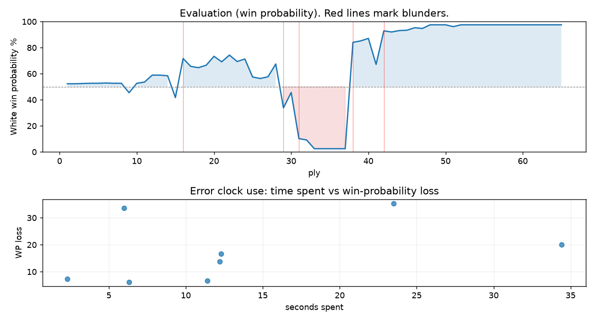

# (free, so lmk) Game analysis: Zhakentii vs DanielKetterer

Date: 2026.07.27  |  Time control: rapid (1800)  |  You played: white
Game ID: ec2c3458-89bd-11f1-a79f-19975b01000f
Analysis: depth=24 multipv=3 findability=honest floor=6 stable_run=3 threads=1 hash_mb=256 deterministic=True engine_id=Stockfish_18 generated=2026-07-27T14:40:11Z
Game end time UTC: 2026-07-27T13:37:25+00:00
Game: https://www.chess.com/game/live/172148616170

## Summary

- Lichess accuracy: you 73.8%, opponent 47.1%
- Opening: C50 Italian Game: Giuoco Pianissimo, Normal (theory followed through ply 8)
- First deviation from theory: ply 9, You played 5. Ng5
- Your moves: 15 best, 8 excellent, 2 good, 3 inaccuracy, 3 mistake, 2 blunder

METRICS:

Best: The played move exactly matches Stockfish's top move

Excellent: A non-best move that loses 2 WP points or less.

Good: WP loss is over 2, but under 5 points; also used for losses under 20 when the position remains already decided.

Inaccuracy: WP loss is at least 5 but under 10 points.

Mistake: WP loss is at least 10 but under 20 points; also generally used when a forced mate is missed with under 10 points of WP loss.

Blunder: WP loss is 20 points or more, or a forced mate is missed with at least 10 points of WP loss.

See: https://support.chess.com/en/articles/8572705-how-are-moves-classified-what-is-a-blunder-or-brilliant-etc 

(Brillint, Great and Miss are rating subjective)
- Puzzles: 20 open, 0 solved

### Puzzle gate tally (this game)

Gates: category in ['brilliant_sacrifice', 'missed_tactic', 'allowed_tactic', 'endgame'], refute depth in [3, 8], best-vs-second WP gap >= 5. Refute bar per move: max(5, 0.6 x WP loss).

| outcome | errors |
|---|---|
| category:opening | 1 |
| category:positional | 1 |
| refute_censored_high | 1 |
| refute_too_deep | 2 |
| refute_too_shallow | 1 |
| wp_gap_too_small | 2 |

Four gates pass at once or nothing is generated, so a zero here is a product of four pass rates rather than a fault. Read the binding gate off this table before changing any threshold.

### Sacrifices in the engine's line

Real sacrifices are listed but never served as puzzles: compensation that never resolves back into material has no gradable answer.

| Move | Offered | Kind | Quiet | Line ends | Verdict |
|---|---|---|---|---|---|
| 13 | -8.0 (piece) | sham | yes | +1.0 pawns | obvious |
| 16 | -4.0 (piece) | sham | yes | +1.0 pawns | obvious |
| 17 | -13.0 (piece) | real | yes | -8.0 pawns | real_sacrifice_not_gradable |

## Biggest missed opportunity

You played 16.Bxh6. Stockfish preferred Kh1, after which the main line runs 16. Kh1 Qc6+ 17. f3 Ne3 18. Bxe3 Bxe3. The evaluation crossed from equal to losing, which matters more than the raw number. Why it went wrong: motif: creates threat on f5. Nothing was hanging and no capture was on offer, but the engine's continuation is forcing: this was a combination landing several moves out, not a judgment error. The engine prefers this move from at or below depth 6, which is as shallow as this measurement resolves; it sits near the surface, a forcing move, the kind a checks-and-captures scan catches. Candidates considered by the engine: Kh1 (-0.48), b4 (-0.75), d4 (-0.85).

## Critical positions

- Ply 16 (opponent), 8...Be6: -0.91 -> +2.52 [evaluation crossed equal -> losing]
- Ply 26 (opponent), 13...gxf6: +0.82 -> +0.69 [only-move situation]
- Ply 29 (you), 15.g4: +1.98 -> -1.82 [evaluation crossed winning -> losing]
- Ply 31 (you), 16.Bxh6: -0.48 -> -5.90 [evaluation crossed equal -> losing]
- Ply 34 (opponent), 17...Rag8+: -10.39 -> -12.57 [only-move situation]
- Ply 38 (opponent), 19...Rg1+: -11.87 -> +4.52 [evaluation crossed winning -> losing]
- Ply 42 (opponent), 21...exf5: +1.94 -> +6.98 [only-move situation]

## Your errors, move by move

| Move | Class | Category | WP loss | Refute depth | Seconds spent | Pre-error eval |
|---|---|---|---:|---|---:|---|
| 5.Ng5 | inaccuracy | opening | 7% | 6 | 2 | balanced |
| 8.d6 | mistake | allowed_tactic | 17% | 1 | 12 | balanced |
| 9.Bxe6 | inaccuracy | allowed_tactic | 6% | 11 | 6 | winning |
| 13.Nxf6+ | mistake | missed_tactic | 14% | 6 | 12 | winning |
| 15.g4 | blunder | positional | 34% | 8 | 6 | winning |
| 16.Bxh6 | blunder | missed_tactic | 35% | 7 | 24 | balanced |
| 17.gxf5 | inaccuracy | allowed_tactic | 7% | >18 | 11 | losing |
| 21.Nd2 | mistake | missed_tactic | 20% | 13 | 34 | winning |

### 5.Ng5 (inaccuracy, positional, wp loss 7%)

You played 5.Ng5. Stockfish preferred O-O, after which the main line runs 5. O-O O-O 6. c3 d6 7. Re1 a5. This was a judgment error rather than a missed tactic; compare the pawn structure and piece activity after both moves. The engine first prefers this move at depth 7 and holds it; findable, but it takes a deliberate look rather than a scan. Candidates considered by the engine: O-O (+0.29), c3 (+0.26), Nbd2 (+0.26).

### 8.d6 (mistake, tactical, wp loss 17%)

You played 8.d6. Stockfish preferred Nd2, after which the main line runs 8. Nd2 Nxd5 9. Nde4 Be7 10. Nf3 Nb6. Why it went wrong: left pawn on d6 insufficiently defended. Before committing to a quiet move here, the checklist is checks, captures, threats, in that order. The engine first prefers this move at depth 9 and holds it; findable, but it takes a deliberate look rather than a scan. Candidates considered by the engine: Nd2 (+0.92), Nf3 (+0.62), O-O (+0.61).

### 9.Bxe6 (inaccuracy, positional, wp loss 6%)

You played 9.Bxe6. Stockfish preferred dxc7, after which the main line runs 9. dxc7 Qxc7 10. Bxe6 fxe6 11. Qb3 O-O-O. Why it went wrong: left bishop on e6, pawn on d6 insufficiently defended. This was a judgment error rather than a missed tactic; compare the pawn structure and piece activity after both moves. The engine first prefers this move at depth 9 and holds it; findable, but it takes a deliberate look rather than a scan. Candidates considered by the engine: dxc7 (+2.52), Nxe6 (+2.41), Bxe6 (+1.80).

### 13.Nxf6+ (mistake, tactical, wp loss 14%)

You played 13.Nxf6+. Stockfish preferred Qb3, after which the main line runs 13. Qb3 Nxe4 14. Qxe6+ Ne7 15. dxe4 Rf8. The evaluation crossed from winning to equal, which matters more than the raw number. Why it went wrong: left knight on f6 insufficiently defended; motif: creates threat on e6. Before committing to a quiet move here, the checklist is checks, captures, threats, in that order. The engine prefers this move from at or below depth 6, which is as shallow as this measurement resolves; it sits near the surface, a forcing move, the kind a checks-and-captures scan catches. Candidates considered by the engine: Qb3 (+2.47), Qe2 (+2.00), Nbd2 (+1.98).

### 15.g4 (blunder, positional, wp loss 34%)

You played 15.g4. Stockfish preferred Nd2, after which the main line runs 15. Nd2 Rag8 16. Ne4 Qc6 17. g3 Rg7. The evaluation crossed from winning to losing, which matters more than the raw number. This was a judgment error rather than a missed tactic; compare the pawn structure and piece activity after both moves. The engine prefers this move from at or below depth 6, which is as shallow as this measurement resolves; it sits near the surface, a quiet move, but one whose point shows at a glance. Candidates considered by the engine: Nd2 (+1.98), d4 (+1.25), Re1 (+1.19).

### 16.Bxh6 (blunder, deep tactic, wp loss 35%)

You played 16.Bxh6. Stockfish preferred Kh1, after which the main line runs 16. Kh1 Qc6+ 17. f3 Ne3 18. Bxe3 Bxe3. The evaluation crossed from equal to losing, which matters more than the raw number. Why it went wrong: motif: creates threat on f5. Nothing was hanging and no capture was on offer, but the engine's continuation is forcing: this was a combination landing several moves out, not a judgment error. The engine prefers this move from at or below depth 6, which is as shallow as this measurement resolves; it sits near the surface, a forcing move, the kind a checks-and-captures scan catches. Candidates considered by the engine: Kh1 (-0.48), b4 (-0.75), d4 (-0.85).

### 17.gxf5 (inaccuracy, positional, wp loss 7%)

You played 17.gxf5. Stockfish preferred Nd2, after which the main line runs 17. Nd2 Rxh6 18. Ne4 Qc6 19. Kh1 Rah8. Why it went wrong: motif: creates threat on f5. This was a judgment error rather than a missed tactic; compare the pawn structure and piece activity after both moves. The engine does not settle on this move until depth 21, which is outside what a human reasonably calculates over the board; this is not a training target. Candidates considered by the engine: Nd2 (-6.24), g5 (-6.69), h3 (-6.77).

### 21.Nd2 (mistake, tactical, wp loss 20%)

You played 21.Nd2. Stockfish preferred Qg4, after which the main line runs 21. Qg4 Rh7 22. Nd2 Bb6 23. Qg6 Rf7. Why it went wrong: motif: creates threat on g1. Before committing to a quiet move here, the checklist is checks, captures, threats, in that order. The engine prefers this move from at or below depth 6, which is as shallow as this measurement resolves; it sits near the surface, a forcing move, the kind a checks-and-captures scan catches. Candidates considered by the engine: Qg4 (+5.19), Kxg1 (+4.85), fxe6 (+4.29).

## Full move table

| Ply | Move | Eval before | Eval after | Best | CP loss | WP loss | Class |
|-----|------|-------------|------------|------|---------|---------|-------|
| 1 | 1.e4* | +0.31 | +0.25 | e4 | 6 | 1% | best |
| 2 | 1...e5 | +0.25 | +0.25 | e5 | 0 | 0% | best |
| 3 | 2.Nf3* | +0.25 | +0.27 | Nf3 | 0 | 0% | best |
| 4 | 2...Nc6 | +0.27 | +0.29 | Nc6 | 2 | 0% | best |
| 5 | 3.Bc4* | +0.29 | +0.29 | Bc4 | 0 | 0% | best |
| 6 | 3...Nf6 | +0.29 | +0.31 | Nf6 | 2 | 0% | best |
| 7 | 4.d3* | +0.31 | +0.29 | d3 | 2 | 0% | best |
| 8 | 4...Bc5 | +0.29 | +0.29 | Be7 | 0 | 0% | excellent |
| 9 | 5.Ng5* | +0.29 | -0.50 | O-O | 79 | 7% | inaccuracy |
| 10 | 5...d5 | -0.50 | +0.29 | O-O | 79 | 7% | inaccuracy |
| 11 | 6.exd5* | +0.29 | +0.39 | exd5 | 0 | 0% | best |
| 12 | 6...Nd4 | +0.39 | +0.98 | Na5 | 59 | 5% | inaccuracy |
| 13 | 7.c3* | +0.98 | +0.98 | c3 | 0 | 0% | best |
| 14 | 7...Nf5 | +0.98 | +0.92 | Nf5 | 0 | 0% | best |
| 15 | 8.d6* | +0.92 | -0.91 | Nd2 | 183 | 17% | mistake |
| 16 | 8...Be6 | -0.91 | +2.52 | Nxd6 | 343 | 30% | blunder |
| 17 | 9.Bxe6* | +2.52 | +1.75 | dxc7 | 77 | 6% | inaccuracy |
| 18 | 9...fxe6 | +1.75 | +1.64 | fxe6 | 0 | 0% | best |
| 19 | 10.dxc7* | +1.64 | +1.87 | dxc7 | 0 | 0% | best |
| 20 | 10...Qc8 | +1.87 | +2.75 | Qd5 | 88 | 7% | inaccuracy |
| 21 | 11.O-O* | +2.75 | +2.19 | Qb3 | 56 | 4% | good |
| 22 | 11...h6 | +2.19 | +2.88 | O-O | 69 | 5% | inaccuracy |
| 23 | 12.Ne4* | +2.88 | +2.22 | Qa4+ | 66 | 5% | good |
| 24 | 12...Qxc7 | +2.22 | +2.47 | Bb6 | 25 | 2% | excellent |
| 25 | 13.Nxf6+* | +2.47 | +0.82 | Qb3 | 165 | 14% | mistake |
| 26 | 13...gxf6 | +0.82 | +0.69 | gxf6 | 0 | 0% | best |
| 27 | 14.Qh5+* | +0.69 | +0.84 | Qh5+ | 0 | 0% | best |
| 28 | 14...Ke7 | +0.84 | +1.98 | Qf7 | 114 | 10% | inaccuracy |
| 29 | 15.g4* | +1.98 | -1.82 | Nd2 | 380 | 34% | blunder |
| 30 | 15...Rhg8 | -1.82 | -0.48 | Rag8 | 134 | 12% | mistake |
| 31 | 16.Bxh6* | -0.48 | -5.90 | Kh1 | 542 | 35% | blunder |
| 32 | 16...Rh8 | -5.90 | -6.24 | Rh8 | 0 | 0% | best |
| 33 | 17.gxf5* | -6.24 | -10.39 | Nd2 | 415 | 7% | inaccuracy |
| 34 | 17...Rag8+ | -10.39 | -12.57 | Rag8+ | 0 | 0% | best |
| 35 | 18.Kh1* | -12.57 | -12.32 | Bg7 | 0 | 0% | excellent |
| 36 | 18...Qc6+ | -12.32 | -M16 | Qc6+ |  | 0% | best |
| 37 | 19.f3* | -M16 | -11.87 | f3 |  | 0% | best |
| 38 | 19...Rg1+ | -11.87 | +4.52 | Rxh6 | 1639 | 82% | blunder |
| 39 | 20.Rxg1* | +4.52 | +4.75 | Rxg1 | 0 | 0% | best |
| 40 | 20...Bxg1 | +4.75 | +5.19 | Bxg1 | 44 | 2% | best |
| 41 | 21.Nd2* | +5.19 | +1.94 | Qg4 | 325 | 20% | mistake |
| 42 | 21...exf5 | +1.94 | +6.98 | Be3 | 504 | 26% | blunder |
| 43 | 22.Kxg1* | +6.98 | +6.64 | Rxg1 | 34 | 1% | excellent |
| 44 | 22...Rg8+ | +6.64 | +7.07 | b5 | 43 | 1% | excellent |
| 45 | 23.Kf2* | +7.07 | +7.19 | Kh1 | 0 | 0% | excellent |
| 46 | 23...Qc5+ | +7.19 | +8.17 | Qe8 | 98 | 2% | excellent |
| 47 | 24.Be3* | +8.17 | +7.85 | d4 | 32 | 1% | excellent |
| 48 | 24...Qc6 | +7.85 | +10.82 | Qc8 | 297 | 3% | good |
| 49 | 25.Qh7+* | +10.82 | +12.62 | Qh7+ | 0 | 0% | best |
| 50 | 25...Kf8 | +12.62 | +12.26 | Kf8 | 0 | 0% | best |
| 51 | 26.Qxf5* | +12.26 | +8.73 | Bh6+ | 353 | 1% | excellent |
| 52 | 26...Rg5 | +8.73 | +10.91 | Ke8 | 218 | 1% | excellent |
| 53 | 27.Bxg5* | +10.91 | +12.59 | Bxg5 | 0 | 0% | best |
| 54 | 27...Qc5+ | +12.59 | M10 | Ke7 |  | 0% | excellent |
| 55 | 28.Be3* | M10 | M9 | d4 |  | 0% | excellent |
| 56 | 28...Qxe3+ | M9 | M6 | Qd6 |  | 0% | excellent |
| 57 | 29.Kxe3* | M6 | M5 | Kxe3 |  | 0% | best |
| 58 | 29...e4 | M5 | M4 | Ke7 |  | 0% | excellent |
| 59 | 30.Qxf6+* | M4 | M3 | Qxf6+ |  | 0% | best |
| 60 | 30...Kg8 | M3 | M2 | Ke8 |  | 0% | excellent |
| 61 | 31.Nxe4* | M2 | M2 | Rg1+ |  | 0% | excellent |
| 62 | 31...b5 | M2 | M2 | a5 |  | 0% | excellent |
| 63 | 32.Rg1+* | M2 | M1 | Rg1+ |  | 0% | best |
| 64 | 32...Kh7 | M1 | M1 | Kh7 |  | 0% | best |
| 65 | 33.Qh4#* | M1 | M1 | Qg7# |  | 0% | excellent |

Rows marked * are your moves. WP loss is win-probability loss; it is the primary signal, CP loss is shown for reference.

## Patterns in this game

- Error categories: 3 allowed_tactic, 3 missed_tactic, 1 opening, 1 positional.
- Attention errors per 100 moves: 0.0.
- Pre-error eval buckets: 4 winning, 3 balanced, 1 losing.
- Opening: 3 error(s) (avg wp loss 10%).
- Middlegame: 5 error(s) (avg wp loss 22%).
