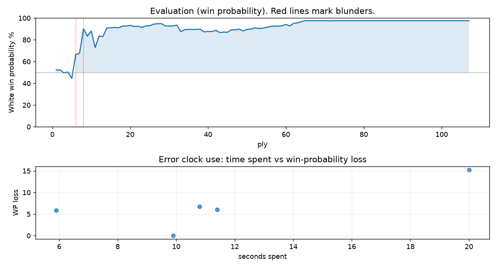

# (free, so lmk) Game analysis: AdamGrant01 vs DanielKetterer

Date: 2026.07.27  |  Time control: rapid (1800)  |  You played: white
Game ID: e9b1cf5d-89eb-11f1-bdab-914c5601000f
Analysis: depth=24 multipv=3 findability=honest floor=6 stable_run=3 threads=1 hash_mb=256 deterministic=True engine_id=Stockfish_18 generated=2026-07-28T10:03:16Z
Game end time UTC: 2026-07-27T19:14:13+00:00
Game: https://www.chess.com/game/live/172162795888

## Summary

- Lichess accuracy: you 92.5%, opponent 86.0%
- Opening: C42 Petrov's Defense: Italian Variation (theory followed through ply 5)
- First deviation from theory: ply 6, Opponent played 3... h6
- Your moves: 26 best, 20 excellent, 3 good, 3 inaccuracy, 2 mistake, 0 blunder

METRICS:

Best: The played move exactly matches Stockfish's top move

Excellent: A non-best move that loses 2 WP points or less.

Good: WP loss is over 2, but under 5 points; also used for losses under 20 when the position remains already decided.

Inaccuracy: WP loss is at least 5 but under 10 points.

Mistake: WP loss is at least 10 but under 20 points; also generally used when a forced mate is missed with under 10 points of WP loss.

Blunder: WP loss is 20 points or more, or a forced mate is missed with at least 10 points of WP loss.

See: https://support.chess.com/en/articles/8572705-how-are-moves-classified-what-is-a-blunder-or-brilliant-etc 

(Brillint, Great and Miss are rating subjective)
- Puzzles: 23 open, 0 solved

### Puzzle gate tally (this game)

Gates: category in ['brilliant_sacrifice', 'missed_tactic', 'allowed_tactic', 'endgame'], refute depth in [3, 8], best-vs-second WP gap >= 5. Refute bar per move: max(5, 0.6 x WP loss).

| outcome | errors |
|---|---|
| accepted | 1 |
| category:attention | 1 |
| category:positional | 1 |
| refute_too_deep | 1 |
| refute_too_shallow | 1 |

Four gates pass at once or nothing is generated, so a zero here is a product of four pass rates rather than a fault. Read the binding gate off this table before changing any threshold.

### Sacrifices in the engine's line

Real sacrifices are listed but never served as puzzles: compensation that never resolves back into material has no gradable answer.

| Move | Offered | Kind | Quiet | Line ends | Verdict |
|---|---|---|---|---|---|
| 3 | -3.0 (piece) | sham | yes | +0.0 pawns | opening_ply |
| 6 | -3.0 (piece) | sham | yes | +2.0 pawns | opening_ply |
| 17 | -2.0 (exchange) | real | yes | -1.0 pawns | real_sacrifice_not_gradable |

## Biggest missed opportunity

You played 6.Qe2. Stockfish preferred O-O, after which the main line runs 6. O-O Rg8 7. Re1 d5 8. Bxd5 Nf6. Why it went wrong: left knight on f7 insufficiently defended; motif: creates threat on h8. Before committing to a quiet move here, the checklist is checks, captures, threats, in that order. The engine prefers this move from at or below depth 6, which is as shallow as this measurement resolves; it sits near the surface, a forcing move, the kind a checks-and-captures scan catches. Candidates considered by the engine: O-O (+5.44), Kf1 (+2.94), Qe2 (+2.70).

## Critical positions

- Ply 6 (opponent), 3...h6: -0.60 -> +1.85 [evaluation crossed equal -> losing]
- Ply 8 (opponent), 4...Nxe4: +2.01 -> +5.98
- Ply 17 (you), 9.Nf7+: +6.41 -> +6.27 [only-move situation]
- Ply 81 (you), 41.Rc1: M14 -> +12.98 [forced mate was on the board]

## Your errors, move by move

| Move | Class | Category | WP loss | Refute depth | Seconds spent | Pre-error eval |
|---|---|---|---:|---|---:|---|
| 3.Nf3 | inaccuracy | allowed_tactic | 6% | 13 | 6 | balanced |
| 5.Nxf7 | inaccuracy | attention | 7% | 2 | 11 | winning |
| 6.Qe2 | mistake | missed_tactic | 15% | 4 | 20 | winning |
| 17.Nf7+ | inaccuracy | allowed_tactic | 6% | 1 | 11 | winning |
| 41.Rc1 | mistake | positional | 0% | >18 | 10 | winning |

### 3.Nf3 (inaccuracy, positional, wp loss 6%)

You played 3.Nf3. Stockfish preferred Nc3, after which the main line runs 3. Nc3 Nc6 4. d3 Na5 5. Bb3 Nxb3. Why it went wrong: left pawn on e4 insufficiently defended. This was a judgment error rather than a missed tactic; compare the pawn structure and piece activity after both moves. The engine does not settle on this move until depth 22, which is outside what a human reasonably calculates over the board; this is not a training target. Candidates considered by the engine: Nc3 (+0.04), d3 (-0.03), d4 (-0.26).

### 5.Nxf7 (inaccuracy, positional, wp loss 7%)

You played 5.Nxf7. Stockfish preferred Bxf7+, after which the main line runs 5. Bxf7+ Ke7 6. Nc3 c6 7. Bh5 d5. Why it went wrong: left knight on f7 insufficiently defended; the best move was a forcing check. This was a judgment error rather than a missed tactic; compare the pawn structure and piece activity after both moves. The engine prefers this move from at or below depth 6, which is as shallow as this measurement resolves; it sits near the surface, a quiet move, but one whose point shows at a glance. Candidates considered by the engine: Bxf7+ (+5.98), Nxf7 (+4.11), Qf3 (+3.53).

### 6.Qe2 (mistake, tactical, wp loss 15%)

You played 6.Qe2. Stockfish preferred O-O, after which the main line runs 6. O-O Rg8 7. Re1 d5 8. Bxd5 Nf6. Why it went wrong: left knight on f7 insufficiently defended; motif: creates threat on h8. Before committing to a quiet move here, the checklist is checks, captures, threats, in that order. The engine prefers this move from at or below depth 6, which is as shallow as this measurement resolves; it sits near the surface, a forcing move, the kind a checks-and-captures scan catches. Candidates considered by the engine: O-O (+5.44), Kf1 (+2.94), Qe2 (+2.70).

### 17.Nf7+ (inaccuracy, positional, wp loss 6%)

You played 17.Nf7+. Stockfish preferred Qh3, after which the main line runs 17. Qh3 Bd7 18. Nc3 Qf5 19. Qxf5 Bxf5. This was a judgment error rather than a missed tactic; compare the pawn structure and piece activity after both moves. The engine does not settle on this move until depth 15; reachable with real calculation, but not on a scan. Candidates considered by the engine: Qh3 (+7.25), Qg3 (+7.07), Qd3+ (+6.26).

### 41.Rc1 (mistake, positional, wp loss 0%)

You played 41.Rc1. Stockfish preferred Rd5, after which the main line runs 41. Rd5 Be5 42. Rxe5 Kh5 43. Ra2 Kg6. There was a forced mate on the board and this move let it slip. Why it went wrong: left bishop on g5, pawn on f4 insufficiently defended. This was a judgment error rather than a missed tactic; compare the pawn structure and piece activity after both moves. The engine first prefers this move at depth 10 and holds it; findable, but it takes a deliberate look rather than a scan. Candidates considered by the engine: Rd5 (M14), h3+ (+13.81), Be7 (+13.64).

## Full move table

| Ply | Move | Eval before | Eval after | Best | CP loss | WP loss | Class |
|-----|------|-------------|------------|------|---------|---------|-------|
| 1 | 1.e4* | +0.31 | +0.25 | e4 | 6 | 1% | best |
| 2 | 1...e5 | +0.25 | +0.25 | e5 | 0 | 0% | best |
| 3 | 2.Bc4* | +0.25 | -0.05 | Nf3 | 30 | 3% | good |
| 4 | 2...Nf6 | -0.05 | +0.04 | Nf6 | 9 | 1% | best |
| 5 | 3.Nf3* | +0.04 | -0.60 | Nc3 | 64 | 6% | inaccuracy |
| 6 | 3...h6 | -0.60 | +1.85 | Nxe4 | 245 | 22% | blunder |
| 7 | 4.Nxe5* | +1.85 | +2.01 | Nxe5 | 0 | 0% | best |
| 8 | 4...Nxe4 | +2.01 | +5.98 | d5 | 397 | 22% | blunder |
| 9 | 5.Nxf7* | +5.98 | +4.37 | Bxf7+ | 161 | 7% | inaccuracy |
| 10 | 5...Qe7 | +4.37 | +5.44 | Qh4 | 107 | 5% | good |
| 11 | 6.Qe2* | +5.44 | +2.68 | O-O | 276 | 15% | mistake |
| 12 | 6...Rg8 | +2.68 | +4.39 | Rh7 | 171 | 11% | mistake |
| 13 | 7.Nxh6* | +4.39 | +4.30 | Nxh6 | 9 | 0% | best |
| 14 | 7...Rh8 | +4.30 | +6.23 | gxh6 | 193 | 8% | inaccuracy |
| 15 | 8.Qh5+* | +6.23 | +6.29 | Qh5+ | 0 | 0% | best |
| 16 | 8...Kd8 | +6.29 | +6.41 | Kd8 | 12 | 0% | best |
| 17 | 9.Nf7+* | +6.41 | +6.27 | Nf7+ | 14 | 0% | best |
| 18 | 9...Ke8 | +6.27 | +6.87 | Qxf7 | 60 | 2% | excellent |
| 19 | 10.Nxh8+* | +6.87 | +6.90 | Nxh8+ | 0 | 0% | best |
| 20 | 10...Kd8 | +6.90 | +7.08 | Kd8 | 18 | 0% | best |
| 21 | 11.O-O* | +7.08 | +6.74 | Nf7+ | 34 | 1% | excellent |
| 22 | 11...Nf6 | +6.74 | +6.78 | Nf6 | 4 | 0% | best |
| 23 | 12.Qf3* | +6.78 | +6.44 | Qg6 | 34 | 1% | excellent |
| 24 | 12...d5 | +6.44 | +6.93 | Nc6 | 49 | 1% | excellent |
| 25 | 13.Bxd5* | +6.93 | +6.97 | Bxd5 | 0 | 0% | best |
| 26 | 13...Nxd5 | +6.97 | +7.67 | Bg4 | 70 | 2% | excellent |
| 27 | 14.Qxd5+* | +7.67 | +7.89 | Qxd5+ | 0 | 0% | best |
| 28 | 14...Bd7 | +7.89 | +7.91 | Qd7 | 2 | 0% | excellent |
| 29 | 15.Qxb7* | +7.91 | +6.92 | d4 | 99 | 2% | good |
| 30 | 15...Bc6 | +6.92 | +6.89 | Bc6 | 0 | 0% | best |
| 31 | 16.Qb3* | +6.89 | +6.91 | Qb3 | 0 | 0% | best |
| 32 | 16...Qe4 | +6.91 | +7.25 | Kc8 | 34 | 1% | excellent |
| 33 | 17.Nf7+* | +7.25 | +5.27 | Qh3 | 198 | 6% | inaccuracy |
| 34 | 17...Ke7 | +5.27 | +5.77 | Ke8 | 50 | 2% | excellent |
| 35 | 18.f3* | +5.77 | +5.83 | f3 | 0 | 0% | best |
| 36 | 18...Qd4+ | +5.83 | +5.80 | Qd4+ | 0 | 0% | best |
| 37 | 19.Kh1* | +5.80 | +5.86 | Kh1 | 0 | 0% | best |
| 38 | 19...Bd5 | +5.86 | +5.86 | Bd5 | 0 | 0% | best |
| 39 | 20.Re1+* | +5.86 | +5.24 | Qc3 | 62 | 2% | good |
| 40 | 20...Kxf7 | +5.24 | +5.32 | Kxf7 | 8 | 0% | best |
| 41 | 21.Qe3* | +5.32 | +5.31 | Qe3 | 1 | 0% | best |
| 42 | 21...c5 | +5.31 | +5.58 | Nc6 | 27 | 1% | excellent |
| 43 | 22.Qxd4* | +5.58 | +5.10 | d3 | 48 | 2% | excellent |
| 44 | 22...cxd4 | +5.10 | +5.17 | cxd4 | 7 | 0% | best |
| 45 | 23.d3* | +5.17 | +5.16 | d3 | 1 | 0% | best |
| 46 | 23...g5 | +5.16 | +5.74 | a5 | 58 | 2% | good |
| 47 | 24.Bxg5* | +5.74 | +5.71 | Re5 | 3 | 0% | excellent |
| 48 | 24...Nd7 | +5.71 | +5.91 | Nc6 | 20 | 1% | excellent |
| 49 | 25.c4* | +5.91 | +5.45 | Nd2 | 46 | 2% | excellent |
| 50 | 25...Bc6 | +5.45 | +5.83 | Be6 | 38 | 1% | excellent |
| 51 | 26.Nd2* | +5.83 | +5.91 | Nd2 | 0 | 0% | best |
| 52 | 26...Bd6 | +5.91 | +6.26 | Nc5 | 35 | 1% | excellent |
| 53 | 27.Ne4* | +6.26 | +6.09 | Nb3 | 17 | 1% | excellent |
| 54 | 27...Be5 | +6.09 | +6.16 | Bb4 | 7 | 0% | excellent |
| 55 | 28.b4* | +6.16 | +6.43 | f4 | 0 | 0% | excellent |
| 56 | 28...Rh8 | +6.43 | +6.73 | Rb8 | 30 | 1% | excellent |
| 57 | 29.f4* | +6.73 | +6.86 | f4 | 0 | 0% | best |
| 58 | 29...Bc7 | +6.86 | +6.85 | Bc7 | 0 | 0% | best |
| 59 | 30.c5* | +6.85 | +7.00 | Kg1 | 0 | 0% | excellent |
| 60 | 30...a6 | +7.00 | +7.51 | Re8 | 51 | 1% | excellent |
| 61 | 31.a4* | +7.51 | +6.93 | Nd6+ | 58 | 1% | excellent |
| 62 | 31...Ke6 | +6.93 | +8.11 | Rb8 | 118 | 2% | good |
| 63 | 32.Nf6+* | +8.11 | +8.32 | Nf6+ | 0 | 0% | best |
| 64 | 32...Kf7 | +8.32 | +9.25 | Kf5 | 93 | 1% | excellent |
| 65 | 33.Nxd7* | +9.25 | +10.01 | Nxd7 | 0 | 0% | best |
| 66 | 33...Bxd7 | +10.01 | +10.94 | Bd8 | 93 | 0% | excellent |
| 67 | 34.Re7+* | +10.94 | +11.31 | Re7+ | 0 | 0% | best |
| 68 | 34...Kg6 | +11.31 | +13.74 | Kg8 | 243 | 0% | excellent |
| 69 | 35.Rxd7* | +13.74 | +10.88 | Rxd7 | 286 | 0% | best |
| 70 | 35...Bb8 | +10.88 | +12.94 | Be5 | 206 | 0% | excellent |
| 71 | 36.Rxd4* | +12.94 | +9.83 | Re1 | 311 | 0% | excellent |
| 72 | 36...Kf5 | +9.83 | +11.13 | Re8 | 130 | 0% | excellent |
| 73 | 37.g3* | +11.13 | +10.01 | Re1 | 112 | 0% | excellent |
| 74 | 37...Kg4 | +10.01 | +10.96 | Kg4 | 95 | 0% | best |
| 75 | 38.Kg2* | +10.96 | +13.39 | Kg2 | 0 | 0% | best |
| 76 | 38...Rh3 | +13.39 | +17.94 | Re8 | 455 | 0% | excellent |
| 77 | 39.b5* | +17.94 | +10.23 | Re1 | 771 | 0% | excellent |
| 78 | 39...Rh8 | +10.23 | +12.94 | axb5 | 271 | 0% | excellent |
| 79 | 40.b6* | +12.94 | +14.02 | b6 | 0 | 0% | best |
| 80 | 40...Rc8 | +14.02 | M14 | Kf5 |  | 0% | excellent |
| 81 | 41.Rc1* | M14 | +12.98 | Rd5 |  | 0% | mistake |
| 82 | 41...Kf5 | +12.98 | M12 | Rc6 |  | 0% | excellent |
| 83 | 42.c6* | M12 | M10 | c6 |  | 0% | best |
| 84 | 42...Bxf4 | M10 | M8 | Re8 |  | 0% | excellent |
| 85 | 43.Bxf4* | M8 | M7 | Bxf4 |  | 0% | best |
| 86 | 43...Re8 | M7 | M7 | Re8 |  | 0% | best |
| 87 | 44.Re4* | M7 | M7 | c7 |  | 0% | excellent |
| 88 | 44...Rf8 | M7 | M7 | Rc8 |  | 0% | excellent |
| 89 | 45.c7* | M7 | M6 | c7 |  | 0% | best |
| 90 | 45...Kg4 | M6 | M3 | Kf6 |  | 0% | excellent |
| 91 | 46.Bd6+* | M3 | M4 | Re5 |  | 0% | excellent |
| 92 | 46...Kg5 | M4 | M4 | Kf5 |  | 0% | excellent |
| 93 | 47.Bxf8* | M4 | M3 | Bxf8 |  | 0% | best |
| 94 | 47...a5 | M3 | M3 | Kg6 |  | 0% | excellent |
| 95 | 48.Rc5+* | M3 | M3 | c8=Q |  | 0% | excellent |
| 96 | 48...Kg6 | M3 | M3 | Kf6 |  | 0% | excellent |
| 97 | 49.Re6+* | M3 | M3 | Rg4+ |  | 0% | excellent |
| 98 | 49...Kf7 | M3 | M3 | Kh7 |  | 0% | excellent |
| 99 | 50.Rcc6* | M3 | M3 | c8=Q |  | 0% | excellent |
| 100 | 50...Kg8 | M3 | M3 | Kg8 |  | 0% | best |
| 101 | 51.c8=Q* | M3 | M2 | c8=Q |  | 0% | best |
| 102 | 51...Kh8 | M2 | M2 | Kf7 |  | 0% | excellent |
| 103 | 52.Bh6+* | M2 | M1 | Qd7 |  | 0% | excellent |
| 104 | 52...Kh7 | M1 | M1 | Kh7 |  | 0% | best |
| 105 | 53.Qd7+* | M1 | M1 | Rc7# |  | 0% | excellent |
| 106 | 53...Kg8 | M1 | M1 | Kg8 |  | 0% | best |
| 107 | 54.Re8#* | M1 | M1 | Qg7# |  | 0% | excellent |

Rows marked * are your moves. WP loss is win-probability loss; it is the primary signal, CP loss is shown for reference.

## Patterns in this game

- Error categories: 2 allowed_tactic, 1 attention, 1 missed_tactic, 1 positional.
- Attention errors per 100 moves: 1.9.
- Pre-error eval buckets: 4 winning, 1 balanced, 0 losing.
- Opening: 3 error(s) (avg wp loss 9%).
- Middlegame: 1 error(s) (avg wp loss 6%).
- Endgame: 1 error(s) (avg wp loss 0%).
