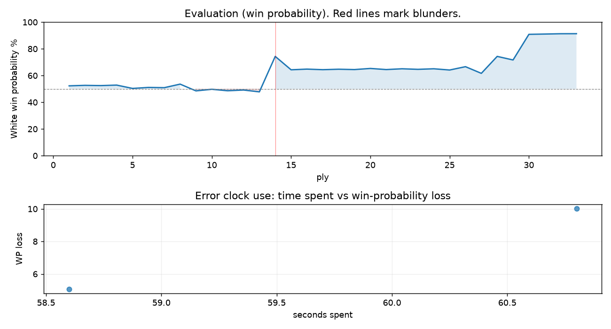

# (free, so lmk) Game analysis: marekduda vs DanielKetterer

Date: 2026.07.28  |  Time control: rapid (1800)  |  You played: white
Game ID: fd1dcb91-8a79-11f1-8942-d007a201000f
Analysis: depth=24 multipv=3 findability=honest floor=6 stable_run=3 threads=1 hash_mb=256 deterministic=True engine_id=Stockfish_18 generated=2026-07-29T09:39:59Z
Game end time UTC: 2026-07-28T12:06:05+00:00
Game: https://www.chess.com/game/live/172192004572

## Summary

- Lichess accuracy: you 88.7%, opponent 68.5%
- Opening: B10 Caro-Kann Defense (theory followed through ply 2)
- First deviation from theory: ply 3, You played 2. Be2
- Your moves: 6 best, 6 excellent, 3 good, 1 inaccuracy, 1 mistake, 0 blunder

METRICS:

Best: The played move exactly matches Stockfish's top move

Excellent: A non-best move that loses 2 WP points or less.

Good: WP loss is over 2, but under 5 points; also used for losses under 20 when the position remains already decided.

Inaccuracy: WP loss is at least 5 but under 10 points.

Mistake: WP loss is at least 10 but under 20 points; also generally used when a forced mate is missed with under 10 points of WP loss.

Blunder: WP loss is 20 points or more, or a forced mate is missed with at least 10 points of WP loss.

See: https://support.chess.com/en/articles/8572705-how-are-moves-classified-what-is-a-blunder-or-brilliant-etc 

(Brillint, Great and Miss are rating subjective)
- Puzzles: 31 open, 0 solved

### Puzzle gate tally (this game)

Gates: category in ['brilliant_sacrifice', 'missed_tactic', 'allowed_tactic', 'endgame'], refute depth in [3, 8], best-vs-second WP gap >= 5. Refute bar per move: max(5, 0.6 x WP loss).

| outcome | errors |
|---|---|
| category:opening | 1 |
| refute_too_deep | 1 |

Four gates pass at once or nothing is generated, so a zero here is a product of four pass rates rather than a fault. Read the binding gate off this table before changing any threshold.

### Sacrifices in the engine's line

Real sacrifices are listed but never served as puzzles: compensation that never resolves back into material has no gradable answer.

| Move | Offered | Kind | Quiet | Line ends | Verdict |
|---|---|---|---|---|---|
| 5 | -3.0 (piece) | sham | yes | +0.0 pawns | opening_ply |
| 8 | -2.0 (exchange) | sham | no | +2.0 pawns | opening_ply |

## Biggest missed opportunity

You played 8.Bf1. Stockfish preferred Nxe5, after which the main line runs 8. Nxe5 Nxe5 9. Bh5+ g6 10. Bf4 Kf7. The evaluation crossed from winning to equal, which matters more than the raw number. Before committing to a quiet move here, the checklist is checks, captures, threats, in that order. The engine first prefers this move at depth 7 and holds it; findable, but it takes a deliberate look rather than a scan. Candidates considered by the engine: Nxe5 (+2.89), c3 (+2.10), Nbd2 (+1.85).

## Critical positions

- Ply 14 (opponent), 7...f5: -0.24 -> +2.89 [evaluation crossed equal -> losing]
- Ply 21 (you), 11.Bxe5: +1.72 -> +1.62 [only-move situation; evaluation crossed winning -> equal]
- Ply 23 (you), 12.Rxe5: +1.69 -> +1.64 [only-move situation; evaluation crossed winning -> equal]
- Ply 31 (you), 16.Qxe8+: +6.24 -> +6.31 [only-move situation]
- Ply 33 (you), 17.Rxe8+: +6.39 -> +6.40 [only-move situation]

## Your errors, move by move

| Move | Class | Category | WP loss | Refute depth | Seconds spent | Pre-error eval |
|---|---|---|---:|---|---:|---|
| 5.d3 | inaccuracy | opening | 5% | 1 | 59 | balanced |
| 8.Bf1 | mistake | missed_tactic | 10% | 14 | 61 | winning |

### 5.d3 (inaccuracy, positional, wp loss 5%)

You played 5.d3. Stockfish preferred Bb5+, after which the main line runs 5. Bb5+ Nc6 6. O-O Bg4 7. h3 Bh5. Why it went wrong: the best move was a forcing check. This was a judgment error rather than a missed tactic; compare the pawn structure and piece activity after both moves. The engine first prefers this move at depth 8 and holds it; findable, but it takes a deliberate look rather than a scan. Candidates considered by the engine: Bb5+ (+0.39), O-O (+0.16), h3 (+0.11).

### 8.Bf1 (mistake, tactical, wp loss 10%)

You played 8.Bf1. Stockfish preferred Nxe5, after which the main line runs 8. Nxe5 Nxe5 9. Bh5+ g6 10. Bf4 Kf7. The evaluation crossed from winning to equal, which matters more than the raw number. Before committing to a quiet move here, the checklist is checks, captures, threats, in that order. The engine first prefers this move at depth 7 and holds it; findable, but it takes a deliberate look rather than a scan. Candidates considered by the engine: Nxe5 (+2.89), c3 (+2.10), Nbd2 (+1.85).

## Full move table

| Ply | Move | Eval before | Eval after | Best | CP loss | WP loss | Class |
|-----|------|-------------|------------|------|---------|---------|-------|
| 1 | 1.e4* | +0.31 | +0.25 | e4 | 6 | 1% | best |
| 2 | 1...c6 | +0.25 | +0.29 | e5 | 4 | 0% | excellent |
| 3 | 2.Be2* | +0.29 | +0.27 | c3 | 2 | 0% | excellent |
| 4 | 2...d5 | +0.27 | +0.31 | d5 | 4 | 0% | best |
| 5 | 3.exd5* | +0.31 | +0.04 | e5 | 27 | 2% | good |
| 6 | 3...cxd5 | +0.04 | +0.12 | cxd5 | 8 | 1% | best |
| 7 | 4.Nf3* | +0.12 | +0.10 | d4 | 2 | 0% | excellent |
| 8 | 4...d4 | +0.10 | +0.39 | Bf5 | 29 | 3% | good |
| 9 | 5.d3* | +0.39 | -0.16 | Bb5+ | 55 | 5% | inaccuracy |
| 10 | 5...Nc6 | -0.16 | -0.03 | e5 | 13 | 1% | excellent |
| 11 | 6.O-O* | -0.03 | -0.15 | c3 | 12 | 1% | excellent |
| 12 | 6...e5 | -0.15 | -0.09 | e5 | 6 | 1% | best |
| 13 | 7.Re1* | -0.09 | -0.24 | c3 | 15 | 1% | excellent |
| 14 | 7...f5 | -0.24 | +2.89 | Bd6 | 313 | 27% | blunder |
| 15 | 8.Bf1* | +2.89 | +1.60 | Nxe5 | 129 | 10% | mistake |
| 16 | 8...Bd6 | +1.60 | +1.66 | Bd6 | 6 | 1% | best |
| 17 | 9.Bf4* | +1.66 | +1.61 | Bf4 | 5 | 0% | best |
| 18 | 9...Nge7 | +1.61 | +1.65 | Nge7 | 4 | 0% | best |
| 19 | 10.Nxe5* | +1.65 | +1.62 | Bxe5 | 3 | 0% | excellent |
| 20 | 10...Nxe5 | +1.62 | +1.72 | Bxe5 | 10 | 1% | excellent |
| 21 | 11.Bxe5* | +1.72 | +1.62 | Bxe5 | 10 | 1% | best |
| 22 | 11...Bxe5 | +1.62 | +1.69 | Bxe5 | 7 | 1% | best |
| 23 | 12.Rxe5* | +1.69 | +1.64 | Rxe5 | 5 | 0% | best |
| 24 | 12...O-O | +1.64 | +1.69 | O-O | 5 | 0% | best |
| 25 | 13.Re1* | +1.69 | +1.58 | Nd2 | 11 | 1% | excellent |
| 26 | 13...f4 | +1.58 | +1.88 | h6 | 30 | 2% | good |
| 27 | 14.Qe2* | +1.88 | +1.29 | Nd2 | 59 | 5% | good |
| 28 | 14...Re8 | +1.29 | +2.89 | Ng6 | 160 | 13% | mistake |
| 29 | 15.Qe4* | +2.89 | +2.52 | Qe5 | 37 | 3% | good |
| 30 | 15...Nf5 | +2.52 | +6.24 | Bf5 | 372 | 19% | mistake |
| 31 | 16.Qxe8+* | +6.24 | +6.31 | Qxe8+ | 0 | 0% | best |
| 32 | 16...Qxe8 | +6.31 | +6.39 | Qxe8 | 8 | 0% | best |
| 33 | 17.Rxe8+* | +6.39 | +6.40 | Rxe8+ | 0 | 0% | best |

Rows marked * are your moves. WP loss is win-probability loss; it is the primary signal, CP loss is shown for reference.

## Patterns in this game

- Error categories: 1 missed_tactic, 1 opening.
- Attention errors per 100 moves: 0.0.
- Pre-error eval buckets: 1 winning, 1 balanced, 0 losing.
- Opening: 2 error(s) (avg wp loss 8%).
