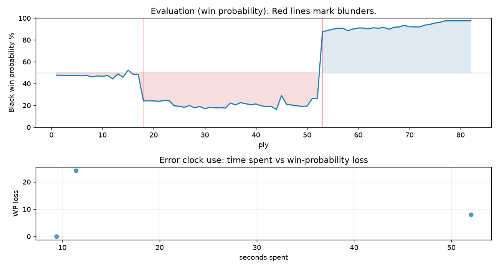

# (free, so lmk) Game analysis: DanielKetterer vs tabrejahamedkhan

Date: 2026.07.28  |  Time control: rapid (1800)  |  You played: black
Game ID: beb9c7fa-8a7c-11f1-b685-56aa3b01000f
Analysis: depth=24 multipv=3 findability=honest floor=6 stable_run=3 threads=1 hash_mb=256 deterministic=True engine_id=Stockfish_18 generated=2026-07-28T13:26:07Z
Game end time UTC: 2026-07-28T12:34:12+00:00
Game: https://www.chess.com/game/live/172192767808

## Summary

- Lichess accuracy: you 91.5%, opponent 76.3%
- Opening: C55 Italian Game: Two Knights Defense, Modern Bishop's Opening (theory followed through ply 10)
- First deviation from theory: ply 11, Opponent played 6. Nc3
- Your moves: 17 best, 13 excellent, 8 good, 1 inaccuracy, 1 mistake, 1 blunder

METRICS:

Best: The played move exactly matches Stockfish's top move

Excellent: A non-best move that loses 2 WP points or less.

Good: WP loss is over 2, but under 5 points; also used for losses under 20 when the position remains already decided.

Inaccuracy: WP loss is at least 5 but under 10 points.

Mistake: WP loss is at least 10 but under 20 points; also generally used when a forced mate is missed with under 10 points of WP loss.

Blunder: WP loss is 20 points or more, or a forced mate is missed with at least 10 points of WP loss.

See: https://support.chess.com/en/articles/8572705-how-are-moves-classified-what-is-a-blunder-or-brilliant-etc 

(Brillint, Great and Miss are rating subjective)
- Puzzles: 24 open, 0 solved

### Puzzle gate tally (this game)

Gates: category in ['brilliant_sacrifice', 'missed_tactic', 'allowed_tactic', 'endgame'], refute depth in [3, 8], best-vs-second WP gap >= 5. Refute bar per move: max(5, 0.6 x WP loss).

| outcome | errors |
|---|---|
| category:positional | 2 |
| wp_gap_too_small | 1 |

Four gates pass at once or nothing is generated, so a zero here is a product of four pass rates rather than a fault. Read the binding gate off this table before changing any threshold.

### Sacrifices in the engine's line

Real sacrifices are listed but never served as puzzles: compensation that never resolves back into material has no gradable answer.

| Move | Offered | Kind | Quiet | Line ends | Verdict |
|---|---|---|---|---|---|
| 9 | -2.0 (exchange) | sham | yes | +0.0 pawns | opening_ply |

## Biggest missed opportunity

You played 9...Nb8. Stockfish preferred Qf6, after which the main line runs 9...Qf6 10. h3 Bxf3 11. Qxf3 Qxf3 12. gxf3. The evaluation crossed from equal to losing, which matters more than the raw number. Why it went wrong: left pawn on b7 insufficiently defended. Before committing to a quiet move here, the checklist is checks, captures, threats, in that order. The engine prefers this move from at or below depth 6, which is as shallow as this measurement resolves; it sits near the surface, a forcing move, the kind a checks-and-captures scan catches. Candidates considered by the engine: Qf6 (+0.18), Bh5 (+0.57), Be7 (+0.60).

## Critical positions

- Ply 18 (you), 9...Nb8: +0.18 -> +3.11 [evaluation crossed equal -> losing]
- Ply 43 (opponent), 22.Rxe3: +3.95 -> +3.92 [only-move situation]
- Ply 53 (opponent), 27.Qc3: +2.82 -> -5.28 [only-move situation; evaluation crossed winning -> losing]
- Ply 54 (you), 27...Ne2+: -5.28 -> -5.58 [only-move situation]
- Ply 56 (you), 28...Nxc3: -5.93 -> -6.15 [only-move situation]
- Ply 72 (you), 36...Qxc5: -6.61 -> -6.60 [only-move situation]
- Ply 82 (you), 41...Qf4+: -M22 -> -81.68 [forced mate was on the board]

## Your errors, move by move

| Move | Class | Category | WP loss | Refute depth | Seconds spent | Pre-error eval |
|---|---|---|---:|---|---:|---|
| 9...Nb8 | blunder | missed_tactic | 24% | 3 | 11 | balanced |
| 23...Ke7 | inaccuracy | positional | 8% | 3 | 52 | losing |
| 41...Qf4+ | mistake | positional | 0% | >18 | 9 | winning |

### 9...Nb8 (blunder, tactical, wp loss 24%)

You played 9...Nb8. Stockfish preferred Qf6, after which the main line runs 9...Qf6 10. h3 Bxf3 11. Qxf3 Qxf3 12. gxf3. The evaluation crossed from equal to losing, which matters more than the raw number. Why it went wrong: left pawn on b7 insufficiently defended. Before committing to a quiet move here, the checklist is checks, captures, threats, in that order. The engine prefers this move from at or below depth 6, which is as shallow as this measurement resolves; it sits near the surface, a forcing move, the kind a checks-and-captures scan catches. Candidates considered by the engine: Qf6 (+0.18), Bh5 (+0.57), Be7 (+0.60).

### 23...Ke7 (inaccuracy, positional, wp loss 8%)

You played 23...Ke7. Stockfish preferred a5, after which the main line runs 23...a5 24. d4 Ng6 25. e5 dxe5 26. d5. This was a judgment error rather than a missed tactic; compare the pawn structure and piece activity after both moves. The engine never settles on this move within the analysis depth, so how findable it was is not measured here; weigh this one lightly. Candidates considered by the engine: a5 (+2.42), Ng6 (+2.50), Qb6 (+2.51).

### 41...Qf4+ (mistake, positional, wp loss 0%)

You played 41...Qf4+. Stockfish preferred h5, after which the main line runs 41...h5 42. Ke1 Qe4+ 43. Kf2 Qf4+ 44. Kg2. There was a forced mate on the board and this move let it slip. Why it went wrong: left pawn on h6, pawn on a6 insufficiently defended; motif: creates threat on d6. This was a judgment error rather than a missed tactic; compare the pawn structure and piece activity after both moves. The engine never settles on this move within the analysis depth, so how findable it was is not measured here; weigh this one lightly. Candidates considered by the engine: h5 (-M22), Qf5+ (-78.12), Qf3+ (-75.61).

## Full move table

| Ply | Move | Eval before | Eval after | Best | CP loss | WP loss | Class |
|-----|------|-------------|------------|------|---------|---------|-------|
| 1 | 1.e4 | +0.31 | +0.25 | e4 | 6 | 1% | best |
| 2 | 1...e5* | +0.25 | +0.25 | e5 | 0 | 0% | best |
| 3 | 2.Nf3 | +0.25 | +0.27 | Nf3 | 0 | 0% | best |
| 4 | 2...Nc6* | +0.27 | +0.29 | Nc6 | 2 | 0% | best |
| 5 | 3.Bc4 | +0.29 | +0.29 | Bc4 | 0 | 0% | best |
| 6 | 3...Nf6* | +0.29 | +0.31 | Nf6 | 2 | 0% | best |
| 7 | 4.d3 | +0.31 | +0.29 | d3 | 2 | 0% | best |
| 8 | 4...h6* | +0.29 | +0.42 | Be7 | 13 | 1% | excellent |
| 9 | 5.O-O | +0.42 | +0.32 | c3 | 10 | 1% | excellent |
| 10 | 5...d6* | +0.32 | +0.36 | Bc5 | 4 | 0% | excellent |
| 11 | 6.Nc3 | +0.36 | +0.28 | a4 | 8 | 1% | excellent |
| 12 | 6...Bg4* | +0.28 | +0.63 | Na5 | 35 | 3% | good |
| 13 | 7.Be3 | +0.63 | +0.12 | h3 | 51 | 5% | good |
| 14 | 7...a6* | +0.12 | +0.45 | Na5 | 33 | 3% | good |
| 15 | 8.Nd5 | +0.45 | -0.25 | a4 | 70 | 6% | inaccuracy |
| 16 | 8...Nxd5* | -0.25 | +0.16 | Na5 | 41 | 4% | good |
| 17 | 9.Bxd5 | +0.16 | +0.18 | Bxd5 | 0 | 0% | best |
| 18 | 9...Nb8* | +0.18 | +3.11 | Qf6 | 293 | 24% | blunder |
| 19 | 10.Bxb7 | +3.11 | +3.09 | Bxb7 | 2 | 0% | best |
| 20 | 10...Nd7* | +3.09 | +3.11 | Nd7 | 2 | 0% | best |
| 21 | 11.Bxa8 | +3.11 | +3.16 | Bxa8 | 0 | 0% | best |
| 22 | 11...Qxa8* | +3.16 | +3.06 | Qxa8 | 0 | 0% | best |
| 23 | 12.h3 | +3.06 | +3.04 | h3 | 2 | 0% | best |
| 24 | 12...Bxf3* | +3.04 | +3.82 | Bh5 | 78 | 5% | good |
| 25 | 13.Qxf3 | +3.82 | +3.89 | Qxf3 | 0 | 0% | best |
| 26 | 13...Qc6* | +3.89 | +4.06 | Be7 | 17 | 1% | excellent |
| 27 | 14.Rac1 | +4.06 | +3.77 | Qg4 | 29 | 2% | excellent |
| 28 | 14...Qa4* | +3.77 | +4.16 | Be7 | 39 | 2% | good |
| 29 | 15.a3 | +4.16 | +3.92 | c4 | 24 | 1% | excellent |
| 30 | 15...c5* | +3.92 | +4.29 | Be7 | 37 | 2% | good |
| 31 | 16.c4 | +4.29 | +4.07 | b4 | 22 | 1% | excellent |
| 32 | 16...Be7* | +4.07 | +4.16 | Be7 | 9 | 0% | best |
| 33 | 17.Qd1 | +4.16 | +4.12 | b3 | 4 | 0% | excellent |
| 34 | 17...Qc6* | +4.12 | +4.19 | Qc6 | 7 | 0% | best |
| 35 | 18.f4 | +4.19 | +3.40 | b4 | 79 | 5% | good |
| 36 | 18...exf4* | +3.40 | +3.68 | a5 | 28 | 2% | excellent |
| 37 | 19.Rxf4 | +3.68 | +3.34 | Bxf4 | 34 | 2% | good |
| 38 | 19...Bg5* | +3.34 | +3.51 | O-O | 17 | 1% | excellent |
| 39 | 20.Rf3 | +3.51 | +3.66 | Rf3 | 0 | 0% | best |
| 40 | 20...Ne5* | +3.66 | +3.53 | Ne5 | 0 | 0% | best |
| 41 | 21.Rg3 | +3.53 | +3.81 | Rg3 | 0 | 0% | best |
| 42 | 21...Bxe3+* | +3.81 | +3.95 | Bf6 | 14 | 1% | excellent |
| 43 | 22.Rxe3 | +3.95 | +3.92 | Rxe3 | 3 | 0% | best |
| 44 | 22...g5* | +3.92 | +4.44 | Qb6 | 52 | 3% | good |
| 45 | 23.g4 | +4.44 | +2.42 | d4 | 202 | 13% | mistake |
| 46 | 23...Ke7* | +2.42 | +3.60 | a5 | 118 | 8% | inaccuracy |
| 47 | 24.d4 | +3.60 | +3.70 | d4 | 0 | 0% | best |
| 48 | 24...Ng6* | +3.70 | +3.82 | Ng6 | 12 | 1% | best |
| 49 | 25.dxc5 | +3.82 | +3.92 | b4 | 0 | 0% | excellent |
| 50 | 25...Qxc5* | +3.92 | +3.86 | Qxc5 | 0 | 0% | best |
| 51 | 26.Qd3 | +3.86 | +2.79 | Qd2 | 107 | 7% | inaccuracy |
| 52 | 26...Nf4* | +2.79 | +2.82 | Ne5 | 3 | 0% | excellent |
| 53 | 27.Qc3 | +2.82 | -5.28 | Qd2 | 810 | 61% | blunder |
| 54 | 27...Ne2+* | -5.28 | -5.58 | Ne2+ | 0 | 0% | best |
| 55 | 28.Kf2 | -5.58 | -5.93 | Kh1 | 35 | 1% | excellent |
| 56 | 28...Nxc3* | -5.93 | -6.15 | Nxc3 | 0 | 0% | best |
| 57 | 29.Rxc3 | -6.15 | -6.17 | Rxc3 | 2 | 0% | best |
| 58 | 29...Qe5* | -6.17 | -5.55 | Rb8 | 62 | 2% | good |
| 59 | 30.b4 | -5.55 | -5.99 | Ke1 | 44 | 2% | excellent |
| 60 | 30...Qh2+* | -5.99 | -6.26 | Qh2+ | 0 | 0% | best |
| 61 | 31.Ke1 | -6.26 | -6.25 | Ke1 | 0 | 0% | best |
| 62 | 31...Rb8* | -6.25 | -6.02 | Rc8 | 23 | 1% | excellent |
| 63 | 32.Re2 | -6.02 | -6.33 | Re2 | 31 | 1% | best |
| 64 | 32...Qe5* | -6.33 | -6.19 | Qg1+ | 14 | 0% | excellent |
| 65 | 33.Ree3 | -6.19 | -6.47 | Rf3 | 28 | 1% | excellent |
| 66 | 33...Rc8* | -6.47 | -5.91 | Kf8 | 56 | 2% | excellent |
| 67 | 34.c5 | -5.91 | -6.51 | Ke2 | 60 | 2% | excellent |
| 68 | 34...dxc5* | -6.51 | -6.60 | dxc5 | 0 | 0% | best |
| 69 | 35.bxc5 | -6.60 | -7.19 | bxc5 | 59 | 1% | best |
| 70 | 35...Rxc5* | -7.19 | -6.66 | Rb8 | 53 | 1% | excellent |
| 71 | 36.Rxc5 | -6.66 | -6.61 | Rxc5 | 0 | 0% | best |
| 72 | 36...Qxc5* | -6.61 | -6.60 | Qxc5 | 1 | 0% | best |
| 73 | 37.Re2 | -6.60 | -7.26 | Kd2 | 66 | 2% | excellent |
| 74 | 37...Qc3+* | -7.26 | -7.59 | Qc3+ | 0 | 0% | best |
| 75 | 38.Rd2 | -7.59 | -8.26 | Kf1 | 67 | 1% | excellent |
| 76 | 38...Qxh3* | -8.26 | -8.83 | Qe3+ | 0 | 0% | excellent |
| 77 | 39.e5 | -8.83 | -81.83 | e5 | 7300 | 1% | best |
| 78 | 39...Qg3+* | -81.83 | -81.82 | Qh4+ | 1 | 0% | excellent |
| 79 | 40.Kf1 | -81.82 | -81.83 | Rf2 | 1 | 0% | excellent |
| 80 | 40...Qxg4* | -81.83 | -81.68 | Qxg4 | 15 | 0% | best |
| 81 | 41.Rd6 | -81.68 | -M22 | Ke1 |  | 0% | excellent |
| 82 | 41...Qf4+* | -M22 | -81.68 | h5 |  | 0% | mistake |

Rows marked * are your moves. WP loss is win-probability loss; it is the primary signal, CP loss is shown for reference.

## Patterns in this game

- Error categories: 1 missed_tactic, 2 positional.
- Attention errors per 100 moves: 0.0.
- Pre-error eval buckets: 1 winning, 1 balanced, 1 losing.
- Opening: 1 error(s) (avg wp loss 24%).
- Middlegame: 1 error(s) (avg wp loss 8%).
- Endgame: 1 error(s) (avg wp loss 0%).
