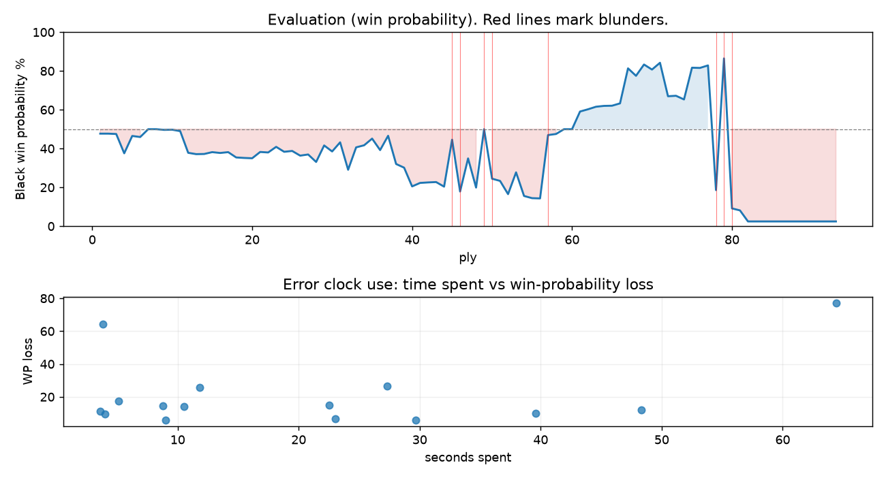

# (free, so lmk) Game analysis: DanielKetterer vs vimlesh12345

Date: 2026.07.28  |  Time control: rapid (1800)  |  You played: black
Game ID: 8dbd9e9a-8aa4-11f1-a04b-79503601000f
Analysis: depth=24 multipv=3 findability=honest floor=6 stable_run=3 threads=1 hash_mb=256 deterministic=True engine_id=Stockfish_18 generated=2026-07-28T17:31:34Z
Game end time UTC: 2026-07-28T17:14:09+00:00
Game: https://www.chess.com/game/live/172204968774

## Summary

- Lichess accuracy: you 53.3%, opponent 64.0%
- Opening: C40 King's Pawn Game: Gunderam Gambit (theory followed through ply 4)
- First deviation from theory: ply 5, Opponent played 3. Bc4
- Your moves: 18 best, 5 excellent, 8 good, 5 inaccuracy, 6 mistake, 4 blunder

METRICS:

Best: The played move exactly matches Stockfish's top move

Excellent: A non-best move that loses 2 WP points or less.

Good: WP loss is over 2, but under 5 points; also used for losses under 20 when the position remains already decided.

Inaccuracy: WP loss is at least 5 but under 10 points.

Mistake: WP loss is at least 10 but under 20 points; also generally used when a forced mate is missed with under 10 points of WP loss.

Blunder: WP loss is 20 points or more, or a forced mate is missed with at least 10 points of WP loss.

See: https://support.chess.com/en/articles/8572705-how-are-moves-classified-what-is-a-blunder-or-brilliant-etc 

(Brillint, Great and Miss are rating subjective)
- Puzzles: 31 open, 0 solved

### Puzzle gate tally (this game)

Gates: category in ['brilliant_sacrifice', 'missed_tactic', 'allowed_tactic', 'endgame'], refute depth in [3, 8], best-vs-second WP gap >= 5. Refute bar per move: max(5, 0.6 x WP loss).

| outcome | errors |
|---|---|
| accepted | 4 |
| category:attention | 4 |
| category:positional | 3 |
| refute_too_deep | 1 |
| wp_gap_too_small | 3 |

Four gates pass at once or nothing is generated, so a zero here is a product of four pass rates rather than a fault. Read the binding gate off this table before changing any threshold.

### Sacrifices in the engine's line

Real sacrifices are listed but never served as puzzles: compensation that never resolves back into material has no gradable answer.

| Move | Offered | Kind | Quiet | Line ends | Verdict |
|---|---|---|---|---|---|
| 6 | -5.0 (piece) | sham | no | +3.0 pawns | opening_ply |
| 19 | -5.0 (piece) | real | yes | -1.0 pawns | real_sacrifice_not_gradable |
| 20 | -6.0 (piece) | real | yes | -1.0 pawns | real_sacrifice_not_gradable |
| 27 | -4.0 (piece) | sham | no | +2.0 pawns | obvious |
| 41 | -6.0 (piece) | real | yes | -6.0 pawns | real_sacrifice_not_gradable |

## Biggest missed opportunity

You played 40...Re4. Stockfish preferred Rd6, after which the main line runs 40...Rd6 41. Rc2 Rd4 42. Rc7 Rxf4+ 43. Ke2. The evaluation crossed from winning to losing, which matters more than the raw number. Why it went wrong: left rook on e4 insufficiently defended; motif: creates threat on g5, f4. Before committing to a quiet move here, the checklist is checks, captures, threats, in that order. The engine prefers this move from at or below depth 6, which is as shallow as this measurement resolves; it sits near the surface, a forcing move, the kind a checks-and-captures scan catches. Candidates considered by the engine: Rd6 (-5.04), Re1 (-3.88), Rc6 (-3.41).

## Critical positions

- Ply 20 (you), 10...Kxe6: +1.66 -> +1.68 [only-move situation]
- Ply 34 (you), 17...Nxe5: +1.03 -> +0.91 [only-move situation]
- Ply 39 (opponent), 20.Rxe5: +2.04 -> +2.28 [only-move situation]
- Ply 45 (opponent), 23.f3: +3.70 -> +0.59 [evaluation crossed winning -> equal]
- Ply 46 (you), 23...h6: +0.59 -> +4.14 [evaluation crossed equal -> losing]
- Ply 49 (opponent), 25.hxg5: +3.78 -> +0.00 [evaluation crossed winning -> equal]
- Ply 50 (you), 25...Rh3: +0.00 -> +3.06 [evaluation crossed equal -> losing]
- Ply 57 (opponent), 29.Nd5: +4.86 -> +0.33 [evaluation crossed winning -> equal]

## Your errors, move by move

| Move | Class | Category | WP loss | Refute depth | Seconds spent | Pre-error eval |
|---|---|---|---:|---|---:|---|
| 2...c6 | inaccuracy | attention | 10% | 1 | 40 | balanced |
| 6...Qxd7 | mistake | attention | 11% | 1 | 4 | balanced |
| 16...f5 | mistake | positional | 14% | 1 | 10 | balanced |
| 18...Ng6 | inaccuracy | positional | 6% | 1 | 9 | balanced |
| 19...Nxe5 | mistake | attention | 15% | 1 | 9 | balanced |
| 20...Re8 | inaccuracy | allowed_tactic | 10% | 10 | 4 | losing |
| 23...h6 | blunder | missed_tactic | 27% | 7 | 27 | balanced |
| 24...hxg5 | mistake | missed_tactic | 15% | 6 | 22 | losing |
| 25...Rh3 | blunder | missed_tactic | 26% | 8 | 12 | balanced |
| 26...Rh5 | inaccuracy | positional | 7% | 3 | 23 | losing |
| 27...Re3 | mistake | missed_tactic | 12% | 4 | 48 | losing |
| 36...Rc5+ | mistake | missed_tactic | 17% | 7 | 5 | winning |
| 39...Kf5 | blunder | allowed_tactic | 64% | 4 | 4 | winning |
| 40...Re4 | blunder | attention | 77% | 2 | 64 | winning |
| 41...Re5 | inaccuracy | allowed_tactic | 6% | 5 | 30 | losing |

### 2...c6 (inaccuracy, positional, wp loss 10%)

You played 2...c6. Stockfish preferred Nc6, after which the main line runs 2...Nc6 3. Bc4 Nf6 4. d3 Bc5 5. O-O. Why it went wrong: left pawn on e5 insufficiently defended. This was a judgment error rather than a missed tactic; compare the pawn structure and piece activity after both moves. The engine prefers this move from at or below depth 6, which is as shallow as this measurement resolves; it sits near the surface, a quiet move, but one whose point shows at a glance. Candidates considered by the engine: Nc6 (+0.27), Nf6 (+0.35), d6 (+0.64).

### 6...Qxd7 (mistake, tactical, wp loss 11%)

You played 6...Qxd7. Stockfish preferred Nxd7, after which the main line runs 6...Nxd7 7. Qe2 Qe7 8. d3 Qe6 9. O-O. Why it went wrong: left pawn on e5 insufficiently defended; a favorable capture was available (Kxd7). Before committing to a quiet move here, the checklist is checks, captures, threats, in that order. The engine prefers this move from at or below depth 6, which is as shallow as this measurement resolves; it sits near the surface, a forcing move, the kind a checks-and-captures scan catches. Candidates considered by the engine: Nxd7 (+0.11), Qxd7 (+1.36), Kxd7 (+2.63).

### 16...f5 (mistake, positional, wp loss 14%)

You played 16...f5. Stockfish preferred Rc8, after which the main line runs 16...Rc8 17. a4 b4 18. Na2 Ng6 19. Bg3. The evaluation crossed from equal to losing, which matters more than the raw number. This was a judgment error rather than a missed tactic; compare the pawn structure and piece activity after both moves. The engine first prefers this move at depth 7 and holds it; findable, but it takes a deliberate look rather than a scan. Candidates considered by the engine: Rc8 (+0.74), Nb6 (+0.92), b4 (+1.03).

### 18...Ng6 (inaccuracy, positional, wp loss 6%)

You played 18...Ng6. Stockfish preferred Rc8, after which the main line runs 18...Rc8 19. Rac1 h6 20. gxh6 Rxh6 21. f4. Why it went wrong: left pawn on d5 insufficiently defended. This was a judgment error rather than a missed tactic; compare the pawn structure and piece activity after both moves. The engine does not settle on this move until depth 15; reachable with real calculation, but not on a scan. Candidates considered by the engine: Rc8 (+0.53), h6 (+0.55), b4 (+0.79).

### 19...Nxe5 (mistake, tactical, wp loss 15%)

You played 19...Nxe5. Stockfish preferred Bb4, after which the main line runs 19...Bb4 20. a4 Rhc8 21. axb5 axb5 22. Rxa8. The evaluation crossed from equal to losing, which matters more than the raw number. Why it went wrong: left knight on e5, pawn on d5 insufficiently defended. Before committing to a quiet move here, the checklist is checks, captures, threats, in that order. The engine prefers this move from at or below depth 6, which is as shallow as this measurement resolves; it sits near the surface, a forcing move, the kind a checks-and-captures scan catches. Candidates considered by the engine: Bb4 (+0.37), Rd8 (+0.48), h6 (+0.77).

### 20...Re8 (inaccuracy, positional, wp loss 10%)

You played 20...Re8. Stockfish preferred g6, after which the main line runs 20...g6 21. Rae1 h6 22. gxh6 Rd8 23. Kg2. Why it went wrong: left pawn on f5, pawn on d5 insufficiently defended. This was a judgment error rather than a missed tactic; compare the pawn structure and piece activity after both moves. The engine prefers this move from at or below depth 6, which is as shallow as this measurement resolves; it sits near the surface, a quiet move, but one whose point shows at a glance. Candidates considered by the engine: g6 (+2.28), Kg6 (+2.82), Rd8 (+3.19).

### 23...h6 (blunder, tactical, wp loss 27%)

You played 23...h6. Stockfish preferred Bxc3, after which the main line runs 23...Bxc3 24. bxc3 Re2 25. Rf1 Rxc2 26. Rc5. The evaluation crossed from equal to losing, which matters more than the raw number. Before committing to a quiet move here, the checklist is checks, captures, threats, in that order. The engine prefers this move from at or below depth 6, which is as shallow as this measurement resolves; it sits near the surface, a forcing move, the kind a checks-and-captures scan catches. Candidates considered by the engine: Bxc3 (+0.59), Rhf8 (+1.60), Ref8 (+3.17).

### 24...hxg5 (mistake, tactical, wp loss 15%)

You played 24...hxg5. Stockfish preferred Bxc3, after which the main line runs 24...Bxc3 25. bxc3 hxg5 26. Rxg5+ Kf6 27. Kg2. Before committing to a quiet move here, the checklist is checks, captures, threats, in that order. The engine prefers this move from at or below depth 6, which is as shallow as this measurement resolves; it sits near the surface, a forcing move, the kind a checks-and-captures scan catches. Candidates considered by the engine: Bxc3 (+1.69), Rc8 (+2.87), Rhf8 (+3.18).

### 25...Rh3 (blunder, tactical, wp loss 26%)

You played 25...Rh3. Stockfish preferred Bxc3, after which the main line runs 25...Bxc3 26. bxc3 Re2 27. Re5 Rxc2 28. a4. The evaluation crossed from equal to losing, which matters more than the raw number. Before committing to a quiet move here, the checklist is checks, captures, threats, in that order. The engine prefers this move from at or below depth 6, which is as shallow as this measurement resolves; it sits near the surface, a forcing move, the kind a checks-and-captures scan catches. Candidates considered by the engine: Bxc3 (+0.00), Rc8 (+1.64), Ref8 (+2.09).

### 26...Rh5 (inaccuracy, positional, wp loss 7%)

You played 26...Rh5. Stockfish preferred Reh8, after which the main line runs 26...Reh8 27. Ne4 Rh2+ 28. Kg3 R2h3+ 29. Kf2. Why it went wrong: motif: creates threat on g5. This was a judgment error rather than a missed tactic; compare the pawn structure and piece activity after both moves. The engine prefers this move from at or below depth 6, which is as shallow as this measurement resolves; it sits near the surface, a quiet move, but one whose point shows at a glance. Candidates considered by the engine: Reh8 (+3.23), Rh4 (+4.18), Rh7 (+4.31).

### 27...Re3 (mistake, tactical, wp loss 12%)

You played 27...Re3. Stockfish preferred Bxc3, after which the main line runs 27...Bxc3 28. bxc3 Re3 29. Rf1 Rxc3 30. Rf2. Before committing to a quiet move here, the checklist is checks, captures, threats, in that order. The engine prefers this move from at or below depth 6, which is as shallow as this measurement resolves; it sits near the surface, a forcing move, the kind a checks-and-captures scan catches. Candidates considered by the engine: Bxc3 (+2.60), Rh4 (+3.51), Rhh8 (+3.69).

### 36...Rc5+ (mistake, tactical, wp loss 17%)

You played 36...Rc5+. Stockfish preferred Re2+, after which the main line runs 36...Re2+ 37. Kd5 Kf5 38. a4 Rxe6 39. axb5. Why it went wrong: the best move was a forcing check; motif: creates threat on g5, b2. Before committing to a quiet move here, the checklist is checks, captures, threats, in that order. The engine prefers this move from at or below depth 6, which is as shallow as this measurement resolves; it sits near the surface, a forcing move, the kind a checks-and-captures scan catches. Candidates considered by the engine: Re2+ (-4.55), Rf2 (-3.91), Rg2 (-3.78).

### 39...Kf5 (blunder, positional, wp loss 64%)

You played 39...Kf5. Stockfish preferred Rd6, after which the main line runs 39...Rd6 40. Re1 Rd3+ 41. Kg4 Kf7 42. a3. The evaluation crossed from winning to losing, which matters more than the raw number. Why it went wrong: motif: creates threat on g5, d1; your king's zone came under heavier attack after this move. This was a judgment error rather than a missed tactic; compare the pawn structure and piece activity after both moves. The engine prefers this move from at or below depth 6, which is as shallow as this measurement resolves; it sits near the surface, a quiet move, but one whose point shows at a glance. Candidates considered by the engine: Rd6 (-4.28), Rc6 (-3.44), Kf7 (-3.44).

### 40...Re4 (blunder, tactical, wp loss 77%)

You played 40...Re4. Stockfish preferred Rd6, after which the main line runs 40...Rd6 41. Rc2 Rd4 42. Rc7 Rxf4+ 43. Ke2. The evaluation crossed from winning to losing, which matters more than the raw number. Why it went wrong: left rook on e4 insufficiently defended; motif: creates threat on g5, f4. Before committing to a quiet move here, the checklist is checks, captures, threats, in that order. The engine prefers this move from at or below depth 6, which is as shallow as this measurement resolves; it sits near the surface, a forcing move, the kind a checks-and-captures scan catches. Candidates considered by the engine: Rd6 (-5.04), Re1 (-3.88), Rc6 (-3.41).

### 41...Re5 (inaccuracy, positional, wp loss 6%)

You played 41...Re5. Stockfish preferred Ke6, after which the main line runs 41...Ke6 42. Kxe4 g6 43. Rd3 Bf8 44. Rd8. Why it went wrong: left rook on e5 insufficiently defended; motif: creates threat on d5. This was a judgment error rather than a missed tactic; compare the pawn structure and piece activity after both moves. The engine prefers this move from at or below depth 6, which is as shallow as this measurement resolves; it sits near the surface, a quiet move, but one whose point shows at a glance. Candidates considered by the engine: Ke6 (+6.58), Kg6 (+6.84), Re5 (M14).

## Full move table

| Ply | Move | Eval before | Eval after | Best | CP loss | WP loss | Class |
|-----|------|-------------|------------|------|---------|---------|-------|
| 1 | 1.e4 | +0.31 | +0.25 | e4 | 6 | 1% | best |
| 2 | 1...e5* | +0.25 | +0.25 | e5 | 0 | 0% | best |
| 3 | 2.Nf3 | +0.25 | +0.27 | Nf3 | 0 | 0% | best |
| 4 | 2...c6* | +0.27 | +1.38 | Nc6 | 111 | 10% | inaccuracy |
| 5 | 3.Bc4 | +1.38 | +0.38 | d4 | 100 | 9% | inaccuracy |
| 6 | 3...d5* | +0.38 | +0.44 | d5 | 6 | 1% | best |
| 7 | 4.exd5 | +0.44 | +0.00 | Bb3 | 44 | 4% | good |
| 8 | 4...cxd5* | +0.00 | +0.00 | cxd5 | 0 | 0% | best |
| 9 | 5.Bb5+ | +0.00 | +0.04 | Bb5+ | 0 | 0% | best |
| 10 | 5...Bd7* | +0.04 | +0.03 | Bd7 | 0 | 0% | best |
| 11 | 6.Bxd7+ | +0.03 | +0.11 | Bxd7+ | 0 | 0% | best |
| 12 | 6...Qxd7* | +0.11 | +1.35 | Nxd7 | 124 | 11% | mistake |
| 13 | 7.Nxe5 | +1.35 | +1.43 | Nxe5 | 0 | 0% | best |
| 14 | 7...Qe6* | +1.43 | +1.42 | Qe6 | 0 | 0% | best |
| 15 | 8.d4 | +1.42 | +1.31 | O-O | 11 | 1% | excellent |
| 16 | 8...f6* | +1.31 | +1.36 | f6 | 5 | 0% | best |
| 17 | 9.Qg4 | +1.36 | +1.31 | Qg4 | 5 | 0% | best |
| 18 | 9...Ke7* | +1.31 | +1.63 | Qxg4 | 32 | 3% | good |
| 19 | 10.Qxe6+ | +1.63 | +1.66 | Qxe6+ | 0 | 0% | best |
| 20 | 10...Kxe6* | +1.66 | +1.68 | Kxe6 | 2 | 0% | best |
| 21 | 11.Nf3 | +1.68 | +1.30 | Nd3 | 38 | 3% | good |
| 22 | 11...Kf7* | +1.30 | +1.33 | Nc6 | 3 | 0% | excellent |
| 23 | 12.O-O | +1.33 | +1.00 | Ke2 | 33 | 3% | good |
| 24 | 12...Ne7* | +1.00 | +1.29 | g5 | 29 | 3% | good |
| 25 | 13.Nc3 | +1.29 | +1.24 | h4 | 5 | 0% | excellent |
| 26 | 13...Nd7* | +1.24 | +1.52 | Nbc6 | 28 | 2% | good |
| 27 | 14.Bf4 | +1.52 | +1.45 | Nb5 | 7 | 1% | excellent |
| 28 | 14...a6* | +1.45 | +1.91 | g5 | 46 | 4% | good |
| 29 | 15.g4 | +1.91 | +0.92 | Bd6 | 99 | 9% | inaccuracy |
| 30 | 15...b5* | +0.92 | +1.27 | g5 | 35 | 3% | good |
| 31 | 16.g5 | +1.27 | +0.74 | Bd6 | 53 | 5% | good |
| 32 | 16...f5* | +0.74 | +2.42 | Rc8 | 168 | 14% | mistake |
| 33 | 17.Ne5+ | +2.42 | +1.03 | a3 | 139 | 12% | mistake |
| 34 | 17...Nxe5* | +1.03 | +0.91 | Nxe5 | 0 | 0% | best |
| 35 | 18.Bxe5 | +0.91 | +0.53 | dxe5 | 38 | 3% | good |
| 36 | 18...Ng6* | +0.53 | +1.19 | Rc8 | 66 | 6% | inaccuracy |
| 37 | 19.Rfe1 | +1.19 | +0.37 | a4 | 82 | 7% | inaccuracy |
| 38 | 19...Nxe5* | +0.37 | +2.04 | Bb4 | 167 | 15% | mistake |
| 39 | 20.Rxe5 | +2.04 | +2.28 | Rxe5 | 0 | 0% | best |
| 40 | 20...Re8* | +2.28 | +3.68 | g6 | 140 | 10% | inaccuracy |
| 41 | 21.Rxf5+ | +3.68 | +3.39 | Rxe8 | 29 | 2% | excellent |
| 42 | 21...Kg6* | +3.39 | +3.35 | Kg6 | 0 | 0% | best |
| 43 | 22.Rxd5 | +3.35 | +3.32 | Rf3 | 3 | 0% | excellent |
| 44 | 22...Bb4* | +3.32 | +3.70 | b4 | 38 | 2% | good |
| 45 | 23.f3 | +3.70 | +0.59 | Kf1 | 311 | 24% | blunder |
| 46 | 23...h6* | +0.59 | +4.14 | Bxc3 | 355 | 27% | blunder |
| 47 | 24.h4 | +4.14 | +1.69 | Ne4 | 245 | 17% | mistake |
| 48 | 24...hxg5* | +1.69 | +3.78 | Bxc3 | 209 | 15% | mistake |
| 49 | 25.hxg5 | +3.78 | +0.00 | Rxg5+ | 378 | 30% | blunder |
| 50 | 25...Rh3* | +0.00 | +3.06 | Bxc3 | 306 | 26% | blunder |
| 51 | 26.Kg2 | +3.06 | +3.23 | Kg2 | 0 | 0% | best |
| 52 | 26...Rh5* | +3.23 | +4.40 | Reh8 | 117 | 7% | inaccuracy |
| 53 | 27.f4 | +4.40 | +2.60 | Ne4 | 180 | 11% | mistake |
| 54 | 27...Re3* | +2.60 | +4.59 | Bxc3 | 199 | 12% | mistake |
| 55 | 28.Re5 | +4.59 | +4.83 | Re5 | 0 | 0% | best |
| 56 | 28...Reh3* | +4.83 | +4.86 | Reh3 | 3 | 0% | best |
| 57 | 29.Nd5 | +4.86 | +0.33 | Ne2 | 453 | 33% | blunder |
| 58 | 29...Rh2+* | +0.33 | +0.27 | Rh2+ | 0 | 0% | best |
| 59 | 30.Kf3 | +0.27 | +0.00 | Kf1 | 27 | 2% | good |
| 60 | 30...R5h3+* | +0.00 | +0.00 | R5h3+ | 0 | 0% | best |
| 61 | 31.Ke4 | +0.00 | -1.00 | Kg4 | 100 | 9% | inaccuracy |
| 62 | 31...Re2+* | -1.00 | -1.13 | Re2+ | 0 | 0% | best |
| 63 | 32.Ne3 | -1.13 | -1.28 | Ne3 | 15 | 1% | best |
| 64 | 32...Rhxe3+* | -1.28 | -1.33 | Rhxe3+ | 0 | 0% | best |
| 65 | 33.Kd5 | -1.33 | -1.34 | Kd5 | 1 | 0% | best |
| 66 | 33...Rxe5+* | -1.34 | -1.48 | Rxe5+ | 0 | 0% | best |
| 67 | 34.dxe5 | -1.48 | -4.00 | fxe5 | 252 | 18% | mistake |
| 68 | 34...Rxc2* | -4.00 | -3.36 | Bd2 | 64 | 4% | good |
| 69 | 35.e6 | -3.36 | -4.37 | Ke6 | 101 | 6% | inaccuracy |
| 70 | 35...Be7* | -4.37 | -3.89 | Rxb2 | 48 | 3% | good |
| 71 | 36.Ke5 | -3.89 | -4.55 | Ke4 | 66 | 4% | good |
| 72 | 36...Rc5+* | -4.55 | -1.92 | Re2+ | 263 | 17% | mistake |
| 73 | 37.Ke4 | -1.92 | -1.95 | Ke4 | 3 | 0% | best |
| 74 | 37...Rc6* | -1.95 | -1.72 | Rc4+ | 23 | 2% | excellent |
| 75 | 38.Rd1 | -1.72 | -4.06 | f5+ | 234 | 16% | mistake |
| 76 | 38...Rxe6+* | -4.06 | -4.04 | Rxe6+ | 2 | 0% | best |
| 77 | 39.Kf3 | -4.04 | -4.28 | Kf3 | 24 | 1% | best |
| 78 | 39...Kf5* | -4.28 | +4.01 | Rd6 | 829 | 64% | blunder |
| 79 | 40.Rd2 | +4.01 | -5.04 | Rd5+ | 905 | 68% | blunder |
| 80 | 40...Re4* | -5.04 | +6.23 | Rd6 | 1127 | 77% | blunder |
| 81 | 41.Rd5+ | +6.23 | +6.58 | Rd5+ | 0 | 0% | best |
| 82 | 41...Re5* | +6.58 | M14 | Ke6 |  | 6% | inaccuracy |
| 83 | 42.Rxe5+ | M14 | M13 | Rxe5+ |  | 0% | best |
| 84 | 42...Kg6* | M13 | M13 | Kg6 |  | 0% | best |
| 85 | 43.Rxe7 | M13 | M12 | Rxe7 |  | 0% | best |
| 86 | 43...a5* | M12 | M6 | Kf5 |  | 0% | excellent |
| 87 | 44.Kg4 | M6 | M5 | Kg4 |  | 0% | best |
| 88 | 44...a4* | M5 | M4 | Kh7 |  | 0% | excellent |
| 89 | 45.f5+ | M4 | M3 | f5+ |  | 0% | best |
| 90 | 45...Kh7* | M3 | M3 | Kh7 |  | 0% | best |
| 91 | 46.f6 | M3 | M5 | g6+ |  | 0% | excellent |
| 92 | 46...Kg6* | M5 | M1 | Kg8 |  | 0% | excellent |
| 93 | 47.Rxg7# | M1 | M1 | Rxg7# |  | 0% | best |

Rows marked * are your moves. WP loss is win-probability loss; it is the primary signal, CP loss is shown for reference.

## Patterns in this game

- Error categories: 3 allowed_tactic, 4 attention, 5 missed_tactic, 3 positional.
- Attention errors per 100 moves: 8.7.
- Pre-error eval buckets: 3 winning, 7 balanced, 5 losing.
- Opening: 2 error(s) (avg wp loss 11%).
- Middlegame: 9 error(s) (avg wp loss 14%).
- Endgame: 4 error(s) (avg wp loss 41%).
