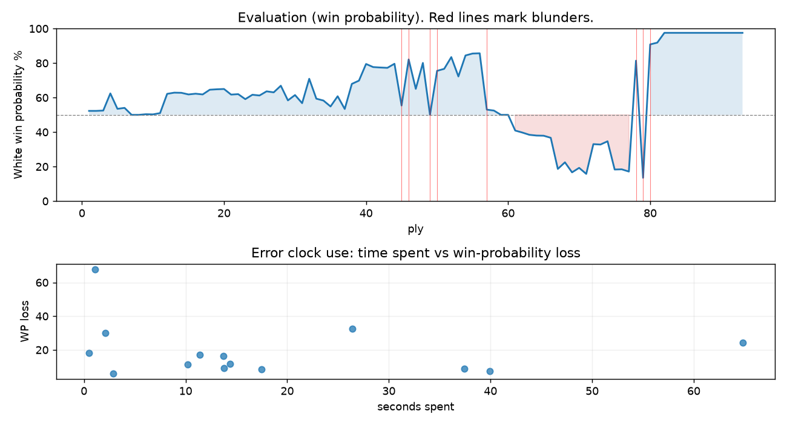

# (free, so lmk) Game analysis: DanielKetterer vs vimlesh12345

Date: 2026.07.28  |  Time control: rapid (1800)  |  You played: white
Game ID: 8dbd9e9a-8aa4-11f1-a04b-79503601000f
Analysis: depth=24 multipv=3 findability=honest floor=6 stable_run=3 threads=1 hash_mb=256 deterministic=True engine_id=Stockfish_18 generated=2026-07-28T17:31:34Z
Game end time UTC: 2026-07-28T17:14:09+00:00
Game: https://www.chess.com/game/live/172204968774

## Summary

- Lichess accuracy: you 64.0%, opponent 53.3%
- Opening: C40 King's Pawn Game: Gunderam Gambit (theory followed through ply 4)
- First deviation from theory: ply 5, You played 3. Bc4
- Your moves: 20 best, 6 excellent, 7 good, 5 inaccuracy, 5 mistake, 4 blunder

METRICS:

Best: The played move exactly matches Stockfish's top move

Excellent: A non-best move that loses 2 WP points or less.

Good: WP loss is over 2, but under 5 points; also used for losses under 20 when the position remains already decided.

Inaccuracy: WP loss is at least 5 but under 10 points.

Mistake: WP loss is at least 10 but under 20 points; also generally used when a forced mate is missed with under 10 points of WP loss.

Blunder: WP loss is 20 points or more, or a forced mate is missed with at least 10 points of WP loss.

See: https://support.chess.com/en/articles/8572705-how-are-moves-classified-what-is-a-blunder-or-brilliant-etc 

(Brillint, Great and Miss are rating subjective)
- Puzzles: 27 open, 0 solved

### Puzzle gate tally (this game)

Gates: category in ['brilliant_sacrifice', 'missed_tactic', 'allowed_tactic', 'endgame'], refute depth in [3, 8], best-vs-second WP gap >= 5. Refute bar per move: max(5, 0.6 x WP loss).

| outcome | errors |
|---|---|
| accepted | 3 |
| category:attention | 5 |
| category:opening | 1 |
| category:positional | 1 |
| refute_too_deep | 2 |
| refute_too_shallow | 2 |

Four gates pass at once or nothing is generated, so a zero here is a product of four pass rates rather than a fault. Read the binding gate off this table before changing any threshold.

### Sacrifices in the engine's line

Real sacrifices are listed but never served as puzzles: compensation that never resolves back into material has no gradable answer.

| Move | Offered | Kind | Quiet | Line ends | Verdict |
|---|---|---|---|---|---|
| 3 | -9.0 (piece) | sham | yes | +1.0 pawns | opening_ply |
| 17 | -2.0 (exchange) | sham | yes | +0.0 pawns | puzzle |
| 19 | -3.0 (piece) | real | yes | -1.0 pawns | real_sacrifice_not_gradable |
| 23 | -5.0 (piece) | real | yes | -1.0 pawns | real_sacrifice_not_gradable |
| 29 | -5.0 (piece) | sham | yes | +0.0 pawns | obvious |
| 35 | -2.0 (exchange) | real | yes | -1.0 pawns | real_sacrifice_not_gradable |

## Biggest missed opportunity

You played 40.Rd2. Stockfish preferred Rd5+, after which the main line runs 40. Rd5+ Kg6 41. f5+ Kxg5 42. fxe6+ Kf6. The evaluation crossed from winning to losing, which matters more than the raw number. Why it went wrong: left pawn on g5, pawn on f4 insufficiently defended; the best move was a forcing check. Before committing to a quiet move here, the checklist is checks, captures, threats, in that order. The engine prefers this move from at or below depth 6, which is as shallow as this measurement resolves; it sits near the surface, a forcing move, the kind a checks-and-captures scan catches. Candidates considered by the engine: Rd5+ (+4.01), Rd7 (-2.91), Rd3 (-3.69).

## Critical positions

- Ply 20 (opponent), 10...Kxe6: +1.66 -> +1.68 [only-move situation]
- Ply 34 (opponent), 17...Nxe5: +1.03 -> +0.91 [only-move situation]
- Ply 39 (you), 20.Rxe5: +2.04 -> +2.28 [only-move situation]
- Ply 45 (you), 23.f3: +3.70 -> +0.59 [evaluation crossed winning -> equal]
- Ply 46 (opponent), 23...h6: +0.59 -> +4.14 [evaluation crossed equal -> losing]
- Ply 49 (you), 25.hxg5: +3.78 -> +0.00 [evaluation crossed winning -> equal]
- Ply 50 (opponent), 25...Rh3: +0.00 -> +3.06 [evaluation crossed equal -> losing]
- Ply 57 (you), 29.Nd5: +4.86 -> +0.33 [evaluation crossed winning -> equal]

## Your errors, move by move

| Move | Class | Category | WP loss | Refute depth | Seconds spent | Pre-error eval |
|---|---|---|---:|---|---:|---|
| 3.Bc4 | inaccuracy | opening | 9% | 1 | 37 | balanced |
| 15.g4 | inaccuracy | positional | 9% | 3 | 18 | winning |
| 17.Ne5+ | mistake | brilliant_sacrifice | 12% | 1 | 14 | winning |
| 19.Rfe1 | inaccuracy | allowed_tactic | 7% | 1 | 40 | balanced |
| 23.f3 | blunder | allowed_tactic | 24% | 16 | 65 | winning |
| 24.h4 | mistake | attention | 17% | 1 | 11 | winning |
| 25.hxg5 | blunder | missed_tactic | 30% | 3 | 2 | winning |
| 27.f4 | mistake | attention | 11% | 1 | 10 | winning |
| 29.Nd5 | blunder | missed_tactic | 33% | 10 | 26 | winning |
| 31.Ke4 | inaccuracy | attention | 9% | 2 | 14 | balanced |
| 34.dxe5 | mistake | missed_tactic | 18% | 5 | 0 | balanced |
| 35.e6 | inaccuracy | attention | 6% | 1 | 3 | losing |
| 38.Rd1 | mistake | attention | 16% | 1 | 14 | losing |
| 40.Rd2 | blunder | missed_tactic | 68% | 5 | 1 | winning |

### 3.Bc4 (inaccuracy, positional, wp loss 9%)

You played 3.Bc4. Stockfish preferred d4, after which the main line runs 3. d4 exd4 4. Qxd4 d6 5. Bf4 Qb6. Why it went wrong: motif: creates threat on e5. This was a judgment error rather than a missed tactic; compare the pawn structure and piece activity after both moves. The engine does not settle on this move until depth 18; reachable with real calculation, but not on a scan. Candidates considered by the engine: d4 (+1.38), Nxe5 (+1.07), Nc3 (+0.66).

### 15.g4 (inaccuracy, positional, wp loss 9%)

You played 15.g4. Stockfish preferred Bd6, after which the main line runs 15. Bd6 Rc8 16. Rfc1 Nb6 17. Bc5 Rc6. The evaluation crossed from winning to equal, which matters more than the raw number. This was a judgment error rather than a missed tactic; compare the pawn structure and piece activity after both moves. The engine prefers this move from at or below depth 6, which is as shallow as this measurement resolves; it sits near the surface, a quiet move, but one whose point shows at a glance. Candidates considered by the engine: Bd6 (+1.91), a4 (+1.59), Rfc1 (+1.53).

### 17.Ne5+ (mistake, positional, wp loss 12%)

You played 17.Ne5+. Stockfish preferred a3, after which the main line runs 17. a3 h6 18. h4 Ng6 19. Nxd5 Nxf4. The evaluation crossed from winning to equal, which matters more than the raw number. This was a judgment error rather than a missed tactic; compare the pawn structure and piece activity after both moves. The engine never settles on this move within the analysis depth, so how findable it was is not measured here; weigh this one lightly. Candidates considered by the engine: a3 (+2.42), Rfe1 (+2.26), h4 (+2.26).

### 19.Rfe1 (inaccuracy, positional, wp loss 7%)

You played 19.Rfe1. Stockfish preferred a4, after which the main line runs 19. a4 b4 20. Nxd5 h6 21. c4 bxc3. Why it went wrong: motif: creates threat on d5. This was a judgment error rather than a missed tactic; compare the pawn structure and piece activity after both moves. The engine does not settle on this move until depth 12; reachable with real calculation, but not on a scan. Candidates considered by the engine: a4 (+1.19), f4 (+1.06), Nxd5 (+1.03).

### 23.f3 (blunder, tactical, wp loss 24%)

You played 23.f3. Stockfish preferred Kf1, after which the main line runs 23. Kf1 h6 24. a4 hxg5 25. axb5 a5. The evaluation crossed from winning to equal, which matters more than the raw number. Why it went wrong: left pawn on g5 insufficiently defended. Before committing to a quiet move here, the checklist is checks, captures, threats, in that order. The engine does not settle on this move until depth 19; reachable with real calculation, but not on a scan. Candidates considered by the engine: Kf1 (+3.70), a4 (+3.52), Nd1 (+2.49).

### 24.h4 (mistake, tactical, wp loss 17%)

You played 24.h4. Stockfish preferred Ne4, after which the main line runs 24. Ne4 Be7 25. gxh6 Rxh6 26. Re1 Rd8. Why it went wrong: left pawn on g5 insufficiently defended. Before committing to a quiet move here, the checklist is checks, captures, threats, in that order. The engine prefers this move from at or below depth 6, which is as shallow as this measurement resolves; it sits near the surface, a forcing move, the kind a checks-and-captures scan catches. Candidates considered by the engine: Ne4 (+4.14), a4 (+3.54), gxh6 (+2.64).

### 25.hxg5 (blunder, tactical, wp loss 30%)

You played 25.hxg5. Stockfish preferred Rxg5+, after which the main line runs 25. Rxg5+ Kf7 26. Ne4 Rxh4 27. Kf2 Be7. The evaluation crossed from winning to equal, which matters more than the raw number. Why it went wrong: left pawn on g5 insufficiently defended; the best move was a forcing check; your king's zone came under heavier attack after this move. Before committing to a quiet move here, the checklist is checks, captures, threats, in that order. The engine prefers this move from at or below depth 6, which is as shallow as this measurement resolves; it sits near the surface, a forcing move, the kind a checks-and-captures scan catches. Candidates considered by the engine: Rxg5+ (+3.78), Ne4 (+2.67), h5+ (+1.90).

### 27.f4 (mistake, tactical, wp loss 11%)

You played 27.f4. Stockfish preferred Ne4, after which the main line runs 27. Ne4 Reh8 28. c3 Rh2+ 29. Kg3 Be7. Why it went wrong: left pawn on g5 insufficiently defended. Before committing to a quiet move here, the checklist is checks, captures, threats, in that order. The engine prefers this move from at or below depth 6, which is as shallow as this measurement resolves; it sits near the surface, a forcing move, the kind a checks-and-captures scan catches. Candidates considered by the engine: Ne4 (+4.40), a4 (+4.04), Kg3 (+3.35).

### 29.Nd5 (blunder, tactical, wp loss 33%)

You played 29.Nd5. Stockfish preferred Ne2, after which the main line runs 29. Ne2 R5h4 30. c3 Ba5 31. Ng3 Rh2+. The evaluation crossed from winning to equal, which matters more than the raw number. Why it went wrong: left pawn on g5 insufficiently defended; motif: creates threat on h3. Before committing to a quiet move here, the checklist is checks, captures, threats, in that order. The engine prefers this move from at or below depth 6, which is as shallow as this measurement resolves; it sits near the surface, a forcing move, the kind a checks-and-captures scan catches. Candidates considered by the engine: Ne2 (+4.86), Ne4 (+4.84), f5+ (+3.13).

### 31.Ke4 (inaccuracy, positional, wp loss 9%)

You played 31.Ke4. Stockfish preferred Kg4, after which the main line runs 31. Kg4 Rh4+ 32. Kg3 R4h3+ 33. Kg4. Why it went wrong: left pawn on g5, pawn on c2 insufficiently defended; motif: creates threat on b4, h3. This was a judgment error rather than a missed tactic; compare the pawn structure and piece activity after both moves. The engine prefers this move from at or below depth 6, which is as shallow as this measurement resolves; it sits near the surface, a quiet move, but one whose point shows at a glance. Candidates considered by the engine: Kg4 (+0.00), Ke4 (-1.03).

### 34.dxe5 (mistake, tactical, wp loss 18%)

You played 34.dxe5. Stockfish preferred fxe5, after which the main line runs 34. fxe5 Rxc2 35. a3 Bd2 36. Ke6 Rc4. The evaluation crossed from equal to losing, which matters more than the raw number. Why it went wrong: left pawn on g5, pawn on c2 insufficiently defended; a favorable capture was available (fxe5). Before committing to a quiet move here, the checklist is checks, captures, threats, in that order. The engine prefers this move from at or below depth 6, which is as shallow as this measurement resolves; it sits near the surface, a forcing move, the kind a checks-and-captures scan catches. Candidates considered by the engine: fxe5 (-1.48), dxe5 (-3.80), Kc6 (-6.83).

### 35.e6 (inaccuracy, positional, wp loss 6%)

You played 35.e6. Stockfish preferred Ke6, after which the main line runs 35. Ke6 Rf2 36. Rc1 Rxf4 37. Rc6 Rf7. Why it went wrong: left pawn on g5, pawn on b2 insufficiently defended. This was a judgment error rather than a missed tactic; compare the pawn structure and piece activity after both moves. The engine prefers this move from at or below depth 6, which is as shallow as this measurement resolves; it sits near the surface, a quiet move, but one whose point shows at a glance. Candidates considered by the engine: Ke6 (-3.36), Rh1 (-3.70), Rd1 (-3.79).

### 38.Rd1 (mistake, tactical, wp loss 16%)

You played 38.Rd1. Stockfish preferred f5+, after which the main line runs 38. f5+ Kh7 39. Rh1+ Kg8 40. g6 Rc4+. Why it went wrong: left pawn on e6, pawn on g5 insufficiently defended; the best move was a forcing check. Before committing to a quiet move here, the checklist is checks, captures, threats, in that order. The engine prefers this move from at or below depth 6, which is as shallow as this measurement resolves; it sits near the surface, a forcing move, the kind a checks-and-captures scan catches. Candidates considered by the engine: f5+ (-1.72), Ke5 (-1.90), Kd5 (-3.85).

### 40.Rd2 (blunder, tactical, wp loss 68%)

You played 40.Rd2. Stockfish preferred Rd5+, after which the main line runs 40. Rd5+ Kg6 41. f5+ Kxg5 42. fxe6+ Kf6. The evaluation crossed from winning to losing, which matters more than the raw number. Why it went wrong: left pawn on g5, pawn on f4 insufficiently defended; the best move was a forcing check. Before committing to a quiet move here, the checklist is checks, captures, threats, in that order. The engine prefers this move from at or below depth 6, which is as shallow as this measurement resolves; it sits near the surface, a forcing move, the kind a checks-and-captures scan catches. Candidates considered by the engine: Rd5+ (+4.01), Rd7 (-2.91), Rd3 (-3.69).

## Full move table

| Ply | Move | Eval before | Eval after | Best | CP loss | WP loss | Class |
|-----|------|-------------|------------|------|---------|---------|-------|
| 1 | 1.e4* | +0.31 | +0.25 | e4 | 6 | 1% | best |
| 2 | 1...e5 | +0.25 | +0.25 | e5 | 0 | 0% | best |
| 3 | 2.Nf3* | +0.25 | +0.27 | Nf3 | 0 | 0% | best |
| 4 | 2...c6 | +0.27 | +1.38 | Nc6 | 111 | 10% | inaccuracy |
| 5 | 3.Bc4* | +1.38 | +0.38 | d4 | 100 | 9% | inaccuracy |
| 6 | 3...d5 | +0.38 | +0.44 | d5 | 6 | 1% | best |
| 7 | 4.exd5* | +0.44 | +0.00 | Bb3 | 44 | 4% | good |
| 8 | 4...cxd5 | +0.00 | +0.00 | cxd5 | 0 | 0% | best |
| 9 | 5.Bb5+* | +0.00 | +0.04 | Bb5+ | 0 | 0% | best |
| 10 | 5...Bd7 | +0.04 | +0.03 | Bd7 | 0 | 0% | best |
| 11 | 6.Bxd7+* | +0.03 | +0.11 | Bxd7+ | 0 | 0% | best |
| 12 | 6...Qxd7 | +0.11 | +1.35 | Nxd7 | 124 | 11% | mistake |
| 13 | 7.Nxe5* | +1.35 | +1.43 | Nxe5 | 0 | 0% | best |
| 14 | 7...Qe6 | +1.43 | +1.42 | Qe6 | 0 | 0% | best |
| 15 | 8.d4* | +1.42 | +1.31 | O-O | 11 | 1% | excellent |
| 16 | 8...f6 | +1.31 | +1.36 | f6 | 5 | 0% | best |
| 17 | 9.Qg4* | +1.36 | +1.31 | Qg4 | 5 | 0% | best |
| 18 | 9...Ke7 | +1.31 | +1.63 | Qxg4 | 32 | 3% | good |
| 19 | 10.Qxe6+* | +1.63 | +1.66 | Qxe6+ | 0 | 0% | best |
| 20 | 10...Kxe6 | +1.66 | +1.68 | Kxe6 | 2 | 0% | best |
| 21 | 11.Nf3* | +1.68 | +1.30 | Nd3 | 38 | 3% | good |
| 22 | 11...Kf7 | +1.30 | +1.33 | Nc6 | 3 | 0% | excellent |
| 23 | 12.O-O* | +1.33 | +1.00 | Ke2 | 33 | 3% | good |
| 24 | 12...Ne7 | +1.00 | +1.29 | g5 | 29 | 3% | good |
| 25 | 13.Nc3* | +1.29 | +1.24 | h4 | 5 | 0% | excellent |
| 26 | 13...Nd7 | +1.24 | +1.52 | Nbc6 | 28 | 2% | good |
| 27 | 14.Bf4* | +1.52 | +1.45 | Nb5 | 7 | 1% | excellent |
| 28 | 14...a6 | +1.45 | +1.91 | g5 | 46 | 4% | good |
| 29 | 15.g4* | +1.91 | +0.92 | Bd6 | 99 | 9% | inaccuracy |
| 30 | 15...b5 | +0.92 | +1.27 | g5 | 35 | 3% | good |
| 31 | 16.g5* | +1.27 | +0.74 | Bd6 | 53 | 5% | good |
| 32 | 16...f5 | +0.74 | +2.42 | Rc8 | 168 | 14% | mistake |
| 33 | 17.Ne5+* | +2.42 | +1.03 | a3 | 139 | 12% | mistake |
| 34 | 17...Nxe5 | +1.03 | +0.91 | Nxe5 | 0 | 0% | best |
| 35 | 18.Bxe5* | +0.91 | +0.53 | dxe5 | 38 | 3% | good |
| 36 | 18...Ng6 | +0.53 | +1.19 | Rc8 | 66 | 6% | inaccuracy |
| 37 | 19.Rfe1* | +1.19 | +0.37 | a4 | 82 | 7% | inaccuracy |
| 38 | 19...Nxe5 | +0.37 | +2.04 | Bb4 | 167 | 15% | mistake |
| 39 | 20.Rxe5* | +2.04 | +2.28 | Rxe5 | 0 | 0% | best |
| 40 | 20...Re8 | +2.28 | +3.68 | g6 | 140 | 10% | inaccuracy |
| 41 | 21.Rxf5+* | +3.68 | +3.39 | Rxe8 | 29 | 2% | excellent |
| 42 | 21...Kg6 | +3.39 | +3.35 | Kg6 | 0 | 0% | best |
| 43 | 22.Rxd5* | +3.35 | +3.32 | Rf3 | 3 | 0% | excellent |
| 44 | 22...Bb4 | +3.32 | +3.70 | b4 | 38 | 2% | good |
| 45 | 23.f3* | +3.70 | +0.59 | Kf1 | 311 | 24% | blunder |
| 46 | 23...h6 | +0.59 | +4.14 | Bxc3 | 355 | 27% | blunder |
| 47 | 24.h4* | +4.14 | +1.69 | Ne4 | 245 | 17% | mistake |
| 48 | 24...hxg5 | +1.69 | +3.78 | Bxc3 | 209 | 15% | mistake |
| 49 | 25.hxg5* | +3.78 | +0.00 | Rxg5+ | 378 | 30% | blunder |
| 50 | 25...Rh3 | +0.00 | +3.06 | Bxc3 | 306 | 26% | blunder |
| 51 | 26.Kg2* | +3.06 | +3.23 | Kg2 | 0 | 0% | best |
| 52 | 26...Rh5 | +3.23 | +4.40 | Reh8 | 117 | 7% | inaccuracy |
| 53 | 27.f4* | +4.40 | +2.60 | Ne4 | 180 | 11% | mistake |
| 54 | 27...Re3 | +2.60 | +4.59 | Bxc3 | 199 | 12% | mistake |
| 55 | 28.Re5* | +4.59 | +4.83 | Re5 | 0 | 0% | best |
| 56 | 28...Reh3 | +4.83 | +4.86 | Reh3 | 3 | 0% | best |
| 57 | 29.Nd5* | +4.86 | +0.33 | Ne2 | 453 | 33% | blunder |
| 58 | 29...Rh2+ | +0.33 | +0.27 | Rh2+ | 0 | 0% | best |
| 59 | 30.Kf3* | +0.27 | +0.00 | Kf1 | 27 | 2% | good |
| 60 | 30...R5h3+ | +0.00 | +0.00 | R5h3+ | 0 | 0% | best |
| 61 | 31.Ke4* | +0.00 | -1.00 | Kg4 | 100 | 9% | inaccuracy |
| 62 | 31...Re2+ | -1.00 | -1.13 | Re2+ | 0 | 0% | best |
| 63 | 32.Ne3* | -1.13 | -1.28 | Ne3 | 15 | 1% | best |
| 64 | 32...Rhxe3+ | -1.28 | -1.33 | Rhxe3+ | 0 | 0% | best |
| 65 | 33.Kd5* | -1.33 | -1.34 | Kd5 | 1 | 0% | best |
| 66 | 33...Rxe5+ | -1.34 | -1.48 | Rxe5+ | 0 | 0% | best |
| 67 | 34.dxe5* | -1.48 | -4.00 | fxe5 | 252 | 18% | mistake |
| 68 | 34...Rxc2 | -4.00 | -3.36 | Bd2 | 64 | 4% | good |
| 69 | 35.e6* | -3.36 | -4.37 | Ke6 | 101 | 6% | inaccuracy |
| 70 | 35...Be7 | -4.37 | -3.89 | Rxb2 | 48 | 3% | good |
| 71 | 36.Ke5* | -3.89 | -4.55 | Ke4 | 66 | 4% | good |
| 72 | 36...Rc5+ | -4.55 | -1.92 | Re2+ | 263 | 17% | mistake |
| 73 | 37.Ke4* | -1.92 | -1.95 | Ke4 | 3 | 0% | best |
| 74 | 37...Rc6 | -1.95 | -1.72 | Rc4+ | 23 | 2% | excellent |
| 75 | 38.Rd1* | -1.72 | -4.06 | f5+ | 234 | 16% | mistake |
| 76 | 38...Rxe6+ | -4.06 | -4.04 | Rxe6+ | 2 | 0% | best |
| 77 | 39.Kf3* | -4.04 | -4.28 | Kf3 | 24 | 1% | best |
| 78 | 39...Kf5 | -4.28 | +4.01 | Rd6 | 829 | 64% | blunder |
| 79 | 40.Rd2* | +4.01 | -5.04 | Rd5+ | 905 | 68% | blunder |
| 80 | 40...Re4 | -5.04 | +6.23 | Rd6 | 1127 | 77% | blunder |
| 81 | 41.Rd5+* | +6.23 | +6.58 | Rd5+ | 0 | 0% | best |
| 82 | 41...Re5 | +6.58 | M14 | Ke6 |  | 6% | inaccuracy |
| 83 | 42.Rxe5+* | M14 | M13 | Rxe5+ |  | 0% | best |
| 84 | 42...Kg6 | M13 | M13 | Kg6 |  | 0% | best |
| 85 | 43.Rxe7* | M13 | M12 | Rxe7 |  | 0% | best |
| 86 | 43...a5 | M12 | M6 | Kf5 |  | 0% | excellent |
| 87 | 44.Kg4* | M6 | M5 | Kg4 |  | 0% | best |
| 88 | 44...a4 | M5 | M4 | Kh7 |  | 0% | excellent |
| 89 | 45.f5+* | M4 | M3 | f5+ |  | 0% | best |
| 90 | 45...Kh7 | M3 | M3 | Kh7 |  | 0% | best |
| 91 | 46.f6* | M3 | M5 | g6+ |  | 0% | excellent |
| 92 | 46...Kg6 | M5 | M1 | Kg8 |  | 0% | excellent |
| 93 | 47.Rxg7#* | M1 | M1 | Rxg7# |  | 0% | best |

Rows marked * are your moves. WP loss is win-probability loss; it is the primary signal, CP loss is shown for reference.

## Patterns in this game

- Error categories: 2 allowed_tactic, 5 attention, 1 brilliant_sacrifice, 4 missed_tactic, 1 opening, 1 positional.
- Attention errors per 100 moves: 10.6.
- Pre-error eval buckets: 8 winning, 4 balanced, 2 losing.
- Opening: 1 error(s) (avg wp loss 9%).
- Middlegame: 8 error(s) (avg wp loss 18%).
- Endgame: 5 error(s) (avg wp loss 23%).
