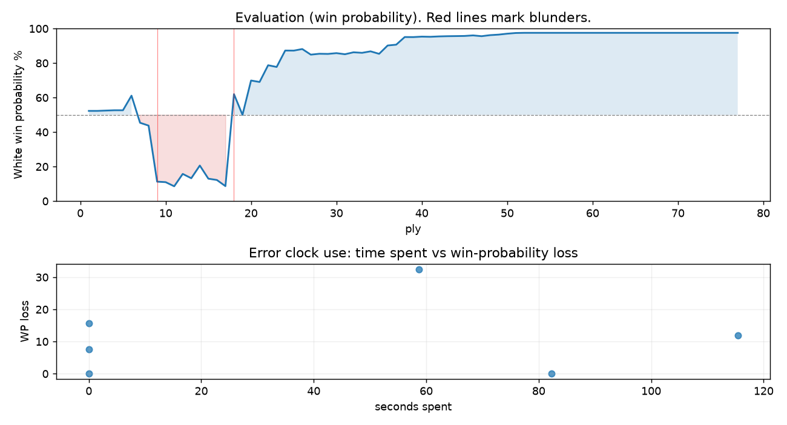

# (free, so lmk) Game analysis: DanielKetterer vs oliviervermeer

Date: 2026.07.23  |  Time control: daily (1/259200)  |  You played: white
Game ID: 113b6cb6-86a3-11f1-9564-d9b4fc01000b
Analysis: depth=24 multipv=3 findability=honest floor=6 stable_run=3 threads=1 hash_mb=256 deterministic=True engine_id=Stockfish_18 generated=2026-07-30T09:47:42Z
Game end time UTC: 2026-07-29T14:28:20+00:00
Game: https://www.chess.com/game/daily/1003439434

## Summary

- Lichess accuracy: you 85.3%, opponent 72.4%
- Opening: C50 Italian Game: Blackburne-Kostić Gambit (theory followed through ply 6)
- First deviation from theory: ply 7, You played 4. Nxe5
- Your moves: 14 best, 16 excellent, 3 good, 1 inaccuracy, 4 mistake, 1 blunder

METRICS:

Best: The played move exactly matches Stockfish's top move

Excellent: A non-best move that loses 2 WP points or less.

Good: WP loss is over 2, but under 5 points; also used for losses under 20 when the position remains already decided.

Inaccuracy: WP loss is at least 5 but under 10 points.

Mistake: WP loss is at least 10 but under 20 points; also generally used when a forced mate is missed with under 10 points of WP loss.

Blunder: WP loss is 20 points or more, or a forced mate is missed with at least 10 points of WP loss.

See: https://support.chess.com/en/articles/8572705-how-are-moves-classified-what-is-a-blunder-or-brilliant-etc 

(Brillint, Great and Miss are rating subjective)
- Puzzles: 33 open, 0 solved

### Puzzle gate tally (this game)

Gates: category in ['brilliant_sacrifice', 'missed_tactic', 'allowed_tactic', 'endgame'], refute depth in [3, 8], best-vs-second WP gap >= 5. Refute bar per move: max(5, 0.6 x WP loss).

| outcome | errors |
|---|---|
| category:positional | 2 |
| refute_censored_high | 1 |
| refute_too_deep | 1 |
| refute_too_shallow | 2 |

Four gates pass at once or nothing is generated, so a zero here is a product of four pass rates rather than a fault. Read the binding gate off this table before changing any threshold.

### Sacrifices in the engine's line

Real sacrifices are listed but never served as puzzles: compensation that never resolves back into material has no gradable answer.

| Move | Offered | Kind | Quiet | Line ends | Verdict |
|---|---|---|---|---|---|
| 4 | -4.0 (piece) | real | no | -3.0 pawns | real_sacrifice_not_gradable |
| 5 | -5.0 (piece) | real | yes | -2.0 pawns | real_sacrifice_not_gradable |
| 8 | -9.0 (piece) | real | yes | -6.0 pawns | real_sacrifice_not_gradable |
| 10 | -2.0 (exchange) | sham | yes | +1.0 pawns | opening_ply |

## Biggest missed opportunity

You played 5.Nxf7. Stockfish preferred O-O, after which the main line runs 5. O-O Qxe5 6. c3 Ne6 7. d4 Qxe4. The evaluation crossed from equal to losing, which matters more than the raw number. Why it went wrong: left knight on f7, pawn on g2 insufficiently defended. Before committing to a quiet move here, the checklist is checks, captures, threats, in that order. The engine never settles on this move within the analysis depth, so how findable it was is not measured here; weigh this one lightly. Candidates considered by the engine: O-O (-0.68), Bxf7+ (-0.69), d3 (-1.50).

## Critical positions

- Ply 9 (you), 5.Nxf7: -0.68 -> -5.60 [evaluation crossed equal -> losing]
- Ply 10 (opponent), 5...Qxg2: -5.60 -> -5.68 [only-move situation]
- Ply 18 (opponent), 9...Nb5: -6.39 -> +1.33 [evaluation crossed winning -> equal]
- Ply 21 (you), 11.e5: +2.29 -> +2.18 [only-move situation]
- Ply 29 (you), 15.cxd5: +4.80 -> +4.78 [only-move situation]
- Ply 67 (you), 34.Bxh4: M12 -> +17.08 [forced mate was on the board]
- Ply 71 (you), 36.Ne3: M2 -> +15.07 [forced mate was on the board]

## Your errors, move by move

| Move | Class | Category | WP loss | Refute depth | Seconds spent | Pre-error eval |
|---|---|---|---:|---|---:|---|
| 4.Nxe5 | mistake | missed_tactic | 16% | 14 | 0 | balanced |
| 5.Nxf7 | blunder | allowed_tactic | 32% | 2 | 59 | balanced |
| 8.Nxh8 | inaccuracy | allowed_tactic | 8% | >18 | 0 | losing |
| 10.dxc4 | mistake | missed_tactic | 12% | 1 | 115 | balanced |
| 34.Bxh4 | mistake | positional | 0% | >18 | 82 | winning |
| 36.Ne3 | mistake | positional | 0% | >18 | 0 | winning |

### 4.Nxe5 (mistake, tactical, wp loss 16%)

You played 4.Nxe5. Stockfish preferred Nxd4, after which the main line runs 4. Nxd4 exd4 5. O-O Nf6 6. Re1 d6. Why it went wrong: a favorable capture was available (Nxe5). Before committing to a quiet move here, the checklist is checks, captures, threats, in that order. The engine does not settle on this move until depth 11; reachable with real calculation, but not on a scan. Candidates considered by the engine: Nxd4 (+1.23), O-O (+1.05), a4 (+0.62).

### 5.Nxf7 (blunder, tactical, wp loss 32%)

You played 5.Nxf7. Stockfish preferred O-O, after which the main line runs 5. O-O Qxe5 6. c3 Ne6 7. d4 Qxe4. The evaluation crossed from equal to losing, which matters more than the raw number. Why it went wrong: left knight on f7, pawn on g2 insufficiently defended. Before committing to a quiet move here, the checklist is checks, captures, threats, in that order. The engine never settles on this move within the analysis depth, so how findable it was is not measured here; weigh this one lightly. Candidates considered by the engine: O-O (-0.68), Bxf7+ (-0.69), d3 (-1.50).

### 8.Nxh8 (inaccuracy, positional, wp loss 8%)

You played 8.Nxh8. Stockfish preferred Be3, after which the main line runs 8. Be3 Nf3+ 9. Qxf3 Qxf3 10. Nd2 Bb4. Why it went wrong: left bishop on c4, pawn on h2 insufficiently defended; motif: creates threat on h8, d4. This was a judgment error rather than a missed tactic; compare the pawn structure and piece activity after both moves. The engine does not settle on this move until depth 24, which is outside what a human reasonably calculates over the board; this is not a training target. Candidates considered by the engine: Be3 (-3.66), Bb3 (-3.71), Ne5 (-4.26).

### 10.dxc4 (mistake, tactical, wp loss 12%)

You played 10.dxc4. Stockfish preferred Be3, after which the main line runs 10. Be3 d5 11. Nd2 cxd3 12. Qb3 a6. Why it went wrong: left pawn on e4, pawn on h2 insufficiently defended; motif: creates threat on c4. Before committing to a quiet move here, the checklist is checks, captures, threats, in that order. The engine does not settle on this move until depth 12; reachable with real calculation, but not on a scan. Candidates considered by the engine: Be3 (+1.33), e5 (+1.10), Bf4 (+0.00).

### 34.Bxh4 (mistake, positional, wp loss 0%)

You played 34.Bxh4. Stockfish preferred Nd5+, after which the main line runs 34. Nd5+ Ke8 35. Re7+ Kd8 36. Rxe4+ Kc8. There was a forced mate on the board and this move let it slip. Why it went wrong: left knight on e7 insufficiently defended; the best move was a forcing check; motif: creates threat on h4, e4. This was a judgment error rather than a missed tactic; compare the pawn structure and piece activity after both moves. The engine never settles on this move within the analysis depth, so how findable it was is not measured here; weigh this one lightly. Candidates considered by the engine: Nd5+ (M12), Nxf5+ (M15), Bxh4 (+17.19).

### 36.Ne3 (mistake, positional, wp loss 0%)

You played 36.Ne3. Stockfish preferred Ng7+, after which the main line runs 36. Ng7+ Kd6 37. Bg3#. There was a forced mate on the board and this move let it slip. Why it went wrong: the best move was a forcing check; motif: creates threat on d5, e4. This was a judgment error rather than a missed tactic; compare the pawn structure and piece activity after both moves. The engine prefers this move from at or below depth 6, which is as shallow as this measurement resolves; it sits near the surface, a quiet move, but one whose point shows at a glance. Candidates considered by the engine: Ng7+ (M2), Ne3 (+14.86), Ne7 (+12.38).

## Full move table

| Ply | Move | Eval before | Eval after | Best | CP loss | WP loss | Class |
|-----|------|-------------|------------|------|---------|---------|-------|
| 1 | 1.e4* | +0.31 | +0.25 | e4 | 6 | 1% | best |
| 2 | 1...e5 | +0.25 | +0.25 | e5 | 0 | 0% | best |
| 3 | 2.Nf3* | +0.25 | +0.27 | Nf3 | 0 | 0% | best |
| 4 | 2...Nc6 | +0.27 | +0.29 | Nc6 | 2 | 0% | best |
| 5 | 3.Bc4* | +0.29 | +0.29 | Bc4 | 0 | 0% | best |
| 6 | 3...Nd4 | +0.29 | +1.23 | Nf6 | 94 | 8% | inaccuracy |
| 7 | 4.Nxe5* | +1.23 | -0.50 | Nxd4 | 173 | 16% | mistake |
| 8 | 4...Qg5 | -0.50 | -0.68 | Qg5 | 0 | 0% | best |
| 9 | 5.Nxf7* | -0.68 | -5.60 | O-O | 492 | 32% | blunder |
| 10 | 5...Qxg2 | -5.60 | -5.68 | Qxg2 | 0 | 0% | best |
| 11 | 6.Rf1* | -5.68 | -6.42 | d3 | 74 | 2% | good |
| 12 | 6...Nf6 | -6.42 | -4.55 | Qxe4+ | 187 | 7% | inaccuracy |
| 13 | 7.d3* | -4.55 | -5.10 | d3 | 55 | 3% | best |
| 14 | 7...b5 | -5.10 | -3.66 | d5 | 144 | 7% | inaccuracy |
| 15 | 8.Nxh8* | -3.66 | -5.16 | Be3 | 150 | 8% | inaccuracy |
| 16 | 8...bxc4 | -5.16 | -5.35 | bxc4 | 0 | 0% | best |
| 17 | 9.c3* | -5.35 | -6.39 | Be3 | 104 | 4% | good |
| 18 | 9...Nb5 | -6.39 | +1.33 | Nf3+ | 772 | 53% | blunder |
| 19 | 10.dxc4* | +1.33 | +0.00 | Be3 | 133 | 12% | mistake |
| 20 | 10...Nd6 | +0.00 | +2.29 | Qxe4+ | 229 | 20% | mistake |
| 21 | 11.e5* | +2.29 | +2.18 | e5 | 11 | 1% | best |
| 22 | 11...Nf7 | +2.18 | +3.56 | Bb7 | 138 | 10% | inaccuracy |
| 23 | 12.exf6* | +3.56 | +3.40 | Nxf7 | 16 | 1% | excellent |
| 24 | 12...gxf6 | +3.40 | +5.23 | Nxh8 | 183 | 10% | inaccuracy |
| 25 | 13.Nxf7* | +5.23 | +5.22 | Nxf7 | 1 | 0% | best |
| 26 | 13...Kxf7 | +5.22 | +5.45 | d6 | 23 | 1% | excellent |
| 27 | 14.Qd5+* | +5.45 | +4.69 | Qh5+ | 76 | 3% | good |
| 28 | 14...Qxd5 | +4.69 | +4.80 | Qxd5 | 11 | 1% | best |
| 29 | 15.cxd5* | +4.80 | +4.78 | cxd5 | 2 | 0% | best |
| 30 | 15...Ba6 | +4.78 | +4.88 | a5 | 10 | 0% | excellent |
| 31 | 16.Rg1* | +4.88 | +4.74 | Be3 | 14 | 1% | excellent |
| 32 | 16...Re8+ | +4.74 | +4.99 | Bc4 | 25 | 1% | excellent |
| 33 | 17.Be3* | +4.99 | +4.92 | Be3 | 7 | 0% | best |
| 34 | 17...Bc5 | +4.92 | +5.12 | Re5 | 20 | 1% | excellent |
| 35 | 18.Nd2* | +5.12 | +4.79 | Rg3 | 33 | 1% | excellent |
| 36 | 18...f5 | +4.79 | +6.03 | Bxe3 | 124 | 5% | good |
| 37 | 19.O-O-O* | +6.03 | +6.18 | O-O-O | 0 | 0% | best |
| 38 | 19...Re5 | +6.18 | +8.06 | Bxe3 | 188 | 4% | good |
| 39 | 20.Bxc5* | +8.06 | +8.04 | Bxc5 | 2 | 0% | best |
| 40 | 20...Rxd5 | +8.04 | +8.20 | Rxd5 | 16 | 0% | best |
| 41 | 21.Nb3* | +8.20 | +8.14 | Bd4 | 6 | 0% | excellent |
| 42 | 21...Bc4 | +8.14 | +8.28 | Bc4 | 14 | 0% | best |
| 43 | 22.Rxd5* | +8.28 | +8.36 | Rxd5 | 0 | 0% | best |
| 44 | 22...Bxd5 | +8.36 | +8.40 | Bxd5 | 4 | 0% | best |
| 45 | 23.Bxa7* | +8.40 | +8.45 | Bxa7 | 0 | 0% | best |
| 46 | 23...d6 | +8.45 | +8.67 | Ke7 | 22 | 0% | excellent |
| 47 | 24.Bd4* | +8.67 | +8.36 | Bb8 | 31 | 0% | excellent |
| 48 | 24...h5 | +8.36 | +8.78 | Ke6 | 42 | 1% | excellent |
| 49 | 25.Rg7+* | +8.78 | +9.02 | Rg7+ | 0 | 0% | best |
| 50 | 25...Kf8 | +9.02 | +9.49 | Ke6 | 47 | 1% | excellent |
| 51 | 26.Rxc7* | +9.49 | +9.90 | Rxc7 | 0 | 0% | best |
| 52 | 26...Ke8 | +9.90 | +81.96 | Kg8 | 7206 | 0% | excellent |
| 53 | 27.Bf6* | +81.96 | +81.96 | Be3 | 0 | 0% | excellent |
| 54 | 27...Bf7 | +81.96 | M27 | h4 |  | 0% | excellent |
| 55 | 28.Na5* | M27 | M28 | Nd4 |  | 0% | excellent |
| 56 | 28...Bxa2 | M28 | M8 | Kf8 |  | 0% | excellent |
| 57 | 29.Nc6* | M8 | M14 | b3 |  | 0% | excellent |
| 58 | 29...Kf8 | M14 | M13 | Bd5 |  | 0% | excellent |
| 59 | 30.Kd2* | M13 | M13 | Nd4 |  | 0% | excellent |
| 60 | 30...Bd5 | M13 | M13 | f4 |  | 0% | excellent |
| 61 | 31.Kd3* | M13 | M16 | Nd4 |  | 0% | excellent |
| 62 | 31...h4 | M16 | M13 | f4 |  | 0% | excellent |
| 63 | 32.Ne7* | M13 | M19 | Nd4 |  | 0% | excellent |
| 64 | 32...Be4+ | M19 | M17 | Be4+ |  | 0% | best |
| 65 | 33.Kd4* | M17 | M16 | Ke3 |  | 0% | excellent |
| 66 | 33...Kf7 | M16 | M12 | Kf7 |  | 0% | best |
| 67 | 34.Bxh4* | M12 | +17.08 | Nd5+ |  | 0% | mistake |
| 68 | 34...d5 | +17.08 | M7 | Bb1 |  | 0% | excellent |
| 69 | 35.Nxf5+* | M7 | M9 | Nc6+ |  | 0% | excellent |
| 70 | 35...Ke6 | M9 | M2 | Kg6 |  | 0% | excellent |
| 71 | 36.Ne3* | M2 | +15.07 | Ng7+ |  | 0% | mistake |
| 72 | 36...Kd6 | +15.07 | M12 | Bf3 |  | 0% | excellent |
| 73 | 37.Rc8* | M12 | M18 | Bg3+ |  | 0% | excellent |
| 74 | 37...Kd7 | M18 | M16 | Kd7 |  | 0% | best |
| 75 | 38.Rd8+* | M16 | M20 | Nxd5 |  | 0% | excellent |
| 76 | 38...Ke6 | M20 | M16 | Ke6 |  | 0% | best |
| 77 | 39.c4* | M16 | M15 | b4 |  | 0% | excellent |

Rows marked * are your moves. WP loss is win-probability loss; it is the primary signal, CP loss is shown for reference.

## Patterns in this game

- Error categories: 2 allowed_tactic, 2 missed_tactic, 2 positional.
- Attention errors per 100 moves: 0.0.
- Pre-error eval buckets: 2 winning, 3 balanced, 1 losing.
- Opening: 4 error(s) (avg wp loss 17%).
- Endgame: 2 error(s) (avg wp loss 0%).
- 4 of your errors came with under a minute on the clock.
