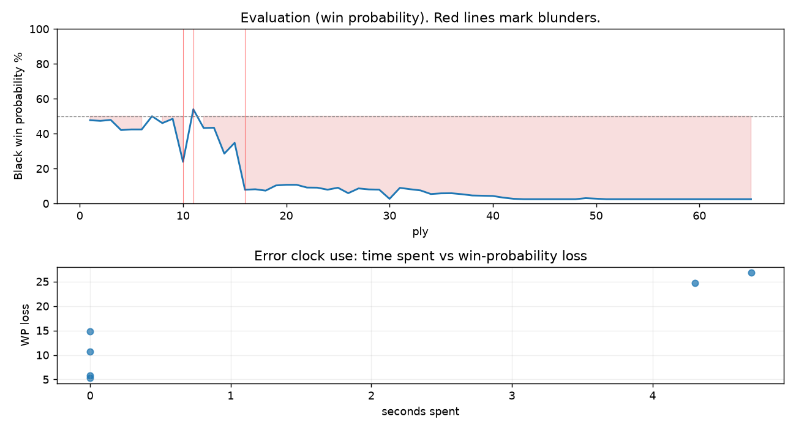

# (free, so lmk) Game analysis: Strategic_Logic vs DanielKetterer

Date: 2026.07.29  |  Time control: daily (1/86400)  |  You played: black
Game ID: c3e7b096-8b66-11f1-9ec1-4cc4c201000b
Analysis: depth=24 multipv=3 findability=honest floor=6 stable_run=3 threads=1 hash_mb=256 deterministic=True engine_id=Stockfish_18 generated=2026-07-29T17:07:29Z
Game end time UTC: 2026-07-29T16:37:18+00:00
Game: https://www.chess.com/game/daily/1006217278

## Summary

- Lichess accuracy: you 77.6%, opponent 86.9%
- Opening: B10 Caro-Kann Defense (theory followed through ply 3)
- First deviation from theory: ply 4, You played 2... e6
- Your moves: 12 best, 11 excellent, 3 good, 2 inaccuracy, 2 mistake, 2 blunder

METRICS:

Best: The played move exactly matches Stockfish's top move

Excellent: A non-best move that loses 2 WP points or less.

Good: WP loss is over 2, but under 5 points; also used for losses under 20 when the position remains already decided.

Inaccuracy: WP loss is at least 5 but under 10 points.

Mistake: WP loss is at least 10 but under 20 points; also generally used when a forced mate is missed with under 10 points of WP loss.

Blunder: WP loss is 20 points or more, or a forced mate is missed with at least 10 points of WP loss.

See: https://support.chess.com/en/articles/8572705-how-are-moves-classified-what-is-a-blunder-or-brilliant-etc 

(Brillint, Great and Miss are rating subjective)
- Puzzles: 33 open, 0 solved

### Puzzle gate tally (this game)

Gates: category in ['brilliant_sacrifice', 'missed_tactic', 'allowed_tactic', 'endgame'], refute depth in [3, 8], best-vs-second WP gap >= 5. Refute bar per move: max(5, 0.6 x WP loss).

| outcome | errors |
|---|---|
| category:attention | 2 |
| category:opening | 2 |
| refute_censored_high | 1 |
| wp_gap_too_small | 1 |

Four gates pass at once or nothing is generated, so a zero here is a product of four pass rates rather than a fault. Read the binding gate off this table before changing any threshold.

### Sacrifices in the engine's line

Real sacrifices are listed but never served as puzzles: compensation that never resolves back into material has no gradable answer.

| Move | Offered | Kind | Quiet | Line ends | Verdict |
|---|---|---|---|---|---|
| 2 | -3.0 (piece) | sham | yes | +0.0 pawns | opening_ply |
| 5 | -2.0 (exchange) | sham | yes | +0.0 pawns | opening_ply |
| 15 | -11.0 (piece) | real | yes | -2.0 pawns | real_sacrifice_not_gradable |

## Biggest missed opportunity

You played 8...Nbd7. Stockfish preferred Nxe4, after which the main line runs 8...Nxe4 9. Bxe4 O-O 10. Nxe5 Bxe5 11. Bxe5. Why it went wrong: left bishop on d6 insufficiently defended. Before committing to a quiet move here, the checklist is checks, captures, threats, in that order. The engine prefers this move from at or below depth 6, which is as shallow as this measurement resolves; it sits near the surface, a forcing move, the kind a checks-and-captures scan catches. Candidates considered by the engine: Nxe4 (+1.71), O-O (+2.56), Bc7 (+2.56).

## Critical positions

- Ply 10 (you), 5...Nf6: +0.16 -> +3.15 [evaluation crossed equal -> losing]
- Ply 11 (opponent), 6.b3: +3.15 -> -0.43 [only-move situation; evaluation crossed winning -> equal]
- Ply 16 (you), 8...Nbd7: +1.71 -> +6.68
- Ply 17 (opponent), 9.Nxd6+: +6.68 -> +6.58 [only-move situation]
- Ply 45 (opponent), 23.Bd3: M16 -> +12.30 [forced mate was on the board]
- Ply 49 (opponent), 25.Re1: M13 -> +9.39 [forced mate was on the board]

## Your errors, move by move

| Move | Class | Category | WP loss | Refute depth | Seconds spent | Pre-error eval |
|---|---|---|---:|---|---:|---|
| 2...e6 | inaccuracy | opening | 6% | 13 | 0 | balanced |
| 5...Nf6 | blunder | opening | 25% | 3 | 4 | balanced |
| 6...dxe4 | mistake | allowed_tactic | 11% | 7 | 0 | balanced |
| 7...e5 | mistake | attention | 15% | 1 | 0 | balanced |
| 8...Nbd7 | blunder | attention | 27% | 1 | 5 | losing |
| 15...Ng4 | inaccuracy | allowed_tactic | 5% | >18 | 0 | losing |

### 2...e6 (inaccuracy, positional, wp loss 6%)

You played 2...e6. Stockfish preferred d5, after which the main line runs 2...d5 3. Nf3 Bg4 4. d4 e6 5. Bd3. This was a judgment error rather than a missed tactic; compare the pawn structure and piece activity after both moves. The engine prefers this move from at or below depth 6, which is as shallow as this measurement resolves; it sits near the surface, a quiet move, but one whose point shows at a glance. Candidates considered by the engine: d5 (+0.23), a6 (+0.57), h6 (+0.65).

### 5...Nf6 (blunder, positional, wp loss 25%)

You played 5...Nf6. Stockfish preferred Nd7, after which the main line runs 5...Nd7 6. Re1 Nc5 7. Bf1 Nxe4 8. Nxe4. The evaluation crossed from equal to losing, which matters more than the raw number. This was a judgment error rather than a missed tactic; compare the pawn structure and piece activity after both moves. The engine does not settle on this move until depth 23, which is outside what a human reasonably calculates over the board; this is not a training target. Candidates considered by the engine: Nd7 (+0.16), Bc7 (+0.31), Ne7 (+0.41).

### 6...dxe4 (mistake, positional, wp loss 11%)

You played 6...dxe4. Stockfish preferred e5, after which the main line runs 6...e5 7. Re1 O-O 8. exd5 cxd5 9. Nxe5. This was a judgment error rather than a missed tactic; compare the pawn structure and piece activity after both moves. The engine prefers this move from at or below depth 6, which is as shallow as this measurement resolves; it sits near the surface, a quiet move, but one whose point shows at a glance. Candidates considered by the engine: e5 (-0.43), Nbd7 (+0.11), Be7 (+0.35).

### 7...e5 (mistake, tactical, wp loss 15%)

You played 7...e5. Stockfish preferred Nxe4, after which the main line runs 7...Nxe4 8. Bxe4 Nd7 9. d4 Nf6 10. Bd3. The evaluation crossed from equal to losing, which matters more than the raw number. Before committing to a quiet move here, the checklist is checks, captures, threats, in that order. The engine prefers this move from at or below depth 6, which is as shallow as this measurement resolves; it sits near the surface, a forcing move, the kind a checks-and-captures scan catches. Candidates considered by the engine: Nxe4 (+0.72), Be7 (+0.99), Bc7 (+1.21).

### 8...Nbd7 (blunder, tactical, wp loss 27%)

You played 8...Nbd7. Stockfish preferred Nxe4, after which the main line runs 8...Nxe4 9. Bxe4 O-O 10. Nxe5 Bxe5 11. Bxe5. Why it went wrong: left bishop on d6 insufficiently defended. Before committing to a quiet move here, the checklist is checks, captures, threats, in that order. The engine prefers this move from at or below depth 6, which is as shallow as this measurement resolves; it sits near the surface, a forcing move, the kind a checks-and-captures scan catches. Candidates considered by the engine: Nxe4 (+1.71), O-O (+2.56), Bc7 (+2.56).

### 15...Ng4 (inaccuracy, positional, wp loss 5%)

You played 15...Ng4. Stockfish preferred Qd8, after which the main line runs 15...Qd8 16. Re2 Rxe5 17. Rxe5 g6 18. Rae1. Why it went wrong: your king's zone came under heavier attack after this move. This was a judgment error rather than a missed tactic; compare the pawn structure and piece activity after both moves. The engine does not settle on this move until depth 20; reachable with real calculation, but not on a scan. Candidates considered by the engine: Qd8 (+6.66), Qe6 (+6.93), Qe7 (+6.99).

## Full move table

| Ply | Move | Eval before | Eval after | Best | CP loss | WP loss | Class |
|-----|------|-------------|------------|------|---------|---------|-------|
| 1 | 1.e4 | +0.31 | +0.25 | e4 | 6 | 1% | best |
| 2 | 1...c6* | +0.25 | +0.29 | e5 | 4 | 0% | excellent |
| 3 | 2.Nc3 | +0.29 | +0.23 | c3 | 6 | 1% | excellent |
| 4 | 2...e6* | +0.23 | +0.87 | d5 | 64 | 6% | inaccuracy |
| 5 | 3.Nf3 | +0.87 | +0.83 | d4 | 4 | 0% | excellent |
| 6 | 3...d5* | +0.83 | +0.83 | d5 | 0 | 0% | best |
| 7 | 4.Bd3 | +0.83 | +0.00 | d4 | 83 | 8% | inaccuracy |
| 8 | 4...Bd6* | +0.00 | +0.43 | Ne7 | 43 | 4% | good |
| 9 | 5.O-O | +0.43 | +0.16 | Bf1 | 27 | 2% | good |
| 10 | 5...Nf6* | +0.16 | +3.15 | Nd7 | 299 | 25% | blunder |
| 11 | 6.b3 | +3.15 | -0.43 | e5 | 358 | 30% | blunder |
| 12 | 6...dxe4* | -0.43 | +0.74 | e5 | 117 | 11% | mistake |
| 13 | 7.Nxe4 | +0.74 | +0.72 | Nxe4 | 2 | 0% | best |
| 14 | 7...e5* | +0.72 | +2.49 | Nxe4 | 177 | 15% | mistake |
| 15 | 8.Bb2 | +2.49 | +1.71 | Nxd6+ | 78 | 6% | inaccuracy |
| 16 | 8...Nbd7* | +1.71 | +6.68 | Nxe4 | 497 | 27% | blunder |
| 17 | 9.Nxd6+ | +6.68 | +6.58 | Nxd6+ | 10 | 0% | best |
| 18 | 9...Kf8* | +6.58 | +6.88 | Ke7 | 30 | 1% | excellent |
| 19 | 10.Nxc8 | +6.88 | +5.87 | Ng5 | 101 | 3% | good |
| 20 | 10...Rxc8* | +5.87 | +5.76 | Rxc8 | 0 | 0% | best |
| 21 | 11.Re1 | +5.76 | +5.76 | Re1 | 0 | 0% | best |
| 22 | 11...Qc7* | +5.76 | +6.24 | h5 | 48 | 2% | excellent |
| 23 | 12.Nxe5 | +6.24 | +6.26 | Nxe5 | 0 | 0% | best |
| 24 | 12...Nxe5* | +6.26 | +6.67 | h5 | 41 | 1% | excellent |
| 25 | 13.Bxe5 | +6.67 | +6.27 | Rxe5 | 40 | 1% | excellent |
| 26 | 13...Qd7* | +6.27 | +7.52 | Qd8 | 125 | 3% | good |
| 27 | 14.Qe2 | +7.52 | +6.41 | Bxf6 | 111 | 3% | good |
| 28 | 14...Re8* | +6.41 | +6.61 | Qd8 | 20 | 1% | excellent |
| 29 | 15.Qf3 | +6.61 | +6.66 | Qf3 | 0 | 0% | best |
| 30 | 15...Ng4* | +6.66 | +9.78 | Qd8 | 312 | 5% | inaccuracy |
| 31 | 16.Qf4 | +9.78 | +6.30 | Qxg4 | 348 | 6% | inaccuracy |
| 32 | 16...Nxe5* | +6.30 | +6.57 | Nxe5 | 27 | 1% | best |
| 33 | 17.Rxe5 | +6.57 | +6.83 | Rxe5 | 0 | 0% | best |
| 34 | 17...f6* | +6.83 | +7.77 | Rxe5 | 94 | 2% | good |
| 35 | 18.Rxe8+ | +7.77 | +7.57 | Rae1 | 20 | 0% | excellent |
| 36 | 18...Qxe8* | +7.57 | +7.54 | Qxe8 | 0 | 0% | best |
| 37 | 19.Qd6+ | +7.54 | +7.82 | Qd6+ | 0 | 0% | best |
| 38 | 19...Kf7* | +7.82 | +8.24 | Qe7 | 42 | 1% | excellent |
| 39 | 20.Bc4+ | +8.24 | +8.32 | Bc4+ | 0 | 0% | best |
| 40 | 20...Kg6* | +8.32 | +8.42 | Kg6 | 10 | 0% | best |
| 41 | 21.Qg3+ | +8.42 | +9.12 | Qg3+ | 0 | 0% | best |
| 42 | 21...Kf5* | +9.12 | +9.74 | Kf5 | 62 | 1% | best |
| 43 | 22.f4 | +9.74 | +12.42 | Qh3+ | 0 | 0% | excellent |
| 44 | 22...Qe4* | +12.42 | M16 | Qe4 |  | 0% | best |
| 45 | 23.Bd3 | M16 | +12.30 | Re1 |  | 0% | mistake |
| 46 | 23...Re8* | +12.30 | M11 | g6 |  | 0% | excellent |
| 47 | 24.Bxe4+ | M11 | M14 | Re1 |  | 0% | excellent |
| 48 | 24...Rxe4* | M14 | M13 | Rxe4 |  | 0% | best |
| 49 | 25.Re1 | M13 | +9.39 | Qd3 |  | 1% | mistake |
| 50 | 25...Rxe1+* | +9.39 | +9.68 | Rxe1+ | 29 | 0% | best |
| 51 | 26.Qxe1 | +9.68 | +10.35 | Qxe1 | 0 | 0% | best |
| 52 | 26...Kxf4* | +10.35 | +18.81 | Kxf4 | 846 | 0% | best |
| 53 | 27.g3+ | +18.81 | M17 | Kf2 |  | 0% | excellent |
| 54 | 27...Kf3* | M17 | M2 | Kf5 |  | 0% | excellent |
| 55 | 28.Qe3+ | M2 | M6 | h3 |  | 0% | excellent |
| 56 | 28...Kg4* | M6 | M6 | Kg4 |  | 0% | best |
| 57 | 29.Qe7 | M6 | M17 | Qf4+ |  | 0% | excellent |
| 58 | 29...f5* | M17 | M6 | Kf5 |  | 0% | excellent |
| 59 | 30.Qxb7 | M6 | M23 | Kf2 |  | 0% | excellent |
| 60 | 30...Kh3* | M23 | M3 | f4 |  | 0% | excellent |
| 61 | 31.Qxc6 | M3 | M7 | Qxg7 |  | 0% | excellent |
| 62 | 31...Kg4* | M7 | M7 | Kg4 |  | 0% | best |
| 63 | 32.c4 | M7 | M9 | Qd7 |  | 0% | excellent |
| 64 | 32...f4* | M9 | M7 | a5 |  | 0% | excellent |
| 65 | 33.gxf4 | M7 | M18 | Qe6+ |  | 0% | excellent |

Rows marked * are your moves. WP loss is win-probability loss; it is the primary signal, CP loss is shown for reference.

## Patterns in this game

- Error categories: 2 allowed_tactic, 2 attention, 2 opening.
- Attention errors per 100 moves: 6.2.
- Pre-error eval buckets: 0 winning, 4 balanced, 2 losing.
- Opening: 5 error(s) (avg wp loss 17%).
- Middlegame: 1 error(s) (avg wp loss 5%).
- 6 of your errors came with under a minute on the clock.
