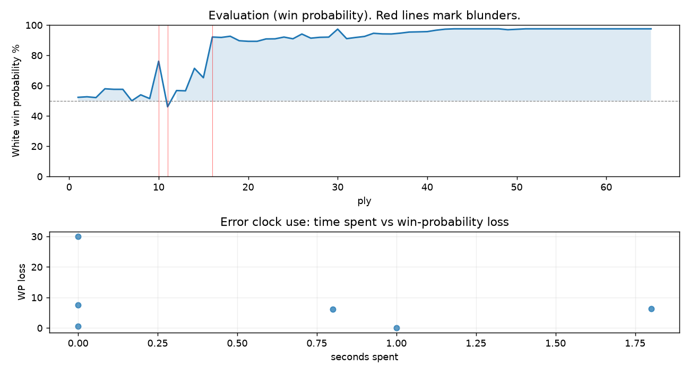

# (free, so lmk) Game analysis: Strategic_Logic vs DanielKetterer

Date: 2026.07.29  |  Time control: daily (1/86400)  |  You played: white
Game ID: c3e7b096-8b66-11f1-9ec1-4cc4c201000b
Analysis: depth=24 multipv=3 findability=honest floor=6 stable_run=3 threads=1 hash_mb=256 deterministic=True engine_id=Stockfish_18 generated=2026-07-29T17:07:29Z
Game end time UTC: 2026-07-29T16:37:18+00:00
Game: https://www.chess.com/game/daily/1006217278

## Summary

- Lichess accuracy: you 86.9%, opponent 77.6%
- Opening: B10 Caro-Kann Defense (theory followed through ply 3)
- First deviation from theory: ply 4, Opponent played 2... e6
- Your moves: 11 best, 13 excellent, 3 good, 3 inaccuracy, 2 mistake, 1 blunder

METRICS:

Best: The played move exactly matches Stockfish's top move

Excellent: A non-best move that loses 2 WP points or less.

Good: WP loss is over 2, but under 5 points; also used for losses under 20 when the position remains already decided.

Inaccuracy: WP loss is at least 5 but under 10 points.

Mistake: WP loss is at least 10 but under 20 points; also generally used when a forced mate is missed with under 10 points of WP loss.

Blunder: WP loss is 20 points or more, or a forced mate is missed with at least 10 points of WP loss.

See: https://support.chess.com/en/articles/8572705-how-are-moves-classified-what-is-a-blunder-or-brilliant-etc 

(Brillint, Great and Miss are rating subjective)
- Puzzles: 33 open, 0 solved

### Puzzle gate tally (this game)

Gates: category in ['brilliant_sacrifice', 'missed_tactic', 'allowed_tactic', 'endgame'], refute depth in [3, 8], best-vs-second WP gap >= 5. Refute bar per move: max(5, 0.6 x WP loss).

| outcome | errors |
|---|---|
| category:attention | 2 |
| category:opening | 1 |
| refute_censored_high | 2 |
| refute_too_shallow | 1 |

Four gates pass at once or nothing is generated, so a zero here is a product of four pass rates rather than a fault. Read the binding gate off this table before changing any threshold.

### Sacrifices in the engine's line

Real sacrifices are listed but never served as puzzles: compensation that never resolves back into material has no gradable answer.

| Move | Offered | Kind | Quiet | Line ends | Verdict |
|---|---|---|---|---|---|
| 4 | -9.0 (piece) | sham | yes | +0.0 pawns | opening_ply |
| 16 | -6.0 (piece) | sham | no | +8.0 pawns | eval_out_of_band |
| 25 | -2.0 (exchange) | sham | yes | mate | puzzle |

## Biggest missed opportunity

You played 6.b3. Stockfish preferred e5, after which the main line runs 6. e5 Bc7 7. exf6 Qxf6 8. Be2 e5. The evaluation crossed from winning to equal, which matters more than the raw number. Why it went wrong: motif: fork; creates threat on f6, d6. This was a judgment error rather than a missed tactic; compare the pawn structure and piece activity after both moves. The engine prefers this move from at or below depth 6, which is as shallow as this measurement resolves; it sits near the surface, a quiet move, but one whose point shows at a glance. Candidates considered by the engine: e5 (+3.15), Re1 (+0.73), h3 (+0.38).

## Critical positions

- Ply 10 (opponent), 5...Nf6: +0.16 -> +3.15 [evaluation crossed equal -> losing]
- Ply 11 (you), 6.b3: +3.15 -> -0.43 [only-move situation; evaluation crossed winning -> equal]
- Ply 16 (opponent), 8...Nbd7: +1.71 -> +6.68
- Ply 17 (you), 9.Nxd6+: +6.68 -> +6.58 [only-move situation]
- Ply 45 (you), 23.Bd3: M16 -> +12.30 [forced mate was on the board]
- Ply 49 (you), 25.Re1: M13 -> +9.39 [forced mate was on the board]

## Your errors, move by move

| Move | Class | Category | WP loss | Refute depth | Seconds spent | Pre-error eval |
|---|---|---|---:|---|---:|---|
| 4.Bd3 | inaccuracy | opening | 8% | >18 | 0 | balanced |
| 6.b3 | blunder | attention | 30% | 1 | 0 | winning |
| 8.Bb2 | inaccuracy | attention | 6% | 1 | 1 | winning |
| 16.Qf4 | inaccuracy | allowed_tactic | 6% | 1 | 2 | winning |
| 23.Bd3 | mistake | allowed_tactic | 0% | >18 | 1 | winning |
| 25.Re1 | mistake | brilliant_sacrifice | 1% | >18 | 0 | winning |

### 4.Bd3 (inaccuracy, positional, wp loss 8%)

You played 4.Bd3. Stockfish preferred d4, after which the main line runs 4. d4 Bb4 5. e5 c5 6. a3 Bxc3+. This was a judgment error rather than a missed tactic; compare the pawn structure and piece activity after both moves. The engine prefers this move from at or below depth 6, which is as shallow as this measurement resolves; it sits near the surface, a quiet move, but one whose point shows at a glance. Candidates considered by the engine: d4 (+0.83), a4 (+0.34), g3 (+0.27).

### 6.b3 (blunder, positional, wp loss 30%)

You played 6.b3. Stockfish preferred e5, after which the main line runs 6. e5 Bc7 7. exf6 Qxf6 8. Be2 e5. The evaluation crossed from winning to equal, which matters more than the raw number. Why it went wrong: motif: fork; creates threat on f6, d6. This was a judgment error rather than a missed tactic; compare the pawn structure and piece activity after both moves. The engine prefers this move from at or below depth 6, which is as shallow as this measurement resolves; it sits near the surface, a quiet move, but one whose point shows at a glance. Candidates considered by the engine: e5 (+3.15), Re1 (+0.73), h3 (+0.38).

### 8.Bb2 (inaccuracy, positional, wp loss 6%)

You played 8.Bb2. Stockfish preferred Nxd6+, after which the main line runs 8. Nxd6+ Qxd6 9. Nxe5 Be6 10. Bb2 O-O. Why it went wrong: the best move was a forcing check; motif: fork. This was a judgment error rather than a missed tactic; compare the pawn structure and piece activity after both moves. The engine prefers this move from at or below depth 6, which is as shallow as this measurement resolves; it sits near the surface, a quiet move, but one whose point shows at a glance. Candidates considered by the engine: Nxd6+ (+2.49), Bb2 (+1.62), Nfg5 (+1.48).

### 16.Qf4 (inaccuracy, positional, wp loss 6%)

You played 16.Qf4. Stockfish preferred Qxg4, after which the main line runs 16. Qxg4 Qxg4 17. Bd6+ Re7 18. Rxe7 g6. This was a judgment error rather than a missed tactic; compare the pawn structure and piece activity after both moves. The engine does not settle on this move until depth 15; reachable with real calculation, but not on a scan. Candidates considered by the engine: Qxg4 (+9.78), Bc3 (+7.31), Bb2 (+7.24).

### 23.Bd3 (mistake, positional, wp loss 0%)

You played 23.Bd3. Stockfish preferred Re1, after which the main line runs 23. Re1 Re8 24. Bd3 h5 25. Bxe4+ Rxe4. There was a forced mate on the board and this move let it slip. Why it went wrong: left pawn on f4 insufficiently defended; motif: creates threat on g7, e4. This was a judgment error rather than a missed tactic; compare the pawn structure and piece activity after both moves. The engine does not settle on this move until depth 11; reachable with real calculation, but not on a scan. Candidates considered by the engine: Re1 (M16), Bd3 (M20), Qh3+ (+14.34).

### 25.Re1 (mistake, positional, wp loss 1%)

You played 25.Re1. Stockfish preferred Qd3, after which the main line runs 25. Qd3 Kxf4 26. Rf1+ Ke5 27. Qd7 g6. There was a forced mate on the board and this move let it slip. Why it went wrong: left pawn on f4 insufficiently defended. This was a judgment error rather than a missed tactic; compare the pawn structure and piece activity after both moves. The engine never settles on this move within the analysis depth, so how findable it was is not measured here; weigh this one lightly. Candidates considered by the engine: Qd3 (M13), h3 (+10.98), Qxg7 (+9.76).

## Full move table

| Ply | Move | Eval before | Eval after | Best | CP loss | WP loss | Class |
|-----|------|-------------|------------|------|---------|---------|-------|
| 1 | 1.e4* | +0.31 | +0.25 | e4 | 6 | 1% | best |
| 2 | 1...c6 | +0.25 | +0.29 | e5 | 4 | 0% | excellent |
| 3 | 2.Nc3* | +0.29 | +0.23 | c3 | 6 | 1% | excellent |
| 4 | 2...e6 | +0.23 | +0.87 | d5 | 64 | 6% | inaccuracy |
| 5 | 3.Nf3* | +0.87 | +0.83 | d4 | 4 | 0% | excellent |
| 6 | 3...d5 | +0.83 | +0.83 | d5 | 0 | 0% | best |
| 7 | 4.Bd3* | +0.83 | +0.00 | d4 | 83 | 8% | inaccuracy |
| 8 | 4...Bd6 | +0.00 | +0.43 | Ne7 | 43 | 4% | good |
| 9 | 5.O-O* | +0.43 | +0.16 | Bf1 | 27 | 2% | good |
| 10 | 5...Nf6 | +0.16 | +3.15 | Nd7 | 299 | 25% | blunder |
| 11 | 6.b3* | +3.15 | -0.43 | e5 | 358 | 30% | blunder |
| 12 | 6...dxe4 | -0.43 | +0.74 | e5 | 117 | 11% | mistake |
| 13 | 7.Nxe4* | +0.74 | +0.72 | Nxe4 | 2 | 0% | best |
| 14 | 7...e5 | +0.72 | +2.49 | Nxe4 | 177 | 15% | mistake |
| 15 | 8.Bb2* | +2.49 | +1.71 | Nxd6+ | 78 | 6% | inaccuracy |
| 16 | 8...Nbd7 | +1.71 | +6.68 | Nxe4 | 497 | 27% | blunder |
| 17 | 9.Nxd6+* | +6.68 | +6.58 | Nxd6+ | 10 | 0% | best |
| 18 | 9...Kf8 | +6.58 | +6.88 | Ke7 | 30 | 1% | excellent |
| 19 | 10.Nxc8* | +6.88 | +5.87 | Ng5 | 101 | 3% | good |
| 20 | 10...Rxc8 | +5.87 | +5.76 | Rxc8 | 0 | 0% | best |
| 21 | 11.Re1* | +5.76 | +5.76 | Re1 | 0 | 0% | best |
| 22 | 11...Qc7 | +5.76 | +6.24 | h5 | 48 | 2% | excellent |
| 23 | 12.Nxe5* | +6.24 | +6.26 | Nxe5 | 0 | 0% | best |
| 24 | 12...Nxe5 | +6.26 | +6.67 | h5 | 41 | 1% | excellent |
| 25 | 13.Bxe5* | +6.67 | +6.27 | Rxe5 | 40 | 1% | excellent |
| 26 | 13...Qd7 | +6.27 | +7.52 | Qd8 | 125 | 3% | good |
| 27 | 14.Qe2* | +7.52 | +6.41 | Bxf6 | 111 | 3% | good |
| 28 | 14...Re8 | +6.41 | +6.61 | Qd8 | 20 | 1% | excellent |
| 29 | 15.Qf3* | +6.61 | +6.66 | Qf3 | 0 | 0% | best |
| 30 | 15...Ng4 | +6.66 | +9.78 | Qd8 | 312 | 5% | inaccuracy |
| 31 | 16.Qf4* | +9.78 | +6.30 | Qxg4 | 348 | 6% | inaccuracy |
| 32 | 16...Nxe5 | +6.30 | +6.57 | Nxe5 | 27 | 1% | best |
| 33 | 17.Rxe5* | +6.57 | +6.83 | Rxe5 | 0 | 0% | best |
| 34 | 17...f6 | +6.83 | +7.77 | Rxe5 | 94 | 2% | good |
| 35 | 18.Rxe8+* | +7.77 | +7.57 | Rae1 | 20 | 0% | excellent |
| 36 | 18...Qxe8 | +7.57 | +7.54 | Qxe8 | 0 | 0% | best |
| 37 | 19.Qd6+* | +7.54 | +7.82 | Qd6+ | 0 | 0% | best |
| 38 | 19...Kf7 | +7.82 | +8.24 | Qe7 | 42 | 1% | excellent |
| 39 | 20.Bc4+* | +8.24 | +8.32 | Bc4+ | 0 | 0% | best |
| 40 | 20...Kg6 | +8.32 | +8.42 | Kg6 | 10 | 0% | best |
| 41 | 21.Qg3+* | +8.42 | +9.12 | Qg3+ | 0 | 0% | best |
| 42 | 21...Kf5 | +9.12 | +9.74 | Kf5 | 62 | 1% | best |
| 43 | 22.f4* | +9.74 | +12.42 | Qh3+ | 0 | 0% | excellent |
| 44 | 22...Qe4 | +12.42 | M16 | Qe4 |  | 0% | best |
| 45 | 23.Bd3* | M16 | +12.30 | Re1 |  | 0% | mistake |
| 46 | 23...Re8 | +12.30 | M11 | g6 |  | 0% | excellent |
| 47 | 24.Bxe4+* | M11 | M14 | Re1 |  | 0% | excellent |
| 48 | 24...Rxe4 | M14 | M13 | Rxe4 |  | 0% | best |
| 49 | 25.Re1* | M13 | +9.39 | Qd3 |  | 1% | mistake |
| 50 | 25...Rxe1+ | +9.39 | +9.68 | Rxe1+ | 29 | 0% | best |
| 51 | 26.Qxe1* | +9.68 | +10.35 | Qxe1 | 0 | 0% | best |
| 52 | 26...Kxf4 | +10.35 | +18.81 | Kxf4 | 846 | 0% | best |
| 53 | 27.g3+* | +18.81 | M17 | Kf2 |  | 0% | excellent |
| 54 | 27...Kf3 | M17 | M2 | Kf5 |  | 0% | excellent |
| 55 | 28.Qe3+* | M2 | M6 | h3 |  | 0% | excellent |
| 56 | 28...Kg4 | M6 | M6 | Kg4 |  | 0% | best |
| 57 | 29.Qe7* | M6 | M17 | Qf4+ |  | 0% | excellent |
| 58 | 29...f5 | M17 | M6 | Kf5 |  | 0% | excellent |
| 59 | 30.Qxb7* | M6 | M23 | Kf2 |  | 0% | excellent |
| 60 | 30...Kh3 | M23 | M3 | f4 |  | 0% | excellent |
| 61 | 31.Qxc6* | M3 | M7 | Qxg7 |  | 0% | excellent |
| 62 | 31...Kg4 | M7 | M7 | Kg4 |  | 0% | best |
| 63 | 32.c4* | M7 | M9 | Qd7 |  | 0% | excellent |
| 64 | 32...f4 | M9 | M7 | a5 |  | 0% | excellent |
| 65 | 33.gxf4* | M7 | M18 | Qe6+ |  | 0% | excellent |

Rows marked * are your moves. WP loss is win-probability loss; it is the primary signal, CP loss is shown for reference.

## Patterns in this game

- Error categories: 2 allowed_tactic, 2 attention, 1 brilliant_sacrifice, 1 opening.
- Attention errors per 100 moves: 6.1.
- Pre-error eval buckets: 5 winning, 1 balanced, 0 losing.
- Opening: 3 error(s) (avg wp loss 15%).
- Middlegame: 3 error(s) (avg wp loss 2%).
- 6 of your errors came with under a minute on the clock.
