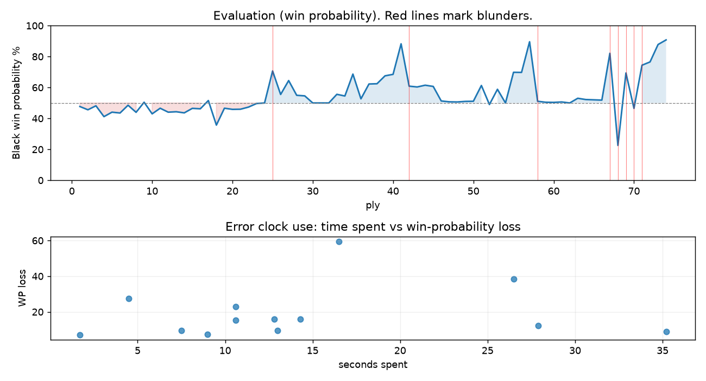

# (free, so lmk) Game analysis: DanielKetterer vs wa2n_bkl

Date: 2026.07.29  |  Time control: rapid (1800)  |  You played: black
Game ID: 541ca8ca-8b43-11f1-91da-1f3fb001000f
Analysis: depth=24 multipv=3 findability=honest floor=6 stable_run=3 threads=1 hash_mb=256 deterministic=True engine_id=Stockfish_18 generated=2026-07-29T13:10:28Z
Game end time UTC: 2026-07-29T12:22:16+00:00
Game: https://www.chess.com/game/live/172239094826

## Summary

- Lichess accuracy: you 63.6%, opponent 64.8%
- Opening: C00 French Defense: Knight Variation (theory followed through ply 3)
- First deviation from theory: ply 4, You played 2... b6
- Your moves: 15 best, 5 excellent, 4 good, 5 inaccuracy, 4 mistake, 4 blunder

METRICS:

Best: The played move exactly matches Stockfish's top move

Excellent: A non-best move that loses 2 WP points or less.

Good: WP loss is over 2, but under 5 points; also used for losses under 20 when the position remains already decided.

Inaccuracy: WP loss is at least 5 but under 10 points.

Mistake: WP loss is at least 10 but under 20 points; also generally used when a forced mate is missed with under 10 points of WP loss.

Blunder: WP loss is 20 points or more, or a forced mate is missed with at least 10 points of WP loss.

See: https://support.chess.com/en/articles/8572705-how-are-moves-classified-what-is-a-blunder-or-brilliant-etc 

(Brillint, Great and Miss are rating subjective)
- Puzzles: 33 open, 0 solved

### Puzzle gate tally (this game)

Gates: category in ['brilliant_sacrifice', 'missed_tactic', 'allowed_tactic', 'endgame'], refute depth in [3, 8], best-vs-second WP gap >= 5. Refute bar per move: max(5, 0.6 x WP loss).

| outcome | errors |
|---|---|
| accepted | 1 |
| category:attention | 4 |
| category:opening | 2 |
| refute_too_deep | 2 |
| refute_too_shallow | 2 |
| wp_gap_too_small | 2 |

Four gates pass at once or nothing is generated, so a zero here is a product of four pass rates rather than a fault. Read the binding gate off this table before changing any threshold.

### Sacrifices in the engine's line

Real sacrifices are listed but never served as puzzles: compensation that never resolves back into material has no gradable answer.

| Move | Offered | Kind | Quiet | Line ends | Verdict |
|---|---|---|---|---|---|
| 2 | -9.0 (piece) | sham | yes | +0.0 pawns | opening_ply |
| 9 | -8.0 (piece) | sham | yes | +1.0 pawns | opening_ply |
| 13 | -2.0 (exchange) | sham | no | +1.0 pawns | obvious |
| 18 | -4.0 (piece) | sham | yes | +0.0 pawns | puzzle |
| 23 | -5.0 (piece) | sham | yes | +0.0 pawns | obvious |
| 26 | -4.0 (piece) | sham | yes | +0.0 pawns | obvious |
| 29 | -3.0 (piece) | sham | yes | +3.0 pawns | obvious |
| 34 | -7.0 (piece) | sham | yes | +3.0 pawns | desperado |

## Biggest missed opportunity

You played 34...Rf8. Stockfish preferred g4, after which the main line runs 34...g4 35. Ne2 gxh3 36. Nxf4 h2 37. Rxf3. The evaluation crossed from winning to losing, which matters more than the raw number. Why it went wrong: left pawn on g5 insufficiently defended; motif: creates threat on h3. Before committing to a quiet move here, the checklist is checks, captures, threats, in that order. The engine does not settle on this move until depth 11; reachable with real calculation, but not on a scan. Candidates considered by the engine: g4 (-4.14), Ne5+ (-3.41), c6 (-0.36).

## Critical positions

- Ply 25 (opponent), 13.Qd2: +0.00 -> -2.39 [evaluation crossed equal -> losing]
- Ply 29 (opponent), 15.Qf2: -0.54 -> -0.50 [only-move situation]
- Ply 31 (opponent), 16.Kxf2: +0.00 -> +0.00 [only-move situation]
- Ply 42 (you), 21...f6: -5.47 -> -1.20 [only-move situation; evaluation crossed winning -> equal]
- Ply 45 (opponent), 23.Kg3: -1.27 -> -1.18 [only-move situation]
- Ply 47 (opponent), 24.Kxf4: -0.14 -> -0.08 [only-move situation]
- Ply 50 (you), 25...Kb8: -0.11 -> -0.12 [only-move situation]
- Ply 57 (opponent), 29.Kf5: -2.27 -> -5.84 [only-move situation]

## Your errors, move by move

| Move | Class | Category | WP loss | Refute depth | Seconds spent | Pre-error eval |
|---|---|---|---:|---|---:|---|
| 2...b6 | inaccuracy | opening | 7% | 12 | 2 | balanced |
| 5...Qf6 | inaccuracy | opening | 8% | 4 | 9 | balanced |
| 9...Qd8 | mistake | allowed_tactic | 16% | 4 | 14 | balanced |
| 13...Nd7 | mistake | attention | 15% | 1 | 11 | winning |
| 14...Qh4+ | inaccuracy | allowed_tactic | 10% | 2 | 13 | balanced |
| 18...e5 | mistake | brilliant_sacrifice | 16% | 2 | 13 | winning |
| 21...f6 | blunder | attention | 27% | 1 | 4 | winning |
| 23...Bxf4+ | inaccuracy | attention | 9% | 1 | 8 | balanced |
| 26...h4 | mistake | missed_tactic | 12% | 10 | 28 | balanced |
| 27...Rhe8 | inaccuracy | attention | 9% | 1 | 35 | balanced |
| 29...Nxf3 | blunder | missed_tactic | 38% | 9 | 26 | winning |
| 34...Rf8 | blunder | missed_tactic | 60% | 6 | 16 | winning |
| 35...b5 | blunder | missed_tactic | 23% | 7 | 11 | winning |

### 2...b6 (inaccuracy, positional, wp loss 7%)

You played 2...b6. Stockfish preferred d5, after which the main line runs 2...d5 3. exd5 exd5 4. d4 Nf6 5. Bd3. Why it went wrong: motif: creates threat on e4. This was a judgment error rather than a missed tactic; compare the pawn structure and piece activity after both moves. The engine prefers this move from at or below depth 6, which is as shallow as this measurement resolves; it sits near the surface, a quiet move, but one whose point shows at a glance. Candidates considered by the engine: d5 (+0.20), c5 (+0.45), a6 (+0.61).

### 5...Qf6 (inaccuracy, positional, wp loss 8%)

You played 5...Qf6. Stockfish preferred Nf6, after which the main line runs 5...Nf6 6. Bf4 Bb4 7. a3 Bxc3+ 8. bxc3. This was a judgment error rather than a missed tactic; compare the pawn structure and piece activity after both moves. The engine first prefers this move at depth 8 and holds it; findable, but it takes a deliberate look rather than a scan. Candidates considered by the engine: Nf6 (-0.05), a6 (+0.17), c5 (+0.25).

### 9...Qd8 (mistake, positional, wp loss 16%)

You played 9...Qd8. Stockfish preferred O-O-O, after which the main line runs 9...O-O-O 10. e5 Qf5 11. d6 Bxf3 12. Nxa7+. This was a judgment error rather than a missed tactic; compare the pawn structure and piece activity after both moves. The engine does not settle on this move until depth 24, which is outside what a human reasonably calculates over the board; this is not a training target. Candidates considered by the engine: O-O-O (-0.17), Kd8 (-0.05), Bd6 (+0.31).

### 13...Nd7 (mistake, tactical, wp loss 15%)

You played 13...Nd7. Stockfish preferred Nxe4, after which the main line runs 13...Nxe4 14. Nxe4 Bxe4 15. Rg1 Qf6 16. c3. The evaluation crossed from winning to equal, which matters more than the raw number. Why it went wrong: motif: fork. Before committing to a quiet move here, the checklist is checks, captures, threats, in that order. The engine prefers this move from at or below depth 6, which is as shallow as this measurement resolves; it sits near the surface, a forcing move, the kind a checks-and-captures scan catches. Candidates considered by the engine: Nxe4 (-2.39), Qxd2+ (-2.02), Bd6 (-1.22).

### 14...Qh4+ (inaccuracy, positional, wp loss 10%)

You played 14...Qh4+. Stockfish preferred Be7, after which the main line runs 14...Be7 15. Ne2 Bf6 16. Ng3 Qe7 17. Qe3. This was a judgment error rather than a missed tactic; compare the pawn structure and piece activity after both moves. The engine first prefers this move at depth 9 and holds it; findable, but it takes a deliberate look rather than a scan. Candidates considered by the engine: Be7 (-1.62), b5 (-0.92), Qf6 (-0.88).

### 18...e5 (mistake, tactical, wp loss 16%)

You played 18...e5. Stockfish preferred g5, after which the main line runs 18...g5 19. h4 b5 20. Bd3 Rdg8 21. hxg5. The evaluation crossed from winning to equal, which matters more than the raw number. Why it went wrong: left pawn on f7 insufficiently defended. Before committing to a quiet move here, the checklist is checks, captures, threats, in that order. The engine does not settle on this move until depth 13; reachable with real calculation, but not on a scan. Candidates considered by the engine: g5 (-2.13), b5 (-2.10), Rdg8 (-1.80).

### 21...f6 (blunder, tactical, wp loss 27%)

You played 21...f6. Stockfish preferred Ne5+, after which the main line runs 21...Ne5+ 22. Kg3 Nxc4+ 23. Bf4 Rhe8 24. Bxd6. The evaluation crossed from winning to equal, which matters more than the raw number. Why it went wrong: the best move was a forcing check; motif: fork; creates threat on c4. Before committing to a quiet move here, the checklist is checks, captures, threats, in that order. The engine prefers this move from at or below depth 6, which is as shallow as this measurement resolves; it sits near the surface, a forcing move, the kind a checks-and-captures scan catches. Candidates considered by the engine: Ne5+ (-5.47), Kb8 (-2.22), f5+ (-2.12).

### 23...Bxf4+ (inaccuracy, positional, wp loss 9%)

You played 23...Bxf4+. Stockfish preferred Ne5, after which the main line runs 23...Ne5 24. Bxe5 Bxe5+ 25. Kg2 h4 26. Be6+. Why it went wrong: left bishop on f4 insufficiently defended; motif: creates threat on c4. This was a judgment error rather than a missed tactic; compare the pawn structure and piece activity after both moves. The engine prefers this move from at or below depth 6, which is as shallow as this measurement resolves; it sits near the surface, a quiet move, but one whose point shows at a glance. Candidates considered by the engine: Ne5 (-1.18), h4+ (-0.81), Bxf4+ (-0.20).

### 26...h4 (mistake, tactical, wp loss 12%)

You played 26...h4. Stockfish preferred Rde8, after which the main line runs 26...Rde8 27. Bd7 Re7 28. Bh3 g5+ 29. Kg3. Why it went wrong: left knight on e5 insufficiently defended; motif: creates threat on e6. Before committing to a quiet move here, the checklist is checks, captures, threats, in that order. The engine prefers this move from at or below depth 6, which is as shallow as this measurement resolves; it sits near the surface, a forcing move, the kind a checks-and-captures scan catches. Candidates considered by the engine: Rde8 (-1.25), Rdf8 (-0.39), g5+ (-0.30).

### 27...Rhe8 (inaccuracy, positional, wp loss 9%)

You played 27...Rhe8. Stockfish preferred Rde8, after which the main line runs 27...Rde8 28. Bd7 Re7 29. Bg4 g6 30. Nd5. Why it went wrong: left knight on e5 insufficiently defended; motif: creates threat on e6. This was a judgment error rather than a missed tactic; compare the pawn structure and piece activity after both moves. The engine prefers this move from at or below depth 6, which is as shallow as this measurement resolves; it sits near the surface, a quiet move, but one whose point shows at a glance. Candidates considered by the engine: Rde8 (-0.97), Rdf8 (-0.53), b5 (-0.47).

### 29...Nxf3 (blunder, tactical, wp loss 38%)

You played 29...Nxf3. Stockfish preferred Bc8+, after which the main line runs 29...Bc8+ 30. Kxf6 Rd6+ 31. Kxg5 Rf8 32. Bf7. The evaluation crossed from winning to equal, which matters more than the raw number. Why it went wrong: left pawn on f6, pawn on g5 insufficiently defended; the best move was a forcing check; motif: creates threat on f3. Before committing to a quiet move here, the checklist is checks, captures, threats, in that order. The engine prefers this move from at or below depth 6, which is as shallow as this measurement resolves; it sits near the surface, a forcing move, the kind a checks-and-captures scan catches. Candidates considered by the engine: Bc8+ (-5.84), Nxf3 (-0.24), Rd6 (+0.27).

### 34...Rf8 (blunder, tactical, wp loss 60%)

You played 34...Rf8. Stockfish preferred g4, after which the main line runs 34...g4 35. Ne2 gxh3 36. Nxf4 h2 37. Rxf3. The evaluation crossed from winning to losing, which matters more than the raw number. Why it went wrong: left pawn on g5 insufficiently defended; motif: creates threat on h3. Before committing to a quiet move here, the checklist is checks, captures, threats, in that order. The engine does not settle on this move until depth 11; reachable with real calculation, but not on a scan. Candidates considered by the engine: g4 (-4.14), Ne5+ (-3.41), c6 (-0.36).

### 35...b5 (blunder, tactical, wp loss 23%)

You played 35...b5. Stockfish preferred Rh8+, after which the main line runs 35...Rh8+ 36. Kg4 Ne5+ 37. Kxg5 Nxd3 38. cxd3. The evaluation crossed from winning to equal, which matters more than the raw number. Why it went wrong: left pawn on g5, pawn on h4 insufficiently defended; the best move was a forcing check. Before committing to a quiet move here, the checklist is checks, captures, threats, in that order. The engine prefers this move from at or below depth 6, which is as shallow as this measurement resolves; it sits near the surface, a forcing move, the kind a checks-and-captures scan catches. Candidates considered by the engine: Rh8+ (-2.22), g4 (-1.18), Ne5 (-0.27).

## Full move table

| Ply | Move | Eval before | Eval after | Best | CP loss | WP loss | Class |
|-----|------|-------------|------------|------|---------|---------|-------|
| 1 | 1.e4 | +0.31 | +0.25 | e4 | 6 | 1% | best |
| 2 | 1...e6* | +0.25 | +0.48 | e5 | 23 | 2% | good |
| 3 | 2.Nf3 | +0.48 | +0.20 | d4 | 28 | 3% | good |
| 4 | 2...b6* | +0.20 | +0.97 | d5 | 77 | 7% | inaccuracy |
| 5 | 3.Nc3 | +0.97 | +0.65 | d4 | 32 | 3% | good |
| 6 | 3...Bb7* | +0.65 | +0.71 | Bb7 | 6 | 1% | best |
| 7 | 4.d3 | +0.71 | +0.16 | d4 | 55 | 5% | inaccuracy |
| 8 | 4...h6* | +0.16 | +0.66 | Nf6 | 50 | 5% | good |
| 9 | 5.Qe2 | +0.66 | -0.05 | d4 | 71 | 7% | inaccuracy |
| 10 | 5...Qf6* | -0.05 | +0.77 | Nf6 | 82 | 8% | inaccuracy |
| 11 | 6.d4 | +0.77 | +0.37 | g3 | 40 | 4% | good |
| 12 | 6...Nc6* | +0.37 | +0.65 | Bb4 | 28 | 3% | good |
| 13 | 7.d5 | +0.65 | +0.62 | Be3 | 3 | 0% | excellent |
| 14 | 7...Ne5* | +0.62 | +0.70 | Ne5 | 8 | 1% | best |
| 15 | 8.Nb5 | +0.70 | +0.38 | Nxe5 | 32 | 3% | good |
| 16 | 8...Nxf3+* | +0.38 | +0.41 | Nxf3+ | 3 | 0% | best |
| 17 | 9.gxf3 | +0.41 | -0.17 | Qxf3 | 58 | 5% | inaccuracy |
| 18 | 9...Qd8* | -0.17 | +1.60 | O-O-O | 177 | 16% | mistake |
| 19 | 10.f4 | +1.60 | +0.37 | dxe6 | 123 | 11% | mistake |
| 20 | 10...a6* | +0.37 | +0.45 | a6 | 8 | 1% | best |
| 21 | 11.Nc3 | +0.45 | +0.44 | Nc3 | 1 | 0% | best |
| 22 | 11...Nf6* | +0.44 | +0.29 | Nf6 | 0 | 0% | best |
| 23 | 12.dxe6 | +0.29 | +0.04 | Bg2 | 25 | 2% | good |
| 24 | 12...dxe6* | +0.04 | +0.00 | dxe6 | 0 | 0% | best |
| 25 | 13.Qd2 | +0.00 | -2.39 | Rg1 | 239 | 21% | blunder |
| 26 | 13...Nd7* | -2.39 | -0.60 | Nxe4 | 179 | 15% | mistake |
| 27 | 14.f3 | -0.60 | -1.62 | Bg2 | 102 | 9% | inaccuracy |
| 28 | 14...Qh4+* | -1.62 | -0.54 | Be7 | 108 | 10% | inaccuracy |
| 29 | 15.Qf2 | -0.54 | -0.50 | Qf2 | 0 | 0% | best |
| 30 | 15...Qxf2+* | -0.50 | +0.00 | Qf6 | 50 | 5% | good |
| 31 | 16.Kxf2 | +0.00 | +0.00 | Kxf2 | 0 | 0% | best |
| 32 | 16...O-O-O* | +0.00 | +0.00 | Be7 | 0 | 0% | excellent |
| 33 | 17.Bc4 | +0.00 | -0.61 | h4 | 61 | 6% | inaccuracy |
| 34 | 17...Bc5+* | -0.61 | -0.49 | b5 | 12 | 1% | excellent |
| 35 | 18.Kg3 | -0.49 | -2.13 | Be3 | 164 | 14% | mistake |
| 36 | 18...e5* | -2.13 | -0.29 | g5 | 184 | 16% | mistake |
| 37 | 19.Rd1 | -0.29 | -1.36 | f5 | 107 | 10% | inaccuracy |
| 38 | 19...exf4+* | -1.36 | -1.38 | exf4+ | 0 | 0% | best |
| 39 | 20.Kxf4 | -1.38 | -1.99 | Bxf4 | 61 | 5% | inaccuracy |
| 40 | 20...Bd6+* | -1.99 | -2.11 | Bd6+ | 0 | 0% | best |
| 41 | 21.Kg4 | -2.11 | -5.47 | Rxd6 | 336 | 20% | mistake |
| 42 | 21...f6* | -5.47 | -1.20 | Ne5+ | 427 | 27% | blunder |
| 43 | 22.Bf4 | -1.20 | -1.14 | Bf4 | 0 | 0% | best |
| 44 | 22...h5+* | -1.14 | -1.27 | h5+ | 0 | 0% | best |
| 45 | 23.Kg3 | -1.27 | -1.18 | Kg3 | 0 | 0% | best |
| 46 | 23...Bxf4+* | -1.18 | -0.14 | Ne5 | 104 | 9% | inaccuracy |
| 47 | 24.Kxf4 | -0.14 | -0.08 | Kxf4 | 0 | 0% | best |
| 48 | 24...Ne5* | -0.08 | -0.07 | Rde8 | 1 | 0% | excellent |
| 49 | 25.Be6+ | -0.07 | -0.11 | Be6+ | 4 | 0% | best |
| 50 | 25...Kb8* | -0.11 | -0.12 | Kb8 | 0 | 0% | best |
| 51 | 26.b3 | -0.12 | -1.25 | Rxd8+ | 113 | 10% | mistake |
| 52 | 26...h4* | -1.25 | +0.11 | Rde8 | 136 | 12% | mistake |
| 53 | 27.h3 | +0.11 | -0.97 | Ke3 | 108 | 10% | inaccuracy |
| 54 | 27...Rhe8* | -0.97 | +0.00 | Rde8 | 97 | 9% | inaccuracy |
| 55 | 28.Bd5 | +0.00 | -2.28 | Rxd8+ | 228 | 20% | mistake |
| 56 | 28...g5+* | -2.28 | -2.27 | Bc8 | 1 | 0% | excellent |
| 57 | 29.Kf5 | -2.27 | -5.84 | Ke3 | 357 | 20% | mistake |
| 58 | 29...Nxf3* | -5.84 | -0.12 | Bc8+ | 572 | 38% | blunder |
| 59 | 30.Bxb7 | -0.12 | -0.05 | Bxb7 | 0 | 0% | best |
| 60 | 30...Rxd1* | -0.05 | -0.04 | Rxd1 | 1 | 0% | best |
| 61 | 31.Rxd1 | -0.04 | -0.07 | Rxd1 | 3 | 0% | best |
| 62 | 31...Kxb7* | -0.07 | +0.00 | Kxb7 | 7 | 1% | best |
| 63 | 32.Kxf6 | +0.00 | -0.33 | Rd5 | 33 | 3% | good |
| 64 | 32...Rf8+* | -0.33 | -0.24 | Rf8+ | 9 | 1% | best |
| 65 | 33.Kg6 | -0.24 | -0.22 | Kg7 | 0 | 0% | excellent |
| 66 | 33...Rf4* | -0.22 | -0.20 | Rf4 | 2 | 0% | best |
| 67 | 34.Rd3 | -0.20 | -4.14 | Kh5 | 394 | 30% | blunder |
| 68 | 34...Rf8* | -4.14 | +3.35 | g4 | 749 | 60% | blunder |
| 69 | 35.Kh5 | +3.35 | -2.22 | Kg7 | 557 | 47% | blunder |
| 70 | 35...b5* | -2.22 | +0.38 | Rh8+ | 260 | 23% | blunder |
| 71 | 36.a4 | +0.38 | -2.90 | Re3 | 328 | 28% | blunder |
| 72 | 36...b4* | -2.90 | -3.21 | Rh8+ | 0 | 0% | excellent |
| 73 | 37.Na2 | -3.21 | -5.36 | Nd1 | 215 | 11% | mistake |
| 74 | 37...Rh8+* | -5.36 | -6.21 | Rh8+ | 0 | 0% | best |

Rows marked * are your moves. WP loss is win-probability loss; it is the primary signal, CP loss is shown for reference.

## Patterns in this game

- Error categories: 2 allowed_tactic, 4 attention, 1 brilliant_sacrifice, 4 missed_tactic, 2 opening.
- Attention errors per 100 moves: 10.8.
- Pre-error eval buckets: 6 winning, 7 balanced, 0 losing.
- Opening: 3 error(s) (avg wp loss 10%).
- Middlegame: 8 error(s) (avg wp loss 17%).
- Endgame: 2 error(s) (avg wp loss 41%).
