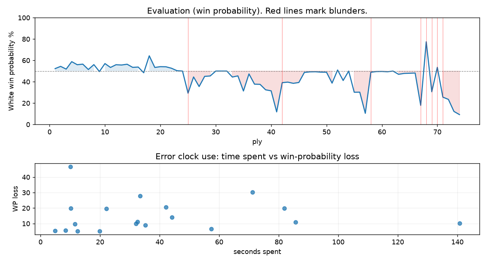

# (free, so lmk) Game analysis: DanielKetterer vs wa2n_bkl

Date: 2026.07.29  |  Time control: rapid (1800)  |  You played: white
Game ID: 541ca8ca-8b43-11f1-91da-1f3fb001000f
Analysis: depth=24 multipv=3 findability=honest floor=6 stable_run=3 threads=1 hash_mb=256 deterministic=True engine_id=Stockfish_18 generated=2026-07-29T13:10:28Z
Game end time UTC: 2026-07-29T12:22:16+00:00
Game: https://www.chess.com/game/live/172239094826

## Summary

- Lichess accuracy: you 64.8%, opponent 63.6%
- Opening: C00 French Defense: Knight Variation (theory followed through ply 3)
- First deviation from theory: ply 4, Opponent played 2... b6
- Your moves: 10 best, 2 excellent, 6 good, 8 inaccuracy, 7 mistake, 4 blunder

METRICS:

Best: The played move exactly matches Stockfish's top move

Excellent: A non-best move that loses 2 WP points or less.

Good: WP loss is over 2, but under 5 points; also used for losses under 20 when the position remains already decided.

Inaccuracy: WP loss is at least 5 but under 10 points.

Mistake: WP loss is at least 10 but under 20 points; also generally used when a forced mate is missed with under 10 points of WP loss.

Blunder: WP loss is 20 points or more, or a forced mate is missed with at least 10 points of WP loss.

See: https://support.chess.com/en/articles/8572705-how-are-moves-classified-what-is-a-blunder-or-brilliant-etc 

(Brillint, Great and Miss are rating subjective)
- Puzzles: 32 open, 0 solved

### Puzzle gate tally (this game)

Gates: category in ['brilliant_sacrifice', 'missed_tactic', 'allowed_tactic', 'endgame'], refute depth in [3, 8], best-vs-second WP gap >= 5. Refute bar per move: max(5, 0.6 x WP loss).

| outcome | errors |
|---|---|
| accepted | 1 |
| category:attention | 3 |
| category:opening | 2 |
| category:positional | 3 |
| refute_too_deep | 2 |
| refute_too_shallow | 2 |
| wp_gap_too_small | 6 |

Four gates pass at once or nothing is generated, so a zero here is a product of four pass rates rather than a fault. Read the binding gate off this table before changing any threshold.

### Sacrifices in the engine's line

Real sacrifices are listed but never served as puzzles: compensation that never resolves back into material has no gradable answer.

| Move | Offered | Kind | Quiet | Line ends | Verdict |
|---|---|---|---|---|---|
| 4 | -2.0 (exchange) | sham | yes | +0.0 pawns | opening_ply |
| 5 | -3.0 (piece) | real | yes | -1.0 pawns | real_sacrifice_not_gradable |
| 9 | -6.0 (piece) | sham | no | +3.0 pawns | opening_ply |
| 13 | -4.0 (piece) | sham | yes | +0.0 pawns | puzzle |
| 14 | -9.0 (piece) | sham | yes | +0.0 pawns | puzzle |
| 17 | -2.0 (exchange) | sham | yes | +3.0 pawns | obvious |
| 21 | -6.0 (piece) | real | no | -2.0 pawns | real_sacrifice_not_gradable |
| 29 | -3.0 (piece) | sham | yes | +0.0 pawns | desperado |
| 36 | -2.0 (exchange) | sham | yes | +1.0 pawns | puzzle |
| 37 | -3.0 (piece) | sham | yes | +0.0 pawns | desperado |

## Biggest missed opportunity

You played 35.Kh5. Stockfish preferred Kg7, after which the main line runs 35. Kg7 Rf4 36. Nd5 Rxe4 37. Rxf3 g4. The evaluation crossed from winning to losing, which matters more than the raw number. Why it went wrong: motif: creates threat on f8. This was a judgment error rather than a missed tactic; compare the pawn structure and piece activity after both moves. The engine prefers this move from at or below depth 6, which is as shallow as this measurement resolves; it sits near the surface, a quiet move, but one whose point shows at a glance. Candidates considered by the engine: Kg7 (+3.35), Rd1 (-0.16), Kh5 (-1.81).

## Critical positions

- Ply 25 (you), 13.Qd2: +0.00 -> -2.39 [evaluation crossed equal -> losing]
- Ply 29 (you), 15.Qf2: -0.54 -> -0.50 [only-move situation]
- Ply 31 (you), 16.Kxf2: +0.00 -> +0.00 [only-move situation]
- Ply 42 (opponent), 21...f6: -5.47 -> -1.20 [only-move situation; evaluation crossed winning -> equal]
- Ply 45 (you), 23.Kg3: -1.27 -> -1.18 [only-move situation]
- Ply 47 (you), 24.Kxf4: -0.14 -> -0.08 [only-move situation]
- Ply 50 (opponent), 25...Kb8: -0.11 -> -0.12 [only-move situation]
- Ply 57 (you), 29.Kf5: -2.27 -> -5.84 [only-move situation]

## Your errors, move by move

| Move | Class | Category | WP loss | Refute depth | Seconds spent | Pre-error eval |
|---|---|---|---:|---|---:|---|
| 4.d3 | inaccuracy | attention | 5% | 1 | 20 | balanced |
| 5.Qe2 | inaccuracy | opening | 7% | >18 | 57 | balanced |
| 9.gxf3 | inaccuracy | opening | 5% | 9 | 5 | balanced |
| 10.f4 | mistake | missed_tactic | 11% | 3 | 86 | balanced |
| 13.Qd2 | blunder | brilliant_sacrifice | 21% | 1 | 42 | balanced |
| 14.f3 | inaccuracy | brilliant_sacrifice | 9% | 1 | 35 | balanced |
| 17.Bc4 | inaccuracy | positional | 6% | 5 | 8 | balanced |
| 18.Kg3 | mistake | positional | 14% | 7 | 44 | balanced |
| 19.Rd1 | inaccuracy | allowed_tactic | 10% | 3 | 12 | balanced |
| 20.Kxf4 | inaccuracy | attention | 5% | 1 | 12 | balanced |
| 21.Kg4 | mistake | missed_tactic | 20% | 3 | 22 | losing |
| 26.b3 | mistake | missed_tactic | 10% | 5 | 141 | balanced |
| 27.h3 | inaccuracy | positional | 10% | 4 | 32 | balanced |
| 28.Bd5 | mistake | missed_tactic | 20% | 3 | 82 | balanced |
| 29.Kf5 | mistake | allowed_tactic | 20% | 10 | 10 | losing |
| 34.Rd3 | blunder | allowed_tactic | 30% | 16 | 71 | balanced |
| 35.Kh5 | blunder | allowed_tactic | 47% | 7 | 10 | winning |
| 36.a4 | blunder | brilliant_sacrifice | 28% | 4 | 33 | balanced |
| 37.Na2 | mistake | attention | 11% | 2 | 33 | losing |

### 4.d3 (inaccuracy, positional, wp loss 5%)

You played 4.d3. Stockfish preferred d4, after which the main line runs 4. d4 Bb4 5. Bd3 Nf6 6. Nd2 c5. This was a judgment error rather than a missed tactic; compare the pawn structure and piece activity after both moves. The engine prefers this move from at or below depth 6, which is as shallow as this measurement resolves; it sits near the surface, a quiet move, but one whose point shows at a glance. Candidates considered by the engine: d4 (+0.71), h4 (+0.61), a3 (+0.42).

### 5.Qe2 (inaccuracy, positional, wp loss 7%)

You played 5.Qe2. Stockfish preferred d4, after which the main line runs 5. d4 Bb4 6. Bd3 Nf6 7. Nd2 c5. This was a judgment error rather than a missed tactic; compare the pawn structure and piece activity after both moves. The engine prefers this move from at or below depth 6, which is as shallow as this measurement resolves; it sits near the surface, a quiet move, but one whose point shows at a glance. Candidates considered by the engine: d4 (+0.66), Be2 (+0.40), Bd2 (+0.33).

### 9.gxf3 (inaccuracy, positional, wp loss 5%)

You played 9.gxf3. Stockfish preferred Qxf3, after which the main line runs 9. Qxf3 Qxf3 10. gxf3 Kd8 11. dxe6 fxe6. Why it went wrong: a favorable capture was available (gxf3). This was a judgment error rather than a missed tactic; compare the pawn structure and piece activity after both moves. The engine prefers this move from at or below depth 6, which is as shallow as this measurement resolves; it sits near the surface, a quiet move, but one whose point shows at a glance. Candidates considered by the engine: Qxf3 (+0.41), gxf3 (+0.00), Kd1 (-4.02).

### 10.f4 (mistake, tactical, wp loss 11%)

You played 10.f4. Stockfish preferred dxe6, after which the main line runs 10. dxe6 fxe6 11. Bf4 Rc8 12. O-O-O a6. Why it went wrong: motif: fork. Before committing to a quiet move here, the checklist is checks, captures, threats, in that order. The engine never settles on this move within the analysis depth, so how findable it was is not measured here; weigh this one lightly. Candidates considered by the engine: dxe6 (+1.60), Bf4 (+1.50), Be3 (+0.95).

### 13.Qd2 (blunder, positional, wp loss 21%)

You played 13.Qd2. Stockfish preferred Rg1, after which the main line runs 13. Rg1 Qe7 14. e5 Nd5 15. Nxd5 Bxd5. The evaluation crossed from equal to losing, which matters more than the raw number. This was a judgment error rather than a missed tactic; compare the pawn structure and piece activity after both moves. The engine does not settle on this move until depth 12; reachable with real calculation, but not on a scan. Candidates considered by the engine: Rg1 (+0.00), a3 (+0.00), Bd2 (-0.11).

### 14.f3 (inaccuracy, positional, wp loss 9%)

You played 14.f3. Stockfish preferred Bg2, after which the main line runs 14. Bg2 Qh4 15. Qd3 f5 16. Qg3 Qxg3. This was a judgment error rather than a missed tactic; compare the pawn structure and piece activity after both moves. The engine never settles on this move within the analysis depth, so how findable it was is not measured here; weigh this one lightly. Candidates considered by the engine: Bg2 (-0.60), Qe3 (-0.64), h4 (-0.74).

### 17.Bc4 (inaccuracy, positional, wp loss 6%)

You played 17.Bc4. Stockfish preferred h4, after which the main line runs 17. h4 Be7 18. Be3 f5 19. exf5 exf5. This was a judgment error rather than a missed tactic; compare the pawn structure and piece activity after both moves. The engine prefers this move from at or below depth 6, which is as shallow as this measurement resolves; it sits near the surface, a quiet move, but one whose point shows at a glance. Candidates considered by the engine: h4 (+0.00), Be3 (-0.30), Rg1 (-0.37).

### 18.Kg3 (mistake, positional, wp loss 14%)

You played 18.Kg3. Stockfish preferred Be3, after which the main line runs 18. Be3 g5 19. Ne2 Be7 20. Rag1 Rhg8. The evaluation crossed from equal to losing, which matters more than the raw number. This was a judgment error rather than a missed tactic; compare the pawn structure and piece activity after both moves. The engine prefers this move from at or below depth 6, which is as shallow as this measurement resolves; it sits near the surface, a quiet move, but one whose point shows at a glance. Candidates considered by the engine: Be3 (-0.49), Ke2 (-0.58), Ke1 (-1.44).

### 19.Rd1 (inaccuracy, positional, wp loss 10%)

You played 19.Rd1. Stockfish preferred f5, after which the main line runs 19. f5 g6 20. fxg6 fxg6 21. Rd1 Kb8. Why it went wrong: motif: creates threat on f7. This was a judgment error rather than a missed tactic; compare the pawn structure and piece activity after both moves. The engine prefers this move from at or below depth 6, which is as shallow as this measurement resolves; it sits near the surface, a quiet move, but one whose point shows at a glance. Candidates considered by the engine: f5 (-0.29), Kg2 (-0.68), Bxf7 (-0.81).

### 20.Kxf4 (inaccuracy, positional, wp loss 5%)

You played 20.Kxf4. Stockfish preferred Bxf4, after which the main line runs 20. Bxf4 g5 21. Bc1 Rhf8 22. Kg2 b5. The evaluation crossed from equal to losing, which matters more than the raw number. Why it went wrong: a favorable capture was available (Kxf4); your king's zone came under heavier attack after this move. This was a judgment error rather than a missed tactic; compare the pawn structure and piece activity after both moves. The engine prefers this move from at or below depth 6, which is as shallow as this measurement resolves; it sits near the surface, a quiet move, but one whose point shows at a glance. Candidates considered by the engine: Bxf4 (-1.38), Kxf4 (-1.87), Kg2 (-3.01).

### 21.Kg4 (mistake, tactical, wp loss 20%)

You played 21.Kg4. Stockfish preferred Rxd6, after which the main line runs 21. Rxd6 cxd6 22. Be3 Rde8 23. Bd4 Ne5. Why it went wrong: left pawn on h2 insufficiently defended. Before committing to a quiet move here, the checklist is checks, captures, threats, in that order. The engine prefers this move from at or below depth 6, which is as shallow as this measurement resolves; it sits near the surface, a forcing move, the kind a checks-and-captures scan catches. Candidates considered by the engine: Rxd6 (-2.11), Ke3 (-2.22), e5 (-4.07).

### 26.b3 (mistake, tactical, wp loss 10%)

You played 26.b3. Stockfish preferred Rxd8+, after which the main line runs 26. Rxd8+ Rxd8 27. Rd1 Re8 28. Bd7 g5+. Why it went wrong: the best move was a forcing check; motif: fork. Before committing to a quiet move here, the checklist is checks, captures, threats, in that order. The engine prefers this move from at or below depth 6, which is as shallow as this measurement resolves; it sits near the surface, a forcing move, the kind a checks-and-captures scan catches. Candidates considered by the engine: Rxd8+ (-0.12), Kg3 (-0.59), b3 (-1.02).

### 27.h3 (inaccuracy, positional, wp loss 10%)

You played 27.h3. Stockfish preferred Ke3, after which the main line runs 27. Ke3 c5 28. Rxd8+ Rxd8 29. Rf1 b5. This was a judgment error rather than a missed tactic; compare the pawn structure and piece activity after both moves. The engine prefers this move from at or below depth 6, which is as shallow as this measurement resolves; it sits near the surface, a quiet move, but one whose point shows at a glance. Candidates considered by the engine: Ke3 (+0.11), Rxd8+ (+0.09), Bh3 (-0.05).

### 28.Bd5 (mistake, tactical, wp loss 20%)

You played 28.Bd5. Stockfish preferred Rxd8+, after which the main line runs 28. Rxd8+ Rxd8 29. Rg1 g5+ 30. Ke3 b5. The evaluation crossed from equal to losing, which matters more than the raw number. Why it went wrong: the best move was a forcing check; motif: fork. Before committing to a quiet move here, the checklist is checks, captures, threats, in that order. The engine prefers this move from at or below depth 6, which is as shallow as this measurement resolves; it sits near the surface, a forcing move, the kind a checks-and-captures scan catches. Candidates considered by the engine: Rxd8+ (+0.00), Bg4 (-0.32), Bc4 (-0.96).

### 29.Kf5 (mistake, tactical, wp loss 20%)

You played 29.Kf5. Stockfish preferred Ke3, after which the main line runs 29. Ke3 Bc8 30. Rh1 c6 31. Bc4 Nxc4+. Why it went wrong: left pawn on f3 insufficiently defended. Before committing to a quiet move here, the checklist is checks, captures, threats, in that order. The engine prefers this move from at or below depth 6, which is as shallow as this measurement resolves; it sits near the surface, a forcing move, the kind a checks-and-captures scan catches. Candidates considered by the engine: Ke3 (-2.27), Kf5 (-5.36).

### 34.Rd3 (blunder, positional, wp loss 30%)

You played 34.Rd3. Stockfish preferred Kh5, after which the main line runs 34. Kh5 Kc6 35. a3 Kb7 36. Rh1 a5. The evaluation crossed from equal to losing, which matters more than the raw number. Why it went wrong: motif: fork; creates threat on g5, h4. This was a judgment error rather than a missed tactic; compare the pawn structure and piece activity after both moves. The engine does not settle on this move until depth 15; reachable with real calculation, but not on a scan. Candidates considered by the engine: Kh5 (-0.20), a4 (-0.20), a3 (-0.20).

### 35.Kh5 (blunder, positional, wp loss 47%)

You played 35.Kh5. Stockfish preferred Kg7, after which the main line runs 35. Kg7 Rf4 36. Nd5 Rxe4 37. Rxf3 g4. The evaluation crossed from winning to losing, which matters more than the raw number. Why it went wrong: motif: creates threat on f8. This was a judgment error rather than a missed tactic; compare the pawn structure and piece activity after both moves. The engine prefers this move from at or below depth 6, which is as shallow as this measurement resolves; it sits near the surface, a quiet move, but one whose point shows at a glance. Candidates considered by the engine: Kg7 (+3.35), Rd1 (-0.16), Kh5 (-1.81).

### 36.a4 (blunder, positional, wp loss 28%)

You played 36.a4. Stockfish preferred Re3, after which the main line runs 36. Re3 Nd4 37. e5 Ne6 38. Ne4 Rf1. The evaluation crossed from equal to losing, which matters more than the raw number. Why it went wrong: motif: creates threat on g5, h4. This was a judgment error rather than a missed tactic; compare the pawn structure and piece activity after both moves. The engine first prefers this move at depth 8 and holds it; findable, but it takes a deliberate look rather than a scan. Candidates considered by the engine: Re3 (+0.38), Rd5 (+0.09), Rd1 (-0.12).

### 37.Na2 (mistake, positional, wp loss 11%)

You played 37.Na2. Stockfish preferred Nd1, after which the main line runs 37. Nd1 g4 38. Kxg4 Ne5+ 39. Kxh4 Nxd3. Why it went wrong: motif: creates threat on g5, h4. This was a judgment error rather than a missed tactic; compare the pawn structure and piece activity after both moves. The engine prefers this move from at or below depth 6, which is as shallow as this measurement resolves; it sits near the surface, a quiet move, but one whose point shows at a glance. Candidates considered by the engine: Nd1 (-3.21), Re3 (-3.25), Nd5 (-3.43).

## Full move table

| Ply | Move | Eval before | Eval after | Best | CP loss | WP loss | Class |
|-----|------|-------------|------------|------|---------|---------|-------|
| 1 | 1.e4* | +0.31 | +0.25 | e4 | 6 | 1% | best |
| 2 | 1...e6 | +0.25 | +0.48 | e5 | 23 | 2% | good |
| 3 | 2.Nf3* | +0.48 | +0.20 | d4 | 28 | 3% | good |
| 4 | 2...b6 | +0.20 | +0.97 | d5 | 77 | 7% | inaccuracy |
| 5 | 3.Nc3* | +0.97 | +0.65 | d4 | 32 | 3% | good |
| 6 | 3...Bb7 | +0.65 | +0.71 | Bb7 | 6 | 1% | best |
| 7 | 4.d3* | +0.71 | +0.16 | d4 | 55 | 5% | inaccuracy |
| 8 | 4...h6 | +0.16 | +0.66 | Nf6 | 50 | 5% | good |
| 9 | 5.Qe2* | +0.66 | -0.05 | d4 | 71 | 7% | inaccuracy |
| 10 | 5...Qf6 | -0.05 | +0.77 | Nf6 | 82 | 8% | inaccuracy |
| 11 | 6.d4* | +0.77 | +0.37 | g3 | 40 | 4% | good |
| 12 | 6...Nc6 | +0.37 | +0.65 | Bb4 | 28 | 3% | good |
| 13 | 7.d5* | +0.65 | +0.62 | Be3 | 3 | 0% | excellent |
| 14 | 7...Ne5 | +0.62 | +0.70 | Ne5 | 8 | 1% | best |
| 15 | 8.Nb5* | +0.70 | +0.38 | Nxe5 | 32 | 3% | good |
| 16 | 8...Nxf3+ | +0.38 | +0.41 | Nxf3+ | 3 | 0% | best |
| 17 | 9.gxf3* | +0.41 | -0.17 | Qxf3 | 58 | 5% | inaccuracy |
| 18 | 9...Qd8 | -0.17 | +1.60 | O-O-O | 177 | 16% | mistake |
| 19 | 10.f4* | +1.60 | +0.37 | dxe6 | 123 | 11% | mistake |
| 20 | 10...a6 | +0.37 | +0.45 | a6 | 8 | 1% | best |
| 21 | 11.Nc3* | +0.45 | +0.44 | Nc3 | 1 | 0% | best |
| 22 | 11...Nf6 | +0.44 | +0.29 | Nf6 | 0 | 0% | best |
| 23 | 12.dxe6* | +0.29 | +0.04 | Bg2 | 25 | 2% | good |
| 24 | 12...dxe6 | +0.04 | +0.00 | dxe6 | 0 | 0% | best |
| 25 | 13.Qd2* | +0.00 | -2.39 | Rg1 | 239 | 21% | blunder |
| 26 | 13...Nd7 | -2.39 | -0.60 | Nxe4 | 179 | 15% | mistake |
| 27 | 14.f3* | -0.60 | -1.62 | Bg2 | 102 | 9% | inaccuracy |
| 28 | 14...Qh4+ | -1.62 | -0.54 | Be7 | 108 | 10% | inaccuracy |
| 29 | 15.Qf2* | -0.54 | -0.50 | Qf2 | 0 | 0% | best |
| 30 | 15...Qxf2+ | -0.50 | +0.00 | Qf6 | 50 | 5% | good |
| 31 | 16.Kxf2* | +0.00 | +0.00 | Kxf2 | 0 | 0% | best |
| 32 | 16...O-O-O | +0.00 | +0.00 | Be7 | 0 | 0% | excellent |
| 33 | 17.Bc4* | +0.00 | -0.61 | h4 | 61 | 6% | inaccuracy |
| 34 | 17...Bc5+ | -0.61 | -0.49 | b5 | 12 | 1% | excellent |
| 35 | 18.Kg3* | -0.49 | -2.13 | Be3 | 164 | 14% | mistake |
| 36 | 18...e5 | -2.13 | -0.29 | g5 | 184 | 16% | mistake |
| 37 | 19.Rd1* | -0.29 | -1.36 | f5 | 107 | 10% | inaccuracy |
| 38 | 19...exf4+ | -1.36 | -1.38 | exf4+ | 0 | 0% | best |
| 39 | 20.Kxf4* | -1.38 | -1.99 | Bxf4 | 61 | 5% | inaccuracy |
| 40 | 20...Bd6+ | -1.99 | -2.11 | Bd6+ | 0 | 0% | best |
| 41 | 21.Kg4* | -2.11 | -5.47 | Rxd6 | 336 | 20% | mistake |
| 42 | 21...f6 | -5.47 | -1.20 | Ne5+ | 427 | 27% | blunder |
| 43 | 22.Bf4* | -1.20 | -1.14 | Bf4 | 0 | 0% | best |
| 44 | 22...h5+ | -1.14 | -1.27 | h5+ | 0 | 0% | best |
| 45 | 23.Kg3* | -1.27 | -1.18 | Kg3 | 0 | 0% | best |
| 46 | 23...Bxf4+ | -1.18 | -0.14 | Ne5 | 104 | 9% | inaccuracy |
| 47 | 24.Kxf4* | -0.14 | -0.08 | Kxf4 | 0 | 0% | best |
| 48 | 24...Ne5 | -0.08 | -0.07 | Rde8 | 1 | 0% | excellent |
| 49 | 25.Be6+* | -0.07 | -0.11 | Be6+ | 4 | 0% | best |
| 50 | 25...Kb8 | -0.11 | -0.12 | Kb8 | 0 | 0% | best |
| 51 | 26.b3* | -0.12 | -1.25 | Rxd8+ | 113 | 10% | mistake |
| 52 | 26...h4 | -1.25 | +0.11 | Rde8 | 136 | 12% | mistake |
| 53 | 27.h3* | +0.11 | -0.97 | Ke3 | 108 | 10% | inaccuracy |
| 54 | 27...Rhe8 | -0.97 | +0.00 | Rde8 | 97 | 9% | inaccuracy |
| 55 | 28.Bd5* | +0.00 | -2.28 | Rxd8+ | 228 | 20% | mistake |
| 56 | 28...g5+ | -2.28 | -2.27 | Bc8 | 1 | 0% | excellent |
| 57 | 29.Kf5* | -2.27 | -5.84 | Ke3 | 357 | 20% | mistake |
| 58 | 29...Nxf3 | -5.84 | -0.12 | Bc8+ | 572 | 38% | blunder |
| 59 | 30.Bxb7* | -0.12 | -0.05 | Bxb7 | 0 | 0% | best |
| 60 | 30...Rxd1 | -0.05 | -0.04 | Rxd1 | 1 | 0% | best |
| 61 | 31.Rxd1* | -0.04 | -0.07 | Rxd1 | 3 | 0% | best |
| 62 | 31...Kxb7 | -0.07 | +0.00 | Kxb7 | 7 | 1% | best |
| 63 | 32.Kxf6* | +0.00 | -0.33 | Rd5 | 33 | 3% | good |
| 64 | 32...Rf8+ | -0.33 | -0.24 | Rf8+ | 9 | 1% | best |
| 65 | 33.Kg6* | -0.24 | -0.22 | Kg7 | 0 | 0% | excellent |
| 66 | 33...Rf4 | -0.22 | -0.20 | Rf4 | 2 | 0% | best |
| 67 | 34.Rd3* | -0.20 | -4.14 | Kh5 | 394 | 30% | blunder |
| 68 | 34...Rf8 | -4.14 | +3.35 | g4 | 749 | 60% | blunder |
| 69 | 35.Kh5* | +3.35 | -2.22 | Kg7 | 557 | 47% | blunder |
| 70 | 35...b5 | -2.22 | +0.38 | Rh8+ | 260 | 23% | blunder |
| 71 | 36.a4* | +0.38 | -2.90 | Re3 | 328 | 28% | blunder |
| 72 | 36...b4 | -2.90 | -3.21 | Rh8+ | 0 | 0% | excellent |
| 73 | 37.Na2* | -3.21 | -5.36 | Nd1 | 215 | 11% | mistake |
| 74 | 37...Rh8+ | -5.36 | -6.21 | Rh8+ | 0 | 0% | best |

Rows marked * are your moves. WP loss is win-probability loss; it is the primary signal, CP loss is shown for reference.

## Patterns in this game

- Error categories: 4 allowed_tactic, 3 attention, 3 brilliant_sacrifice, 4 missed_tactic, 2 opening, 3 positional.
- Attention errors per 100 moves: 8.1.
- Pre-error eval buckets: 1 winning, 15 balanced, 3 losing.
- Opening: 4 error(s) (avg wp loss 7%).
- Middlegame: 11 error(s) (avg wp loss 13%).
- Endgame: 4 error(s) (avg wp loss 29%).
