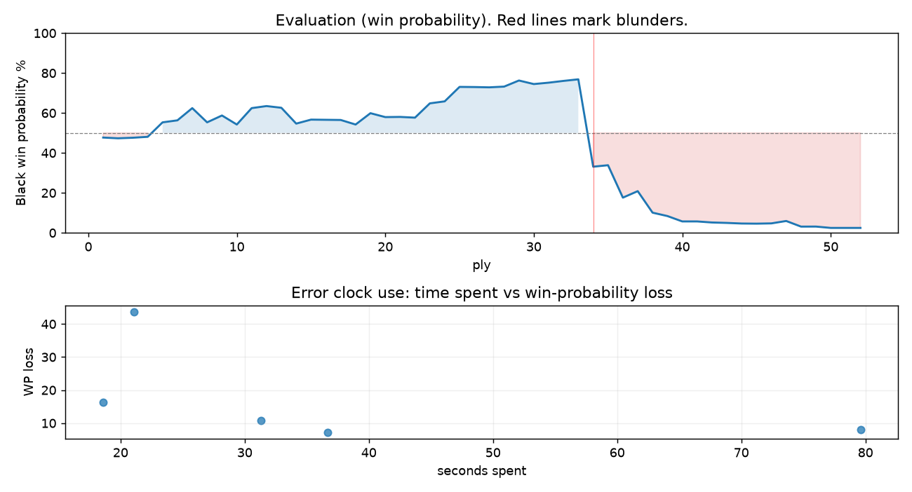

# (free, so lmk) Game analysis: Hog03 vs DanielKetterer

Date: 2026.07.29  |  Time control: rapid (1800)  |  You played: black
Game ID: 3ed572b1-8b7b-11f1-a707-252f5701000f
Analysis: depth=24 multipv=3 findability=honest floor=6 stable_run=3 threads=1 hash_mb=256 deterministic=True engine_id=Stockfish_18 generated=2026-07-29T19:05:53Z
Game end time UTC: 2026-07-29T18:51:12+00:00
Game: https://www.chess.com/game/live/172255926288

## Summary

- Lichess accuracy: you 72.7%, opponent 90.5%
- Opening: B10 Caro-Kann Defense: Accelerated Panov Attack (theory followed through ply 4)
- First deviation from theory: ply 5, Opponent played 3. d3
- Your moves: 6 best, 11 excellent, 4 good, 2 inaccuracy, 2 mistake, 1 blunder

METRICS:

Best: The played move exactly matches Stockfish's top move

Excellent: A non-best move that loses 2 WP points or less.

Good: WP loss is over 2, but under 5 points; also used for losses under 20 when the position remains already decided.

Inaccuracy: WP loss is at least 5 but under 10 points.

Mistake: WP loss is at least 10 but under 20 points; also generally used when a forced mate is missed with under 10 points of WP loss.

Blunder: WP loss is 20 points or more, or a forced mate is missed with at least 10 points of WP loss.

See: https://support.chess.com/en/articles/8572705-how-are-moves-classified-what-is-a-blunder-or-brilliant-etc 

(Brillint, Great and Miss are rating subjective)
- Puzzles: 33 open, 0 solved

### Puzzle gate tally (this game)

Gates: category in ['brilliant_sacrifice', 'missed_tactic', 'allowed_tactic', 'endgame'], refute depth in [3, 8], best-vs-second WP gap >= 5. Refute bar per move: max(5, 0.6 x WP loss).

| outcome | errors |
|---|---|
| category:attention | 3 |
| refute_censored_high | 1 |
| refute_too_deep | 1 |

Four gates pass at once or nothing is generated, so a zero here is a product of four pass rates rather than a fault. Read the binding gate off this table before changing any threshold.

### Sacrifices in the engine's line

Real sacrifices are listed but never served as puzzles: compensation that never resolves back into material has no gradable answer.

| Move | Offered | Kind | Quiet | Line ends | Verdict |
|---|---|---|---|---|---|
| 4 | -2.0 (exchange) | sham | yes | +0.0 pawns | opening_ply |
| 7 | -4.0 (piece) | real | yes | -1.0 pawns | real_sacrifice_not_gradable |
| 17 | -7.0 (piece) | sham | yes | +2.0 pawns | obvious |
| 18 | -5.0 (piece) | sham | yes | +1.0 pawns | desperado |
| 19 | -8.0 (piece) | sham | no | +1.0 pawns | desperado |

## Biggest missed opportunity

You played 17...Rd7. Stockfish preferred Kb7, after which the main line runs 17...Kb7 18. Nf3 Bxa3 19. bxa3 Nfe4 20. Rxd8. The evaluation crossed from winning to losing, which matters more than the raw number. Why it went wrong: left bishop on b4 insufficiently defended. Before committing to a quiet move here, the checklist is checks, captures, threats, in that order. The engine prefers this move from at or below depth 6, which is as shallow as this measurement resolves; it sits near the surface, a forcing move, the kind a checks-and-captures scan catches. Candidates considered by the engine: Kb7 (-3.26), Ne6 (+0.00), Ncd7 (+1.80).

## Critical positions

- Ply 34 (you), 17...Rd7: -3.26 -> +1.91 [only-move situation; evaluation crossed winning -> losing]

## Your errors, move by move

| Move | Class | Category | WP loss | Refute depth | Seconds spent | Pre-error eval |
|---|---|---|---:|---|---:|---|
| 4...Be6 | inaccuracy | attention | 7% | 1 | 37 | balanced |
| 7...Qd8 | inaccuracy | attention | 8% | 1 | 80 | balanced |
| 17...Rd7 | blunder | missed_tactic | 44% | 10 | 21 | winning |
| 18...Rd8 | mistake | missed_tactic | 16% | >18 | 19 | losing |
| 19...g6 | mistake | attention | 11% | 1 | 31 | losing |

### 4...Be6 (inaccuracy, positional, wp loss 7%)

You played 4...Be6. Stockfish preferred e5, after which the main line runs 4...e5 5. dxe5 Qxd1+ 6. Kxd1 Bf5 7. Ne2. This was a judgment error rather than a missed tactic; compare the pawn structure and piece activity after both moves. The engine prefers this move from at or below depth 6, which is as shallow as this measurement resolves; it sits near the surface, a quiet move, but one whose point shows at a glance. Candidates considered by the engine: e5 (-1.38), Na6 (-1.32), Bf5 (-1.23).

### 7...Qd8 (inaccuracy, positional, wp loss 8%)

You played 7...Qd8. Stockfish preferred Qe5, after which the main line runs 7...Qe5 8. Nge2 Nf6 9. Bf4 Qa5 10. Bd2. Why it went wrong: left pawn on e4 insufficiently defended. This was a judgment error rather than a missed tactic; compare the pawn structure and piece activity after both moves. The engine prefers this move from at or below depth 6, which is as shallow as this measurement resolves; it sits near the surface, a quiet move, but one whose point shows at a glance. Candidates considered by the engine: Qe5 (-1.40), Qd7 (-0.62), Qd8 (-0.54).

### 17...Rd7 (blunder, tactical, wp loss 44%)

You played 17...Rd7. Stockfish preferred Kb7, after which the main line runs 17...Kb7 18. Nf3 Bxa3 19. bxa3 Nfe4 20. Rxd8. The evaluation crossed from winning to losing, which matters more than the raw number. Why it went wrong: left bishop on b4 insufficiently defended. Before committing to a quiet move here, the checklist is checks, captures, threats, in that order. The engine prefers this move from at or below depth 6, which is as shallow as this measurement resolves; it sits near the surface, a forcing move, the kind a checks-and-captures scan catches. Candidates considered by the engine: Kb7 (-3.26), Ne6 (+0.00), Ncd7 (+1.80).

### 18...Rd8 (mistake, tactical, wp loss 16%)

You played 18...Rd8. Stockfish preferred Ne6, after which the main line runs 18...Ne6 19. Nf3 Rhd8 20. Bxe5 Rxd1 21. Bxc7. Why it went wrong: left knight on c5 insufficiently defended. Before committing to a quiet move here, the checklist is checks, captures, threats, in that order. The engine does not settle on this move until depth 13; reachable with real calculation, but not on a scan. Candidates considered by the engine: Ne6 (+1.82), Nce4 (+2.61), Nb7 (+2.68).

### 19...g6 (mistake, tactical, wp loss 11%)

You played 19...g6. Stockfish preferred Qxe5+, after which the main line runs 19...Qxe5+ 20. Qxe5 Rxd1 21. bxc5 R1d2+ 22. Kf3. Why it went wrong: left queen on c7, knight on f6 insufficiently defended; the best move was a forcing check; motif: fork. Before committing to a quiet move here, the checklist is checks, captures, threats, in that order. The engine prefers this move from at or below depth 6, which is as shallow as this measurement resolves; it sits near the surface, a forcing move, the kind a checks-and-captures scan catches. Candidates considered by the engine: Qxe5+ (+3.62), Re8 (+3.64), Qb7 (+5.11).

## Full move table

| Ply | Move | Eval before | Eval after | Best | CP loss | WP loss | Class |
|-----|------|-------------|------------|------|---------|---------|-------|
| 1 | 1.e4 | +0.31 | +0.25 | e4 | 6 | 1% | best |
| 2 | 1...c6* | +0.25 | +0.29 | e5 | 4 | 0% | excellent |
| 3 | 2.c4 | +0.29 | +0.26 | c3 | 3 | 0% | excellent |
| 4 | 2...d5* | +0.26 | +0.21 | d5 | 0 | 0% | best |
| 5 | 3.d3 | +0.21 | -0.58 | cxd5 | 79 | 7% | inaccuracy |
| 6 | 3...dxe4* | -0.58 | -0.69 | d4 | 0 | 0% | excellent |
| 7 | 4.d4 | -0.69 | -1.38 | dxe4 | 69 | 6% | inaccuracy |
| 8 | 4...Be6* | -1.38 | -0.58 | e5 | 80 | 7% | inaccuracy |
| 9 | 5.Qb3 | -0.58 | -0.96 | Nc3 | 38 | 3% | good |
| 10 | 5...b6* | -0.96 | -0.46 | Qb6 | 50 | 5% | good |
| 11 | 6.Nc3 | -0.46 | -1.38 | Ne2 | 92 | 8% | inaccuracy |
| 12 | 6...Qxd4* | -1.38 | -1.50 | Qxd4 | 0 | 0% | best |
| 13 | 7.Be3 | -1.50 | -1.40 | g3 | 0 | 0% | excellent |
| 14 | 7...Qd8* | -1.40 | -0.51 | Qe5 | 89 | 8% | inaccuracy |
| 15 | 8.Rd1 | -0.51 | -0.73 | Nxe4 | 22 | 2% | excellent |
| 16 | 8...Qc7* | -0.73 | -0.72 | Qc7 | 1 | 0% | best |
| 17 | 9.Nxe4 | -0.72 | -0.71 | Nxe4 | 0 | 0% | best |
| 18 | 9...Bf5* | -0.71 | -0.46 | Nf6 | 25 | 2% | good |
| 19 | 10.Qd3 | -0.46 | -1.09 | Bd3 | 63 | 6% | inaccuracy |
| 20 | 10...Bxe4* | -1.09 | -0.87 | e5 | 22 | 2% | excellent |
| 21 | 11.Qxe4 | -0.87 | -0.88 | Qxe4 | 1 | 0% | best |
| 22 | 11...Nd7* | -0.88 | -0.84 | Nf6 | 4 | 0% | excellent |
| 23 | 12.Bf4 | -0.84 | -1.66 | g4 | 82 | 7% | inaccuracy |
| 24 | 12...e5* | -1.66 | -1.78 | e5 | 0 | 0% | best |
| 25 | 13.Bg3 | -1.78 | -2.71 | Bd2 | 93 | 7% | inaccuracy |
| 26 | 13...Bb4+* | -2.71 | -2.70 | Ngf6 | 1 | 0% | excellent |
| 27 | 14.Ke2 | -2.70 | -2.68 | Ke2 | 0 | 0% | best |
| 28 | 14...Ngf6* | -2.68 | -2.73 | Ngf6 | 0 | 0% | best |
| 29 | 15.Qd3 | -2.73 | -3.17 | Qc2 | 44 | 3% | good |
| 30 | 15...O-O-O* | -3.17 | -2.91 | Rd8 | 26 | 2% | excellent |
| 31 | 16.a3 | -2.91 | -3.01 | a3 | 10 | 1% | best |
| 32 | 16...Nc5* | -3.01 | -3.14 | Be7 | 0 | 0% | excellent |
| 33 | 17.Qf5+ | -3.14 | -3.26 | Qf5+ | 12 | 1% | best |
| 34 | 17...Rd7* | -3.26 | +1.91 | Kb7 | 517 | 44% | blunder |
| 35 | 18.axb4 | +1.91 | +1.82 | axb4 | 9 | 1% | best |
| 36 | 18...Rd8* | +1.82 | +4.19 | Ne6 | 237 | 16% | mistake |
| 37 | 19.Bxe5 | +4.19 | +3.62 | bxc5 | 57 | 3% | good |
| 38 | 19...g6* | +3.62 | +5.94 | Qxe5+ | 232 | 11% | mistake |
| 39 | 20.Bxc7 | +5.94 | +6.49 | Bxc7 | 0 | 0% | best |
| 40 | 20...gxf5* | +6.49 | +7.62 | Re8+ | 113 | 3% | good |
| 41 | 21.Bxd8 | +7.62 | +7.62 | Bxd8 | 0 | 0% | best |
| 42 | 21...Rxd1* | +7.62 | +7.90 | Rxd8 | 28 | 1% | excellent |
| 43 | 22.Kxd1 | +7.90 | +8.02 | Kxd1 | 0 | 0% | best |
| 44 | 22...Nfe4* | +8.02 | +8.20 | Kxd8 | 18 | 0% | excellent |
| 45 | 23.bxc5 | +8.20 | +8.24 | bxc5 | 0 | 0% | best |
| 46 | 23...Kxd8* | +8.24 | +8.16 | Kxd8 | 0 | 0% | best |
| 47 | 24.Ke2 | +8.16 | +7.51 | cxb6 | 65 | 1% | excellent |
| 48 | 24...Nxf2* | +7.51 | +9.34 | Nxc5 | 183 | 3% | good |
| 49 | 25.Kxf2 | +9.34 | +9.32 | Kxf2 | 2 | 0% | best |
| 50 | 25...f4* | +9.32 | +10.62 | Kc7 | 130 | 1% | excellent |
| 51 | 26.Nf3 | +10.62 | +26.59 | Kf3 | 0 | 0% | excellent |
| 52 | 26...h5* | +26.59 | M29 | Kd7 |  | 0% | excellent |

Rows marked * are your moves. WP loss is win-probability loss; it is the primary signal, CP loss is shown for reference.

## Patterns in this game

- Error categories: 3 attention, 2 missed_tactic.
- Attention errors per 100 moves: 11.5.
- Pre-error eval buckets: 1 winning, 2 balanced, 2 losing.
- Opening: 2 error(s) (avg wp loss 8%).
- Middlegame: 3 error(s) (avg wp loss 24%).
