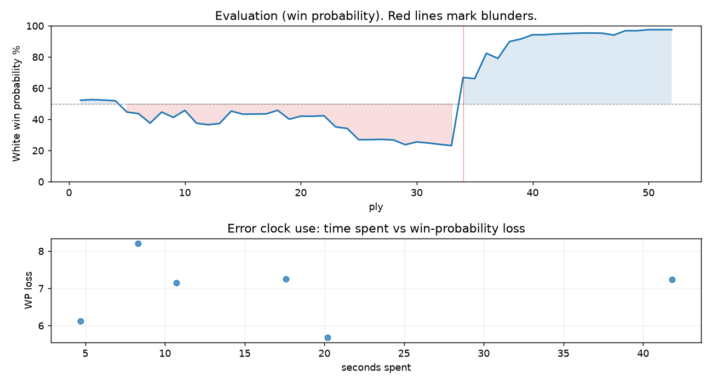

# (free, so lmk) Game analysis: Hog03 vs DanielKetterer

Date: 2026.07.29  |  Time control: rapid (1800)  |  You played: white
Game ID: 3ed572b1-8b7b-11f1-a707-252f5701000f
Analysis: depth=24 multipv=3 findability=honest floor=6 stable_run=3 threads=1 hash_mb=256 deterministic=True engine_id=Stockfish_18 generated=2026-07-29T19:05:53Z
Game end time UTC: 2026-07-29T18:51:12+00:00
Game: https://www.chess.com/game/live/172255926288

## Summary

- Lichess accuracy: you 90.5%, opponent 72.7%
- Opening: B10 Caro-Kann Defense: Accelerated Panov Attack (theory followed through ply 4)
- First deviation from theory: ply 5, You played 3. d3
- Your moves: 12 best, 5 excellent, 3 good, 6 inaccuracy, 0 mistake, 0 blunder

METRICS:

Best: The played move exactly matches Stockfish's top move

Excellent: A non-best move that loses 2 WP points or less.

Good: WP loss is over 2, but under 5 points; also used for losses under 20 when the position remains already decided.

Inaccuracy: WP loss is at least 5 but under 10 points.

Mistake: WP loss is at least 10 but under 20 points; also generally used when a forced mate is missed with under 10 points of WP loss.

Blunder: WP loss is 20 points or more, or a forced mate is missed with at least 10 points of WP loss.

See: https://support.chess.com/en/articles/8572705-how-are-moves-classified-what-is-a-blunder-or-brilliant-etc 

(Brillint, Great and Miss are rating subjective)
- Puzzles: 33 open, 0 solved

### Puzzle gate tally (this game)

Gates: category in ['brilliant_sacrifice', 'missed_tactic', 'allowed_tactic', 'endgame'], refute depth in [3, 8], best-vs-second WP gap >= 5. Refute bar per move: max(5, 0.6 x WP loss).

| outcome | errors |
|---|---|
| category:attention | 3 |
| category:opening | 2 |
| refute_too_deep | 1 |

Four gates pass at once or nothing is generated, so a zero here is a product of four pass rates rather than a fault. Read the binding gate off this table before changing any threshold.

### Sacrifices in the engine's line

Real sacrifices are listed but never served as puzzles: compensation that never resolves back into material has no gradable answer.

| Move | Offered | Kind | Quiet | Line ends | Verdict |
|---|---|---|---|---|---|
| 4 | -8.0 (piece) | sham | no | +2.0 pawns | opening_ply |
| 6 | -3.0 (piece) | sham | yes | +1.0 pawns | opening_ply |
| 10 | -3.0 (piece) | sham | yes | +0.0 pawns | opening_ply |
| 12 | -4.0 (piece) | sham | yes | +0.0 pawns | puzzle |
| 13 | -5.0 (piece) | sham | yes | +0.0 pawns | desperado |

## Critical positions

- Ply 34 (opponent), 17...Rd7: -3.26 -> +1.91 [only-move situation; evaluation crossed winning -> losing]

## Your errors, move by move

| Move | Class | Category | WP loss | Refute depth | Seconds spent | Pre-error eval |
|---|---|---|---:|---|---:|---|
| 3.d3 | inaccuracy | opening | 7% | 6 | 18 | balanced |
| 4.d4 | inaccuracy | attention | 6% | 1 | 5 | balanced |
| 6.Nc3 | inaccuracy | attention | 8% | 1 | 8 | balanced |
| 10.Qd3 | inaccuracy | opening | 6% | 1 | 20 | balanced |
| 12.Bf4 | inaccuracy | brilliant_sacrifice | 7% | 9 | 11 | balanced |
| 13.Bg3 | inaccuracy | attention | 7% | 1 | 42 | losing |

### 3.d3 (inaccuracy, positional, wp loss 7%)

You played 3.d3. Stockfish preferred cxd5, after which the main line runs 3. cxd5 cxd5 4. exd5 Nf6 5. Nc3 Nxd5. This was a judgment error rather than a missed tactic; compare the pawn structure and piece activity after both moves. The engine prefers this move from at or below depth 6, which is as shallow as this measurement resolves; it sits near the surface, a quiet move, but one whose point shows at a glance. Candidates considered by the engine: cxd5 (+0.21), exd5 (+0.18), e5 (-0.25).

### 4.d4 (inaccuracy, positional, wp loss 6%)

You played 4.d4. Stockfish preferred dxe4, after which the main line runs 4. dxe4 Qxd1+ 5. Kxd1 Nf6 6. Nc3 e5. Why it went wrong: a favorable capture was available (dxe4). This was a judgment error rather than a missed tactic; compare the pawn structure and piece activity after both moves. The engine prefers this move from at or below depth 6, which is as shallow as this measurement resolves; it sits near the surface, a quiet move, but one whose point shows at a glance. Candidates considered by the engine: dxe4 (-0.69), Nc3 (-0.94), Be3 (-1.23).

### 6.Nc3 (inaccuracy, positional, wp loss 8%)

You played 6.Nc3. Stockfish preferred Ne2, after which the main line runs 6. Ne2 Nf6 7. Nbc3 Nbd7 8. Ng3 b5. Why it went wrong: left pawn on d4 insufficiently defended. This was a judgment error rather than a missed tactic; compare the pawn structure and piece activity after both moves. The engine prefers this move from at or below depth 6, which is as shallow as this measurement resolves; it sits near the surface, a quiet move, but one whose point shows at a glance. Candidates considered by the engine: Ne2 (-0.46), Be3 (-0.59), Qe3 (-0.82).

### 10.Qd3 (inaccuracy, positional, wp loss 6%)

You played 10.Qd3. Stockfish preferred Bd3, after which the main line runs 10. Bd3 e6 11. Ne2 Nd7 12. O-O Bg6. This was a judgment error rather than a missed tactic; compare the pawn structure and piece activity after both moves. The engine never settles on this move within the analysis depth, so how findable it was is not measured here; weigh this one lightly. Candidates considered by the engine: Bd3 (-0.46), Ng3 (-0.56), Qc2 (-0.92).

### 12.Bf4 (inaccuracy, positional, wp loss 7%)

You played 12.Bf4. Stockfish preferred g4, after which the main line runs 12. g4 Ngf6 13. Qg2 e6 14. Be2 O-O-O. This was a judgment error rather than a missed tactic; compare the pawn structure and piece activity after both moves. The engine does not settle on this move until depth 16; reachable with real calculation, but not on a scan. Candidates considered by the engine: g4 (-0.84), Be2 (-1.02), g3 (-1.04).

### 13.Bg3 (inaccuracy, positional, wp loss 7%)

You played 13.Bg3. Stockfish preferred Bd2, after which the main line runs 13. Bd2 Ngf6 14. Qc2 Rd8 15. Bc3 Bc5. This was a judgment error rather than a missed tactic; compare the pawn structure and piece activity after both moves. The engine prefers this move from at or below depth 6, which is as shallow as this measurement resolves; it sits near the surface, a quiet move, but one whose point shows at a glance. Candidates considered by the engine: Bd2 (-1.78), a3 (-1.99), Nf3 (-1.99).

## Full move table

| Ply | Move | Eval before | Eval after | Best | CP loss | WP loss | Class |
|-----|------|-------------|------------|------|---------|---------|-------|
| 1 | 1.e4* | +0.31 | +0.25 | e4 | 6 | 1% | best |
| 2 | 1...c6 | +0.25 | +0.29 | e5 | 4 | 0% | excellent |
| 3 | 2.c4* | +0.29 | +0.26 | c3 | 3 | 0% | excellent |
| 4 | 2...d5 | +0.26 | +0.21 | d5 | 0 | 0% | best |
| 5 | 3.d3* | +0.21 | -0.58 | cxd5 | 79 | 7% | inaccuracy |
| 6 | 3...dxe4 | -0.58 | -0.69 | d4 | 0 | 0% | excellent |
| 7 | 4.d4* | -0.69 | -1.38 | dxe4 | 69 | 6% | inaccuracy |
| 8 | 4...Be6 | -1.38 | -0.58 | e5 | 80 | 7% | inaccuracy |
| 9 | 5.Qb3* | -0.58 | -0.96 | Nc3 | 38 | 3% | good |
| 10 | 5...b6 | -0.96 | -0.46 | Qb6 | 50 | 5% | good |
| 11 | 6.Nc3* | -0.46 | -1.38 | Ne2 | 92 | 8% | inaccuracy |
| 12 | 6...Qxd4 | -1.38 | -1.50 | Qxd4 | 0 | 0% | best |
| 13 | 7.Be3* | -1.50 | -1.40 | g3 | 0 | 0% | excellent |
| 14 | 7...Qd8 | -1.40 | -0.51 | Qe5 | 89 | 8% | inaccuracy |
| 15 | 8.Rd1* | -0.51 | -0.73 | Nxe4 | 22 | 2% | excellent |
| 16 | 8...Qc7 | -0.73 | -0.72 | Qc7 | 1 | 0% | best |
| 17 | 9.Nxe4* | -0.72 | -0.71 | Nxe4 | 0 | 0% | best |
| 18 | 9...Bf5 | -0.71 | -0.46 | Nf6 | 25 | 2% | good |
| 19 | 10.Qd3* | -0.46 | -1.09 | Bd3 | 63 | 6% | inaccuracy |
| 20 | 10...Bxe4 | -1.09 | -0.87 | e5 | 22 | 2% | excellent |
| 21 | 11.Qxe4* | -0.87 | -0.88 | Qxe4 | 1 | 0% | best |
| 22 | 11...Nd7 | -0.88 | -0.84 | Nf6 | 4 | 0% | excellent |
| 23 | 12.Bf4* | -0.84 | -1.66 | g4 | 82 | 7% | inaccuracy |
| 24 | 12...e5 | -1.66 | -1.78 | e5 | 0 | 0% | best |
| 25 | 13.Bg3* | -1.78 | -2.71 | Bd2 | 93 | 7% | inaccuracy |
| 26 | 13...Bb4+ | -2.71 | -2.70 | Ngf6 | 1 | 0% | excellent |
| 27 | 14.Ke2* | -2.70 | -2.68 | Ke2 | 0 | 0% | best |
| 28 | 14...Ngf6 | -2.68 | -2.73 | Ngf6 | 0 | 0% | best |
| 29 | 15.Qd3* | -2.73 | -3.17 | Qc2 | 44 | 3% | good |
| 30 | 15...O-O-O | -3.17 | -2.91 | Rd8 | 26 | 2% | excellent |
| 31 | 16.a3* | -2.91 | -3.01 | a3 | 10 | 1% | best |
| 32 | 16...Nc5 | -3.01 | -3.14 | Be7 | 0 | 0% | excellent |
| 33 | 17.Qf5+* | -3.14 | -3.26 | Qf5+ | 12 | 1% | best |
| 34 | 17...Rd7 | -3.26 | +1.91 | Kb7 | 517 | 44% | blunder |
| 35 | 18.axb4* | +1.91 | +1.82 | axb4 | 9 | 1% | best |
| 36 | 18...Rd8 | +1.82 | +4.19 | Ne6 | 237 | 16% | mistake |
| 37 | 19.Bxe5* | +4.19 | +3.62 | bxc5 | 57 | 3% | good |
| 38 | 19...g6 | +3.62 | +5.94 | Qxe5+ | 232 | 11% | mistake |
| 39 | 20.Bxc7* | +5.94 | +6.49 | Bxc7 | 0 | 0% | best |
| 40 | 20...gxf5 | +6.49 | +7.62 | Re8+ | 113 | 3% | good |
| 41 | 21.Bxd8* | +7.62 | +7.62 | Bxd8 | 0 | 0% | best |
| 42 | 21...Rxd1 | +7.62 | +7.90 | Rxd8 | 28 | 1% | excellent |
| 43 | 22.Kxd1* | +7.90 | +8.02 | Kxd1 | 0 | 0% | best |
| 44 | 22...Nfe4 | +8.02 | +8.20 | Kxd8 | 18 | 0% | excellent |
| 45 | 23.bxc5* | +8.20 | +8.24 | bxc5 | 0 | 0% | best |
| 46 | 23...Kxd8 | +8.24 | +8.16 | Kxd8 | 0 | 0% | best |
| 47 | 24.Ke2* | +8.16 | +7.51 | cxb6 | 65 | 1% | excellent |
| 48 | 24...Nxf2 | +7.51 | +9.34 | Nxc5 | 183 | 3% | good |
| 49 | 25.Kxf2* | +9.34 | +9.32 | Kxf2 | 2 | 0% | best |
| 50 | 25...f4 | +9.32 | +10.62 | Kc7 | 130 | 1% | excellent |
| 51 | 26.Nf3* | +10.62 | +26.59 | Kf3 | 0 | 0% | excellent |
| 52 | 26...h5 | +26.59 | M29 | Kd7 |  | 0% | excellent |

Rows marked * are your moves. WP loss is win-probability loss; it is the primary signal, CP loss is shown for reference.

## Patterns in this game

- Error categories: 3 attention, 1 brilliant_sacrifice, 2 opening.
- Attention errors per 100 moves: 11.5.
- Pre-error eval buckets: 0 winning, 5 balanced, 1 losing.
- Opening: 4 error(s) (avg wp loss 7%).
- Middlegame: 2 error(s) (avg wp loss 7%).
