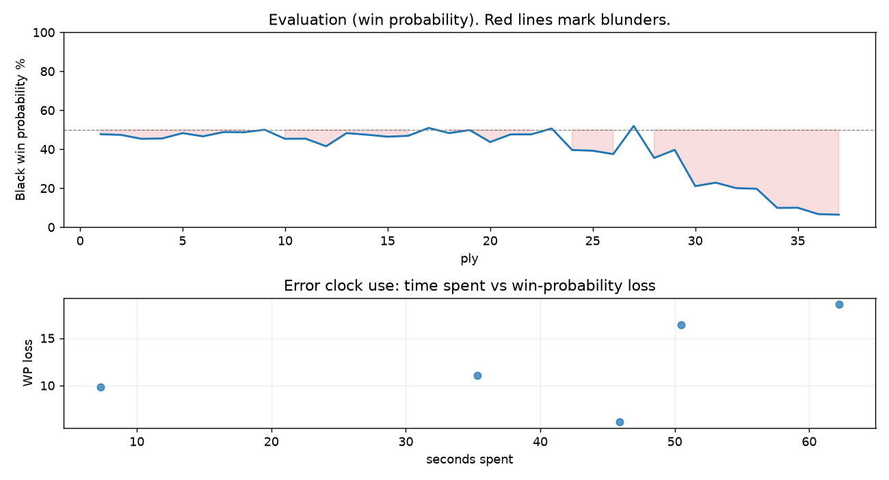

# (free, so lmk) Game analysis: Reinaldo-g vs DanielKetterer

Date: 2026.07.30  |  Time control: rapid (1800)  |  You played: black
Game ID: d0dafb06-8c20-11f1-85a4-9b2a4301000f
Analysis: depth=24 multipv=3 findability=honest floor=6 stable_run=3 threads=1 hash_mb=256 deterministic=True engine_id=Stockfish_18 generated=2026-07-30T14:43:26Z
Game end time UTC: 2026-07-30T14:24:44+00:00
Game: https://www.chess.com/game/live/172291417954

## Summary

- Lichess accuracy: you 74.5%, opponent 88.2%
- Opening: B13 Caro-Kann Defense: Panov Attack (theory followed through ply 7)
- First deviation from theory: ply 8, You played 4... Nf6
- Your moves: 5 best, 3 excellent, 5 good, 2 inaccuracy, 3 mistake, 0 blunder

METRICS:

Best: The played move exactly matches Stockfish's top move

Excellent: A non-best move that loses 2 WP points or less.

Good: WP loss is over 2, but under 5 points; also used for losses under 20 when the position remains already decided.

Inaccuracy: WP loss is at least 5 but under 10 points.

Mistake: WP loss is at least 10 but under 20 points; also generally used when a forced mate is missed with under 10 points of WP loss.

Blunder: WP loss is 20 points or more, or a forced mate is missed with at least 10 points of WP loss.

See: https://support.chess.com/en/articles/8572705-how-are-moves-classified-what-is-a-blunder-or-brilliant-etc 

(Brillint, Great and Miss are rating subjective)
- Puzzles: 40 open, 0 solved

### Puzzle gate tally (this game)

Gates: category in ['brilliant_sacrifice', 'missed_tactic', 'allowed_tactic', 'endgame'], refute depth in [3, 8], best-vs-second WP gap >= 5. Refute bar per move: max(5, 0.6 x WP loss).

| outcome | errors |
|---|---|
| accepted | 2 |
| category:opening | 1 |
| category:positional | 1 |
| wp_gap_too_small | 1 |

Four gates pass at once or nothing is generated, so a zero here is a product of four pass rates rather than a fault. Read the binding gate off this table before changing any threshold.

### Sacrifices in the engine's line

Real sacrifices are listed but never served as puzzles: compensation that never resolves back into material has no gradable answer.

| Move | Offered | Kind | Quiet | Line ends | Verdict |
|---|---|---|---|---|---|
| 14 | -3.0 (piece) | sham | yes | +0.0 pawns | obvious |
| 15 | -5.0 (piece) | real | yes | -1.0 pawns | real_sacrifice_not_gradable |

## Biggest missed opportunity

You played 15...f6. Stockfish preferred Bd6, after which the main line runs 15...Bd6 16. Nc6+ Kd7 17. Nxd8 Rxd8 18. Re3. The evaluation crossed from equal to losing, which matters more than the raw number. Why it went wrong: motif: creates threat on e5. This was a judgment error rather than a missed tactic; compare the pawn structure and piece activity after both moves. The engine first prefers this move at depth 8 and holds it; findable, but it takes a deliberate look rather than a scan. Candidates considered by the engine: Bd6 (+1.14), Rg8 (+2.68), Kf6 (+2.83).

## Critical positions

- Ply 33 (opponent), 17.Nxh8: +3.76 -> +3.82 [only-move situation]

## Your errors, move by move

| Move | Class | Category | WP loss | Refute depth | Seconds spent | Pre-error eval |
|---|---|---|---:|---|---:|---|
| 10...O-O-O | inaccuracy | opening | 6% | 6 | 46 | balanced |
| 12...Ke6 | mistake | positional | 11% | 5 | 35 | balanced |
| 14...Nxc3 | mistake | missed_tactic | 16% | 7 | 50 | balanced |
| 15...f6 | mistake | allowed_tactic | 19% | 6 | 62 | balanced |
| 17...Bd6 | inaccuracy | allowed_tactic | 10% | 5 | 7 | losing |

### 10...O-O-O (inaccuracy, positional, wp loss 6%)

You played 10...O-O-O. Stockfish preferred Bb4, after which the main line runs 10...Bb4 11. O-O O-O 12. Nh4 Be6 13. Ne2. This was a judgment error rather than a missed tactic; compare the pawn structure and piece activity after both moves. The engine prefers this move from at or below depth 6, which is as shallow as this measurement resolves; it sits near the surface, a quiet move, but one whose point shows at a glance. Candidates considered by the engine: Bb4 (+0.02), a6 (+0.08), Bd6 (+0.17).

### 12...Ke6 (mistake, positional, wp loss 11%)

You played 12...Ke6. Stockfish preferred Ke8, after which the main line runs 12...Ke8 13. O-O Ne4 14. Re1 f6 15. f3. Why it went wrong: your king's zone came under heavier attack after this move. This was a judgment error rather than a missed tactic; compare the pawn structure and piece activity after both moves. The engine prefers this move from at or below depth 6, which is as shallow as this measurement resolves; it sits near the surface, a quiet move, but one whose point shows at a glance. Candidates considered by the engine: Ke8 (-0.07), Ke7 (+0.09), Ke6 (+1.13).

### 14...Nxc3 (mistake, tactical, wp loss 16%)

You played 14...Nxc3. Stockfish preferred f6, after which the main line runs 14...f6 15. g4 fxe5 16. gxf5+ Kxf5 17. f3. Why it went wrong: left knight on c3 insufficiently defended; motif: creates threat on e5. Before committing to a quiet move here, the checklist is checks, captures, threats, in that order. The engine prefers this move from at or below depth 6, which is as shallow as this measurement resolves; it sits near the surface, a forcing move, the kind a checks-and-captures scan catches. Candidates considered by the engine: f6 (-0.21), Kf6 (+0.52), Bd6 (+1.31).

### 15...f6 (mistake, positional, wp loss 19%)

You played 15...f6. Stockfish preferred Bd6, after which the main line runs 15...Bd6 16. Nc6+ Kd7 17. Nxd8 Rxd8 18. Re3. The evaluation crossed from equal to losing, which matters more than the raw number. Why it went wrong: motif: creates threat on e5. This was a judgment error rather than a missed tactic; compare the pawn structure and piece activity after both moves. The engine first prefers this move at depth 8 and holds it; findable, but it takes a deliberate look rather than a scan. Candidates considered by the engine: Bd6 (+1.14), Rg8 (+2.68), Kf6 (+2.83).

### 17...Bd6 (inaccuracy, positional, wp loss 10%)

You played 17...Bd6. Stockfish preferred Rc8, after which the main line runs 17...Rc8 18. Re3 Be7 19. Rg3 Rg8 20. Bf4. Why it went wrong: motif: creates threat on c3. This was a judgment error rather than a missed tactic; compare the pawn structure and piece activity after both moves. The engine prefers this move from at or below depth 6, which is as shallow as this measurement resolves; it sits near the surface, a quiet move, but one whose point shows at a glance. Candidates considered by the engine: Rc8 (+3.82), a5 (+3.92), b6 (+4.04).

## Full move table

| Ply | Move | Eval before | Eval after | Best | CP loss | WP loss | Class |
|-----|------|-------------|------------|------|---------|---------|-------|
| 1 | 1.e4 | +0.31 | +0.25 | e4 | 6 | 1% | best |
| 2 | 1...c6* | +0.25 | +0.29 | e5 | 4 | 0% | excellent |
| 3 | 2.d4 | +0.29 | +0.51 | c3 | 0 | 0% | excellent |
| 4 | 2...d5* | +0.51 | +0.49 | d5 | 0 | 0% | best |
| 5 | 3.exd5 | +0.49 | +0.19 | e5 | 30 | 3% | good |
| 6 | 3...cxd5* | +0.19 | +0.37 | cxd5 | 18 | 2% | best |
| 7 | 4.c4 | +0.37 | +0.13 | Bd3 | 24 | 2% | good |
| 8 | 4...Nf6* | +0.13 | +0.14 | Nf6 | 1 | 0% | best |
| 9 | 5.Nf3 | +0.14 | +0.00 | Nc3 | 14 | 1% | excellent |
| 10 | 5...Bf5* | +0.00 | +0.51 | g6 | 51 | 5% | good |
| 11 | 6.Nc3 | +0.51 | +0.50 | Qb3 | 1 | 0% | excellent |
| 12 | 6...e6* | +0.50 | +0.93 | Nc6 | 43 | 4% | good |
| 13 | 7.Qa4+ | +0.93 | +0.19 | Qb3 | 74 | 7% | inaccuracy |
| 14 | 7...Qd7* | +0.19 | +0.28 | Nc6 | 9 | 1% | excellent |
| 15 | 8.Qxd7+ | +0.28 | +0.39 | Qxd7+ | 0 | 0% | best |
| 16 | 8...Nbxd7* | +0.39 | +0.34 | Nbxd7 | 0 | 0% | best |
| 17 | 9.cxd5 | +0.34 | -0.10 | c5 | 44 | 4% | good |
| 18 | 9...exd5* | -0.10 | +0.19 | Nxd5 | 29 | 3% | good |
| 19 | 10.Bb5 | +0.19 | +0.02 | Nh4 | 17 | 2% | excellent |
| 20 | 10...O-O-O* | +0.02 | +0.69 | Bb4 | 67 | 6% | inaccuracy |
| 21 | 11.Bxd7+ | +0.69 | +0.26 | Bf4 | 43 | 4% | good |
| 22 | 11...Kxd7* | +0.26 | +0.26 | Kxd7 | 0 | 0% | best |
| 23 | 12.Ne5+ | +0.26 | -0.07 | O-O | 33 | 3% | good |
| 24 | 12...Ke6* | -0.07 | +1.15 | Ke8 | 122 | 11% | mistake |
| 25 | 13.O-O | +1.15 | +1.19 | O-O | 0 | 0% | best |
| 26 | 13...Ne4* | +1.19 | +1.39 | Ke7 | 20 | 2% | excellent |
| 27 | 14.Re1 | +1.39 | -0.21 | g4 | 160 | 14% | mistake |
| 28 | 14...Nxc3* | -0.21 | +1.62 | f6 | 183 | 16% | mistake |
| 29 | 15.bxc3 | +1.62 | +1.14 | Nc6+ | 48 | 4% | good |
| 30 | 15...f6* | +1.14 | +3.59 | Bd6 | 245 | 19% | mistake |
| 31 | 16.Ng6+ | +3.59 | +3.31 | Ng6+ | 28 | 2% | best |
| 32 | 16...Kd7* | +3.31 | +3.76 | Kf7 | 45 | 3% | good |
| 33 | 17.Nxh8 | +3.76 | +3.82 | Nxh8 | 0 | 0% | best |
| 34 | 17...Bd6* | +3.82 | +6.01 | Rc8 | 219 | 10% | inaccuracy |
| 35 | 18.Nf7 | +6.01 | +5.98 | Nf7 | 3 | 0% | best |
| 36 | 18...g5* | +5.98 | +7.16 | Rc8 | 118 | 3% | good |
| 37 | 19.Nxd8 | +7.16 | +7.29 | Nxd8 | 0 | 0% | best |

Rows marked * are your moves. WP loss is win-probability loss; it is the primary signal, CP loss is shown for reference.

## Patterns in this game

- Error categories: 2 allowed_tactic, 1 missed_tactic, 1 opening, 1 positional.
- Attention errors per 100 moves: 0.0.
- Pre-error eval buckets: 0 winning, 4 balanced, 1 losing.
- Opening: 1 error(s) (avg wp loss 6%).
- Middlegame: 4 error(s) (avg wp loss 14%).
